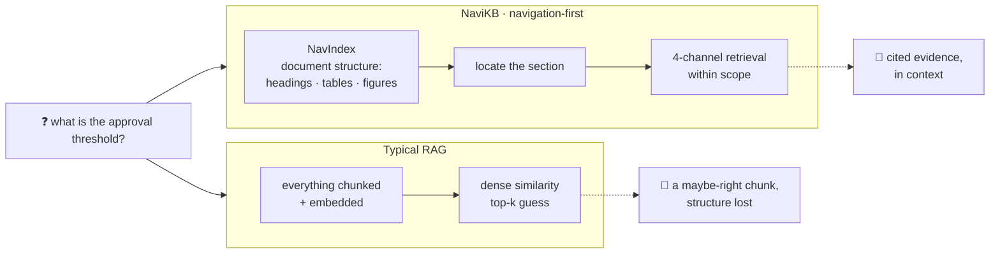
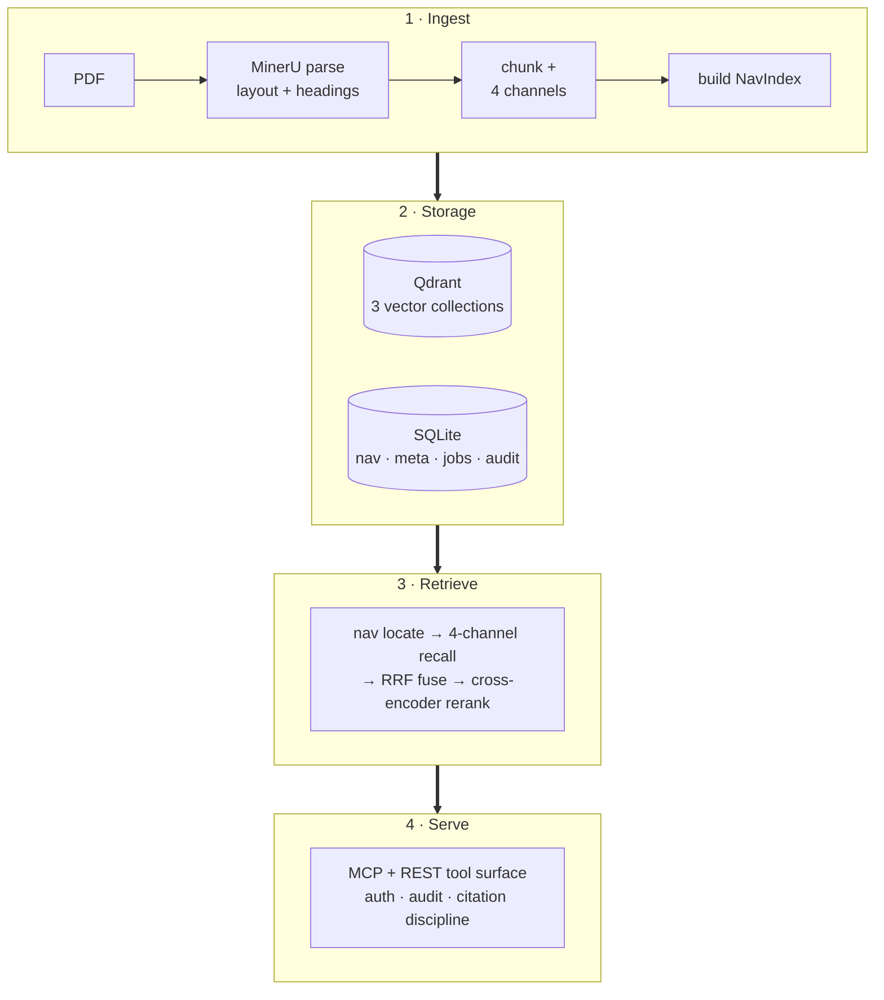
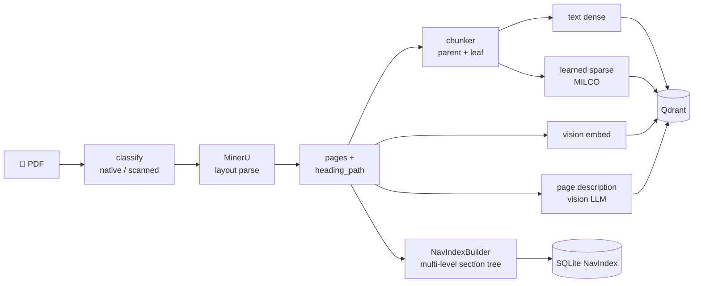
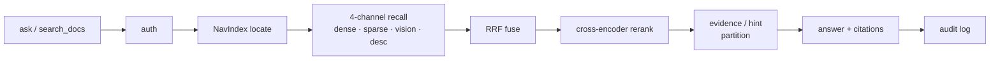
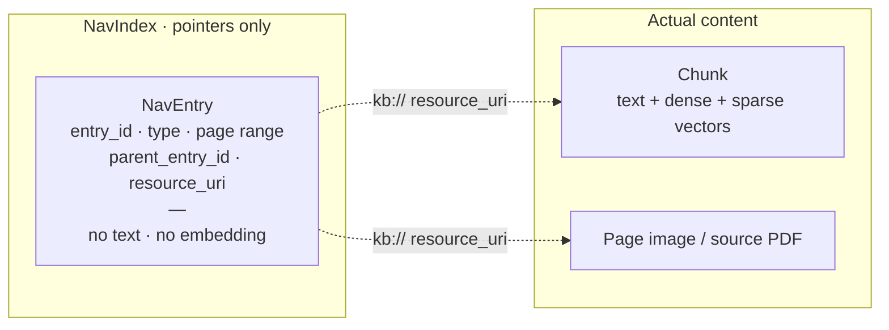

<div align="right">

**English** | [中文](README.zh.md)

</div>

<div align="center">

# 🧭 NaviKB

**Navigate your documents like a reader — not a search box.**

A navigation-first, local-first knowledge base for individuals and small teams.
Agent-native via MCP. No SaaS, no Kubernetes, no entity graph — just your
documents' own structure, made walkable.

[](LICENSE)
[](pyproject.toml)
[](docs/status.md)
[](#how-a-question-gets-answered)
[](#)
[](https://github.com/Laurent00TT/navikb)

</div>

---

## The one idea

Most RAG systems shred a document into a flat pool of chunks and hope dense
similarity finds the right one. **NaviKB keeps the document whole.** It indexes
the *structure* — headings, tables, figures, page ranges — into a pointer-only
**NavIndex**, lets an agent *navigate* to the right place, and only then runs
retrieval, scoped to that location.



It runs entirely on your machine or LAN, and exposes every capability as a
first-class **MCP tool surface** so coding agents and assistants can drive it
directly.

---

## Two bets the mainstream stack gets wrong

**1 · Navigation is the primary access pattern — retrieval is the second step.**
NaviKB builds a multi-level section tree straight from the parser's heading
hierarchy. An agent walks it the way a human flips to *Chapter 5 → 5.3*, and
retrieval runs *within* that scope instead of guessing across the whole corpus.

**2 · Generated content is not evidence.** An LLM's description of a page is a
retrieval *hint*, not a citation. NaviKB partitions every response into
`evidence_fields` (parsed text, image URLs, captions) and `hint_fields`
(LLM-generated descriptions), and tells the agent exactly which it is allowed
to cite — hallucination discipline enforced at the data layer, not left to the
caller.

---

## Architecture at a glance

Four loosely-coupled layers. SQLite + Qdrant + a worker process are the *entire*
stack — no Redis, no Celery, no Kafka, no graph database.



→ Full walkthrough in [docs/design/architecture.md](docs/design/architecture.md).

---

## How ingestion works

One PDF in → parsed layout, four retrieval channels, and a navigable section
tree out. The heavy lifting runs in a background **worker** so the API stays
responsive; everything is re-runnable and idempotent per document.



---

## How a question gets answered

Retrieval is **one of four channels** (text-dense, text-sparse, vision,
description), fused with Reciprocal Rank Fusion and reranked by a cross-encoder
— but always anchored to navigable structure, gated by auth, and recorded by a
two-phase audit log.



---

## The NavIndex: pointers, not chunks

The thing that makes navigation cheap: a **`NavEntry` is a pure pointer.** It
carries an id, a type, a page range, its parent, and a `kb://` resource URI —
but **no text and no embedding**. Titles and structure live in the index;
the actual content lives where it always did. Re-deriving the whole nav tree is
deterministic and free of model calls.



→ The rationale, and the trade-offs vs. chunking, are in
[docs/design/navigation-first.md](docs/design/navigation-first.md).

---

## What's inside

| | |
|---|---|
| 🧭 **Navigation-first** | Multi-level section tree from real document structure; agent walks it via MCP `kb_get_toc` / `kb_expand_nav_entry`. |
| 🔀 **4-channel retrieval** | Text-dense + learned-sparse + vision + page-description, RRF-fused and cross-encoder reranked. |
| 🧱 **Citation discipline** | Evidence vs. hint partition enforced at the data layer — the agent is told what it may cite. |
| 🔌 **MCP-native** | Every capability is a first-class MCP tool; mount at `/mcp` and point any agent at it. |
| 🛠 **Operator surface** | Hard-cutover auth, two-phase audit, soft-delete + GC retention, backup, maintenance mode, `doctor` health check. |
| 🔁 **Swappable models** | Every model is placed behind a configurable endpoint — local llama.cpp, a remote GPU, or a hosted OpenAI-compatible API. |
| 🪶 **Small footprint** | SQLite + Qdrant + one worker. No graph DB, no message queue, no orchestrator. |

---

## Quickstart

```powershell
# 1. Install (Python 3.11+)
python -m venv .venv
.\.venv\Scripts\python.exe -m pip install -e ".[server,dev]"
.\.venv\Scripts\python.exe -m pip install -e ".[mineru]"   # PDF layout parsing (optional)

# 2. Configure — copy the template, then point the *_SERVER_URL / *_MODEL_ID
#    entries at your own model endpoints (see "Models are swappable" below).
Copy-Item .env.example .env

# 3. Run the local control plane
python scripts/serve.py --port 8000     # FastAPI tool server (REST + MCP)
python scripts/worker.py                 # background ingestion worker

# Or bring up main + Qdrant + worker together:
# docker compose -f docker/docker-compose.local.yml --env-file .env up -d --build
```

The server binds `127.0.0.1` by default. Create an admin, ingest a PDF (bring
your own, or build samples from the bundled **synthetic** sources in
`datasets/pdf_corpus_v1/synthetic_sources/`):

```powershell
python scripts/manage_users.py create <username> --role admin
python scripts/ingest.py --path .\path\to\document.pdf
```

Every request carries an `Authorization: Bearer <user_token>` header. Search,
or ask a question the agent answers from retrieved evidence:

```powershell
curl -X POST http://127.0.0.1:8000/search_docs `
  -H "Content-Type: application/json" `
  -H "Authorization: Bearer $env:KB_USER_TOKEN" `
  -d "{\"query\":\"approval threshold\",\"top_k\":5}"

curl -X POST http://127.0.0.1:8000/ask `
  -H "Content-Type: application/json" `
  -H "Authorization: Bearer $env:KB_USER_TOKEN" `
  -d "{\"question\":\"What is the approval threshold?\"}"
```

Health-check the stack with `python scripts/doctor.py`. The MCP tool surface is
mounted at `/mcp`.

---

## Models are swappable (the reference config is just an example)

NaviKB places every model behind a configurable endpoint
(`*_SERVER_URL` / `*_MODEL_ID` in `.env`). The stack we validated — **Qwen3-VL**
for text + vision embeddings and reranking, **MILCO** for learned sparse,
**Qwen3-VL** for page descriptions, **MinerU** for layout parsing — is *one
reference configuration*, not a hard dependency.

Point the endpoints at whatever you have: a local llama.cpp / LM Studio, a
remote GPU over an SSH tunnel, or a hosted OpenAI-compatible API. The engine,
the four-channel retrieval, the navigation layer, and the operator surface are
the contribution here — the specific models are yours to choose.

A single-GPU **RTX 4090-48G** reference deployment (3× vLLM + MILCO + MinerU +
Qdrant, all resident at once) ships in [`deploy/local-48g/`](deploy/local-48g/).

---

## How it compares

| Concern | **NaviKB** | Typical RAG (LangChain / LlamaIndex) | GraphRAG | NaviRAG (research) |
|---|---|---|---|---|
| Primary access pattern | **Pointer navigation + 4-channel retrieval** | Dense retrieval over flat chunks | Graph walk over LLM-extracted entities | Hierarchical LLM-driven exploration |
| Local-first | ✅ default | ⚠️ possible but uncommon | ❌ usually needs Neo4j-class infra | ❌ research-stage |
| MCP-native | ✅ first-class | ⚠️ via adapters | ❌ | ❌ |
| Citation discipline | ✅ evidence/hint partition enforced | ❌ caller decides | ❌ | ❌ |
| Operator surface | ✅ auth · audit · backup · GC | ❌ build-it-yourself | ⚠️ enterprise only | ❌ |

Per-cell reasoning — and an honest "where NaviKB is weaker" — lives in
[docs/design/comparison.md](docs/design/comparison.md).

---

## Status & maturity

NaviKB is **early-alpha**: the code is here, runs, and is covered by a large
test suite, but it is a *reference implementation*, not a turnkey product.

| Area | State |
|---|---|
| Core engine (ingest → retrieve → serve) | ✅ implemented & tested |
| Navigation layer (multi-level NavIndex) | ✅ implemented & tested |
| 4-channel retrieval + RRF + rerank | ✅ implemented |
| Operator surface (auth, audit, GC, backup) | ✅ implemented |
| MCP tool surface | ✅ implemented |
| Clean-machine reproducible install | 🚧 not yet independently reproduced |
| Evaluation / quality benchmarks | 🚧 maturing |

[**docs/status.md**](docs/status.md) is the honest, detailed account — what
works, what doesn't, and where the risks are.

---

## The optional workbench

A web workbench (React + Vite) lives in a separate repo,
**[navikb-workbench](https://github.com/Laurent00TT/navikb-workbench)** — a thin
HTTP client of the core's `/ui/api` surface (no shared code). Run this core
first, then point the workbench at it. The core runs fully headless without it.

---

## Documentation

| Document | Purpose |
|---|---|
| [docs/status.md](docs/status.md) | Honest maturity: what works, what doesn't, the open risks |
| [docs/design/architecture.md](docs/design/architecture.md) | Four-layer architecture in detail |
| [docs/design/navigation-first.md](docs/design/navigation-first.md) | Why NavIndex; pointer-only design; trade-offs vs. chunking |
| [docs/design/security-model.md](docs/design/security-model.md) | Auth, two-phase audit, soft delete, maintenance flag, GC retention |
| [docs/design/comparison.md](docs/design/comparison.md) | Deep comparison vs. LangChain / LlamaIndex / GraphRAG / NaviRAG |
| [CONTRIBUTING.md](CONTRIBUTING.md) | What feedback and contributions are welcome |

**Quick links:** 📋 [Status](docs/status.md) · 🏛 [Architecture](docs/design/architecture.md) · 🖥 [Workbench](https://github.com/Laurent00TT/navikb-workbench) · 💬 [Open an issue](../../issues/new/choose) · 🤝 [Contributing](CONTRIBUTING.md) · 🔒 [Security](SECURITY.md) · 📜 [Apache-2.0](LICENSE)

---

## Naming

**NaviKB** = **Navi**gable + **K**nowledge **B**ase. Pronounced "nah-vee-K-B."
It sits in the 2026 *navigable knowledge base* research direction
([NaviRAG](https://arxiv.org/abs/2604.12766),
["Don't Retrieve, Navigate"](https://arxiv.org/abs/2604.14572)) but at a
different layer: those are retrieval-algorithm prototypes; NaviKB is the
production-operations stack underneath that class of design.
