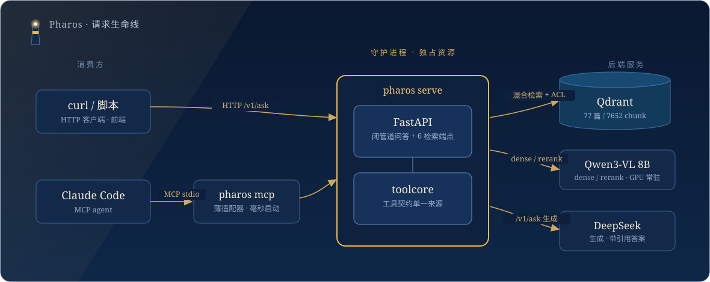

<div align="center">


# Pharos

[](https://github.com/Laurent00TT/PharosRAG/actions/workflows/ci.yml)
[](LICENSE)


[](docs/learning/)

**Turn PDFs, scans, docx, pptx and xlsx into a local knowledge base you can ask questions of — with enterprise access control and citations you can trace back to the page.**
Each RAG component was sharpened on its own, then folded into one repository: multi-identity auth, observability and systemd supervision come with it.

</div>

> **A note on language.** The code, CLI and commit history are in English; the
> documentation — including the 12-part learning series — is written in Chinese.
> This README is the English entry point and covers what the system is, how it is
> put together and how to run it. For anything deeper, you will be reading Chinese
> (or machine-translating it).

---

> The Lighthouse of Alexandria stood beside the Library, guiding ships to shore. **Pharos does the same job, except what it lights up is your team's document library.**

This is not another chunking toy. Every significant decision here is backed by a measurement, argued through several rounds of adversarial review, and is running today over 77 real documents and 7,652 chunks. Installing it is one line: `pip install -e '.[dev]'` (src-layout, editable).

## Two exits, one set of semantics

One knowledge base, one door for each kind of consumer:

| Exit | Command | Who uses it | What it does |
|---|---|---|---|
| **HTTP API** | `pharos serve` | curl, scripts, frontends | Closed-pipeline QA: `/v1/ask` runs retrieve → grounding → DeepSeek → an answer with citations, plus six retrieval endpoints |
| **MCP** | `pharos mcp` | agents such as Claude Code | Agentic RAG: when to retrieve, how to rewrite, whether to go multi-hop — the agent decides |

Both doors share one set of semantics, held in place by two rules: the tool contract has exactly one source (`toolcore`, so the stdio and HTTP sides cannot drift), and identity is decided server-side (an agent cannot edit its own permissions).

## Architecture

<div align="center">

</div>

**Why a resident daemon?** Embedded Qdrant admits a single client and holds an exclusive lock, and an 8B model takes a minute or two just to load. Under the earlier stdio-direct design, every agent session spawned its own process — fighting over the lock and reloading the model each time. Pharos inverts that: the daemon owns the heavy resources, MCP shrinks to a thin HTTP adapter that starts in milliseconds, and every session shares one already-warm backend. The trade-offs behind this are in [docs/DESIGN.md](docs/DESIGN.md) (Chinese).

<details>
<summary><b>Production shape: from one box to three independently scalable tiers</b></summary>

<br/>

The single-node problem is that the GPU model, embedded Qdrant and application logic all live in one process, so horizontal scaling hits a ceiling immediately. Split apart, there are three tiers that scale independently:

- **`inference`** (FastAPI on `:8900`) — GPU forward passes lifted out on their own, returning full-width vectors that the client then truncates, with both sides kept equivalent;
- **`pharos`** — the application layer sheds torch entirely (set `inference_url` and it never loads a model), which is what makes `--scale pharos=N` possible;
- **Qdrant in server mode** — replicas share one source of truth, with `nginx` in front for load balancing; `docker kill` on any replica goes unnoticed.

```bash
docker compose --env-file .env.compose up -d --scale pharos=3   # entry point: http://127.0.0.1:8080
```

One thing worth stating plainly: **the throughput ceiling is the forward speed of a single inference card (the GPU serialises), and adding replicas does not raise it.** What replicas actually buy you is concurrency in the non-GPU parts, plus crash isolation and rolling upgrades. The full write-up is in [docs/SCALE_OUT.md](docs/SCALE_OUT.md) (Chinese).

</details>

## Getting started

The service runs under systemd — starts at boot, restarts on failure. Day to day, a team member needs their own API key and then:

```bash
conda activate pharos
pip install -e '.[dev]'                        # src-layout, editable install

python -m pharos ask "What do we have on X?"   # closed-pipeline QA, answers carry citations
python -m pharos health
```

For agentic mode in Claude Code: copy `.mcp.json.example` to `.mcp.json` (gitignored), fill in your `PHAROS_API_KEY` and local paths, and you get the `rag` tool — provided the daemon is running. With no daemon around, `pharos mcp --direct` also works: it talks stdio, loads the GPU model itself, and depends on nothing resident.

Building the index, as an administrator (the corpus is a directory of MinerU parse output):

```bash
sudo systemctl stop pharos                                     # single-client lock, so stop first
python -m pharos index --corpus <parsed_dir> --dest ~/rag_real
sudo systemctl start pharos
```

## Want to understand RAG, not just use it?

The repository also carries a **[RAG learning and interview-prep set](docs/learning/)**: this system — repeatedly contradicted by its own data and repeatedly fixed — taken apart into **12 pieces and 4,122 lines** of tutorial. It runs from chunking, hybrid retrieval, the permission model and generation grounding all the way through agentic use, evaluation methodology and multi-replica scale-out. Every piece carries code anchors, measured numbers, interview framings, and experiments you can run yourself. **Written in Chinese.**

| What you want | Which pieces |
|---|---|
| The trade-off at each RAG layer, and what the mainstream options look like | [01 overview](docs/learning/01-rag-overview.md) · [02 chunking](docs/learning/02-parsing-chunking.md) · [03 retrieval](docs/learning/03-retrieval.md) |
| Enterprise permissions, generation grounding, agentic | [04 ACL](docs/learning/04-acl-security.md) · [05 generation](docs/learning/05-generation-grounding.md) · [06 agentic](docs/learning/06-agentic-mcp.md) |
| How RAG should actually be evaluated (where this system spent the most care) | [07 evaluation](docs/learning/07-evaluation.md) |
| System design, single box to replicas, engineering method | [08 service](docs/learning/08-service-architecture.md) · [09 scale-out](docs/learning/09-scale-out.md) · [10 stories](docs/learning/10-methodology-stories.md) |
| Interview cramming | [11 question bank](docs/learning/11-interview-qa.md) |

## Security model

- **Identity answers "who is asking", ACL answers "what may they see".** An X-API-Key resolves to an identity first; that identity's tenant and principals are then handed to the retrieval layer per request, where ACL does hard filtering to enforce visibility. The whole chain is verified by the five-user matrix in `acl_regression`.
- **Fail-closed throughout.** An unrecognised or absent key is a 401. A malformed keys file refuses to start. Binding to a non-loopback address forces keys mode — the library does not go out on the LAN unguarded. A document with no permissions attached is visible to nobody by default.
- **Sessions are isolated from each other.** Cross-call deduplication is bucketed by identity and session, so one person never sees another's state. **It also does not leak detail:** logs record identity names and never keys, errors do not spill internals, and every retrieved passage is tagged `trust: untrusted` against prompt injection.
- Binds `127.0.0.1` only by default. HTTPS and public exposure are explicit non-goals — tunnel in if you need remote access.

<details>
<summary><b>Three identity modes, and the configuration</b></summary>

<br/>

| Mode | Trigger | Used for | Where identity comes from |
|---|---|---|---|
| **keys** | `PHAROS_KEYS_FILE` is set | **team deployment (default)** | each request's X-API-Key yields its own identity (name + tenant + principals) |
| **legacy** | only `PHAROS_API_KEY` is set | single user, or just a doorstop | one key, identity bound at startup |
| **open** | neither is set | local development, loopback only | the single identity bound at startup |

```bash
python -m pharos keys new alice --tenant demo --admin      # issue an identity; the key prints exactly once
python -m pharos keys new bob   --tenant demo --principals g_eng
# set PHAROS_KEYS_FILE=~/pharos.keys.json in .env; add PHAROS_HOST=0.0.0.0 for LAN access
sudo systemctl restart pharos
```

Configuration lives in the single `.env` at the repository root (see [.env.example](.env.example); everything is prefixed `PHAROS_*`): `PHAROS_KEYS_FILE`, `PHAROS_CORPUS_DIR`, `PHAROS_INDEX_DIR` (defaults to `~/rag_real`), `PHAROS_COLLECTION`, `PHAROS_PORT` (8787), `PHAROS_HOST` (a non-loopback bind forces keys mode), `PHAROS_LOG_DIR`, and `DEEPSEEK_API_KEY` (needed by `/v1/ask`). The full deployment, key and operations procedures are in [docs/OPERATIONS.md](docs/OPERATIONS.md) (Chinese).

</details>

## Tests

```bash
python -m pytest tests -q                          # full CPU suite: product layer + engine layer, ACL predicates included
python -m pytest tests -q --ignore=tests/engine    # product layer only (fake retriever + MockLLM; no GPU, no network)
```

Neither touches a GPU, a Qdrant server or the network, and [CI](.github/workflows/ci.yml) runs them on every push. The suite size, its product/engine split and the measurement provenance live in [docs/TESTING.md](docs/TESTING.md) §1 — the single authority for that number. The GPU end-to-end zero-leak regression (`eval/acl_regression.py`, on WSL + a 4090), concurrency benchmarks, backup drills and security review records are in the same document.

## Documentation index

All documentation below is in Chinese.

| Document | What it covers |
|---|---|
| [docs/OVERVIEW.md](docs/OVERVIEW.md) | **System overview (the authoritative entry point)**: the whole picture, component map, how to read this documentation set |
| [docs/learning/](docs/learning/) | **RAG learning and interview docs (12 pieces)**: chunking through evaluation, with code anchors and interview framings |
| [docs/DESIGN.md](docs/DESIGN.md) | Goals, architecture, key decisions (including the alternatives that were rejected), multi-identity and observability, risks |
| [docs/IMPLEMENTATION.md](docs/IMPLEMENTATION.md) | Module map, request paths, lock model, the retrieval-layer seam |
| [docs/API.md](docs/API.md) | HTTP API contract: endpoints, parameters, auth, the status state machine |
| [docs/OPERATIONS.md](docs/OPERATIONS.md) | **Team operations manual**: deployment, keys, measured capacity, backup and restore, troubleshooting |
| [docs/SCALE_OUT.md](docs/SCALE_OUT.md) | One box to many replicas (phases A–F): the three-tier split, load balancing, equivalence verification |
| [docs/TESTING.md](docs/TESTING.md) | Test matrix and the evidence behind it: unit tests, ACL regression, GPU smoke, benchmarks, drills, security |
| [docs/ROADMAP.md](docs/ROADMAP.md) | Where this is going, and what is **explicitly not being built** (with reasons) |
| [docs/COMPONENT_NOTES.md](docs/COMPONENT_NOTES.md) · [docs/PROVENANCE.md](docs/PROVENANCE.md) | Recorded objections to inherited components; provenance and where measurement baselines break |

Component-level design and evaluation live in [docs/components/](docs/components/) (chunker / embedder / generator / mcp-server); methodology in [docs/methodology/](docs/methodology/).

## License

[MIT](LICENSE).

<div align="center">
<br/>
<sub>Pharos · a self-built multi-format agentic RAG · local 4090 / WSL <code>pharos</code></sub>
</div>
