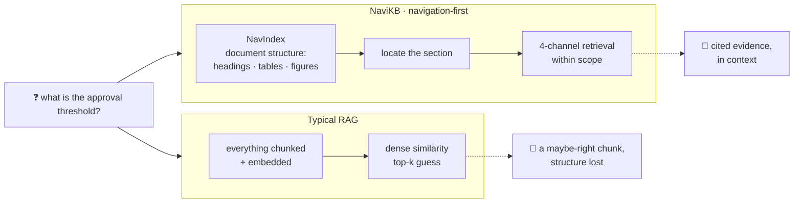
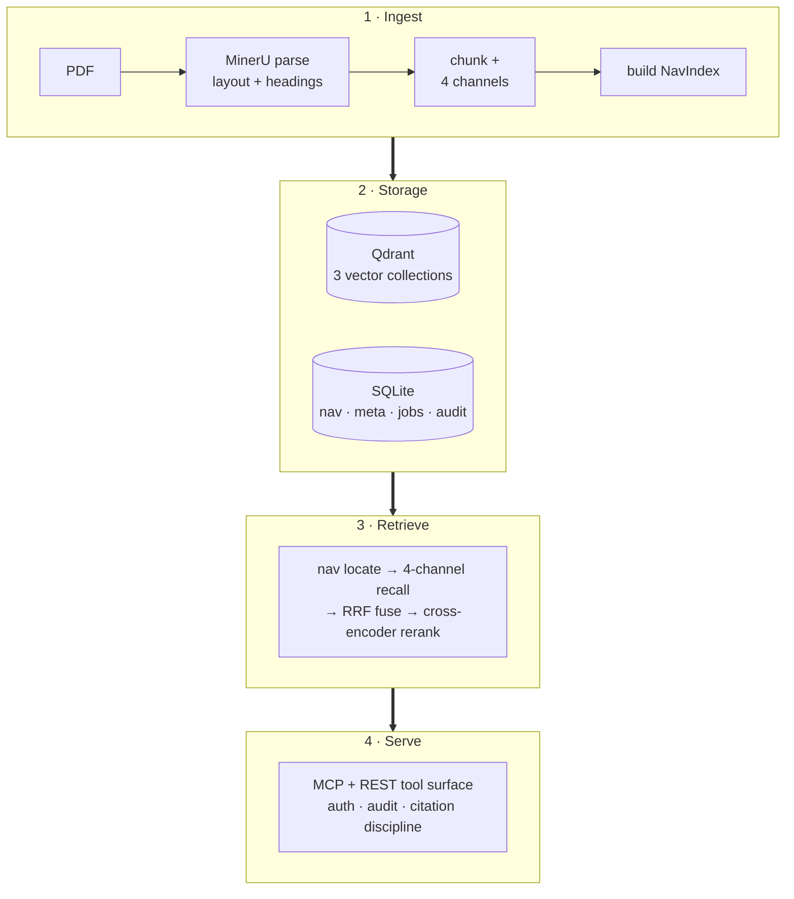
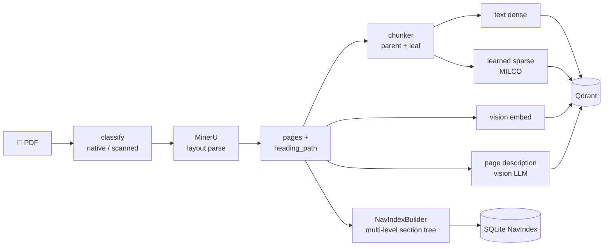
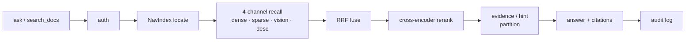
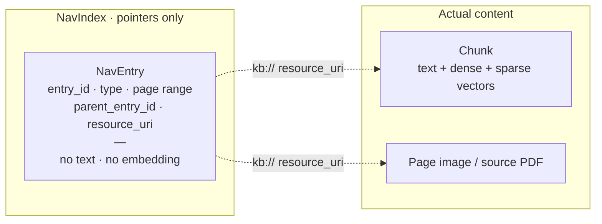

<div align="right">

**中文** | [English](README.md)

</div>

<div align="center">

# 🧭 NaviKB

**像翻书一样在文档里导航，而不是对着搜索框碰运气。**

一个 navigation-first、本地优先的知识库，面向个人与小团队，通过 MCP 原生对接
agent。没有 SaaS、没有 Kubernetes、没有实体图谱——只是把文档自身的结构变得可以
导航。

[](LICENSE)
[](pyproject.toml)
[](docs/status.zh.md)
[](#一次提问怎么被回答)
[](#)
[](https://github.com/Laurent00TT/navikb)

</div>

---

## 一个核心理念

大多数 RAG 把文档切成一堆零散的 chunk，再指望 dense similarity 能捞回正确的那一
块。**NaviKB 让文档保持完整。** 它把文档的*结构*——标题、表格、图、页码范围——
索引成一个纯指针的 **NavIndex**，让 agent 先*导航*到正确的位置，**然后才**检索，
而且检索被约束在它已经定位到的范围内。



它完全跑在你自己的机器或局域网内，并把每一项能力都做成一流的 **MCP 工具**，让
编码 agent 和助手可以直接驱动它。

---

## 主流栈做反的两件事

**1 · 导航才是主要的访问方式，检索是第二步。** NaviKB 直接从 parser 的标题层级
建出多级 section 树。agent 像人翻到*第 5 章 → 5.3 节*那样在树上浏览，检索只在
那个范围*之内*进行，而不是在整个语料里盲猜。

**2 · 生成的内容不是证据。** LLM 对一页的描述只是召回的*线索*，不是可引用的来源。
NaviKB 把每个响应拆成 `evidence_fields`（解析出的文本、图片 URL、caption）和
`hint_fields`（LLM 生成的描述），并明确告诉 agent 哪些**可以引用**——防幻觉约束在
数据层就被强制，而不是丢给调用方自行处理。

---

## 架构一览

四个松耦合的层。SQLite + Qdrant + 一个 worker 进程就是*全部*技术栈——没有 Redis、
没有 Celery、没有 Kafka、没有图数据库。



→ 完整架构详解见 [docs/design/architecture.zh.md](docs/design/architecture.zh.md)。

---

## ingest 怎么工作

一篇 PDF 进去，出来的是解析好的版面、四个检索通道、和一棵可导航的 section 树。
重活都放在后台 **worker** 里跑，API 始终保持响应；对每篇文档都可重跑、且幂等。



---

## 一次提问怎么被回答

检索只是**四个通道之一**（text-dense、text-sparse、vision、description），先用
Reciprocal Rank Fusion 融合、再由 cross-encoder 重排——但始终锚定在可导航的结构
上，经鉴权把关，并由两阶段审计日志记录在案。



---

## NavIndex：是指针，不是 chunk

导航之所以这么轻量，关键在于：**一个 `NavEntry` 就是一个纯指针。** 它只带 id、
类型、页码范围、父节点、以及一个 `kb://` 资源 URI——**不带文本，也不带 embedding**。
标题和结构留在索引里，真正的内容仍在它原本的地方。整棵 nav 树都可以确定性地重新
推导，全程零模型调用。



→ 设计动机、以及相对 chunking 的取舍，见
[docs/design/navigation-first.zh.md](docs/design/navigation-first.zh.md)。

---

## 它包含什么

| | |
|---|---|
| 🧭 **Navigation-first** | 从真实文档结构建出多级 section 树；agent 经 MCP `kb_get_toc` / `kb_expand_nav_entry` 遍历它。 |
| 🔀 **四通道检索** | text-dense + learned-sparse + vision + page-description，RRF 融合 + cross-encoder 重排。 |
| 🧱 **引用纪律** | evidence / hint 分区在数据层强制——明确告诉 agent 什么能引用。 |
| 🔌 **MCP 原生** | 每项能力都是一流的 MCP 工具；挂在 `/mcp`，任何 agent 都能直接对接。 |
| 🛠 **运维面** | 硬切换鉴权（hard-cutover auth）、两阶段审计、软删除 + GC 保留、备份、维护模式、`doctor` 健康检查。 |
| 🔁 **模型可替换** | 每个模型都藏在可配置端点之后——本地 llama.cpp、远端 GPU、或托管的 OpenAI 兼容 API。 |
| 🪶 **小体量** | SQLite + Qdrant + 一个 worker，没有图数据库、消息队列、编排器。 |

---

## 快速开始

```powershell
# 1. 安装（Python 3.11+）
python -m venv .venv
.\.venv\Scripts\python.exe -m pip install -e ".[server,dev]"
.\.venv\Scripts\python.exe -m pip install -e ".[mineru]"   # PDF 版面解析（可选）

# 2. 配置 —— 复制模板，再把 *_SERVER_URL / *_MODEL_ID 指向你自己的模型端点
#    （见下方"模型可替换"）。
Copy-Item .env.example .env

# 3. 跑本地控制面
python scripts/serve.py --port 8000     # FastAPI 工具服务（REST + MCP）
python scripts/worker.py                 # 后台 ingest worker

# 或一起拉起 main + Qdrant + worker：
# docker compose -f docker/docker-compose.local.yml --env-file .env up -d --build
```

服务默认绑定 `127.0.0.1`。创建管理员、ingest 一篇 PDF（用你自己的，或用仓库内置
的 **synthetic** 源 `datasets/pdf_corpus_v1/synthetic_sources/` 生成的样例）：

```powershell
python scripts/manage_users.py create <username> --role admin
python scripts/ingest.py --path .\path\to\document.pdf
```

每个请求都带 `Authorization: Bearer <user_token>` 请求头。可以搜索，也可以让
agent 从检索到的证据里回答一个问题：

```powershell
curl -X POST http://127.0.0.1:8000/search_docs `
  -H "Content-Type: application/json" `
  -H "Authorization: Bearer $env:KB_USER_TOKEN" `
  -d "{\"query\":\"approval threshold\",\"top_k\":5}"

curl -X POST http://127.0.0.1:8000/ask `
  -H "Content-Type: application/json" `
  -H "Authorization: Bearer $env:KB_USER_TOKEN" `
  -d "{\"question\":\"What is the approval threshold?\"}"
```

用 `python scripts/doctor.py` 给整个栈做健康检查。MCP 工具面挂在 `/mcp`。

---

## 模型可替换（参考配置只是一个示例）

NaviKB 把每个模型都解耦到一个可配置端点之后（`.env` 里的 `*_SERVER_URL` /
`*_MODEL_ID`）。我们验证过的那套——**Qwen3-VL** 做文本+视觉 embedding 与重排、
**MILCO** 做 learned sparse、**Qwen3-VL** 做页面描述、**MinerU** 做版面解析——只是
*一个*参考配置，不是硬依赖。

把端点指向你现有的服务即可：本地 llama.cpp / LM Studio、用 SSH 隧道连过去的
远端 GPU、或托管的 OpenAI 兼容 API。引擎、四通道检索、导航层、运维面才是这里的
贡献——具体用哪个模型由你来定。

一套单卡 **RTX 4090-48G** 的参考部署（3× vLLM + MILCO + MinerU + Qdrant 同时常驻）
放在 [`deploy/local-48g/`](deploy/local-48g/)。

---

## 怎么对比

| 对比项 | **NaviKB** | 典型 RAG（LangChain / LlamaIndex） | GraphRAG | NaviRAG（研究） |
|---|---|---|---|---|
| 主要访问方式 | **指针导航 + 4 通道检索** | 扁平 chunk 上的 dense 检索 | LLM 抽实体后的图游走 | LLM 驱动的层级探索 |
| 本地优先 | ✅ 默认 | ⚠️ 可以但少见 | ❌ 通常需 Neo4j 级设施 | ❌ 研究阶段 |
| MCP 原生 | ✅ 一流 | ⚠️ 靠适配器 | ❌ | ❌ |
| 引用纪律 | ✅ evidence/hint 分区强制 | ❌ 调用方自己定 | ❌ | ❌ |
| 运维面 | ✅ auth · audit · backup · GC | ❌ 自己造 | ⚠️ 仅企业级 | ❌ |

逐格的理由——以及一段诚实的"NaviKB 哪里更弱"——见
[docs/design/comparison.zh.md](docs/design/comparison.zh.md)。

---

## 状态与成熟度

NaviKB 处于 **early-alpha**：代码已落地、可运行，也有一套大规模测试覆盖，但它是一份
*参考实现*，不是开箱即用的产品。

| 领域 | 状态 |
|---|---|
| 核心引擎（ingest → retrieve → serve） | ✅ 已实现并测试 |
| 导航层（多级 NavIndex） | ✅ 已实现并测试 |
| 4 通道检索 + RRF + rerank | ✅ 已实现 |
| 运维面（auth、audit、GC、backup） | ✅ 已实现 |
| MCP 工具面 | ✅ 已实现 |
| 干净机器上的可复现安装 | 🚧 尚未独立复现 |
| 评测 / 质量基准 | 🚧 完善中 |

[**docs/status.zh.md**](docs/status.zh.md) 是更诚实、更详细的说明——什么能用、
什么不能、风险在哪。

---

## 可选的 workbench

一个 Web workbench（React + Vite）放在单独的仓库
**[navikb-workbench](https://github.com/Laurent00TT/navikb-workbench)**——它只是
core `/ui/api` 接口的一个薄 HTTP 客户端（不共享代码）。先把这个 core 跑起来，再
让 workbench 指向它。core 不带它也能完全 headless 运行。

---

## 文档

| 文档 | 用途 |
|---|---|
| [docs/status.zh.md](docs/status.zh.md) | 诚实的成熟度：什么能用、什么不能、有哪些开放风险 |
| [docs/design/architecture.zh.md](docs/design/architecture.zh.md) | 四层架构详解 |
| [docs/design/navigation-first.zh.md](docs/design/navigation-first.zh.md) | 为什么是 NavIndex；纯指针设计；相对 chunking 的取舍 |
| [docs/design/security-model.zh.md](docs/design/security-model.zh.md) | auth、两阶段审计、软删除、维护标志、GC 保留 |
| [docs/design/comparison.zh.md](docs/design/comparison.zh.md) | 与 LangChain / LlamaIndex / GraphRAG / NaviRAG 的深度对比 |
| [CONTRIBUTING.zh.md](CONTRIBUTING.zh.md) | 欢迎哪些反馈与贡献 |

**快速链接：** 📋 [状态](docs/status.zh.md) · 🏛 [架构](docs/design/architecture.zh.md) · 🖥 [Workbench](https://github.com/Laurent00TT/navikb-workbench) · 💬 [提 issue](../../issues/new/choose) · 🤝 [贡献](CONTRIBUTING.zh.md) · 🔒 [安全](SECURITY.md) · 📜 [Apache-2.0](LICENSE)

---

## 命名

**NaviKB** = **Navi**gable + **K**nowledge **B**ase，读作 "nah-vee-K-B"。它属于
2026 年*可导航知识库*这一研究方向（[NaviRAG](https://arxiv.org/abs/2604.12766)、
["Don't Retrieve, Navigate"](https://arxiv.org/abs/2604.14572)），但站在一个
不同的层：那些是检索算法的研究原型，而 NaviKB 是在这一类设计思路上落地的生产-运维栈。
