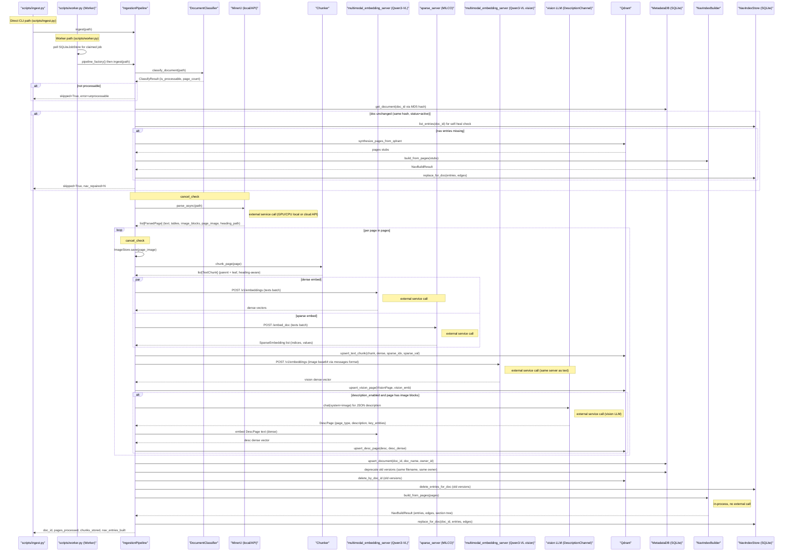
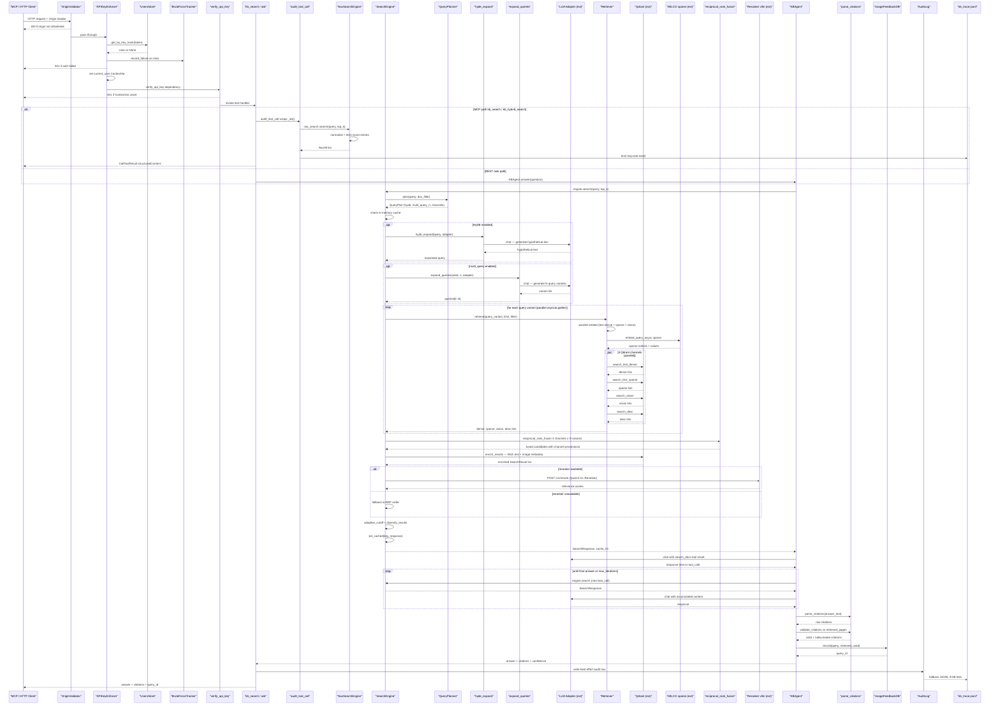
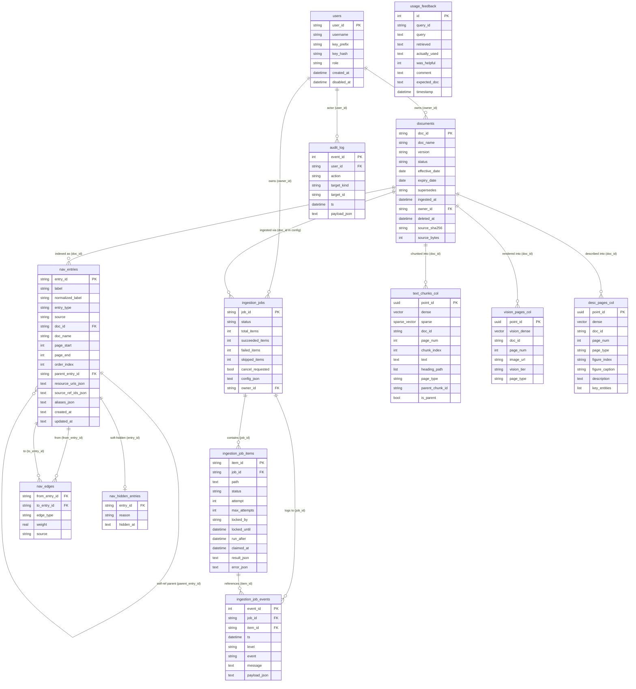
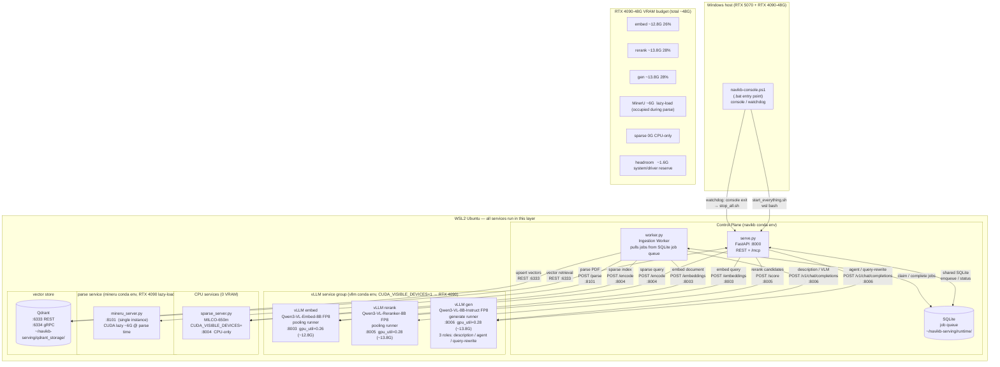

**English** | [中文](architecture-review.zh.md)

# NaviKB Architecture Review

> **TL;DR** — NaviKB is a navigation-first, self-hosted knowledge-base platform designed as a self-deployable alternative to PageIndex. It processes PDFs through a four-layer pipeline (Ingest → Storage → Retrieve → Serve) and exposes results over a Model Context Protocol (MCP) Streamable-HTTP endpoint. The system's central architectural bet is that a pre-built hierarchical document-structure index — where each `NavEntry` is a *pure pointer* carrying no text or embedding — produces more precise structural navigation than flat-embedding approaches. A single RTX 4090-48G deployment script ships with the repository, running three vLLM processes (embed / rerank / generate), a CPU-side sparse server (MILCO), and Qdrant. A full review identified 60 problems; the most pressing are a committed admin API token, several security primitives documented but absent in code (Argon2id, HMAC-compare), and core four-channel retrieval paths that are wired but never exercised at runtime.

> _Snapshot — reflects the code at review time, not live state._

## Post-review update (this session)

Five problems from the register were acted on after the review. **This block is the authoritative current state**; the per-section text further below is the original review snapshot.

| ID | Original finding | Current status |
|----|------------------|----------------|
| **P1** | Admin API token hardcoded in `deploy/local-48g/_search.sh:2` (security / high) | **Fixed** — replaced with a required `${KB_ADMIN_TOKEN:?}` env var. ⚠️ The leaked token still exists in git history and **must be rotated**. |
| **P6** | Text chunks use `uuid4` ids → re-ingest accretes ghost vectors (correctness / high) | **Fixed** — the text-chunk point id is now deterministic `uuid5("text:{doc_id}:{chunk_index}")`, mirroring the existing vision/desc fix in the same file. |
| **P8** | `QueryPlanner.enabled_channels` is computed but never reaches the retriever (correctness / high) | **Fixed** — `Retriever.retrieve()` now accepts `enabled_channels` and gates all four channels (skipping the vision query-embed when disabled); `engine.py` passes `plan.enabled_channels`. |
| **P2** | API-key auth uses SQL hash equality instead of `hmac.compare_digest` (was security / high) | **Reclassified → low / doc-drift.** The compared value is a SHA-256 hash (hash-space), so this is not a practically exploitable timing oracle; the documented `compare_digest` is defence-in-depth. Left as-is by decision. |
| **P3** | Read paths apply no `owner_id` filter → any authenticated user can read all documents (was security / high) | **Reclassified → by design.** `security-model.md` states multi-tenant strong isolation is an explicit non-goal for the small-team use case, and `qdrant_store.py` marks the payload `owner_id` "NOT for filter". Shared read is intentional. |

> The P1 / P6 / P8 code fixes are **syntax/logic-verified only** (no virtualenv on the review host). Validate with `uv run pytest tests/test_storage.py tests/test_search.py tests/test_search_planner.py`.

## 1. Overview

NaviKB is a navigation-first knowledge-base platform for self-hosted document-centric retrieval. Its stated competitor is PageIndex, which reduces document structure to flat vector embeddings. NaviKB's differentiating claim is that a separately constructed hierarchical navigation index (the `nav` layer) answers structural queries — chapter containment, heading ancestry, page ranges — that similarity search cannot answer precisely.

The system is structured as four loosely coupled layers:

| Layer | Responsibility | Key components |
|-------|---------------|----------------|
| **Ingest** | PDF parsing, chunking, embedding, nav-index construction | `IngestionPipeline`, `DocumentClassifier`, MinerU, `Chunker`, `NavIndexBuilder` |
| **Storage** | Persistence of chunks, vectors, nav entries, jobs, usage | Qdrant (3 collections), 4 SQLite databases |
| **Retrieve** | Hybrid four-channel search, RRF fusion, cross-encoder reranking, query expansion | `SearchEngine`, `QueryPlanner`, `NavSearchEngine`, `CrossEncoderReranker` |
| **Serve** | API gateway, authentication, MCP endpoint, agent orchestration | `tool_server` (FastAPI :8000), `/mcp` Streamable HTTP, `AgentOrchestrator` |

### Layered architecture

```mermaid
flowchart TD
    subgraph EXT["External Services"]
        direction LR
        MinerU["MinerU<br/>(local HTTP / SaaS API)"]
        vLLM_Embed["vLLM<br/>Qwen3-VL-Embedding-8B<br/>:8003"]
        vLLM_Rerank["vLLM<br/>Qwen3-VL-Reranker-8B<br/>:8005"]
        MILCO["MILCO sparse_server<br/>:8004"]
        Qdrant["Qdrant<br/>:6333"]
    end

    subgraph INGEST["Ingest Layer"]
        direction TB
        DocClassifier["DocumentClassifier<br/>(native/scanned/encrypted)"]
        Parser["Parser Factory<br/>(mineru_local / mineru_api)"]
        MiddleToPages["middle_to_pages<br/>(heading_stack → ParsedPage)"]
        Chunker["Chunker<br/>(heading-aware parent+leaf)"]
        TextCh["TextChannel<br/>(dense embed)"]
        SparseCh["SparseChannel<br/>(MILCO embed)"]
        VisionCh["VisionChannel<br/>(image embed)"]
        DescCh["DescriptionChannel<br/>(vision LLM JSON)"]
        JobExecutor["IngestionJobExecutor<br/>(cancel / retry / owner)"]
        JobRunner["IngestionJobRunner<br/>(heartbeat + poll)"]
    end

    subgraph STORAGE["Storage Layer"]
        direction TB
        QdrantStore["QdrantStore<br/>text_chunks / vision_pages / desc_pages"]
        MetaDB["MetadataDB<br/>(SQLite kb_metadata.db)"]
        NavStore["NavIndexStore<br/>(SQLite nav_index.db)"]
        JobStore["SQLiteJobStore<br/>(ingestion_jobs.db)"]
        ImageStore["ImageStore<br/>(local filesystem)"]
        SourceStore["SourceDocStore<br/>(local filesystem)"]
        AuditLog["AuditLog<br/>(3-tier write semantics)"]
        CacheEpoch["CacheEpochStore<br/>(cross-process invalidation)"]
    end

    subgraph RETRIEVE["Retrieve Layer"]
        direction TB
        SearchEngine["SearchEngine<br/>(cache → expand → RRF → rerank)"]
        QueryPlanner["QueryPlanner<br/>(fact/visual/table/process)"]
        HyDE["HyDE Expander"]
        MultiQuery["Multi-Query Expander"]
        Retriever["Retriever<br/>(4-channel parallel Qdrant query)"]
        RRF["RRF Fusion<br/>(weighted reciprocal rank)"]
        Reranker["Reranker<br/>(cross-encoder /v1/rerank)"]
        NavSearch["NavSearchEngine<br/>(keyword TF in-memory)"]
        HybridNav["HybridNavigator<br/>(nav + evidence fan-out)"]
        NavBuilder["NavIndexBuilder<br/>(active-stack algorithm)"]
    end

    subgraph SERVE["Serve Layer"]
        direction TB
        ToolServer["tool_server<br/>(FastAPI :8000)"]
        MCPServer["MCP Server<br/>(/mcp StreamableHTTP)"]
        RestAPI["REST API<br/>(search / docs / jobs / ask)"]
        AgentLoop["KBAgent<br/>(tool-call loop + citation validation)"]
        MCPTools["MCP Tools<br/>(kb_search / kb_hybrid_search / nav tools)"]
        MCPResources["MCP Resources<br/>(kb:// URI handlers)"]
        AuthMW["Auth Middleware<br/>(APIKeyEnforcer + OriginValidator)"]
        AdminAPI["Admin API<br/>(maintenance mode / drain)"]
    end

    %% Ingest write paths (downward into storage)
    DocClassifier --> Parser
    Parser --> MinerU
    MinerU --> MiddleToPages
    MiddleToPages --> Chunker
    Chunker --> TextCh
    Chunker --> SparseCh
    MiddleToPages --> VisionCh
    MiddleToPages --> DescCh
    TextCh --> vLLM_Embed
    SparseCh --> MILCO
    VisionCh --> vLLM_Embed
    DescCh --> vLLM_Embed

    TextCh --> QdrantStore
    SparseCh --> QdrantStore
    VisionCh --> QdrantStore
    DescCh --> QdrantStore
    MiddleToPages --> ImageStore
    Parser --> SourceStore
    JobExecutor --> MetaDB
    JobExecutor --> AuditLog
    JobRunner --> JobStore
    JobExecutor --> CacheEpoch

    NavBuilder --> NavStore
    MiddleToPages --> NavBuilder

    %% Retrieve read paths (upward from storage)
    Qdrant <--> QdrantStore
    SearchEngine --> QueryPlanner
    SearchEngine --> HyDE
    SearchEngine --> MultiQuery
    SearchEngine --> Retriever
    Retriever --> QdrantStore
    Retriever --> vLLM_Embed
    Retriever --> MILCO
    Retriever --> RRF
    RRF --> Reranker
    Reranker --> vLLM_Rerank
    SearchEngine --> MetaDB
    SearchEngine --> CacheEpoch

    NavSearch --> NavStore
    HybridNav --> SearchEngine
    HybridNav --> NavSearch

    %% Serve reads from Retrieve and Storage
    ToolServer --> AuthMW
    ToolServer --> RestAPI
    ToolServer --> MCPServer
    MCPServer --> MCPTools
    MCPServer --> MCPResources
    RestAPI --> SearchEngine
    RestAPI --> AgentLoop
    AgentLoop --> SearchEngine
    MCPTools --> SearchEngine
    MCPTools --> HybridNav
    MCPTools --> NavStore
    MCPResources --> MetaDB
    MCPResources --> ImageStore
    MCPResources --> NavStore
    ToolServer --> AdminAPI
    AdminAPI --> MetaDB

    %% Cross-layer coordination
    JobStore --> JobRunner
    MetaDB --> NavSearch
```

The diagram is read top-to-bottom following data flow. External services (MinerU, two vLLM instances, MILCO, Qdrant) sit at the top and are reached only over HTTP — they run outside the main NaviKB process. The Ingest layer feeds documents through classification and parsing, then fans out to three Qdrant collections (`text_chunks_{ver}`, `vision_pages_{ver}`, `desc_pages_{ver}`) and to SQLite `nav_index.db`. The Retrieve layer's `SearchEngine` fans in from all four channels (dense, sparse, vision, description) and fuses results with weighted Reciprocal Rank Fusion (RRF). The Serve layer wraps everything behind `APIKeyEnforcer` and an audit trail before returning responses to MCP or REST clients.

## 2. Ingest Pipeline

The diagram covers the full ingest pipeline for a PDF, mapping to the actual source code. Key structural notes:

- scripts/ingest.py runs IngestionPipeline directly in-process (no job queue).
- scripts/worker.py runs IngestionJobRunner which polls SQLiteJobStore, then constructs IngestionPipeline via pipeline_factory and calls ingest(). Both paths share the same pipeline code at src/kb/ingestion/pipeline.py.

Per-page loop (the hot path): for each ParsedPage returned by MinerU, three channels run. Text/sparse embeds are parallelised via asyncio.gather (see pipeline.py lines 424-430). Vision embed is a separate sequential call. Description channel only fires when the page has image blocks or low text ratio, and it calls DescLLM (an injected vision-LLM adapter) then re-embeds the description text through TextSvc.

External service calls: MinerU (local GPU subprocess or cloud API), multimodal_embedding_server/Qwen3-VL (text + vision, same server), sparse_server/MILCO, and optionally a vision LLM for descriptions.

NavIndexBuilder.build_from_pages() is pure in-process computation (no external calls). NavIndexStore writes to a local SQLite file (nav_index.db). Both nav_store and nav_builder are injected by the worker lifespan and gated by nav_enabled + nav_auto_build_on_ingest feature flags.

## 3. Query / Retrieve Pipeline

The diagram traces every hop from the external MCP/HTTP client to the final response, grounded in the actual source code:

1. OriginValidator (mcp_security.py) — the first ASGI interceptor; checks whether the Origin header is in the allowlist and returns 403 immediately if not.
2. APIKeyEnforcer (auth/middleware.py) — parses the X-API-Key / Bearer token and calls UsersStore.get_by_key_hash; on failure, notifies BruteForceTracker to accumulate the count and returns 401. On success, writes the User into the current_user ContextVar (try/finally guarantees reset).
3. verify_api_key (tool_server/security.py) — FastAPI dependency; asserts a second time that the ContextVar is set, otherwise returns 401 (belt-and-suspenders).
4. audit_tool_call (mcp_security.py) — wraps each MCP tool call, times it, and writes an mcp.tool trace event to kb_trace.jsonl.
5. NavSearchEngine (nav/search.py) — scores the nav index by keyword and returns NavHit (pointers only, no generated content).
6. SearchEngine (search/engine.py) — the hub: checks the in-memory cache first, then optionally runs HyDE/Multi-Query expansion (calling an external LLM) per the QueryPlanner decision, then dispatches concurrently to the Retriever.
7. Retriever (search/retriever.py) — embeds in parallel (text dense + MILCO sparse + vision), then sends 4-channel queries to Qdrant in parallel (dense/sparse/vision/desc).
8. RRF (search/rrf.py) — performs weighted Reciprocal Rank Fusion across N query variants and 4 channels.
9. Reranker (search/reranker.py) — POSTs to the external vllm /v1/rerank endpoint; gracefully falls back to RRF order when unavailable.
10. KBAgent (agent/agent.py) — a tool-calling loop driving the LLM; each iteration can trigger a new engine.search; finally parses citations, runs hallucination validation, and writes to UsageFeedbackDB.
11. AuditLog (audit/log.py) — best-effort write to SQLite; fsyncs to a JSONL fallback when the DB fails.

## 4. Data Model

The diagram highlights three core design decisions that deserve detailed explanation.

**Why NavEntry is a pure pointer**

The `nav_entries` table stores only navigational metadata: `label`, `entry_type`, the page range (`page_start`/`page_end`), and a `resource_uris_json` list of `kb://documents/{doc_id}/pages/{start}-{end}` URIs. There is no `text`, `embedding`, or `description` column. This is the intentional "navigation-layer / content-layer separation" principle: a NavEntry carries no raw content — it acts only as a structured address book pointing at Qdrant vector records. If a caller needs the actual text it must issue a separate `kb://documents/{doc_id}/pages/{page_num}` resource request (or read the `text_chunk` from the Qdrant payload after a search hit). This convention is stated explicitly in the `EvidenceHit` comment: intentionally does NOT carry text_chunk / vision_description / image_url.

**Relationship between parent_entry_id and nav_edges**

The two express different dimensions of "relationship" and should not be conflated:

- `parent_entry_id` (a column on `nav_entries` itself): expresses the tree hierarchy (document → section → page). It is a deterministic, one-way containment relationship written by `NavIndexBuilder.build_from_pages` during the build phase based on `heading_path`. The entire tree is rooted at the document-root entry; `parent_entry_id=NULL` appears only on document root nodes.

- `nav_edges` (a separate table whose PK is the composite key `from_entry_id + to_entry_id + edge_type`): expresses lateral semantic associations, including `next`/`previous` (ordering), `related_by_heading`/`related_by_page_window`/`related_by_keyword` (similarity), and `same_page`/`same_document` (co-membership). nav_edges are graph edges; parent_entry_id is a tree edge. The former can span documents (beyond same_document); the latter is strictly within a single document.

When a document is deleted (`delete_entries_for_doc`), the code first collects all entry_ids belonging to that document, then cascades to delete every edge in nav_edges where either endpoint is one of those entry_ids, soft-hide records from nav_hidden_entries, and finally deletes the nav_entries rows — all three tables cleaned in the same transaction, leaving no orphaned edges.

**Separation of SQLite files**

The system uses four independent SQLite files (kb_metadata.db, kb_jobs.db, kb_nav.db, kb_feedback.db) plus Qdrant as the vector store. metadata_db is the authoritative source (doc lifecycle + audit + users); jobs_db manages the async ingestion queue (including fairness-aware claim logic); nav_db is the standalone navigation index (WAL mode allows concurrent reads by MCP search); feedback_db stores search-quality feedback. Qdrant's three collections (text_chunks, vision_pages, desc_pages) each correspond to one ingestion channel; the `doc_id` in their payloads is a soft (non-FK) reference to the documents table in metadata_db.

## 5. Process & Deployment Topology

The following describes how all services coexist and share VRAM on a single 48 G node.

Runtime layer: every service runs inside WSL2 Ubuntu. On the Windows side there is a single navikb-console.ps1 / NaviKB-Console.bat that launches a watchdog subprocess — whenever the console window closes (X button, Ctrl+C, or crash), the watchdog automatically executes stop_all.sh to release VRAM and ensure the 4090 is not left with leaked allocations.

Process structure: the control plane consists of two processes. serve.py (FastAPI :8000) handles all inbound REST requests and the /mcp endpoint, orchestrating queries at runtime. worker.py is the background ingestion worker; it coordinates with serve.py through the shared SQLite job queue — stored on WSL ext4 at ~/navikb-serving/runtime/ and must not be placed on the /mnt/c 9p volume — atomically claiming tasks and executing the parse → embed → store pipeline.

All three vLLM services are bound to CUDA_VISIBLE_DEVICES=1 (RTX 4090; index 0 is the 5070), each in its own independent process:
- embed (:8003) uses the pooling runner, FP8 dynamic quantisation, gpu_util=0.26 → ~12.8 G
- rerank (:8005) also uses the pooling runner, FP8, gpu_util=0.28 → ~13.8 G
- gen (:8006) uses the generate runner, FP8, gpu_util=0.28 → ~13.8 G; a single model serves three roles: page description generation, /ask agent conversation, and HyDE query-rewrite

The three combined reserve ~40.4 G and are three independent vLLM processes (not merged), each with a distinct port and served-model-name.

The MILCO sparse server (:8004) is forced onto pure CPU with CUDA_VISIBLE_DEVICES="" and uses 0 VRAM, preventing milco.py's self.to("cuda") from claiming the 4090.

MinerU (:8101) is bound to the 4090 but uses lazy-load mode: it only moves to GPU when actively parsing a PDF, occupying ~6 G, and releases the allocation when parsing completes. This staggers VRAM usage with vLLM (parse-heavy and inference-heavy operations do not happen simultaneously, so memory coexists).

Qdrant (:6333/:6334) runs purely on CPU + disk and uses 0 VRAM.

Overall design principle: each of the three vLLM models independently reserves its own VRAM partition; sparse and Qdrant consume no GPU; MinerU lazy-load fills the remaining headroom. Under static load the three vLLM processes occupy ~40 G of the 48 G card, leaving ~8 G for MinerU and system/driver overhead.

## 6. Design Principles

### 6.1 Navigation-first

NaviKB's "navigation-first" principle does not mean that retrieval routes through the nav layer before the vector layer — it means the structure tree is built independently before the vector index, and that the structure tree is a first-class citizen of the entire system. PageIndex's vectorless approach fully flattens document structure into embeddings, encoding navigation semantics (chapter containment, upstream/downstream pages) implicitly through similarity, and cannot answer precise structural queries such as "which pages does section 5.3 contain?". NaviKB instead uses the active-stack algorithm in `NavIndexBuilder.build_from_pages` (`builder.py:22`) to mirror the heading_path emitted by the parser: the common prefix is left unchanged, levels beyond the common prefix are popped and closed, newly entered levels are pushed and opened, and each section's page_end is extended in real time as pages are visited (lines 124–126), with resource_uris backfilled after the loop completes (lines 162–165). NavEntry is designed as a pure pointer — the `contains_generated_content` property is hardcoded to return `False` (models.py:58-60) and EvidenceHit explicitly drops text_chunk / vision_description / image_url. This means a NavEntry carries only "where to point" information, not content summaries — it is a location anchor, not a context carrier. Retrieval (vector search + rerank) remains an independent second step; decoupling the two allows the structure tree to be built before the GPU is even started, and allows navigation paths to be versioned independently, unaffected by embedding model iterations.

### 6.2 Four-channel retrieval

NaviKB's four-channel retrieval addresses four distinct information gaps. The dense channel (Qwen3-VL-Embedding-8B, 4096-dimensional) handles semantic similarity: it matches when a natural-language query shares intent with a passage but uses different wording. The sparse channel (MILCO-650m learned sparse, asymmetric doc/query pruning) handles exact lexical matching: proper nouns, model numbers, acronyms, and other tokens that dense embeddings handle poorly. The vision channel (the same multimodal embedding server, accepting base64 image payloads) handles charts, flowcharts, and scanned pages — visual content that a text-only path cannot reach. The description channel (LLM-structured JSON descriptions) handles text-searchability of image semantics: it pre-translates visual content into language that can be matched by dense or sparse. Results from all four channels are fused through two stages of RRF (`rrf.py`): the first stage, `_flatten_rrf`, merges multiple query variants within each channel (engine.py); the second stage, `reciprocal_rank_fusion`, combines results across all four channels with the k=60 formula `score += w*(1/(k+rank+1))`, where per-channel weights can be tuned up for sparse on CJK keyword queries and up for dense on semantic English queries. RRF's role is diversity preservation: it aggregates the top candidates from every channel into a single large candidate set, discarding no strong signal from any channel. The cross-encoder rerank (Qwen3-VL-Reranker-8B via vllm `/v1/rerank`) then provides precision convergence: it scores each candidate against the query pairwise; pool_multiplier=1.0 ensures the set size is not reduced (re-ranked, not filtered). When the reranker is unavailable it raises `RerankerUnavailable` and the engine falls back to the pure RRF order, preserving availability.

### 6.3 Dual-process architecture

The server/worker dual-process separation is motivated by resource isolation: tool_server (FastAPI, no GPU) handles all live API requests while worker (GPU-intensive pipeline) pulls jobs from the SQLite task queue. SQLite is used as the coordination bus instead of Redis/Celery/broker because it keeps deployment simple — a single-machine self-hosted scenario should not require additional stateful services; the SQLite file travels with the project and a backup is just a `cp`. The concurrency model rests on two mechanisms in `sqlite_store.py`. First, BEGIN IMMEDIATE transactions (the SQLAlchemy event listener at lines 150–152) force write-intent transaction opening on write-mode engine connections, resolving the TOCTOU race in `claim_next_item` — when multiple workers simultaneously read "a free task is available", only one succeeds in writing it; read-only engines skip BEGIN IMMEDIATE to avoid contention between diagnostic queries and the worker. Second, fairness-LRU scheduling: `_CLAIM_SQL` uses a LEFT JOIN to compute `MAX(claimed_at)` per owner_id over the past hour; owners with a NULL last_claim sort first, guaranteeing that new or long-idle users are scheduled before active users and preventing queue monopolisation. While a task is held, a background asyncio.Task periodically refreshes the `locked_until` heartbeat; when a worker crashes the lease expires naturally and another worker can reclaim it. Cross-process cache invalidation is handled by `CacheEpochStore`: after a write completes, the worker increments an epoch value in SQLite; before each search, tool_server performs a single-row PK query; when the epoch changes, the entire in-process TTLCache is invalidated — no inter-process messaging required.

### 6.4 Authentication and audit

Auth and audit run through the entire request path as two independent layers built on a shared underlying infrastructure. The REST-layer FastAPI HTTP middleware and the MCP-layer `APIKeyEnforcer` ASGI wrapper (`auth/middleware.py`) both call the same `authenticate_token()` parser: hash token → DB lookup → disabled check → BruteForceTracker record. BruteForceTracker is an in-process sliding window keyed by source_ip with an LRU cap of 4096 entries; when the threshold is hit, it writes an `auth.brute_force` audit row. `current_user` is injected into both layers via `contextvars.ContextVar`; try/finally guarantees a reset after each request, ensuring that concurrent calls via asyncio.gather / to_thread cannot leak identity across contexts. `OriginValidator` (`mcp_security.py:53`) wraps the MCP sub-application as an ASGI middleware, rejecting Origin headers not in the allowlist; empty Origins are passed through to support non-browser clients (CLI tools, SDKs). The audit layer in `audit/log.py` implements a three-tier contract: MANDATORY_ACTIONS (user.create/disable/role_change/key_reset) write atomically into the ORM session and return 500 on failure; TWO_PHASE_ACTIONS (doc.delete/doc.reassign) include a JSONL fsync fallback and return 503 instead of silently succeeding when the DB is unwritable; best-effort actions swallow DB errors. `AuditContractError` uses `raise` rather than `assert` to prevent `python -O` from optimising away the contract check. `require_owner_or_admin` (`auth/permissions.py`) emits a best-effort `authz.denied` audit event for every 403; NULL / `_system` owners are treated as admin-only resources to ensure internal system operations cannot be accidentally reached by user-facing paths. The owner_id flows from the HTTP request through the ContextVar binding, through job_executor → IngestionPipeline → document metadata, forming a complete provenance chain.

## 7. Subsystem Reference

### NaviKB parser subsystem

**Purpose.** Convert raw documents (PDF, DOCX) into a list of ParsedPage objects — each carrying structured_text, heading_path (the heading_stack snapshot at that page), page_image bytes, tables, and image_blocks — for downstream ingestion into chunking, embedding, and nav-index building. The parser is the sole producer of heading_path, which is the data source for NavIndexBuilder's multi-level section tree.

**Key files**

| File | Role |
|------|------|
| `C:\Users\11541\Desktop\projects\navikb\src\kb\parser\__init__.py` | Factory: make_parser() selects the backend at startup based on Settings.parser_backend; validates API token presence; lazy-imports cloud/openai backends so local-only installs stay lean. |
| `C:\Users\11541\Desktop\projects\navikb\src\kb\parser\base.py` | Parser Protocol definition and ParseError exception; sets the interface contract. |
| `C:\Users\11541\Desktop\projects\navikb\src\kb\parser\_middle_to_pages.py` | Core conversion logic: walks MinerU middle_json / layout.json pages, maintains a heading_stack across pages, builds ParsedPage list with structured_text / heading_path / tables / image_blocks. |
| `C:\Users\11541\Desktop\projects\navikb\src\kb\parser\_page_render.py` | pypdfium2 PDF-to-PNG renderer; produces page_image_b64 list for injection into layout_json (used by MinerUAPIParser since the API zip has no rendered page images). |
| `C:\Users\11541\Desktop\projects\navikb\src\kb\parser\mineru_local.py` | Local-MinerU backend: hostname-affinity round-robin router (_AffinityRouter/_AcquiredURL) over one or more mineru_server HTTP instances; 503-aware dispatch; optional per-PDF GPU subprocess (mineru_gpu_worker). |
| `C:\Users\11541\Desktop\projects\navikb\src\kb\parser\mineru_api.py` | MinerU SaaS API backend: 5-step per-PDF flow (batch upload URL → OSS PUT → poll done → download zip → extract layout.json); page-weighted least-loaded token routing with per-token fail-over. |
| `C:\Users\11541\Desktop\projects\navikb\src\kb\parser\mineru_openai_local.py` | Placeholder for mineru-openai-server client; parse_async always raises NotImplementedError — HTTP protocol unverified. |
| `C:\Users\11541\Desktop\projects\navikb\src\kb\parser\document_classifier.py` | Lightweight pre-parse classifier (no model): uses pypdfium2 char-density and abnormal-char-ratio heuristics to label PDFs as native_text / scanned / encrypted / corrupted / invalid; non-PDFs pass through. |
| `C:\Users\11541\Desktop\projects\navikb\src\kb\parser\qdrant_to_pages.py` | Recovery helper: synthesizes minimal ParsedPage stubs from existing Qdrant text-chunk payloads, enabling nav-index rebuild without re-parsing via MinerU. |
| `C:\Users\11541\Desktop\projects\navikb\src\kb\ingestion\mineru_worker.py` | Per-PDF GPU subprocess lifecycle manager: spawns mineru_server.py in cuda mode, waits for /health, yields URL, then /exits and waits for process death to reclaim VRAM. |

**Key symbols**

| Symbol | Location | What it does |
|--------|----------|--------------|
| `middle_to_pages` | `C:\Users\11541\Desktop\projects\navikb\src\kb\parser\_middle_to_pages.py:54` | Top-level conversion: iterates pdf_info pages, maintains heading_stack across pages, dispatches block types to structured_text/tables/image_blocks, decodes page_image_b64. |
| `heading_stack` | `C:\Users\11541\Desktop\projects\navikb\src\kb\parser\_middle_to_pages.py:69` | Document-level list[str] updated per heading block via pop/push logic; its snapshot is stored as ParsedPage.heading_path at each page. |
| `_HEADING_LEVEL` | `C:\Users\11541\Desktop\projects\navikb\src\kb\parser\_middle_to_pages.py:47` | Maps MinerU 3.x block types to heading depth: doc_title=1, title=2, paragraph_title=3. |
| `_AffinityRouter` | `C:\Users\11541\Desktop\projects\navikb\src\kb\parser\mineru_local.py:40` | Hostname-stable round-robin router with asyncio.Semaphore concurrency cap for multi-instance MinerU scaling. |
| `MinerUAPIParser._pick_least_loaded` | `C:\Users\11541\Desktop\projects\navikb\src\kb\parser\mineru_api.py:84` | Page-weighted least-loaded token selector; adds expected_pages to chosen token's running total to balance MinerU per-account quota across multi-token configurations. |
| `MinerUAPIParser._poll_until_done` | `C:\Users\11541\Desktop\projects\navikb\src\kb\parser\mineru_api.py:289` | Exponential-backoff polling loop (cap 30s) for MinerU SaaS batch status; raises ParseError on failed state, TimeoutError after max_wait_s. |
| `render_page_images` | `C:\Users\11541\Desktop\projects\navikb\src\kb\parser\_page_render.py:18` | Renders all PDF pages to PNG via pypdfium2 at configurable DPI (default 3.0x scale = ~216 DPI); returns list of base64 strings for injection into layout_json. |
| `classify_document` | `C:\Users\11541\Desktop\projects\navikb\src\kb\parser\document_classifier.py:42` | Lightweight pre-parse classifier using char-density (< 50 chars/page → scanned) and abnormal-char ratio (> 3% → corrupted); non-PDFs pass through as native_text. |
| `synthesize_pages_from_qdrant` | `C:\Users\11541\Desktop\projects\navikb\src\kb\parser\qdrant_to_pages.py:47` | Reconstructs ParsedPage stubs from Qdrant text_chunks scroll for nav-index rebuild without re-parsing. |
| `mineru_gpu_worker` | `C:\Users\11541\Desktop\projects\navikb\src\kb\ingestion\mineru_worker.py:71` | Async context manager: spawns per-PDF mineru_server subprocess in cuda mode, waits for /health, yields URL, then /exits and waits for process death with terminate/kill fallback. |

**Inputs.** A Path to a PDF (or other document file) on local disk. Settings object carries backend choice, server URLs, API tokens, language, parse mode, GPU flag, render scale, timeout values.

**Outputs.** list[ParsedPage] — each element has: doc_id (MD5 of raw bytes), doc_name (filename), page_num (0-based, from MinerU page_idx), structured_text (Markdown-flavored text with #/## headings and [TABLE] markers), heading_path (list[str] snapshot of the heading stack at that page, root-to-current order), page_image (PNG bytes), image_blocks (list of {page_num, caption}), tables (list of {html, page_num, caption}), metadata ({page_size, block_count, block_field}).

**Dependencies.** kb.models.ParsedPage, kb.config.Settings, httpx (async HTTP), pypdfium2 (PDF rendering and classification), kb.observability.emit (event emission), kb.ingestion.mineru_worker.mineru_gpu_worker (GPU subprocess lifecycle), scripts/mineru_server.py (external local HTTP server), mineru.net SaaS API (cloud backend)

**External services.** mineru.net SaaS API — POST /api/v4/file-urls/batch, PUT to OSS presigned URL, GET /api/v4/extract-results/batch/{batch_id}, Local mineru_server HTTP service — POST /parse, GET /health, POST /exit, mineru-openai-server (NOT YET INTEGRATED — parse_async raises NotImplementedError)

**Notable design.** "Three-backend factory pattern (mineru_local / mineru_api / mineru_openai_local) resolved once at startup with no auto-fallback — failures surface at ingest.error and move on. Centralised middle_to_pages() shared by local and API parsers ensures identical ParsedPage shape from both paths. heading_stack is maintained as a document-level mutable list across page iteration: on each heading block, elements at depth >= current level are popped before pushing the new text, producing a clean ancestor chain. API backend implements page-weighted least-loaded token routing to even out MinerU per-account page quota across multiple tokens; token_load is an in-memory counter lost on restart, which is acceptable since daily quota resets externally. The local backend adds hostname-affinity round-robin with a Semaphore concurrency cap sized to the number of instances, providing lightweight backpressure. Per-PDF GPU subprocess lifecycle (mineru_gpu_worker) bounds VRAM by spawning and killing a fresh mineru_server process per document rather than relying on a model-unload API that MinerU does not expose."

**Status claims**

| Claim | Status | Evidence |
|-------|--------|----------|
| MinerU middle_json → ParsedPage conversion shared between local and API backends | implemented | `` |
| heading_path / heading_stack built correctly across pages as H1/H2/H3 pop/push | implemented | `` |
| Multi-instance MinerU scaling with round-robin and 503-aware rotation | implemented | `` |
| Per-PDF GPU subprocess for VRAM reclamation | implemented | `` |
| MinerU SaaS API backend with multi-token page-weighted routing and fail-over | implemented | `` |
| mineru-openai-server (vlm-vllm-async-engine) backend | vision | `` |
| Lightweight pre-parse document classification (native_text / scanned / encrypted / corrupted) | implemented | `` |
| Nav-index rebuild from Qdrant without re-parsing | implemented | `` |
| API size/page pre-check to avoid wasting daily quota | implemented | `` |
| Parser aclose() called by IngestionPipeline teardown | partial | `` |

### NaviKB Ingestion Subsystem

**Purpose.** Transforms raw document files (PDF/etc.) into multi-modal vector records stored in Qdrant. The pipeline runs: document classification → MinerU parse → heading-aware chunk → parallel dense+sparse text embedding → vision embedding → optional vision-LLM description → Qdrant upsert across three collections (text_chunks, vision_pages, desc_pages) + SQLite metadata write + nav-index auto-build. A job executor layer wraps the pipeline with cooperative cancellation, retry policy, owner-context binding, and best-effort audit logging.

**Key files**

| File | Role |
|------|------|
| `C:\Users\11541\Desktop\projects\navikb\src\kb\ingestion\pipeline.py` | Main orchestrator — IngestionPipeline.ingest() drives all four channels, classification gate, hash-dedup skip, partial-write cleanup, nav self-heal, and metadata commit |
| `C:\Users\11541\Desktop\projects\navikb\src\kb\ingestion\chunker.py` | Heading-aware page chunker — produces parent+leaf TextChunk pairs for text and tables |
| `C:\Users\11541\Desktop\projects\navikb\src\kb\ingestion\channels\text.py` | Channel 1 (dense) — HTTP client to vllm/Qwen3-VL-Embedding for text; returns (dense, [], []) tuple |
| `C:\Users\11541\Desktop\projects\navikb\src\kb\ingestion\channels\sparse.py` | Channel 1 (sparse) — HTTP client to sparse_server (MILCO) for doc/query asymmetric sparse embeddings |
| `C:\Users\11541\Desktop\projects\navikb\src\kb\ingestion\channels\vision.py` | Channel 2 — HTTP client to vllm multimodal embedding server; encodes page image as base64 chat-messages payload |
| `C:\Users\11541\Desktop\projects\navikb\src\kb\ingestion\channels\description.py` | Channel 3 — vision LLM adapter call; produces structured DescPage JSON (page_type, description, key_entities, etc.) |
| `C:\Users\11541\Desktop\projects\navikb\src\kb\ingestion\job_executor.py` | IngestionJobExecutor — async wrapper around pipeline; handles owner ContextVar, cancel/fail/retry state transitions, audit |
| `C:\Users\11541\Desktop\projects\navikb\src\kb\ingestion\mineru_worker.py` | Per-PDF subprocess lifecycle manager for local-GPU MinerU; spawns/kills mineru_server.py to reclaim VRAM between PDFs |
| `C:\Users\11541\Desktop\projects\navikb\src\kb\ingestion\streaming_pipeline.py` | Semaphore-bounded multi-doc concurrency wrapper for bulk import |
| `C:\Users\11541\Desktop\projects\navikb\src\kb\storage\qdrant_store.py` | Qdrant output layer — upsert_text_chunk / upsert_vision_page / upsert_desc_page; collection names keyed on embedding_version |
| `C:\Users\11541\Desktop\projects\navikb\src\kb\models.py` | Shared data models: ParsedPage, TextChunk, VisionPage, DescPage |
| `C:\Users\11541\Desktop\projects\navikb\src\kb\config.py` | Settings — all chunker/embedding/sparse/description/mineru/nav knobs |

**Key symbols**

| Symbol | Location | What it does |
|--------|----------|--------------|
| `IngestionPipeline.ingest` | `C:\Users\11541\Desktop\projects\navikb\src\kb\ingestion\pipeline.py:244` | Top-level ingest entry point; orchestrates classify→parse→chunk→embed(dense+sparse parallel)→vision→desc→qdrant upsert→metadata→nav |
| `IngestionPipeline._check_cancel` | `C:\Users\11541\Desktop\projects\navikb\src\kb\ingestion\pipeline.py:113` | Polls cancel hook at two checkpoints (pre-parse, per-page); raises JobCancelled on true; swallows hook errors (fail-open) |
| `IngestionPipeline._cleanup_partial_writes` | `C:\Users\11541\Desktop\projects\navikb\src\kb\ingestion\pipeline.py:183` | On mid-ingest cancel: deletes qdrant points and image files for the doc; best-effort, wraps both in try/except |
| `IngestionPipeline._heal_nav_for_skipped_doc` | `C:\Users\11541\Desktop\projects\navikb\src\kb\ingestion\pipeline.py:132` | On unchanged-hash skip: if nav is empty for the doc, synthesizes ParsedPage stubs from qdrant and rebuilds nav |
| `IngestionPipeline.aclose` | `C:\Users\11541\Desktop\projects\navikb\src\kb\ingestion\pipeline.py:204` | Closes parser/vision/desc HTTP clients, MetadataDB engine, Qdrant HTTP pool; does NOT close text_ch or sparse_ch |
| `Chunker.chunk_page` | `C:\Users\11541\Desktop\projects\navikb\src\kb\ingestion\chunker.py:35` | Produces parent+leaf TextChunks; tables get whole-table parent+leaf; text takes heading-aware path if >=2 headings, else char-split |
| `Chunker._chunk_by_headings` | `C:\Users\11541\Desktop\projects\navikb\src\kb\ingestion\chunker.py:74` | Splits at markdown heading boundaries; short segments → parent+identical-leaf; long segments → parent+char-split leaves |
| `Chunker._split_chars` | `C:\Users\11541\Desktop\projects\navikb\src\kb\ingestion\chunker.py:207` | Simple character-count splitter; raises ValueError if size<=0; comment notes token-aware replacement is future work |
| `TextChannel.embed_batch` | `C:\Users\11541\Desktop\projects\navikb\src\kb\ingestion\channels\text.py:69` | Sync entry; calls asyncio.run() internally; returns list of (dense, [], []) — sparse placeholders intentionally empty |
| `SparseChannel.embed_doc_batch_async` | `C:\Users\11541\Desktop\projects\navikb\src\kb\ingestion\channels\sparse.py:64` | POST /embed_doc to sparse_server; returns list[SparseEmbedding] or None on failure (degrade-graceful) |
| `VisionChannel.embed_async` | `C:\Users\11541\Desktop\projects\navikb\src\kb\ingestion\channels\vision.py:65` | Encodes image as base64, sends chat-messages payload to /v1/embeddings; returns list[float]\|None; logs full vllm error body on 400 |
| `DescriptionChannel.should_process` | `C:\Users\11541\Desktop\projects\navikb\src\kb\ingestion\channels\description.py:63` | Returns True if has_image_blocks OR text_char_ratio < 0.9; used to skip pure-text pages |
| `DescriptionChannel.describe` | `C:\Users\11541\Desktop\projects\navikb\src\kb\ingestion\channels\description.py:78` | Sends image + heading context to vision LLM; parses JSON with _strip_json_fence; falls back to empty DescPage on failure |
| `IngestionJobExecutor.execute_item` | `C:\Users\11541\Desktop\projects\navikb\src\kb\ingestion\job_executor.py:61` | Fetches job to get owner_id, sets current_user ContextVar, calls _run_pipeline; handles JobCancelled / Exception → store transitions |
| `_is_retryable` | `C:\Users\11541\Desktop\projects\navikb\src\kb\ingestion\job_executor.py:234` | Classifies exception as retryable by type name string matching (fragile) and ParseError message content |
| `mineru_gpu_worker` | `C:\Users\11541\Desktop\projects\navikb\src\kb\ingestion\mineru_worker.py:71` | Async context manager: spawns mineru_server.py subprocess in cuda mode, waits for /health, yields URL, calls /exit on exit |
| `QdrantStore.upsert_text_chunk` | `C:\Users\11541\Desktop\projects\navikb\src\kb\storage\qdrant_store.py:78` | Inserts point with dense+sparse named vectors and full chunk payload; uses random uuid4 (not deterministic) |
| `QdrantStore.upsert_vision_page` | `C:\Users\11541\Desktop\projects\navikb\src\kb\storage\qdrant_store.py:109` | Inserts vision_dense vector; id=uuid5(NAMESPACE_URL, 'vision:{doc_id}:{page_num}') — deterministic/idempotent |
| `streaming_ingest` | `C:\Users\11541\Desktop\projects\navikb\src\kb\ingestion\streaming_pipeline.py:15` | Semaphore-bounded gather over multiple paths; per-doc failures are swallowed into result dict |

**Inputs.** A single document file Path. Internally: ParsedPage list from MinerU (structured_text, heading_path, page_image bytes, image_blocks, tables). Settings control all knobs (chunker sizes, embedding server URLs, sparse prune ratios, description enable/adapter, nav auto-build).

**Outputs.** Qdrant: points in text_chunks_{embedding_version} (dense+sparse), vision_pages_{embedding_version} (vision_dense), desc_pages_{embedding_version} (dense). SQLite: row in kb_metadata.db documents table (doc_id, doc_name, owner_id, status=active). Nav index: NavEntry rows via auto_build_nav_for_doc. Image files via ImageStore. Optional: source PDF copy via SourceDocStore. Return dict: {doc_id, skipped, pages_processed, chunks_stored, nav_entries_built}.

**Dependencies.** kb.parser (make_parser / MinerU local/API), kb.storage.qdrant_store.QdrantStore, kb.storage.metadata_db.MetadataDB, kb.storage.image_store.ImageStore, kb.storage.source_store.SourceDocStore, kb.nav.auto_build.auto_build_nav_for_doc, kb.nav.store.NavIndexStore, kb.nav.builder.NavIndexBuilder, kb.parser.document_classifier.classify_document, kb.parser.qdrant_to_pages.synthesize_pages_from_qdrant, kb.adapters.factory.make_chat_adapter, kb.search.cache.invalidate_all, kb.search.cache_epoch.CacheEpochStore, kb.auth.context.current_user (ContextVar), kb.jobs.cancel.JobCancelled, kb.jobs.errors.JobError, kb.jobs.resource_manager.ResourceManager, kb.observability.emit / emit_error

**External services.** multimodal_embedding_server (vllm + Qwen3-VL-Embedding-8B) at settings.multimodal_embedding_server_url — /v1/embeddings for both text and vision, sparse_server (MILCO-650m HTTP wrapper) at settings.sparse_server_url — /embed_doc and /embed_query, mineru_server (local subprocess or MinerU SaaS API) — PDF parsing, Description vision LLM (Qwen3.6 or any OpenAI-compat endpoint) at settings.description_url, Qdrant vector DB at settings.qdrant_url or local path, SQLite (kb_metadata.db) for document metadata and cache epoch

**Notable design.** Four-channel fan-out per page: (1) text — dense via Qwen3-VL + sparse via MILCO, dispatched in parallel with asyncio.gather(to_thread(embed_batch), embed_doc_batch_async); (2) vision — same embedding server, chat-messages image payload; (3) description — separate vision LLM, produces semantic JSON stored as a desc collection point with its own dense embedding. Parent/leaf chunk architecture: retrieval targets leaves, enrichment returns parent. Heading-aware splitting engages only when page has >=2 headings. Hash-based dedup (MD5 of file bytes) skips unchanged docs, with nav self-heal on skip. Cooperative cancel at two checkpoints with partial-write rollback. Cross-owner protection on filename-based version deprecation. aclose() called per-pipeline-per-job to prevent handle accumulation in long-running workers. Qdrant collection names encode embedding_version, enabling zero-downtime re-embedding by bumping the version string.

**Status claims**

| Claim | Status | Evidence |
|-------|--------|----------|
| Dense text embedding via Qwen3-VL-Embedding-8B (PoC v1.1) | implemented | `` |
| MILCO learned-sparse embedding (SparseChannel) | implemented | `` |
| Vision embedding (single-vector Qwen3-VL, replacing ColQwen multi-vector) | implemented | `` |
| Description channel (vision LLM structured JSON per page) | implemented | `` |
| Heading-aware chunking with parent+leaf architecture | implemented | `` |
| Cooperative job cancellation at page boundaries with partial-write cleanup | implemented | `` |
| Cross-owner protection on filename-based version deprecation | implemented | `` |
| Nav index auto-build on every successful ingest | implemented | `` |
| Nav self-heal on unchanged-hash skip | implemented | `` |
| Per-pipeline aclose() to prevent handle leaks in long-running workers | implemented | `` |
| aclose() covers text_ch and sparse_ch | partial | `` |
| Token-aware splitting (mentioned as future improvement) | vision | `` |
| Cloud MinerU API backend (parser_backend=mineru_api) | partial | `` |
| Resource manager GPU/LLM semaphore gating | implemented | `` |

### NaviKB deploy/local-48g/ and docker/ subsystem

**Purpose.** Provides the complete deployment topology for a single-machine (RTX 4090 48 GB, Windows 11 + WSL2) all-online NaviKB instance, and a Docker Compose topology for the cloud/GPU-host split. Covers model-server orchestration (embed/rerank/gen/sparse/mineru/qdrant), conda-environment management, model download, VRAM budgeting, service health-checking, start/stop lifecycle, and a Windows GUI console that owns the stack lifetime.

**Key files**

| File | Role |
|------|------|
| `C:\Users\11541\Desktop\projects\navikb\deploy\local-48g\README.md` | Authoritative topology reference: port/env/VRAM table, setup order, gotcha index |
| `C:\Users\11541\Desktop\projects\navikb\deploy\local-48g\STEP_BY_STEP.md` | Detailed deployment journal: root-cause/fix pairs for every major gotcha, VRAM budget rationale, FP8 decision record, known limitations |
| `C:\Users\11541\Desktop\projects\navikb\deploy\local-48g\start_everything.sh` | One-shot full-stack bring-up: launches all 8 services in dependency order (qdrant -> embed -> sparse -> mineru -> rerank -> gen -> serve -> worker), health-polls each before proceeding |
| `C:\Users\11541\Desktop\projects\navikb\deploy\local-48g\start_all_online.sh` | Model-services only bring-up (no qdrant/serve/worker); strips CRLF via sed before bash to guard against Windows checkout corruption |
| `C:\Users\11541\Desktop\projects\navikb\deploy\local-48g\stop_all.sh` | Graceful teardown: SIGTERM via pidfiles, then pkill sweeps for all 6 process patterns |
| `C:\Users\11541\Desktop\projects\navikb\deploy\local-48g\env.local-48g` | Runtime .env for local-48g: all service endpoints, model IDs, embedding version, sparse/rerank settings, search feature flags |
| `C:\Users\11541\Desktop\projects\navikb\deploy\local-48g\_start_embed.sh` | Launches Qwen3-VL-Embedding-8B via vLLM pooling runner, FP8 dynamic quantization, port 8003, 26% VRAM |
| `C:\Users\11541\Desktop\projects\navikb\deploy\local-48g\_start_gen.sh` | Launches Qwen3-VL-8B-Instruct-FP8 via vLLM generate runner; disables flashinfer (no nvcc), TORCH_SDPA, bounded vision profile, port 8006, 28% VRAM |
| `C:\Users\11541\Desktop\projects\navikb\deploy\local-48g\_start_rerank.sh` | Launches Qwen3-VL-Reranker-8B via vLLM pooling; requires 3 must-have overrides (chat-template, classifier_from_token, is_original_qwen3_reranker), port 8005, 28% VRAM |
| `C:\Users\11541\Desktop\projects\navikb\deploy\local-48g\_start_sparse.sh` | Launches MILCO-650m on CPU (CUDA_VISIBLE_DEVICES=''); HF_HUB_OFFLINE, sub-tokenizer paths, SPARSE_ENCODE_BATCH=8, port 8004 |
| `C:\Users\11541\Desktop\projects\navikb\deploy\local-48g\_start_mineru.sh` | Launches MinerU in mineru conda env, CUDA pinned to 4090, single instance port 8101 |
| `C:\Users\11541\Desktop\projects\navikb\deploy\local-48g\_start_serve.sh` | Launches FastAPI control plane (REST + /mcp) in navikb env, CWD on ext4 (critical for SQLite), port 8000 |
| `C:\Users\11541\Desktop\projects\navikb\deploy\local-48g\_start_worker.sh` | Launches background ingestion worker; shares same ext4 CWD as serve for SQLite coordination |
| `C:\Users\11541\Desktop\projects\navikb\deploy\local-48g\_start_qdrant.sh` | Launches Qdrant binary (server mode required for concurrent write access), REST 6333 / gRPC 6334 |
| `C:\Users\11541\Desktop\projects\navikb\deploy\local-48g\navikb-console.ps1` | Windows PowerShell GUI console: dashboard, live monitor, start/stop controls, watchdog that calls stop_all.sh when the console is closed |
| `C:\Users\11541\Desktop\projects\navikb\deploy\local-48g\_sparse_fix.sh` | One-time: rewrites MILCO config.json so sub-tokenizer checkpoints point to local paths for offline operation |
| `C:\Users\11541\Desktop\projects\navikb\deploy\local-48g\quantize_embed_fp8.py` | ABANDONED dead-end: offline llmcompressor FP8 quantization for embed (loads random weights -- kept as a record only) |
| `C:\Users\11541\Desktop\projects\navikb\deploy\local-48g\quantize_rerank_fp8.py` | ABANDONED dead-end: offline llmcompressor FP8 quantization for rerank (kept as a record only) |
| `C:\Users\11541\Desktop\projects\navikb\docker\docker-compose.local.yml` | Docker Compose for cloud/GPU-host-split topology: qdrant + kb_main + kb_worker; GPU services reached via SSH tunnel to host.docker.internal |
| `C:\Users\11541\Desktop\projects\navikb\docker\Dockerfile.main` | Image for kb_main and kb_worker: python:3.12-slim + navikb[server,dev], CPU-only torch, includes FlagEmbedding build-dep (noted as future cleanup) |
| `C:\Users\11541\Desktop\projects\navikb\docker\Dockerfile.milco` | Image for standalone MILCO sparse server: CPU-only torch, sparse_server.py only, model downloaded on first request (or optionally pre-baked) |
| `C:\Users\11541\Desktop\projects\navikb\scripts\sparse_server.py` | MILCO FastAPI service: /embed_doc, /embed_query, /health; mass-based pruning; sub-batch guard (SPARSE_ENCODE_BATCH); memory release after each forward |
| `C:\Users\11541\Desktop\projects\navikb\scripts\mineru_server.py` | MinerU FastAPI service: /parse (hybrid/vlm/pipeline mode), /health, /exit (hard-kills for GPU reclaim); surrogate-scrubbing on JSON output; busy-flag 503 for round-robin |
| `C:\Users\11541\Desktop\projects\navikb\scripts\serve.py` | Thin uvicorn entrypoint for kb.tool_server.app:app; default bind 127.0.0.1 (override to 0.0.0.0 in compose) |
| `C:\Users\11541\Desktop\projects\navikb\scripts\worker.py` | Async ingestion worker: SQLiteJobStore -> IngestionJobRunner -> IngestionJobExecutor -> IngestionPipeline; wires nav, audit, maintenance |

**Key symbols**

| Symbol | Location | What it does |
|--------|----------|--------------|
| `start_svc / wait_health` | `C:\Users\11541\Desktop\projects\navikb\deploy\local-48g\start_all_online.sh:17-38` | Helper pair: launch service detached via setsid, write pidfile, then poll /health every 3 s up to timeout |
| `launch / wait_h` | `C:\Users\11541\Desktop\projects\navikb\deploy\local-48g\start_everything.sh:11-20` | Same pattern in the authoritative bring-up; worker is launched with port=0 (no health poll) |
| `_encode_to_qdrant` | `C:\Users\11541\Desktop\projects\navikb\scripts\sparse_server.py:139` | Core MILCO encode: sub-batch loop (SPARSE_ENCODE_BATCH), COO sparse tensor decomposition, mass-based pruning, explicit del + empty_cache |
| `_mass_based_prune` | `C:\Users\11541\Desktop\projects\navikb\scripts\sparse_server.py:109` | Drops bottom prune_ratio mass fraction from sparse vector; 0.3 for docs, 0.0 for queries |
| `_parse_busy flag` | `C:\Users\11541\Desktop\projects\navikb\scripts\mineru_server.py:120` | Non-locking single-instance busy guard: returns 503 so KB router retries a different mineru instance |
| `surrogate scrubbing` | `C:\Users\11541\Desktop\projects\navikb\scripts\mineru_server.py:196` | json.dumps(...).encode('utf-8','replace') to discard lone UTF-16 surrogates from math-heavy PDFs that would crash JSONResponse |
| `SPARSE_ENCODE_BATCH env (=8)` | `C:\Users\11541\Desktop\projects\navikb\deploy\local-48g\_start_sparse.sh:20` | Caps MILCO forward batch to 8 texts to bound CPU/VRAM spike; default in sparse_server.py is 48 |
| `Stop-Watchdog / watchdog PS1 script` | `C:\Users\11541\Desktop\projects\navikb\deploy\local-48g\navikb-console.ps1:23-25` | Spawns hidden PowerShell watchdog process that monitors console PID and runs stop_all.sh on console exit |
| `ScriptUtil + VramNote` | `C:\Users\11541\Desktop\projects\navikb\deploy\local-48g\navikb-console.ps1:59-78` | Parses gpu-memory-utilization from each _start_*.sh to derive per-model VRAM reservation estimate for dashboard display |
| `CUDA_DEVICE_ORDER=PCI_BUS_ID CUDA_VISIBLE_DEVICES=1` | `C:\Users\11541\Desktop\projects\navikb\deploy\local-48g\_start_embed.sh:6` | Every vLLM start script pins to the 4090 (PCI index 1, not torch fastest-first index 0 which is the 5070 8G) |
| `VLLM_USE_FLASHINFER_SAMPLER=0 + VLLM_ATTENTION_BACKEND=TORCH_SDPA` | `C:\Users\11541\Desktop\projects\navikb\deploy\local-48g\_start_gen.sh:11-12` | Bypasses flashinfer JIT compilation paths that require nvcc (absent in conda env) |
| `hf_overrides classifier_from_token` | `C:\Users\11541\Desktop\projects\navikb\deploy\local-48g\_start_rerank.sh:12` | Three must-haves for Qwen3-VL-Reranker: chat_template, classifier_from_token=['no','yes'], is_original_qwen3_reranker=true -- missing any causes garbage rankings (vllm #35412) |

**Inputs.** PDF files for ingest; operator's WSL2 shell (or the Windows NaviKB-Console.bat); .env runtime configuration (env.local-48g copied to ~/navikb-serving/runtime/.env). Docker deployment additionally requires KB_REPO_PATH, KB_DATA_PATH, and GPU-host SSH tunnels on 8003-8006/8101-8103.

**Outputs.** 8-service running stack on localhost: embed :8003, sparse :8004, rerank :8005, gen :8006, mineru :8101, serve :8000, worker (no port), qdrant :6333/:6334. Pidfiles in ~/navikb-serving/run/, logs in ~/navikb-serving/logs/, SQLite DBs + Qdrant storage on WSL ext4 (~/navikb-serving/runtime/ and ~/navikb-serving/qdrant_storage/). Qdrant Snapshot directories (deploy/local-48g/snapshots/) with 3 populated collections: text_chunks, vision_pages, desc_pages (sparse is stored inside text_chunks as a SparseVector field, not a separate collection).

**Dependencies.** omai-research/milco-650m (HuggingFace, Apache 2.0), naver/splade-v3 tokenizer (HuggingFace, via _sparse_fix.sh), BAAI/bge-m3 tokenizer (ships inside MILCO model dir), Qwen/Qwen3-VL-Embedding-8B (ModelScope BF16), Qwen/Qwen3-VL-Reranker-8B (ModelScope BF16), Qwen/Qwen3-VL-8B-Instruct-FP8 (ModelScope official FP8), OpenDataLab/MinerU2.5-Pro-2604-1.2B (ModelScope), qdrant v1.12.0 binary (GitHub release), vllm 0.22.1 + torch 2.11.0+cu130 (conda env: vllm), mineru[pipeline,vlm]>=3.1.0 (conda env: mineru), navikb[server] editable install (conda env: navikb), Miniconda3 under ~/miniconda3 (no system packages), WSL2 Ubuntu 24.04 on Windows 11, Clash Verge proxy at 127.0.0.1:7897 (for HF downloads only)

**External services.** ModelScope (model download, CDN reachable from WSL), hf-mirror.com via Windows curl.exe + Clash proxy (MILCO, splade-v3 tokenizer download only), nvidia-smi (VRAM monitoring in status/console scripts), Qdrant REST API :6333 (used by serve and worker)

**Notable design.** Several deep design choices are notable. First, the three-conda-env isolation: vllm (torch 2.11+cu130, transformers 5.10), mineru (transformers ~4.57, torch ~2.8), navikb (transformers <5.0, torch <2.9 CPU). Each requirement set is irreconcilably incompatible, so env-crossing is via HTTP. Second, the SQLite-on-ext4 rule: server and worker must share SQLite DBs; /mnt/c 9p locking is unreliable, so both processes cd to ~/navikb-serving/runtime/ (ext4) before starting. Third, SPARSE_DEVICE=cpu + CUDA_VISIBLE_DEVICES='' for MILCO: the model hardcodes self.to('cuda') in milco.py, so GPU hiding is the only way to force CPU; this gives 0 VRAM cost at the price of CPU throughput. Fourth, FP8 via vLLM load-time --quantization fp8 rather than offline llmcompressor: the offline path loads embedding weights as random, ruining quality; the quantize_*.py files are explicitly marked abandoned. Fifth, the watchdog pattern in navikb-console.ps1: a hidden PowerShell child process polls the console's PID and calls stop_all.sh on its death, ensuring VRAM is freed even on force-kill. Sixth, the start_all_online.sh sed CRLF stripping: scripts are edited on Windows, so start_all_online.sh strips \\r before executing them (start_everything.sh trusts .gitattributes eol=lf instead). Seventh, mineru busy-flag 503 as implicit load-balancing: no shared state is needed; the single-instance guard returns 503, and the KB router retries a different instance, turning dumb round-robin into busy-aware dispatch. Eighth, VRAM budget logic: gpu-memory-utilization is per-process fraction of TOTAL card memory; the real killer is vision profile_run activation, so gen is bounded with --max-num-seqs 2 and capped max_pixels rather than just lowering utilization.

**Status claims**

| Claim | Status | Evidence |
|-------|--------|----------|
| All 8 services (embed/rerank/gen/sparse/mineru/qdrant/serve/worker) run simultaneously on a single RTX 4090 48G with search and ingest concurrent | implemented | `` |
| Peak VRAM ~42G/49G; three FP8 vLLM models consume embed ~11.5G + rerank ~12.5G + gen ~13G = ~37G, leaving ~9G for MinerU | implemented | `` |
| MILCO sparse (Channel 3) runs at 0 VRAM on CPU via SPARSE_DEVICE=cpu + CUDA_VISIBLE_DEVICES='' | implemented | `` |
| HyDE + multi-query search enabled (HYDE_ENABLED=true, MULTI_QUERY_ENABLED=true, MULTI_QUERY_N=3) | implemented | `` |
| Reranker is enabled (SEARCH_DISABLE_RERANKER=false) | implemented | `` |
| 4-channel ingest (text + vision + sparse + description) all online simultaneously | implemented | `` |
| Nav auto-build on ingest enabled (NAV_ENABLED=true, NAV_AUTO_BUILD_ON_INGEST=true) | implemented | `` |
| Docker Compose supports horizontal worker scaling (--scale kb_worker=N) | partial | `` |
| Retrieval quality of FP8 models validated against BF16 baseline | vision | `` |
| Unattended/persistent operation (survive terminal close) | partial | `` |

### NaviKB runtime subsystem

**Purpose.** The runtime subsystem is the process-model and launch-orchestration layer for NaviKB. It defines how the two independent OS processes (tool_server and worker) are brought up, how they share state through SQLite databases, and how in-process singletons (model registry, tracing, auth context) are managed. Concretely it covers: (1) src/kb/runtime/ — the in-process ModelRegistry singleton; (2) scripts/serve.py + scripts/worker.py — the two entry-point scripts; (3) scripts/start_all.ps1 / deploy/local-48g/start_everything.sh — launch orchestration; (4) src/kb/tool_server/app.py lifespan — FastAPI startup/shutdown wiring; (5) src/kb/jobs/ — SQLite-backed job queue that bridges the two processes; (6) src/kb/admin/maintenance.py + src/kb/search/cache_epoch.py — cross-process coordination primitives; (7) src/kb/observability/trace.py + src/kb/auth/context.py — per-request ContextVar propagation used in both processes.

**Key files**

| File | Role |
|------|------|
| `C:/Users/11541/Desktop/projects/navikb/src/kb/runtime/model_registry.py` | In-process thread-safe model cache (ModelRegistry); the __init__.py is empty; only two files in src/kb/runtime/ |
| `C:/Users/11541/Desktop/projects/navikb/scripts/serve.py` | Server entry point: uvicorn launch of kb.tool_server.app:app |
| `C:/Users/11541/Desktop/projects/navikb/scripts/worker.py` | Worker entry point: async main() builds all stores, wires IngestionJobRunner, runs forever |
| `C:/Users/11541/Desktop/projects/navikb/src/kb/tool_server/app.py` | FastAPI app + asynccontextmanager lifespan: wires all stores, MCP session manager, auth middleware, route includes |
| `C:/Users/11541/Desktop/projects/navikb/src/kb/jobs/runner.py` | IngestionJobRunner: poll loop, heartbeat task per claimed item, resilient run_forever |
| `C:/Users/11541/Desktop/projects/navikb/src/kb/jobs/sqlite_store.py` | SQLiteJobStore: BEGIN IMMEDIATE TOCTOU guard, fairness-aware claim_next_item, full job lifecycle |
| `C:/Users/11541/Desktop/projects/navikb/src/kb/jobs/resource_manager.py` | ResourceManager: asyncio.Semaphore per resource type (mineru_gpu, description_llm, text_embedding) |
| `C:/Users/11541/Desktop/projects/navikb/src/kb/ingestion/job_executor.py` | IngestionJobExecutor: per-item pipeline factory call, cancel/fail/complete routing, current_user ContextVar binding |
| `C:/Users/11541/Desktop/projects/navikb/src/kb/admin/maintenance.py` | MaintenanceState: SQLite single-row cross-process flag; blocks claim_next_item when on |
| `C:/Users/11541/Desktop/projects/navikb/src/kb/search/cache_epoch.py` | CacheEpochStore: SQLite monotone counter bump/get for cross-process search-cache invalidation |
| `C:/Users/11541/Desktop/projects/navikb/src/kb/observability/trace.py` | setup_tracing + ContextVar trace_id + emit/timed: structured JSONL observability, both processes |
| `C:/Users/11541/Desktop/projects/navikb/src/kb/auth/context.py` | current_user ContextVar: per-asyncio-Task user identity propagation across both REST and worker paths |
| `C:/Users/11541/Desktop/projects/navikb/src/kb/auth/middleware.py` | APIKeyEnforcer (ASGI) + authenticate_token: shared auth function for REST and MCP paths |
| `C:/Users/11541/Desktop/projects/navikb/src/kb/tool_server/mcp_security.py` | OriginValidator ASGI middleware + audit_tool_call wrapper for MCP sub-app |
| `C:/Users/11541/Desktop/projects/navikb/src/kb/tool_server/mcp_state.py` | MCPState dataclass + bind_state/reset: module-level singletons handed to FastMCP tool closures |
| `C:/Users/11541/Desktop/projects/navikb/scripts/start_all.ps1` | Windows launch orchestrator: checks Qdrant Docker container, spawns serve.py + worker.py in separate PowerShell windows |
| `C:/Users/11541/Desktop/projects/navikb/deploy/local-48g/start_everything.sh` | Linux/WSL full-stack launch: qdrant → embed → sparse → mineru → rerank → gen → serve → worker, each with health wait |
| `C:/Users/11541/Desktop/projects/navikb/src/kb/config.py` | Settings (pydantic-settings): all tunable knobs read once at startup, including DB paths, job-worker timing, feature flags |

**Key symbols**

| Symbol | Location | What it does |
|--------|----------|--------------|
| `ModelRegistry` | `C:/Users/11541/Desktop/projects/navikb/src/kb/runtime/model_registry.py:27` | Thread-safe RLock-guarded dict keyed by (name, **kwargs) tuple; failure-does-not-pollute semantics; module-level _GLOBAL_MODEL_REGISTRY singleton via get_model_registry() |
| `lifespan` | `C:/Users/11541/Desktop/projects/navikb/src/kb/tool_server/app.py:90` | FastAPI asynccontextmanager: initialises all stores in order, binds MCP session manager run(), tears down in reverse order on exit |
| `IngestionJobRunner.run_forever` | `C:/Users/11541/Desktop/projects/navikb/src/kb/jobs/runner.py:75` | Resilient poll loop: survives arbitrary exceptions from run_once (re-raises only CancelledError), backs off on empty queue |
| `IngestionJobRunner._heartbeat` | `C:/Users/11541/Desktop/projects/navikb/src/kb/jobs/runner.py:108` | asyncio.Task that extends locked_until every heartbeat_interval_s; cancelled in finally after execute_item returns |
| `SQLiteJobStore.claim_next_item` | `C:/Users/11541/Desktop/projects/navikb/src/kb/jobs/sqlite_store.py:234` | Fairness-aware claim using _CLAIM_SQL raw SQL with BEGIN IMMEDIATE; 1-hour window LRU fairness among owners; maintenance gate |
| `_CLAIM_SQL` | `C:/Users/11541/Desktop/projects/navikb/src/kb/jobs/sqlite_store.py:40` | Raw SQL LEFT JOIN subquery for fairness scheduling: NULL last_claim sorts first, then oldest claim, then rowid |
| `IngestionJobExecutor.execute_item` | `C:/Users/11541/Desktop/projects/navikb/src/kb/ingestion/job_executor.py:61` | Per-item orchestration: get_job for owner_id, set current_user ContextVar, call _run_pipeline, route JobCancelled vs Exception, audit terminal failures |
| `ResourceManager.acquire_many` | `C:/Users/11541/Desktop/projects/navikb/src/kb/jobs/resource_manager.py:29` | Sorted semaphore acquisition to prevent deadlock; yields then releases in reverse order |
| `MaintenanceState.is_on` | `C:/Users/11541/Desktop/projects/navikb/src/kb/admin/maintenance.py:86` | Hot-path: single indexed PK SELECT per write call to check cross-process maintenance flag |
| `CacheEpochStore.bump` | `C:/Users/11541/Desktop/projects/navikb/src/kb/search/cache_epoch.py:91` | Atomic SQLite UPDATE epoch+1; worker calls this after ingest/deprecate to invalidate tool_server search cache |
| `setup_tracing` | `C:/Users/11541/Desktop/projects/navikb/src/kb/observability/trace.py:29` | Idempotent RotatingFileHandler configuration for logs/kb_trace.jsonl; guarded by module-level _initialized bool |
| `_reset_session_manager_run_latch` | `C:/Users/11541/Desktop/projects/navikb/src/kb/tool_server/app.py:57` | Resets FastMCP StreamableHTTPSessionManager _has_started flag so multiple TestClient lifespans in one pytest session can re-enter run() |
| `APIKeyEnforcer` | `C:/Users/11541/Desktop/projects/navikb/src/kb/auth/middleware.py:79` | ASGI wrapper for /mcp mount: resolves UsersStore per-request via provider lambda, calls authenticate_token, sets/resets current_user ContextVar |
| `MCPState / bind_state / reset` | `C:/Users/11541/Desktop/projects/navikb/src/kb/tool_server/mcp_state.py:8` | Module-level dataclass holding all store references; bound in lifespan, reset on teardown for test isolation |

**Inputs.** Server process: HTTP requests (REST + MCP via FastAPI/uvicorn). Worker process: SQLite ingestion_jobs.db (polled). Both processes read .env via pydantic-settings Settings. External services: Qdrant (local file or URL), MinerU parse server (HTTP), multimodal embedding server (HTTP), reranker server (HTTP), sparse server (HTTP), optionally LM Studio for /ask.

**Outputs.** Server process: REST API on :8000, MCP transport at /mcp (StreamableHTTP). Worker process: populated Qdrant collections + kb_metadata.db rows + nav_index.db entries on successful ingest. Shared outputs across both processes: kb_metadata.db (users/audit/maintenance/cache_epoch tables), ingestion_jobs.db, logs/kb_trace.jsonl.

**Dependencies.** fastapi, uvicorn, sqlalchemy[asyncio], aiosqlite, httpx, pydantic-settings, mcp (FastMCP SDK), starlette

**External services.** Qdrant (local file or HTTP :6333), MinerU parse server (HTTP :8001 or SaaS mineru.net), Multimodal embedding server / vllm (HTTP :8003), Sparse / MILCO server (HTTP :8004), Reranker server / vllm (HTTP :8005), LM Studio / OpenAI-compat LLM (HTTP :1235, optional for /ask)

**Notable design.** Five design choices stand out. (1) SQLite as the sole cross-process coordination bus: kb_metadata.db hosts users, audit_log, maintenance_state, and cache_epoch; ingestion_jobs.db hosts the job queue; nav_index.db hosts navigation. No Redis, no message broker. BEGIN IMMEDIATE on SQLiteJobStore prevents TOCTOU in claim_next_item (sqlite_store.py:138-152). (2) Single-worker serialisation: ResourceManager limits each resource to one concurrent claim (all semaphores default 1). The worker processes items one at a time in a single asyncio loop — no thread pool or multi-worker concurrency. (3) Fail-closed security stack: two layers on /mcp (OriginValidator then APIKeyEnforcer); users_store_provider lambda defers resolution to request time; missing store returns 503 not bypass. Bootstrap in lifespan refuses start if users table empty or no active admin (app.py:115-126). (4) Cooperative cancel: JobCancelled exception raised by pipeline at page boundaries; executor routes to cancel_item (not fail_item) preserving attempt count; heartbeat task cancelled in finally regardless of outcome. (5) ModelRegistry is fully designed but not integrated: the docstring explicitly says 'NOTE on integration status' — TextChannel and Reranker are now HTTP clients (v1.1 refactor) so the registry's primary use case (deduplicating in-process model loads) is moot for the current stack; the module exists as future scaffolding.

**Status claims**

| Claim | Status | Evidence |
|-------|--------|----------|
| Server/worker dual-process launch with independent entry points | implemented | `` |
| SQLite-based cross-process job queue coordination with lease/heartbeat | implemented | `` |
| Fairness-aware scheduling (LRU per owner) | implemented | `` |
| Cross-process search cache invalidation via epoch bump | implemented | `` |
| Cross-process maintenance mode flag (drain queue during backup) | implemented | `` |
| ModelRegistry for deduplicating in-process model loads | partial | `` |
| Cooperative cancellation of running ingestion items | implemented | `` |
| Resource concurrency control (GPU, LLM, embedding semaphores) | partial | `` |
| MCP transport security (origin check + per-user API key auth) | implemented | `` |
| Multi-worker horizontal scale (multiple worker processes) | vision | `` |
| nav_vector_enabled (semantic-similarity NavSearch ranking) | vision | `` |
| nav_graph_expand_depth (graph-walk expansion) | vision | `` |

### NaviKB auth subsystem

**Purpose.** Provides the full authentication and authorization layer for NaviKB: API-key identity (users/key_gen), per-request propagation (context), enforcement middleware for both REST and MCP transports (middleware), role and ownership-based access control (permissions), and brute-force aggregation (audit/brute_force). Two-role model (member/admin). No JWT/OAuth — opaque API keys only.

**Key files**

| File | Role |
|------|------|
| `src/kb/auth/users.py` | UsersStore — async SQLAlchemy CRUD over the users table in kb_metadata.db; generates/hashes API keys; every write atomically co-inserts an AuditLogRecord in the same session (single-phase mandatory audit) |
| `src/kb/auth/key_gen.py` | generate_key() and hash_token() — 256-bit random key shaped as kb_{username}_{43-char-suffix}, stored as SHA-256 hex; key_prefix = first 8 chars of the random suffix for human-readable doctor view without secret exposure |
| `src/kb/auth/middleware.py` | authenticate_token() shared resolver + APIKeyEnforcer ASGI middleware wrapping the MCP sub-app; sets/resets current_user ContextVar with try/finally; integrates BruteForceTracker on missing/unknown_key failures |
| `src/kb/auth/context.py` | current_user ContextVar; get_current_user() raises RuntimeError (not returns None) on un-authenticated access — fail-loud rather than silent anonymous grant |
| `src/kb/auth/permissions.py` | require_role() FastAPI dependency factory; require_owner_or_admin() async helper for handler bodies; emits authz.denied audit on every 403 (best-effort A-3) |
| `src/kb/audit/brute_force.py` | In-memory sliding-window BruteForceTracker per source_ip; bounded by max_ips=4096 and periodic LRU eviction; fires one auth.brute_force audit row per threshold breach |
| `src/kb/tool_server/app.py` | Wires auth middleware stack: trace_middleware → auth_middleware (REST gate) + APIKeyEnforcer+OriginValidator (MCP gate); enforces startup refuse-start if users table empty or no active admin |
| `src/kb/tool_server/security.py` | verify_api_key FastAPI dependency — defense-in-depth belt-and-suspenders check that auth_middleware already ran (current_user is set) |
| `src/kb/tool_server/mcp_security.py` | OriginValidator ASGI middleware enforcing MCP Origin allowlist; audit_tool_call() wrapper emitting mcp.tool trace events |
| `scripts/manage_users.py` | Admin CLI for user CRUD (create/disable/set-role/reset-key/reassign); all ops use acting_user_id='_system' hardcoded — the only today-production caller of UsersStore write methods |

**Key symbols**

| Symbol | Location | What it does |
|--------|----------|--------------|
| `UsersStore` | `src/kb/auth/users.py:67` | Async SQLAlchemy store for users table; get_by_key_hash is the hot-path read; create/disable/set_role/reset_key are admin-CLI-only writes |
| `User` | `src/kb/auth/users.py:44` | Frozen dataclass representing an authenticated identity; is_disabled property checks disabled_at is not None |
| `generate_key` | `src/kb/auth/key_gen.py:21` | Returns (plaintext, key_prefix, key_hash); uses secrets.token_urlsafe(32) for 256-bit entropy |
| `hash_token` | `src/kb/auth/key_gen.py:38` | SHA-256 hex digest of the raw token string; docstring delegates constant-time comparison to caller but caller does NOT use hmac.compare_digest (see problems) |
| `authenticate_token` | `src/kb/auth/middleware.py:44` | Core resolution fn: hash incoming token, DB lookup, disabled check, feeds BruteForceTracker on missing/unknown |
| `APIKeyEnforcer` | `src/kb/auth/middleware.py:79` | ASGI middleware for MCP sub-app; resolves UsersStore per-request via provider lambda so mount can happen at module load; resets ContextVar in try/finally (I-8) |
| `get_current_user` | `src/kb/auth/context.py:29` | Raises RuntimeError if current_user ContextVar is None — fail-loud sentinel against bypassed middleware |
| `require_role` | `src/kb/auth/permissions.py:40` | FastAPI dep factory; admin passes any role check (role hierarchy) |
| `require_owner_or_admin` | `src/kb/auth/permissions.py:55` | Async helper for handler bodies; NULL/"_system" owner_id is admin-only (I-11 backfill sentinel); emits authz.denied on every 403 |
| `BruteForceTracker` | `src/kb/audit/brute_force.py:47` | In-memory sliding window per source_ip; max_ips=4096 hard cap with LRU eviction; fires one auth.brute_force audit row per threshold breach |
| `auth_middleware` | `src/kb/tool_server/app.py:367` | FastAPI HTTP middleware for REST paths; mirrors APIKeyEnforcer logic; registered AFTER trace_middleware so trace_id is set before auth fires (FastAPI reverses decorator order) |
| `_AUTH_ALLOWLIST` | `src/kb/tool_server/app.py:356` | frozenset of paths that bypass auth_middleware: /health, /docs, /redoc, /openapi.json, /ui, /ui/ |
| `VALID_ROLES` | `src/kb/auth/users.py:26` | frozenset {'member', 'admin'} — the only two valid role strings |

**Inputs.** HTTP request headers (X-API-Key or Authorization: Bearer) for REST; same headers inside MCP ASGI scope for MCP transport. Admin CLI reads DB URL from KB_USERS_DB_URL env var or Settings.qdrant_path default.

**Outputs.** Authenticated User dataclass bound to current_user ContextVar for the lifetime of the request; 401 JSON on auth failure; 403 JSON on authz failure; audit rows in audit_log table and/or kb_trace.jsonl.

**Dependencies.** kb.audit.log.AuditLog, kb.audit.brute_force.BruteForceTracker, kb.observability.trace.emit/emit_error, kb.storage.metadata_db.AuditLogRecord, sqlalchemy.ext.asyncio, starlette (ASGI, Headers, JSONResponse), fastapi (HTTPException, Depends), secrets, hashlib

**External services.** SQLite (kb_metadata.db via aiosqlite — users table + audit_log table share the same file), JSONL fallback file (settings.audit_fallback_path) for two-phase mandatory audit when DB write fails

**Notable design.** Dual-middleware architecture: REST paths use a FastAPI @app.middleware(\"http\") gate (auth_middleware in app.py) while MCP paths use an ASGI-layer APIKeyEnforcer wrapped around the mounted sub-app — both call the same authenticate_token() resolver. Current_user isolation relies entirely on asyncio ContextVar semantics (per-Task copy). Search results have NO per-user ownership scoping: list_active_doc_ids() returns all active docs regardless of owner_id, so every authenticated user (member or admin) can search all ingested content — ownership only gates mutations (delete/cancel/add-alias/hide-entry/retry). The include_deprecated=True flag on /search_docs is the only retrieval-time RBAC gate (admin-only). Startup refuses to boot if users table is empty or has no active admin. Disabled users are rejected at authenticate_token time (before BruteForce tracking — intentional, per-user state not IP-level signal). BruteForce tracking is in-memory only and process-local; a process restart resets all counters.

**Status claims**

| Claim | Status | Evidence |
|-------|--------|----------|
| API key authentication on every REST endpoint | implemented | `` |
| API key authentication on MCP transport | implemented | `` |
| Multi-user isolation (per-user ownership of docs/jobs) | partial | `` |
| Role-based access control (member/admin hierarchy) | implemented | `` |
| Brute-force protection per source IP | implemented | `` |
| Audit trail for all user mutations (atomic single-phase) | implemented | `` |
| Audit trail for authorization denials | implemented | `` |
| Acting-user attribution for admin-via-API endpoints (T3+) | vision | `` |
| Per-user retrieval scoping (search results filtered to owned docs) | vision | `` |
| Constant-time token comparison to prevent timing attacks | partial | `` |

### NaviKB search subsystem

**Purpose.** Implements the 4-channel hybrid retrieval pipeline for NaviKB: sparse (MILCO learned-sparse), dense text, vision (Qwen3-VL embedding), and description channels are retrieved in parallel, fused via weighted RRF, enriched with metadata from Qdrant/SQLite, then optionally reranked by a cross-encoder (Qwen3-VL-Reranker-8B via vllm /v1/rerank). Query-time expansions (HyDE, Multi-Query) can be applied before retrieval. A query planner classifies each query and adjusts expansion flags and multipliers. Results are cached in-process with cross-process epoch-based invalidation via SQLite.

**Key files**

| File | Role |
|------|------|
| `C:\Users\11541\Desktop\projects\navikb\src\kb\search\engine.py` | Top-level SearchEngine orchestrator: cache lookup, HyDE/Multi-Query expansion, parallel retrieval, RRF fusion, enrichment, reranking, adaptive cutoff, cold-start UX |
| `C:\Users\11541\Desktop\projects\navikb\src\kb\search\retriever.py` | Fires all 4 Qdrant channel queries in parallel for each query variant; builds doc-id filter list from MetadataDB |
| `C:\Users\11541\Desktop\projects\navikb\src\kb\search\rrf.py` | Weighted Reciprocal Rank Fusion: merges ranked lists from multiple channels with per-channel multipliers, tracks which channels contributed each result |
| `C:\Users\11541\Desktop\projects\navikb\src\kb\search\reranker.py` | Cross-encoder reranker: HTTP client posting Cohere-style /v1/rerank to vllm-served Qwen3-VL-Reranker-8B; raises RerankerUnavailable on failure |
| `C:\Users\11541\Desktop\projects\navikb\src\kb\search\planner.py` | QueryPlanner: keyword-based query classifier that returns a SearchPlan with hyde flag, multi_query_n, enabled_channels, candidate_multiplier |
| `C:\Users\11541\Desktop\projects\navikb\src\kb\search\contracts.py` | Post-retrieval helpers: filter_results_by_contract (doc_name/doc_id/page_type), diversify_results (max per doc), adaptive_cutoff (score-based trimming) |
| `C:\Users\11541\Desktop\projects\navikb\src\kb\search\cache.py` | In-process TTLCache(maxsize=256, ttl=300s) keyed on SHA-256 of all retrieval-affecting params including epoch |
| `C:\Users\11541\Desktop\projects\navikb\src\kb\search\cache_epoch.py` | CacheEpochStore: SQLite single-row counter for cross-process cache invalidation; worker bumps on ingest/deprecate, tool_server reads into cache key |
| `C:\Users\11541\Desktop\projects\navikb\src\kb\search\expander.py` | enrich_results: resolves (doc_id, page_num, score, channels) tuples from RRF into full SearchResult objects via parallel Qdrant point fetches |
| `C:\Users\11541\Desktop\projects\navikb\src\kb\search\hyde.py` | HyDE expansion: generates hypothetical answer via LLM adapter, falls back to original query on failure |
| `C:\Users\11541\Desktop\projects\navikb\src\kb\search\multi_query.py` | Multi-Query expansion: LLM generates N paraphrases; parser extracts numbered list; falls back to original on failure or parse error |
| `C:\Users\11541\Desktop\projects\navikb\src\kb\search\vision_query.py` | VisionQueryEmbedder: posts instruction-prefixed text query to multimodal_embedding_server /v1/embeddings to get a 4096-dim dense vector for the vision channel |
| `C:\Users\11541\Desktop\projects\navikb\src\kb\search\constants.py` | Defines the 4 channel name constants: dense, sparse, vision, desc |
| `C:\Users\11541\Desktop\projects\navikb\src\kb\config.py` | Settings: all search knobs (RRF weights, reranker URL, adaptive cutoff thresholds, hyde/multi_query flags, profile presets) |

**Key symbols**

| Symbol | Location | What it does |
|--------|----------|--------------|
| `SearchEngine.search` | `C:\Users\11541\Desktop\projects\navikb\src\kb\search\engine.py:89` | Main search entrypoint: cache → HyDE/MQ expansion → parallel retrieval → per-channel RRF → inter-channel RRF fusion → enrich → rerank → adaptive cutoff → confidence flag |
| `Retriever.retrieve` | `C:\Users\11541\Desktop\projects\navikb\src\kb\search\retriever.py:43` | Embeds query (text dense + sparse + vision in parallel), then fires 4 Qdrant searches in parallel; returns (dense_hits, sparse_hits, vision_hits, desc_hits) |
| `reciprocal_rank_fusion` | `C:\Users\11541\Desktop\projects\navikb\src\kb\search\rrf.py:4` | Weighted RRF with k=60: score = sum(w * 1/(k+rank+1)) per channel; returns list of (doc_id, page_num, fused_score, [channels]) |
| `_flatten_rrf` | `C:\Users\11541\Desktop\projects\navikb\src\kb\search\engine.py:356` | Merges same-channel results across N multi-query variants by treating each variant's list as a pseudo-channel in RRF |
| `Reranker.rerank` | `C:\Users\11541\Desktop\projects\navikb\src\kb\search\reranker.py:61` | Sync wrapper: filters candidates with any content, calls asyncio.run(_rerank_async), rescores and sorts; raises RerankerUnavailable on failure |
| `Reranker._doc_text_for` | `C:\Users\11541\Desktop\projects\navikb\src\kb\search\reranker.py:132` | Converts SearchResult to string for /v1/rerank: text_chunk > vision_description > empty string |
| `QueryPlanner.plan` | `C:\Users\11541\Desktop\projects\navikb\src\kb\search\planner.py:54` | Keyword-based classifier: fact_lookup / visual_layout / table_lookup / process / general; sets SearchPlan fields |
| `adaptive_cutoff` | `C:\Users\11541\Desktop\projects\navikb\src\kb\search\contracts.py:37` | Trims result list adaptively: calibrated (abs score >= min_score) or uncalibrated (relative ratio * top_score); default OFF |
| `CacheEpochStore.bump` | `C:\Users\11541\Desktop\projects\navikb\src\kb\search\cache_epoch.py:91` | Atomically increments epoch counter in SQLite; invalidates all in-process caches on next request |
| `enrich_results` | `C:\Users\11541\Desktop\projects\navikb\src\kb\search\expander.py:12` | Resolves RRF (doc_id, page_num, score, channels) tuples into SearchResult objects via 4 parallel Qdrant fetches per candidate |

**Inputs.** query: str, top_k: int (default 5), doc_filter: dict | None (keys: doc_name, doc_id, page_type), hyde: bool | None, multi_query: bool | None, include_deprecated: bool

**Outputs.** tuple[SearchResponse, bool]: SearchResponse contains results: list[SearchResult] with score (float), match_channels (list[str]), text_chunk, vision_description, image_url, doc_version, effective_date, plus low_confidence flag and optional cold-start message; bool is cache_hit

**Dependencies.** kb.storage.qdrant_store.QdrantStore, kb.storage.metadata_db.MetadataDB, kb.ingestion.channels.text.TextChannel, kb.ingestion.channels.sparse.SparseChannel, kb.adapters.factory.make_chat_adapter, kb.config.Settings, kb.observability (emit/SearchStartEvent/SearchEndEvent/RetrieveVariantEvent), cachetools.TTLCache, sqlalchemy (async, for CacheEpochStore), httpx (for VisionQueryEmbedder and Reranker)

**External services.** multimodal_embedding_server (Qwen3-VL-Embedding-8B via vllm, default http://localhost:8003) — dense text + vision query embedding, sparse_server (MILCO-650m, default http://localhost:8004) — learned-sparse query encoding, reranker_server (Qwen3-VL-Reranker-8B via vllm /v1/rerank, default http://localhost:8005) — cross-encoder reranking, query_rewrite LLM (OpenAI-compat, default http://localhost:1235/v1) — HyDE hypothetical doc generation and Multi-Query paraphrase generation

**Notable design.** Two-level RRF fusion: (1) _flatten_rrf merges each channel's N variant result lists (multi-query) into a single per-channel list; (2) reciprocal_rank_fusion merges the 4 channel lists into the final fused ranking. Per-channel weights (all 1.0 default) allow query-class tuning without changing the formula. Reranker pool multiplier=1.0 (set-preserving) means the reranker can only reorder RRF top-k, never evict them — isolating precision gain from recall damage. CacheEpochStore solves the dual-process cache staleness problem at ~0.1ms per search (single SQLite PK lookup). The adaptive_cutoff feature ships as OFF-by-default to avoid premature production risk. HyDE/Multi-Query LLM adapter forces thinking off (disable_thinking=True) to prevent empty content from Qwen3's reasoning-first outputs.

**Status claims**

| Claim | Status | Evidence |
|-------|--------|----------|
| 4-channel recall (dense + sparse + vision + desc) | implemented | `` |
| Weighted RRF fusion across channels | implemented | `` |
| Cross-encoder rerank (Qwen3-VL-Reranker-8B via vllm /v1/rerank) | implemented | `` |
| Graceful reranker fallback to RRF on server failure | implemented | `` |
| HyDE query expansion | implemented | `` |
| Multi-Query expansion with parallel retrieval and RRF merge | implemented | `` |
| Query planner selects channels and flags per query class | partial | `` |
| Cross-process cache invalidation via SQLite epoch | implemented | `` |
| Adaptive cutoff (score-based result trimming) | partial | `` |
| Vision-only candidates preserved at their RRF score through reranking | partial | `` |
| Navigation-first: nav acts as first step before search | vision | `` |

### NaviKB jobs subsystem

**Purpose.** Implements the ingestion job queue and cross-process worker coordination for NaviKB. Provides persistent job/item lifecycle management over SQLite (ingestion_jobs.db), a lease-based cooperative concurrency model for the server+worker dual-process architecture, per-owner fairness scheduling, cooperative cancellation, retry with backoff, resource throttling, and a maintenance/drain gate for backup windows.

**Key files**

| File | Role |
|------|------|
| `src/kb/jobs/models.py` | Pure dataclasses: IngestionJob, IngestionJobItem, IngestionJobEvent; job/item status string constants |
| `src/kb/jobs/store.py` | JobStore Protocol — the minimal interface contract (create, get, claim, heartbeat, complete, fail, cancel, retry) |
| `src/kb/jobs/sqlite_store.py` | SQLiteJobStore — the sole implementation; owns all 3 ORM tables (ingestion_jobs, ingestion_job_items, ingestion_job_events), BEGIN IMMEDIATE concurrency guard, fairness LRU SQL (_CLAIM_SQL), idempotent schema migration, doctor helpers |
| `src/kb/jobs/runner.py` | IngestionJobRunner — poll loop that claims items, spawns per-item asyncio heartbeat tasks, delegates to executor, survives transient errors |
| `src/kb/jobs/cancel.py` | JobCancelled exception — cooperative-cancel signal raised at page boundaries; signals executor to call cancel_item instead of fail_item |
| `src/kb/jobs/errors.py` | JobError dataclass — typed error payload with retryable flag used by fail_item |
| `src/kb/jobs/resource_manager.py` | ResourceManager — asyncio.Semaphore-based concurrency limiter for GPU/LLM resources; sorted acquisition prevents deadlock |
| `src/kb/ingestion/job_executor.py` | IngestionJobExecutor — bridges runner→pipeline; handles all terminal transitions (complete/fail/cancel_item), owns current_user ContextVar binding (T3), cancel_check closure injection |
| `src/kb/ingestion/pipeline.py` | IngestionPipeline — the actual doc-processing chain; polls cancel_check at every page boundary; raises JobCancelled; calls _cleanup_partial_writes on cancel |
| `src/kb/admin/maintenance.py` | MaintenanceState — single-row SQLite flag in kb_metadata.db; cross-process drain gate for backup windows |
| `src/kb/tool_server/admin_api.py` | POST/GET /admin/maintenance_mode; drain loop waits up to 5 min for count_active_claims() → 0 |
| `src/kb/ops/doctor_team.py` | Read-only aggregation panel: active workers, stale claims, queue-by-owner, fairness debug, destructive audit actions, trash inventory |
| `scripts/worker.py` | Worker process entrypoint: wires SQLiteJobStore + MaintenanceState + IngestionJobExecutor + IngestionJobRunner and runs run_forever() |

**Key symbols**

| Symbol | Location | What it does |
|--------|----------|--------------|
| `SQLiteJobStore` | `src/kb/jobs/sqlite_store.py:119` | Main store class; NullPool + BEGIN IMMEDIATE on every write transaction; readonly=True mode for doctor/monitoring |
| `_CLAIM_SQL` | `src/kb/jobs/sqlite_store.py:40` | Raw text() fairness query: LEFT JOIN on owner's MAX(claimed_at) within _FAIRNESS_WINDOW (1h), NULL-safe IS match, NULLS-first + last_claim ASC + rowid ASC ordering |
| `_FAIRNESS_WINDOW` | `src/kb/jobs/sqlite_store.py:71` | timedelta(hours=1) — window within which owner activity is tracked for LRU fairness |
| `SQLiteJobStore.claim_next_item` | `src/kb/jobs/sqlite_store.py:234` | Runs _CLAIM_SQL, cancels item immediately if cancel_requested, increments attempt, sets locked_by/locked_until/claimed_at, advances job status to RUNNING |
| `SQLiteJobStore._update_job_counts` | `src/kb/jobs/sqlite_store.py:579` | Recomputes succeeded/failed/skipped/cancelled counts by scanning all items; sets terminal job status (SUCCEEDED/FAILED/PARTIALLY_SUCCEEDED/CANCELLED) |
| `SQLiteJobStore.fail_item` | `src/kb/jobs/sqlite_store.py:307` | Re-queues item if retryable and attempt < max_attempts; sets run_after (delay before next pick-up); else marks FAILED |
| `SQLiteJobStore.cancel_item` | `src/kb/jobs/sqlite_store.py:341` | Cooperative-cancel transition: ITEM_CANCELLED, no attempt bump, reason in error_json |
| `SQLiteJobStore.count_active_claims` | `src/kb/jobs/sqlite_store.py:465` | Counts CLAIMED items with locked_until > now (active, not stale); used by drain loop |
| `IngestionJobRunner.run_forever` | `src/kb/jobs/runner.py:75` | Catch-all loop; re-raises only CancelledError; backs off poll_interval_s on any other exception |
| `IngestionJobRunner._heartbeat` | `src/kb/jobs/runner.py:108` | Background asyncio.Task that extends locked_until every heartbeat_interval_s; stops if heartbeat() returns False |
| `IngestionJobExecutor.execute_item` | `src/kb/ingestion/job_executor.py:61` | Fetches job for owner_id, binds current_user ContextVar (T3, B-2 always-paired), dispatches pipeline, routes JobCancelled→cancel_item, Exception→fail_item, success→complete_item |
| `JobCancelled` | `src/kb/jobs/cancel.py:13` | Exception sentinel for cooperative cancel; raised by pipeline at page boundaries when cancel_check() returns True |
| `ResourceManager.acquire_many` | `src/kb/jobs/resource_manager.py:29` | Sorted semaphore acquisition (alphabetical to prevent deadlock); yields, releases in reverse |
| `MaintenanceState.is_on` | `src/kb/admin/maintenance.py:86` | Hot-path single-row PK lookup; injected as maintenance_check callback into SQLiteJobStore |
| `JobStore (Protocol)` | `src/kb/jobs/store.py:7` | Minimal Protocol: 8 methods; does NOT include cancel_item, is_cancel_requested, append_event, list_events, list_claimed_items, count_active_claims — all used by real callers |

**Inputs.** File paths (list[str]) submitted via REST API or CLI; config dict (including max_attempts); owner_id (user UUID, None for CLI, \"_system\" for T1a backfill). Worker process consumes items from SQLite queue by polling claim_next_item.

**Outputs.** IngestionJob / IngestionJobItem dataclasses returned to API callers; ingest result dict ({doc_id, skipped, pages_processed, chunks_stored, nav_entries_built}) stored in result_json; structured events in ingestion_job_events; audit rows in kb_metadata.db; Qdrant vectors, MetadataDB doc rows, NavIndex entries as side effects of successful processing.

**Dependencies.** sqlalchemy[asyncio] + aiosqlite (SQLite async ORM), kb.auth.context (current_user ContextVar), kb.auth.users (UsersStore — owner materialization), kb.audit.log (AuditLog), kb.ingestion.pipeline (IngestionPipeline), kb.nav.store / kb.nav.builder (auto-build nav on ingest), kb.parser.base (ParseError — retryability classification), kb.jobs.resource_manager (ResourceManager semaphores)

**External services.** SQLite (ingestion_jobs.db for job queue; kb_metadata.db for maintenance flag, audit, users), Qdrant (via pipeline — not directly in jobs/), MinerU parser HTTP service (via pipeline), Qwen3-VL embedding HTTP service (via pipeline), MILCO sparse embedding HTTP service (via pipeline)

**Notable design.** 1. BEGIN IMMEDIATE on every write transaction (SQLiteJobStore, write-mode only): closes the TOCTOU race in claim_next_item without row-level locks. readonly=True path skips this so doctor SELECTs never contend with workers for the global write lock. 2. Fairness-LRU queue: _CLAIM_SQL uses a correlated LEFT JOIN + GROUP BY subquery to find the owner with the oldest MAX(claimed_at) within the 1h window; NULL-safe IS match so NULL owner_id and identical NULL owners still coalesce correctly. Degenerates to rowid FIFO on cold start. 3. Cooperative cancel with two levels: (a) request_cancel atomically flips cancel_requested + cancels all queued items in the same transaction; (b) pipeline polls is_cancel_requested at every page boundary and raises JobCancelled; executor routes JobCancelled to cancel_item (no retry, no attempt bump) rather than fail_item. 4. Lease + heartbeat: worker holds locked_until timestamp; background asyncio.Task extends it every lease/3 seconds; claim_next_item reclaims expired leases (locked_until <= now) — dead-worker recovery without an external coordinator. 5. _update_job_counts scans all items on every terminal transition — O(N) per item completion. 6. JobStore Protocol deliberately kept minimal (8 methods) while SQLiteJobStore exposes ~15 additional methods used directly by doctor, executor, API layer — the Protocol provides no static safety for those call sites.

**Status claims**

| Claim | Status | Evidence |
|-------|--------|----------|
| TOCTOU-safe concurrent claim via BEGIN IMMEDIATE | implemented | `` |
| Per-owner fairness LRU scheduling (I-10 / T4) | implemented | `` |
| Lease + heartbeat dead-worker recovery | implemented | `` |
| Cooperative cancel at page boundaries | implemented | `` |
| Retry with backoff (retryable errors re-queued with run_after) | implemented | `` |
| owner_id propagation through job→item→pipeline→document (T3) | implemented | `` |
| Maintenance drain gate (T5) — cross-process via SQLite | implemented | `` |
| Resource concurrency limiting (GPU/LLM semaphores) | implemented | `` |
| Idempotent schema migration (owner_id, claimed_at columns) | implemented | `` |
| Doctor panel with active/stale worker distinction | implemented | `` |
| WAL mode on ingestion_jobs.db for concurrent read/write | vision | `` |

### NaviKB agent subsystem

**Purpose.** Implements the LLM tool-calling loop that sits on top of the search engine: takes a user question, drives an iterative search_docs → synthesize cycle, validates and filters hallucinated citations against actually-retrieved pages, attaches vision images for multimodal LLMs, accumulates confidence signals from each search turn, and returns a structured {answer, citations, retrieved, query_id, confidence} payload. It is the sole "Serve" layer for the /ask HTTP endpoint and has no MCP counterpart.

**Key files**

| File | Role |
|------|------|
| `C:/Users/11541/Desktop/projects/navikb/src/kb/agent/agent.py` | Core KBAgent class: tool-calling loop, multimodal image budget, confidence accumulation, uncertainty prefix injection |
| `C:/Users/11541/Desktop/projects/navikb/src/kb/agent/citation.py` | Citation dataclass, regex parser, hallucination validator |
| `C:/Users/11541/Desktop/projects/navikb/src/kb/agent/prompts.py` | SYSTEM_PROMPT with strict citation rules, SEARCH_DOCS_TOOL_DEF, AGENT_PROMPT_VERSION constant |
| `C:/Users/11541/Desktop/projects/navikb/src/kb/agent/__init__.py` | Empty package init (1 line) |
| `C:/Users/11541/Desktop/projects/navikb/src/kb/tool_server/ask_api.py` | FastAPI /ask endpoint that instantiates KBAgent per request and serializes results |
| `C:/Users/11541/Desktop/projects/navikb/src/kb/adapters/base.py` | AdapterMessage/Response/ToolCall dataclasses; ImagePart and build_multimodal_content helpers |
| `C:/Users/11541/Desktop/projects/navikb/src/kb/feedback/db.py` | SQLAlchemy async SQLite store for query/retrieved/actually_used feedback rows |
| `C:/Users/11541/Desktop/projects/navikb/src/kb/observability/events.py` | Typed AgentIterationEvent and AgentFinalEvent dataclasses |
| `C:/Users/11541/Desktop/projects/navikb/tests/test_agent.py` | Unit + integration tests for KBAgent, citation parser, multimodal budget, prompts |

**Key symbols**

| Symbol | Location | What it does |
|--------|----------|--------------|
| `KBAgent` | `C:/Users/11541/Desktop/projects/navikb/src/kb/agent/agent.py:23` | Main orchestrator class: holds adapter, engine, feedback_db; answer() runs the tool-calling loop |
| `KBAgent.answer` | `C:/Users/11541/Desktop/projects/navikb/src/kb/agent/agent.py:39` | Async loop: chat → tool_calls → search → accumulate retrieved_pages → final answer → validate citations |
| `KBAgent._build_multimodal_message` | `C:/Users/11541/Desktop/projects/navikb/src/kb/agent/agent.py:235` | Collects page images from search results, applies per-turn image count and byte budgets, appends role=user multipart message |
| `KBAgent._load_image_bytes` | `C:/Users/11541/Desktop/projects/navikb/src/kb/agent/agent.py:312` | Reads local:// / file:// / bare-path image URLs; explicitly stubs out http(s):// |
| `KBAgent._format_search_result` | `C:/Users/11541/Desktop/projects/navikb/src/kb/agent/agent.py:349` | Builds JSON tool-result payload with citation_marker, text, score, optional image_url/vision_description |
| `parse_citations` | `C:/Users/11541/Desktop/projects/navikb/src/kb/agent/citation.py:16` | Regex extractor for [doc_id:page_num] markers from LLM output |
| `validate_citations` | `C:/Users/11541/Desktop/projects/navikb/src/kb/agent/citation.py:25` | Splits raw citations into (valid, hallucinated) by checking against retrieved_pages set |
| `_CITATION_RE` | `C:/Users/11541/Desktop/projects/navikb/src/kb/agent/citation.py:13` | Compiled regex r"\[([a-zA-Z0-9_-]+):(\d+)\]" used by parse_citations |
| `SYSTEM_PROMPT` | `C:/Users/11541/Desktop/projects/navikb/src/kb/agent/prompts.py:5` | LLM system prompt: citation format rules, low_confidence handling, vision integration instructions |
| `SEARCH_DOCS_TOOL_DEF` | `C:/Users/11541/Desktop/projects/navikb/src/kb/agent/prompts.py:45` | OpenAI function-calling schema for search_docs tool (query, top_k, doc_filter) |
| `_apply_uncertainty_prefix` | `C:/Users/11541/Desktop/projects/navikb/src/kb/agent/agent.py:398` | Prepends hardcoded Chinese uncertainty prefix when confidence.status == 'low' |
| `_build_confidence_summary` | `C:/Users/11541/Desktop/projects/navikb/src/kb/agent/agent.py:390` | Converts confidence_reasons set to {status: 'low'\|'grounded', reasons: [sorted list]} |
| `_estimate_history_tokens` | `C:/Users/11541/Desktop/projects/navikb/src/kb/agent/agent.py:412` | Rough char/4 + 1500-per-image token estimate for context budget observability (not enforcement) |
| `AGENT_PROMPT_VERSION` | `C:/Users/11541/Desktop/projects/navikb/src/kb/agent/prompts.py:3` | Version string 'agent-v1' emitted in agent.start trace event for offline analysis |

**Inputs.** A natural language question string (str); adapter is instantiated per-request in ask_api.py with settings from app.state; SearchEngine instance is shared from app.state; optional UsageFeedbackDB. The LLM may call search_docs with {query: str, top_k: int, doc_filter: {doc_name?, page_type?}}.

**Outputs.** A dict: {answer: str, citations: list[Citation], citations_hallucinated: list[Citation], retrieved: list[tuple[str,int]], query_id: str|None, confidence: {status: 'grounded'|'low', reasons: list[str]}}. The /ask endpoint serializes this to JSON. Feedback row is persisted to SQLite when feedback_db is wired.

**Dependencies.** kb.adapters.base (AdapterMessage, BaseLLMAdapter, ImagePart), kb.adapters.openai_compat / ollama (concrete LLM backends), kb.search.engine.SearchEngine, kb.feedback.db.UsageFeedbackDB, kb.observability (emit, AgentIterationEvent, AgentFinalEvent, preview), kb.config.Settings (agent_max_images_per_turn, agent_max_image_bytes_per_turn), kb.models.SearchResponse/SearchResult

**External services.** Any OpenAI-compatible LLM HTTP API (vLLM, LM Studio, llama-server at agent_url) — accessed by the injected adapter, not directly by agent.py

**Notable design.** Three orthogonal confidence signals are accumulated into a single confidence_reasons set across the entire session: (1) search-engine low_confidence from score threshold, (2) no_valid_citations when retrieval happened but LLM cited nothing grounded, (3) hallucinated_citations_removed when LLM fabricated a reference. These merge to a binary grounded/low status with a sorted reason list. The multimodal budget tracks (doc_id, page_num) pairs across the full session via _attached_image_keys to avoid re-sending the same page image in later turns. Image loading is strictly local-only (local://, file://, bare path); http(s):// is a documented stub. The LLM sees a consistent {status, results, total} tool-result schema whether the call succeeded or errored, so it can gracefully degrade. The KBAgent is instantiated fresh per HTTP request in ask_api.py, so _attached_image_keys is correctly scoped per conversation.

**Status claims**

| Claim | Status | Evidence |
|-------|--------|----------|
| Citation markers are extracted and validated against actually-retrieved pages | implemented | `` |
| Hallucinated citations are detected and reported (not silently dropped from output) | implemented | `` |
| Low-confidence answers receive an uncertainty prefix | partial | `` |
| Multimodal page images are sent to vision-capable LLMs | implemented | `` |
| Remote (http/https) image URLs are supported for multimodal input | vision | `` |
| Usage feedback (retrieved vs actually-used pages) is recorded per query | implemented | `` |
| Agent loop is bounded by max_iterations to prevent infinite tool-call loops | implemented | `` |
| Context token budget is monitored pre-flight each round | partial | `` |
| LLM-supplied doc_filter is passed through to SearchEngine without sanitization | implemented | `` |

### scripts/ subsystem — NaviKB

**Purpose.** The scripts/ directory is NaviKB's entire operational surface: process entry-points (ingest, serve, worker), model microservices (mineru_server, sparse_server), admin CLI (manage_users, doctor, backup_kb, gc_deleted_docs, archive_old_audit), data-migration helpers (backfill_*, migrate_qdrant_local_to_server), evaluation harness (eval, eval_search, analyze_*), and a rich set of smoke tests (smoke_*, test_mcp). Together these scripts wire every layer of the four-tier Ingest→Storage→Retrieve→Serve architecture into runnable operations without any CI framework — they are the runbook made executable.

**Key files**

| File | Role |
|------|------|
| `C:/Users/11541/Desktop/projects/navikb/scripts/ingest.py` | Direct-ingest CLI: discovers .pdf/.docx files, creates one trace_id per file, calls IngestionPipeline.ingest sequentially |
| `C:/Users/11541/Desktop/projects/navikb/scripts/serve.py` | FastAPI tool_server entry-point: thin uvicorn wrapper over kb.tool_server.app:app, no GPU models in-process |
| `C:/Users/11541/Desktop/projects/navikb/scripts/worker.py` | Async ingestion queue consumer: wires SQLiteJobStore, IngestionJobExecutor, IngestionJobRunner, handles nav/maintenance/audit lifecycle |
| `C:/Users/11541/Desktop/projects/navikb/scripts/mineru_server.py` | MinerU parsing microservice: FastAPI wrapping hybrid/vlm/pipeline backends, per-PDF subprocess model, /exit endpoint for GPU reclaim, surrogate-safe JSON serialization |
| `C:/Users/11541/Desktop/projects/navikb/scripts/sparse_server.py` | MILCO learned-sparse embedding microservice: eager-loads model, per-endpoint doc/query prune asymmetry, sub-batch guard for GPU OOM prevention |
| `C:/Users/11541/Desktop/projects/navikb/scripts/doctor.py` | Health-check CLI: single-host deep-reconcile + team admin view; exits 1 on errors |
| `C:/Users/11541/Desktop/projects/navikb/scripts/manage_users.py` | Admin user-management CLI: create/list/disable/set-role/reset-key/reassign subcommands, all audit-logged |
| `C:/Users/11541/Desktop/projects/navikb/scripts/gc_deleted_docs.py` | Soft-delete GC: 5-layer purge in crash-safe order (Qdrant→images→source→nav→metadata), maintenance guard, injectable stores for testing, exports _check_maintenance_via_http |
| `C:/Users/11541/Desktop/projects/navikb/scripts/backup_kb.py` | Online backup: maintenance-mode gate, SQLite online-backup API for 3 DBs, qdrant copytree, maintenance flag reset in copy, sha256 manifest |
| `C:/Users/11541/Desktop/projects/navikb/scripts/backfill_descriptions.py` | One-off Channel 4 description backfill for pre-description-channel docs; hardcodes /app/src path |
| `C:/Users/11541/Desktop/projects/navikb/scripts/backfill_nav_index.py` | One-off nav index backfill from Qdrant text_chunks; maintenance guard, synthesizes ParsedPage stubs |
| `C:/Users/11541/Desktop/projects/navikb/scripts/archive_old_audit.py` | Audit log archival: two-phase append-JSONL-then-delete-DB, year-bucketed, maintenance guard, dry-run by default |
| `C:/Users/11541/Desktop/projects/navikb/scripts/eval_search.py` | Primary retrieval quality eval: ablation flags (--no-hyde/--no-mq/--no-desc), snapshot output, group metrics |
| `C:/Users/11541/Desktop/projects/navikb/scripts/analyze_eval_groups.py` | Offline snapshot diff tool: side-by-side delta comparison by metadata field group |
| `C:/Users/11541/Desktop/projects/navikb/scripts/analyze_traces.py` | Offline JSONL trace analyzer: search/agent/ingest/error reports with latency percentiles |
| `C:/Users/11541/Desktop/projects/navikb/scripts/test_mcp.py` | 19-test MCP wire-protocol smoke: raw JSON-RPC against /mcp/, covers tools/resources/concurrent sessions/nav tools |
| `C:/Users/11541/Desktop/projects/navikb/scripts/smoke_cancel.py` | End-to-end cancel path smoke: FakePipeline + real SQLiteJobStore, validates cancelled state vs failed |
| `C:/Users/11541/Desktop/projects/navikb/scripts/smoke_audit.sh` | T2 audit + permission-matrix smoke: isolated temp dir, bootstraps users via CLI, validates audit rows and 403/200 ownership routing |
| `C:/Users/11541/Desktop/projects/navikb/scripts/start_all.ps1` | Windows one-click startup: checks Docker Qdrant container, spawns tool_server + worker in separate PowerShell windows |
| `C:/Users/11541/Desktop/projects/navikb/scripts/kb.ps1` | PowerShell KB admin CLI: wraps 12 HTTP endpoints (ask/search/add/list/status/events/retry/cancel/health), UTF-8 safe on Chinese Windows |

**Key symbols**

| Symbol | Location | What it does |
|--------|----------|--------------|
| `main(path, dry_run)` | `C:/Users/11541/Desktop/projects/navikb/scripts/ingest.py:26` | Async ingest entry-point; calls IngestionPipeline.ingest per file with one trace_id each; does NOT pass owner_id |
| `_run_mineru(pdf_bytes, mode, ...)` | `C:/Users/11541/Desktop/projects/navikb/scripts/mineru_server.py:200` | Synchronous MinerU dispatch to hybrid/vlm/pipeline backends; called via asyncio.to_thread from _parse_impl |
| `_parse_busy (global bool)` | `C:/Users/11541/Desktop/projects/navikb/scripts/mineru_server.py:122` | Single-instance busy flag for 503 pushback; read+set without lock (safe only because event-loop is single-threaded) |
| `exit_server()` | `C:/Users/11541/Desktop/projects/navikb/scripts/mineru_server.py:98` | POST /exit: schedules os._exit(0) via asyncio.create_task with 0.1s sleep to flush response first |
| `_encode_to_qdrant(texts, prune_ratio, source_view)` | `C:/Users/11541/Desktop/projects/navikb/scripts/sparse_server.py:139` | Synchronous PyTorch forward + mass-based pruning; called directly from async endpoints without asyncio.to_thread |
| `_mass_based_prune(indices, values, prune_ratio)` | `C:/Users/11541/Desktop/projects/navikb/scripts/sparse_server.py:109` | Top-mass pruning: keeps tokens until accumulated mass >= total*(1-ratio); O(n log n) |
| `gc_main(...)` | `C:/Users/11541/Desktop/projects/navikb/scripts/gc_deleted_docs.py:80` | Injectable-store GC core: crash-safe 5-layer purge ordered Qdrant→images→source→nav→metadata |
| `backup(...)` | `C:/Users/11541/Desktop/projects/navikb/scripts/backup_kb.py:91` | Online backup: maintenance-mode gate, SQLite online-backup, copytree, maintenance reset in copy, manifest.json |
| `cmd_reassign(args)` | `C:/Users/11541/Desktop/projects/navikb/scripts/manage_users.py:91` | Per-doc ownership transfer: two-phase audit per document; currently uses acting_user_id='_system' instead of real admin |
| `archive_main(...)` | `C:/Users/11541/Desktop/projects/navikb/scripts/archive_old_audit.py:105` | Two-phase audit archival: append year-bucketed JSONL with fsync, then batch-DELETE from DB; dry-run exits 4 |
| `_render_page_images(pdf_bytes, scale)` | `C:/Users/11541/Desktop/projects/navikb/scripts/mineru_server.py:276` | Renders PDF pages via pypdfium2 at scale=3.0 (216 DPI); kept in sync comment with src/kb/parser/_page_render.py |
| `_configure_model_source() / _configure_device()` | `C:/Users/11541/Desktop/projects/navikb/scripts/mineru_server.py:39` | Must be called BEFORE any mineru.* import; sets MINERU_MODEL_SOURCE and MINERU_DEVICE_MODE env vars |
| `_check_maintenance_via_http(base_url, admin_key)` | `C:/Users/11541/Desktop/projects/navikb/scripts/gc_deleted_docs.py:48` | Shared maintenance guard function imported by backfill_nav_index.py and independently duplicated in archive_old_audit.py |

**Inputs.** ingest.py: --path (dir or single file), --dry-run. serve.py: --host, --port. worker.py: --queue, --poll-interval, --lease-seconds, --heartbeat-interval. mineru_server.py: --host, --port (default 8001); POST /parse: UploadFile + form fields mode/lang/formula_enable/table_enable/include_page_images. sparse_server.py: --host, --port (default 8004); SPARSE_MODEL/SPARSE_MODEL_REVISION/SPARSE_DOC_PRUNE_RATIO/SPARSE_QUERY_PRUNE_RATIO/SPARSE_USE_SOURCE_VIEW/SPARSE_DEVICE env vars. gc_deleted_docs.py: --retention-days, --dry-run, --force-purge, --server-url, --admin-key / KB_ADMIN_KEY, --skip-maintenance-check. backup_kb.py: backup_dir positional, --server-url, --admin-key / KB_ADMIN_KEY, --best-effort. manage_users.py: subcommands create/list/disable/set-role/reset-key/reassign; KB_USERS_DB_URL env. eval_search.py: --testset, --top-k, --no-hyde, --no-mq, --no-desc, --verbose, --snapshot, --qdrant-path. doctor.py: --json, --no-reconcile, --reconcile-sample-limit; subcommand 'team' with --retention-days.

**Outputs.** ingest.py: stderr progress logs + total chunks count. serve.py: starts uvicorn HTTP server on :8000. worker.py: long-running process, no stdout except on error. mineru_server.py: JSON response with middle_json structure, page_image_b64 injected per page; /health, /parse, /exit endpoints. sparse_server.py: /embed_doc returns {embeddings:[{indices,values}...]}, /embed_query returns single {indices,values}. gc_deleted_docs.py: stdout log + returns list of purged doc dicts; exit 0/2/3. backup_kb.py: backup_dir/ with *.bak SQLite copies, qdrant/ tree, images/, manifest.json. eval_search.py: stdout metrics (Recall@K, NDCG@K, MRR) + optional JSON snapshot file. doctor.py: text or JSON health report, exit 1 on errors. manage_users.py: plaintext key to stdout (ONCE) for create/reset-key; tabular list for list.

**Dependencies.** kb.config.Settings, kb.ingestion.pipeline.IngestionPipeline, kb.jobs.runner.IngestionJobRunner, kb.jobs.sqlite_store.SQLiteJobStore, kb.ingestion.job_executor.IngestionJobExecutor, kb.nav.builder.NavIndexBuilder, kb.nav.store.NavIndexStore, kb.audit.log.AuditLog, kb.auth.users.UsersStore, kb.admin.maintenance.MaintenanceState, kb.storage.metadata_db.MetadataDB, kb.storage.qdrant_store.QdrantStore, kb.storage.image_store.ImageStore, kb.storage.source_store.SourceDocStore, kb.observability.setup_tracing, kb.ops.doctor.run_doctor, kb.ops.doctor_team.gather_team_view, kb.eval.runner.EvalRunner, kb.eval.testset.load_testset, kb.eval.pdf_corpus.*, kb.feedback.analyzer.*, kb.feedback.db.UsageFeedbackDB, kb.nav.search.NavSearchEngine, kb.parser.mineru_local.MinerULocalParser, kb.ingestion.mineru_worker.mineru_gpu_worker

**External services.** MinerU 3.x (mineru Python package, local GPU process), MILCO omai-research/milco-650m (HuggingFace / local via transformers), Qdrant vector DB (local file mode or Docker container :6333), SQLite (kb_metadata.db, ingestion_jobs.db, nav_index.db, usage_feedback.db), pypdfium2 (PDF page rendering), uvicorn + FastAPI (mineru_server, sparse_server, tool_server), nvidia-smi (smoke_gpu_mineru.py GPU memory probing), httpx (backup, gc, backfill maintenance probes), MinerU SaaS API mineru.net (smoke_api_mineru.py only)

**Notable design.** Three-tier process separation: tool_server (no GPU, fast cold-start) + worker (queue consumer) + model microservices (mineru_server per-PDF subprocess, sparse_server long-lived). The per-PDF subprocess model for MinerU is a deliberate architecture choice to reclaim 6.6 GB GPU between documents (MinerU has no public model-unload API) — /exit triggers os._exit(0) after 0.1 s flush. MILCO sparse server implements MILCO's doc/query prune asymmetry as separate /embed_doc and /embed_query endpoints, encoding the spec invariant that changing prune ratios must bump embedding_version. GC purge order (Qdrant→images→source→nav→metadata-last) is crash-safe by design: a partial purge retains the metadata row and is retried on next run. Backup uses SQLite online-backup API (WAL-aware) and resets the maintenance flag in the copy so a restored snapshot comes up clean. The scripts/ __init__.py makes the package importable (notably for backfill_nav_index.py's cross-import of gc_deleted_docs._check_maintenance_via_http).

**Status claims**

| Claim | Status | Evidence |
|-------|--------|----------|
| Async job worker with cooperative cancellation (cancel_check at page boundaries) | implemented | `` |
| Maintenance-mode guard on all destructive operational scripts (GC, backup, archive, backfill) | implemented | `` |
| Nav index auto-build on ingest (nav_enabled && nav_auto_build_on_ingest gate) | implemented | `` |
| Online (WAL-aware) backup of all 3 SQLite DBs with maintenance mode coordination | implemented | `` |
| Crash-safe 5-layer GC purge (Qdrant→images→source→nav→metadata) | implemented | `` |
| Two-phase audit archival (append-then-delete) with year-bucketed JSONL and fsync | implemented | `` |
| Per-PDF subprocess worker model for MinerU GPU reclaim | implemented | `` |
| MILCO sub-batch guard to prevent GPU OOM on large documents | implemented | `` |
| Retrieval quality eval with ablation support (HyDE / multi-query / desc channel) | implemented | `` |
| Description channel backfill for pre-Channel-4 ingested docs | partial | `` |
| Admin audit attribution for manage_users CLI operations (acting_user_id) | partial | `` |
| Doctor --no-reconcile fast path (SQLite read-only guard for jobs DB) | partial | `` |

### NaviKB Storage Subsystem

**Purpose.** Provides all persistence for NaviKB: three Qdrant vector collections (text_chunks, vision_pages, desc_pages) backed by QdrantStore; a SQLite-based document metadata registry (MetadataDB); a local-filesystem image blob store (ImageStore); a local-filesystem source-PDF blob store (SourceDocStore); a SQLite-based ingestion job queue (SQLiteJobStore); a SQLite-based nav-index graph store (NavIndexStore); and a composite coordinator (KnowledgeBaseStore) that orchestrates cross-store cleanup. Four additional SQLite tables in the shared kb_metadata.db file — audit_log, users, maintenance_state, cache_epoch — complete the durable-state picture. The layer is designed for a two-process deployment (tool_server + worker) using WAL-mode SQLite as the cross-process coordination bus.

**Key files**

| File | Role |
|------|------|
| `C:\Users\11541\Desktop\projects\navikb\src\kb\storage\kb_store.py` | KnowledgeBaseStore composite: wraps QdrantStore + MetadataDB + ImageStore; owns cross-store cleanup and staging-to-active promotion |
| `C:\Users\11541\Desktop\projects\navikb\src\kb\storage\metadata_db.py` | SQLAlchemy async SQLite store for documents and audit_log tables; holds all status lifecycle transitions and inline ALTER TABLE migrations |
| `C:\Users\11541\Desktop\projects\navikb\src\kb\storage\qdrant_store.py` | Qdrant vector store: three collections (text_chunks/vision_pages/desc_pages), hybrid dense+sparse text search, vision/desc retrieval, scroll-based point lookups |
| `C:\Users\11541\Desktop\projects\navikb\src\kb\storage\image_store.py` | Local filesystem page-image blob store (PNG per page); no remote storage option remains |
| `C:\Users\11541\Desktop\projects\navikb\src\kb\storage\source_store.py` | Local filesystem source-PDF blob store with path-traversal defense; streaming SHA256 hash on save |
| `C:\Users\11541\Desktop\projects\navikb\src\kb\jobs\sqlite_store.py` | SQLite-backed ingestion job queue with leased-claim, heartbeat, retry, fairness (LRU per owner_id), cancellation, and maintenance gate |
| `C:\Users\11541\Desktop\projects\navikb\src\kb\nav\store.py` | SQLite-backed navigation index: nav_entries / nav_edges / nav_hidden_entries; atomic replace_for_doc, chunked bulk deletes, WAL mode |
| `C:\Users\11541\Desktop\projects\navikb\src\kb\audit\log.py` | AuditLog with three write semantics (single-phase mandatory / two-phase / best-effort); JSONL fallback for two-phase completed; shares kb_metadata.db engine |
| `C:\Users\11541\Desktop\projects\navikb\src\kb\admin\maintenance.py` | SQLite-backed cross-process maintenance flag; single-row table in kb_metadata.db; FastAPI dependency require_no_maintenance |
| `C:\Users\11541\Desktop\projects\navikb\src\kb\search\cache_epoch.py` | SQLite single-row epoch counter for cross-process search-cache invalidation; bump() by worker, get_epoch() by tool_server on each search |
| `C:\Users\11541\Desktop\projects\navikb\src\kb\auth\users.py` | UsersStore: users table in kb_metadata.db; WAL mode; atomic user+audit commits for MANDATORY audit actions |
| `C:\Users\11541\Desktop\projects\navikb\src\kb\feedback\db.py` | UsageFeedbackDB: SQLite usage_feedback table, separate file, inline ALTER TABLE migration |
| `C:\Users\11541\Desktop\projects\navikb\scripts\gc_deleted_docs.py` | GC script: scans deleted docs past retention window; purges Qdrant, images, source PDF, nav index, then metadata row (last = crash-safe order) |
| `C:\Users\11541\Desktop\projects\navikb\scripts\migrate_qdrant_local_to_server.py` | One-shot migration script: scrolls all points from local-file Qdrant and upserts to Qdrant server |
| `C:\Users\11541\Desktop\projects\navikb\src\kb\models.py` | Shared dataclasses: TextChunk, VisionPage, DescPage, ParsedPage, SearchResult — the canonical data shapes flowing into storage |
| `C:\Users\11541\Desktop\projects\navikb\src\kb\config.py` | Settings (pydantic-settings): all storage paths, Qdrant URL, embedding_version (collection name), retention, WAL-related comments |

**Key symbols**

| Symbol | Location | What it does |
|--------|----------|--------------|
| `KnowledgeBaseStore.cleanup_doc_assets` | `C:\Users\11541\Desktop\projects\navikb\src\kb\storage\kb_store.py:25` | Deletes Qdrant vectors + images for a doc; source_store deletion is absent here, handled only by gc_deleted_docs.py |
| `KnowledgeBaseStore.activate_new_version` | `C:\Users\11541\Desktop\projects\navikb\src\kb\storage\kb_store.py:51` | Atomic promotion: activates new doc_id, deprecates all old_doc_ids in MetadataDB |
| `MetadataDB.init` | `C:\Users\11541\Desktop\projects\navikb\src\kb\storage\metadata_db.py:70` | Creates tables + runs idempotent ALTER TABLE migrations for owner_id, deleted_at, source_sha256, source_bytes |
| `MetadataDB.mark_deleted` | `C:\Users\11541\Desktop\projects\navikb\src\kb\storage\metadata_db.py:208` | Soft-delete: sets status=deleted and deleted_at=now(); GC source of truth |
| `MetadataDB.restore_document` | `C:\Users\11541\Desktop\projects\navikb\src\kb\storage\metadata_db.py:216` | Undo soft-delete: sets status=active, clears deleted_at |
| `MetadataDB.list_valid_doc_ids` | `C:\Users\11541\Desktop\projects\navikb\src\kb\storage\metadata_db.py:249` | Returns active doc_ids that have not passed expiry_date — used to fence expired documents from retrieval |
| `QdrantStore.ensure_collections` | `C:\Users\11541\Desktop\projects\navikb\src\kb\storage\qdrant_store.py:44` | Idempotent collection creation: text_chunks (dense 4096 + sparse MILCO), vision_pages (dense 4096), desc_pages (dense 4096) |
| `QdrantStore.upsert_text_chunk` | `C:\Users\11541\Desktop\projects\navikb\src\kb\storage\qdrant_store.py:78` | Upserts TextChunk with random uuid4 point id — no deduplication for text chunks (unlike vision/desc) |
| `QdrantStore.upsert_vision_page / upsert_desc_page` | `C:\Users\11541\Desktop\projects\navikb\src\kb\storage\qdrant_store.py:109` | Deterministic uuid5 point id keyed on (doc_id, page_num) — ensures re-ingest overwrites rather than duplicating |
| `SQLiteJobStore._CLAIM_SQL` | `C:\Users\11541\Desktop\projects\navikb\src\kb\jobs\sqlite_store.py:40` | Fairness-aware claim query: LEFT JOIN on per-owner MAX(claimed_at); orders cold owners (NULL last_claim) first; requires BEGIN IMMEDIATE to prevent TOCTOU |
| `SQLiteJobStore._begin_immediate listener` | `C:\Users\11541\Desktop\projects\navikb\src\kb\jobs\sqlite_store.py:150` | Event hook that forces BEGIN IMMEDIATE on every transaction for the write-mode job store to serialize claims |
| `NavIndexStore.replace_for_doc` | `C:\Users\11541\Desktop\projects\navikb\src\kb\nav\store.py:384` | Atomic delete+upsert in one transaction: if upsert fails the delete rolls back, preventing empty-nav state |
| `SourceDocStore._doc_path` | `C:\Users\11541\Desktop\projects\navikb\src\kb\storage\source_store.py:33` | Path traversal defense: rejects doc_id containing '..', '/', '\', null byte; additionally checks resolve().is_relative_to() |
| `AuditLog.make_record / write_attempted / write_completed / write` | `C:\Users\11541\Desktop\projects\navikb\src\kb\audit\log.py:127` | Three-tier audit write contract; write_completed has JSONL fsync fallback; write() rejects mandatory+two-phase actions at entry |
| `gc_main` | `C:\Users\11541\Desktop\projects\navikb\scripts\gc_deleted_docs.py:80` | GC core: purge order is Qdrant -> images -> source PDF -> nav -> metadata row; metadata row deleted last for crash-safety |

**Inputs.** TextChunk / VisionPage / DescPage dataclasses (models.py) carrying doc_id, embeddings, payloads; source PDF file paths from ingestion pipeline; Settings (config.py) providing all paths and Qdrant URL; owner_id from authenticated user context

**Outputs.** Qdrant point payloads returned as list[dict] by search_text_dense/sparse/vision/desc; document metadata dicts from MetadataDB; local file paths/URLs from ImageStore and SourceDocStore; IngestionJob/Item dataclasses from SQLiteJobStore; NavEntry/NavEdge dataclasses from NavIndexStore

**Dependencies.** qdrant_client (sync), sqlalchemy[asyncio] + aiosqlite, kb.config.Settings, kb.models (TextChunk/VisionPage/DescPage), kb.nav.models (NavEntry/NavEdge), kb.jobs.models (IngestionJob/Item), kb.observability.trace (emit/emit_error in audit)

**External services.** Qdrant (local file mode or server URL), SQLite via aiosqlite (kb_metadata.db, ingestion_jobs.db, usage_feedback.db, nav_index.db), Local filesystem (images under image_storage_path, PDFs under source_storage_path)

**Notable design.** Five separate persistence backends (Qdrant + four SQLite files) are used, with kb_metadata.db acting as the cross-process coordination bus for audit, users, maintenance flag, and cache epoch. SQLiteJobStore uses a raw SQL fairness query with BEGIN IMMEDIATE to prevent TOCTOU under multi-worker SQLite concurrency. Vision and desc Qdrant points use deterministic uuid5 IDs to make re-ingest idempotent, but text chunk points use random uuid4 — a deliberate asymmetry documented in source comments. MetadataDB, SQLiteJobStore, and UsageFeedbackDB all do inline ALTER TABLE migrations (PRAGMA table_info probe + idempotent ALTER TABLE) instead of a migration framework, which keeps startup self-healing but creates schema drift risk. WAL mode + PRAGMA synchronous=NORMAL is set on NavIndexStore, AuditLog, and UsersStore engines via connection-event hooks; MetadataDB, MaintenanceState, and CacheEpochStore do NOT set WAL, creating a concurrency inconsistency within the same kb_metadata.db file. All SQLite engines use NullPool (no connection reuse), which is correct for async aiosqlite but means each query opens and closes the file. GC script deletes metadata row last (crash-safe order) but accesses the private _engine and _session_factory attributes of MetadataDB directly, coupling the script to internal ORM state. SourceDocStore has layered path-traversal defense (string checks + resolve().is_relative_to()), making it the most security-hardened component in the layer.

**Status claims**

| Claim | Status | Evidence |
|-------|--------|----------|
| Three-collection Qdrant schema (text_chunks dense+sparse, vision_pages dense, desc_pages dense) using Qwen3-VL-Embedding-8B 4096-dim vectors | implemented | `` |
| Idempotent re-ingest: vision and desc pages overwrite rather than duplicate via deterministic uuid5 point IDs | implemented | `` |
| Text chunk deduplication on re-ingest (idempotent upsert) | vision | `` |
| Document soft-delete with retention-period GC (deleted_at timestamp + gc_deleted_docs.py) | implemented | `` |
| Source PDF retention for workbench navigation and on-demand page re-render | partial | `` |
| Cross-process SQLite coordination between tool_server and worker (maintenance flag, cache epoch) | implemented | `` |
| Fairness-aware ingestion job queue (LRU per owner, BEGIN IMMEDIATE TOCTOU guard) | implemented | `` |
| Atomic navigation index replace (delete+upsert in one transaction) | implemented | `` |
| Three-tier audit write semantics (single-phase mandatory / two-phase with JSONL fallback / best-effort) | implemented | `` |
| Self-healing schema migrations (idempotent ALTER TABLE at init time, no migration framework) | implemented | `` |
| Qdrant local-file to server migration | partial | `` |
| nav vector search (semantic similarity nav ranking) | vision | `` |
| Graph-walk expansion (follow parent_child/next_prev edges N hops from nav hit) | vision | `` |

### NaviKB Observability Subsystem

**Purpose.** Provides structured event tracing for offline analysis of the NaviKB system. All events are written as JSONL to logs/kb_trace.jsonl via a rotating file handler. The module exposes emit/timed primitives consumed across the entire codebase (ingest, search, agent, nav, auth, audit, MCP); offline analysis is done by scripts/analyze_traces.py which reads those same JSONL files.

**Key files**

| File | Role |
|------|------|
| `C:\Users\11541\Desktop\projects\navikb\src\kb\observability\trace.py` | Core: ContextVar trace_id management, RotatingFileHandler setup, emit/emit_error/timed primitives |
| `C:\Users\11541\Desktop\projects\navikb\src\kb\observability\events.py` | Typed dataclass schemas for the 5 highest-frequency events (SearchStart/End, RetrieveVariant, AgentIteration, AgentFinal) |
| `C:\Users\11541\Desktop\projects\navikb\src\kb\observability\preview.py` | preview() helper — truncates long strings to 200 chars before embedding in trace records |
| `C:\Users\11541\Desktop\projects\navikb\src\kb\observability\token_parser.py` | parse_thinking() — normalizes vLLM reasoning_content field (Track 1) and <think>...</think> tag (Track 2) into a uniform thinking_chars/content_chars/clean_content dict |
| `C:\Users\11541\Desktop\projects\navikb\src\kb\observability\__init__.py` | Public re-export surface: all primitives + all typed events in __all__ |
| `C:\Users\11541\Desktop\projects\navikb\scripts\analyze_traces.py` | Offline analyzer: reads kb_trace.jsonl + rotated backups, computes latency percentiles (median/p95/max) for search/agent/ingest pipelines, error histogram |
| `C:\Users\11541\Desktop\projects\navikb\src\kb\tool_server\app.py` | HTTP middleware: generates/accepts X-Trace-Id per request, calls setup_tracing() at lifespan startup |
| `C:\Users\11541\Desktop\projects\navikb\src\kb\auth\context.py` | current_user ContextVar — lazily imported by emit() to auto-inject user_id into every trace record |

**Key symbols**

| Symbol | Location | What it does |
|--------|----------|--------------|
| `setup_tracing()` | `C:\Users\11541\Desktop\projects\navikb\src\kb\observability\trace.py:29` | Configures RotatingFileHandler writing to {log_dir}/kb_trace.jsonl; idempotent via module-level _initialized flag; called from FastAPI lifespan, worker main(), and CLI scripts |
| `emit()` | `C:\Users\11541\Desktop\projects\navikb\src\kb\observability\trace.py:74` | Writes one JSONL record with ts/trace_id/event + caller fields; accepts typed TraceEvent dataclass or legacy string+kwargs; auto-injects user_id from current_user ContextVar; swallows all exceptions |
| `timed()` | `C:\Users\11541\Desktop\projects\navikb\src\kb\observability\trace.py:129` | Context manager that emits event with duration_ms and success=True/False on exit; re-raises exceptions (does NOT swallow them unlike emit) |
| `new_trace() / set_trace_id()` | `C:\Users\11541\Desktop\projects\navikb\src\kb\observability\trace.py:58` | new_trace() generates a 12-hex UUID fragment and sets it in the asyncio ContextVar; set_trace_id() allows upstream X-Trace-Id propagation |
| `parse_thinking()` | `C:\Users\11541\Desktop\projects\navikb\src\kb\observability\token_parser.py:21` | Extracts thinking vs content split from LLM response; supports vLLM reasoning_content field and Qwen3 <think> tags; returns clean_content with thinking stripped |
| `TraceEvent / dataclasses` | `C:\Users\11541\Desktop\projects\navikb\src\kb\observability\events.py:19` | Base class + 5 typed event dataclasses; to_emit_args() strips EVENT_NAME before serialization; field names must match legacy emit() kwargs exactly for analyze_traces.py compatibility |
| `trace_middleware` | `C:\Users\11541\Desktop\projects\navikb\src\kb\tool_server\app.py:420` | FastAPI @app.middleware('http') that sets trace_id per request and echoes it in X-Trace-Id response header |
| `load_traces()` | `C:\Users\11541\Desktop\projects\navikb\scripts\analyze_traces.py:20` | Reads kb_trace.jsonl plus rotated backups (kb_trace.jsonl.1, .2, ...) with optional --since datetime filter; skips blank lines and JSON parse errors silently |
| `_p()` | `C:\Users\11541\Desktop\projects\navikb\scripts\analyze_traces.py:64` | Custom percentile helper (index-based, not interpolated); used for p95 latency in all report_*() functions |

**Inputs.** Per-request: X-Trace-Id header (optional, for upstream trace propagation). Per-emit call: event name string or typed TraceEvent dataclass instance plus arbitrary keyword fields. Per-parse_thinking call: OpenAI SDK ChatCompletion object or raw dict. Offline: --log-dir (default ./logs), --since ISO datetime, --type (all/search/agent/ingest/errors).

**Outputs.** Runtime: JSONL records appended to logs/kb_trace.jsonl (rotated at 50 MB, 5 backups by default); X-Trace-Id echoed in HTTP response headers. Offline: human-readable latency/percentile report printed to stdout by analyze_traces.py.

**Dependencies.** kb.auth.context (current_user ContextVar, lazy import in emit), logging.handlers.RotatingFileHandler (stdlib), contextvars (stdlib), re, json, time, uuid (stdlib), kb.config.Settings (log_dir / log_max_mb / log_backup_count)

**Notable design.** "Never raises" contract: emit() swallows all exceptions so the observability path never affects the business path (trace.py:112). timed() deliberately does NOT swallow exceptions — it re-raises after emitting, making failure mode asymmetric with emit(). Typed events (events.py dataclasses) and legacy string+kwargs emit() are kept wire-compatible so analyze_traces.py needs no changes. The _initialized global (trace.py:26) makes setup_tracing() idempotent across multiple call sites (server lifespan + worker + CLI scripts). trace_id propagation uses asyncio ContextVar so asyncio.gather / asyncio.to_thread inherit it automatically without explicit forwarding. User attribution: emit() lazily imports kb.auth.context and calls current_user.get(); if auth is not set (bootstrap / test isolation / worker context), the field is silently omitted. The vision_query_ms field in RetrieveVariantEvent is a back-compat alias set equal to embed_ms since v1.1 when vision embedding was parallelized (retriever.py:98-100). analyze_traces.py covers search/agent/ingest report types but has no handlers for agent.ctx.snapshot, hybrid.search, mcp.tool, auth.failed, or search.plan events that the codebase emits — these are recorded to disk but produce no offline analysis output.

**Status claims**

| Claim | Status | Evidence |
|-------|--------|----------|
| trace_id auto-propagates through asyncio.gather and asyncio.to_thread | implemented | `` |
| emit() auto-injects user_id from ContextVar | implemented | `` |
| Typed dataclass events catch field-name typos at edit time | implemented | `` |
| Offline analyzer computes median/p95/max latency for search pipeline stages | implemented | `` |
| Offline analyzer covers agent (iterations, citations, thinking ratio) | implemented | `` |
| Offline analyzer covers ingest pipeline (parse/embed/vision/describe stages) | implemented | `` |
| Offline analyzer covers auth.failed / hybrid.search / mcp.tool / search.plan events | vision | `` |
| parse_thinking handles both vLLM reasoning_content and Qwen3 <think> tags | implemented | `` |
| vision_query_ms field measures vision query embedding latency independently | partial | `` |
| Worker process traces share the same log file as the server | implemented | `` |

### NaviKB core_types subsystem

**Purpose.** Provides the complete type surface for the NaviKB system: global runtime configuration (Settings), in-process pipeline data-transfer objects (ParsedPage, TextChunk, VisionPage, DescPage, SearchResult, SearchResponse, DocMeta, DocumentSummary), navigation index types (NavEntry, NavEdge, NavSourceRef, FetchTarget, EvidenceHit, NavHit, HybridNavigatorResponse), job orchestration types (IngestionJob, IngestionJobItem, IngestionJobEvent, JobError), and identity/security types (User, AuditLogRecord, DocumentRecord with their ORM mappings in storage). Together they are the canonical schema from which every layer — Ingest / Storage / Retrieve / Serve — derives its contracts.

**Key files**

| File | Role |
|------|------|
| `C:\Users\11541\Desktop\projects\navikb\src\kb\config.py` | Single pydantic-settings Settings class holding all ~80 runtime knobs; env-file driven, extra=ignore; contains effective_search_config() profile resolver |
| `C:\Users\11541\Desktop\projects\navikb\src\kb\models.py` | In-process DTO layer: ParsedPage, TextChunk, VisionPage, DescPage, SearchResult, SearchResponse, DocMeta, DocumentSummary |
| `C:\Users\11541\Desktop\projects\navikb\src\kb\nav\models.py` | Navigation index types: NavEntry, NavEdge, NavSourceRef, FetchTarget, EvidenceHit, NavHit, HybridNavigatorResponse with Literal enums for types/sources/edge-kinds |
| `C:\Users\11541\Desktop\projects\navikb\src\kb\jobs\models.py` | Job orchestration DTOs: IngestionJob, IngestionJobItem, IngestionJobEvent; status string constants for both job and item state machines |
| `C:\Users\11541\Desktop\projects\navikb\src\kb\jobs\sqlite_store.py` | SQLite-backed JobStore: ORM rows (JobRecord, JobItemRecord, JobEventRecord), fairness-aware claim SQL (_CLAIM_SQL), BEGIN IMMEDIATE TOCTOU fix, cancel/heartbeat/retry logic |
| `C:\Users\11541\Desktop\projects\navikb\src\kb\storage\metadata_db.py` | DocumentRecord and AuditLogRecord ORM rows; MetadataDB with idempotent ALTER migrations for owner_id, deleted_at, source_sha256/source_bytes; soft-delete and restore |
| `C:\Users\11541\Desktop\projects\navikb\src\kb\auth\users.py` | User dataclass + _UserRow ORM + UsersStore: CRUD over users table in kb_metadata.db; WAL mode; atomically co-writes audit row in same session for mandatory actions |
| `C:\Users\11541\Desktop\projects\navikb\src\kb\auth\key_gen.py` | API key generation: kb_{username}_{43-char-urlsafe-random}; stores SHA-256 hash and 8-char prefix; hash_token helper |
| `C:\Users\11541\Desktop\projects\navikb\src\kb\auth\middleware.py` | authenticate_token() + APIKeyEnforcer ASGI middleware: X-API-Key / Bearer extraction, hash lookup, current_user ContextVar set/reset with try/finally |
| `C:\Users\11541\Desktop\projects\navikb\src\kb\auth\context.py` | current_user ContextVar with get_current_user() that fails loud (RuntimeError) if middleware was bypassed |
| `C:\Users\11541\Desktop\projects\navikb\src\kb\auth\permissions.py` | require_role() FastAPI dependency + require_owner_or_admin() helper; NULL/_system owner = admin-only; emits best-effort authz.denied audit |
| `C:\Users\11541\Desktop\projects\navikb\src\kb\audit\log.py` | AuditLog: three write semantics (single-phase mandatory via make_record, two-phase mandatory with JSONL fallback, best-effort); AuditWriteFailure; contract error guards |
| `C:\Users\11541\Desktop\projects\navikb\src\kb\audit\brute_force.py` | BruteForceTracker: in-memory sliding window per source_ip; memory bounded by max_ips=4096 + LRU eviction + periodic sweep |
| `C:\Users\11541\Desktop\projects\navikb\src\kb\jobs\errors.py` | JobError dataclass: error_type, message, retryable flag used by fail_item for retry vs terminal-fail decision |

**Key symbols**

| Symbol | Location | What it does |
|--------|----------|--------------|
| `Settings` | `src/kb/config.py:7` | Central pydantic-settings class; all env vars parsed here; effective_search_config() resolves profile vs explicit overrides using model_fields_set |
| `Settings.effective_search_config` | `src/kb/config.py:349` | Profile (fast/quality/balanced) × explicit-env-override resolver; uses Pydantic model_fields_set to prevent profile from clobbering user-explicit values |
| `ParsedPage` | `src/kb/models.py:7` | Parser output DTO; carries raw page image bytes, structured_text, heading_path, image_blocks, tables — consumed by ingestion pipeline |
| `TextChunk` | `src/kb/models.py:19` | Small/parent chunk DTO from chunker; parent_chunk_id + is_parent support small-large retrieval pattern |
| `VisionPage` | `src/kb/models.py:33` | Vision channel ingestion unit; vision_tier discriminates rendering quality |
| `DescPage` | `src/kb/models.py:41` | Description channel unit; carries LLM-generated description, key_entities, figure metadata |
| `SearchResult` | `src/kb/models.py:55` | Unified search hit; score comment claims it is always reranker sigmoid [0,1]; match_channels tracks which retrieval channels contributed |
| `SearchResponse` | `src/kb/models.py:82` | Search output envelope; includes low_confidence flag, cold-start UX fields (message, suggested_upload_topics) |
| `DocMeta / DocumentSummary` | `src/kb/models.py:94` | Document metadata view; DocumentSummary extends DocMeta with page_count and has_vision |
| `NavEntry` | `src/kb/nav/models.py:40` | Pure pointer: entry_id, label, page_start/end, doc_id — no embedded text or vector. contains_generated_content property always returns False |
| `EvidenceHit` | `src/kb/nav/models.py:94` | Frozen compact projection of SearchResult for HybridNavigatorResponse; intentionally omits text_chunk/vision_description/image_url to enforce navigation-only invariant |
| `HybridNavigatorResponse` | `src/kb/nav/models.py:137` | Top-level hybrid search response carrying both evidence_hits (search) and nav_hits + suggested_fetches (navigation) |
| `IngestionJob / IngestionJobItem` | `src/kb/jobs/models.py:21` | Job orchestration DTOs; IngestionJobItem exposes locked_by/locked_until for diagnosing live vs stale claims |
| `User` | `src/kb/auth/users.py:44` | Frozen user dataclass; is_disabled property; role is member\|admin string |
| `DocumentRecord` | `src/kb/storage/metadata_db.py:27` | SQLAlchemy ORM row for documents table; includes soft-delete (deleted_at, status=deleted), source_sha256/source_bytes for dedup, owner_id for access control |
| `AuditLogRecord` | `src/kb/storage/metadata_db.py:45` | ORM row for audit_log table; composite indexes on (user_id,ts) and (action,ts); payload stored as TEXT JSON |
| `AuditLog` | `src/kb/audit/log.py:83` | Three-semantic audit writer: make_record() for atomic same-session mandatory writes; write_completed() with JSONL fsync fallback; write() best-effort with contract enforcement |
| `SQLiteJobStore._CLAIM_SQL` | `src/kb/jobs/sqlite_store.py:40` | Fairness-aware fair-queue claim: LEFT JOIN on MAX(claimed_at) per owner in 1-hour window; NULL-safe owner comparison; reclaims expired leases |
| `BruteForceTracker` | `src/kb/audit/brute_force.py:47` | Sliding-window in-memory per-IP auth failure tracker; max_ips=4096 hard cap with LRU eviction; fires one audit row per threshold crossing |
| `hash_token` | `src/kb/auth/key_gen.py:38` | SHA-256 hex digest of plaintext token; comment notes constant-time comparison is caller's responsibility but callers use == not hmac.compare_digest |

**Inputs.** Environment variables / .env file (pydantic-settings); runtime kwargs for Settings construction; incoming HTTP headers (X-API-Key / Authorization Bearer) for auth; SQLite DB files (kb_metadata.db for documents/users/audit, separate DB files for jobs); plaintext API keys from admin CLI.

**Outputs.** Typed DTOs consumed by all other layers; authenticated User objects + ContextVar propagation; AuditLog records in DB and JSONL fallback; IngestionJob/Item state transitions in SQLite; DocumentRecord lifecycle state; Settings resolution for all downstream modules.

**Dependencies.** pydantic-settings, sqlalchemy (async, aiosqlite), httpx (reranker client), python stdlib: contextvars, hashlib, secrets, hmac (partially used), kb.observability.trace (emit/emit_error)

**External services.** SQLite (kb_metadata.db for documents/users/audit_log; separate jobs DB; nav_index.db), Filesystem (audit_fallback.jsonl with fsync; source_storage_path; image_storage_path; log_dir), MinerU SaaS API (mineru.net) or local HTTP server (configurable via parser_backend), Qwen3-VL-Embedding server (multimodal_embedding_server_url:8003), Qwen3-VL-Reranker server (reranker_server_url:8005), MILCO sparse server (sparse_server_url:8004), LM Studio / OpenAI-compat LLM (agent_url, description_url, query_rewrite_url default :1235)

**Notable design.** Three-tier audit semantics enforced by contract at API boundaries: (1) single-phase mandatory (user.* operations) via make_record() co-added to caller's ORM session — atomicity by design; (2) two-phase mandatory (doc.delete/reassign) with DB→JSONL fsync fallback raising AuditWriteFailure; (3) best-effort with explicit rejection of mandatory/two-phase action names to prevent silent degradation. NavEntry is a pure pointer (no text/embedding/description) by architectural invariant — EvidenceHit in nav/models.py enforces this in the hybrid response type. Job fairness uses a single LEFT-JOIN SQL that is BEGIN IMMEDIATE protected to close a TOCTOU race. Settings.effective_search_config() uses Pydantic model_fields_set to correctly distinguish 'user set this env var' from 'this is still the class default', preventing profiles from silently overriding explicit configuration.

**Status claims**

| Claim | Status | Evidence |
|-------|--------|----------|
| NavEntry is a pure pointer (no text/embedding/description) | implemented | `` |
| EvidenceHit enforces navigation-only invariant (no text_chunk/image_url) | implemented | `` |
| Three-semantic audit write contract (mandatory/two-phase/best-effort) | implemented | `` |
| SearchResult.score is always reranker sigmoid [0,1] | partial | `` |
| API key stored as SHA-256 hash, never plaintext | implemented | `` |
| Constant-time token comparison (timing-safe auth) | partial | `` |
| Profile does not override user-explicit env configuration | implemented | `` |
| Job claim is TOCTOU-safe via BEGIN IMMEDIATE | implemented | `` |
| Fairness-aware job scheduling (LRU per owner_id) | implemented | `` |
| ingestion_allowed_roots path guard prevents arbitrary file ingestion | implemented | `` |
| nav_vector_enabled enables nav vector search | vision | `` |
| nav_graph_expand_depth enables graph-walk expansion | vision | `` |
| hybrid_router_min_samples_for_training enables supervised routing | vision | `` |
| BruteForceTracker memory is bounded (no unbounded IP map growth) | implemented | `` |
| sparse_model_revision should be pinned SHA for production safety | partial | `` |

### NaviKB eval subsystem

**Purpose.** The eval subsystem provides the full evaluation infrastructure for NaviKB: golden-set management, pure-function retrieval metrics (Recall@K / NDCG@K / MRR), an async runner that wires live SearchEngine calls to those metrics, thin per-scenario quality probes (hybrid hit-rate, navigation page-coverage), optional RAGAS end-to-end metrics, and a layered corpus-management framework (manifest schema, public seeds, arXiv Atom collector, Eastmoney financial-report collector, deterministic synthetic PDFs). It also ships CLI scripts for running evals and diffing snapshots.

**Key files**

| File | Role |
|------|------|
| `C:\Users\11541\Desktop\projects\navikb\src\kb\eval\golden.py` | GoldenCase / ExpectedSource dataclasses + JSONL loader; enforces 3-mode enum (evidence/hybrid/navigation), explicitly rejects legacy 'wiki' mode |
| `C:\Users\11541\Desktop\projects\navikb\src\kb\eval\metrics.py` | Pure-function retrieval metrics: recall_at_k, ndcg_at_k (binary relevance), mean_reciprocal_rank |
| `C:\Users\11541\Desktop\projects\navikb\src\kb\eval\runner.py` | EvalRunner: async loop over TestQuery set, calls SearchEngine.search(), computes per-query metrics, groups by query_type, diagnoses recall-0 failures via classify_failure() |
| `C:\Users\11541\Desktop\projects\navikb\src\kb\eval\testset.py` | TestQuery dataclass + JSONL loader; ground-truth format is (doc_id, page_num) pairs |
| `C:\Users\11541\Desktop\projects\navikb\src\kb\eval\nav_eval.py` | page_coverage(): measures what fraction of expected pages fall within returned nav ranges |
| `C:\Users\11541\Desktop\projects\navikb\src\kb\eval\hybrid_eval.py` | source_hit(): binary check whether any GoldenCase.expected_sources intersect returned_sources |
| `C:\Users\11541\Desktop\projects\navikb\src\kb\eval\ragas_eval.py` | Optional RAGAS integration: faithfulness / answer_relevancy / context_precision; degrades gracefully to None when ragas not installed |
| `C:\Users\11541\Desktop\projects\navikb\src\kb\eval\pdf_corpus.py` | Manifest schema (pdf_corpus_manifest_v1): REQUIRED_MANIFEST_FIELDS, CONTROLLED_VALUES, validate_record/manifest, read/write JSONL, sha256/md5 helpers, subset selection, MMDocIR normalizer |
| `C:\Users\11541\Desktop\projects\navikb\src\kb\eval\pdf_corpus_synthetic.py` | Deterministic synthetic internal-policy PDFs: 20 topics × 3 pages each, rendered via fpdf2, emits 60 ground-truth queries with known doc_id (MD5 of rendered PDF) |
| `C:\Users\11541\Desktop\projects\navikb\src\kb\eval\pdf_corpus_public_sources.py` | Curated public-domain seed records: IRS forms, GovInfo bills, NASA NTRS, arXiv papers; download_pdf helper with max_mb cap |
| `C:\Users\11541\Desktop\projects\navikb\src\kb\eval\pdf_corpus_arxiv.py` | arXiv Atom API collector: fetch_arxiv_entries, parse_arxiv_feed, build_arxiv_records; strips version suffix from arxiv IDs |
| `C:\Users\11541\Desktop\projects\navikb\src\kb\eval\financial_reports_corpus.py` | Bilingual semiconductor financial-report corpus: Eastmoney JSONP API crawler with retry + dfcfw cookie bypass, English seed records from MSCI/Goldman/JPMorgan/SIA/S&P; download_pdf with content-type guard |
| `C:\Users\11541\Desktop\projects\navikb\scripts\eval_search.py` | Primary eval harness script: ablation flags (--no-hyde, --no-mq, --no-desc), snapshot JSON output, per-query breakdown |
| `C:\Users\11541\Desktop\projects\navikb\scripts\analyze_eval_groups.py` | Snapshot diff/comparison tool: groups by arbitrary metadata.field, prints delta NDCG table |

**Key symbols**

| Symbol | Location | What it does |
|--------|----------|--------------|
| `GoldenCase` | `C:\Users\11541\Desktop\projects\navikb\src\kb\eval\golden.py:23` | Frozen dataclass for a single golden evaluation case; fields: id, query, intent, expected_mode, expected_sources |
| `load_golden_cases` | `C:\Users\11541\Desktop\projects\navikb\src\kb\eval\golden.py:31` | JSONL parser; raises ValueError with file:line context on any schema violation |
| `VALID_EXPECTED_MODES` | `C:\Users\11541\Desktop\projects\navikb\src\kb\eval\golden.py:13` | frozenset({'evidence', 'hybrid', 'navigation'}); rejects 'wiki' from earlier architecture |
| `recall_at_k` | `C:\Users\11541\Desktop\projects\navikb\src\kb\eval\metrics.py:9` | Fraction of relevant items found in top-k; returns 0.0 if relevant is empty |
| `ndcg_at_k` | `C:\Users\11541\Desktop\projects\navikb\src\kb\eval\metrics.py:19` | Binary-relevance NDCG; ideal DCG uses min(k, \|relevant\|) relevant items |
| `mean_reciprocal_rank` | `C:\Users\11541\Desktop\projects\navikb\src\kb\eval\metrics.py:34` | Reciprocal rank of first relevant hit; 0.0 if no hit |
| `EvalRunner` | `C:\Users\11541\Desktop\projects\navikb\src\kb\eval\runner.py:23` | Async runner: wraps SearchEngine, iterates TestQuery list, computes metrics and groups |
| `classify_failure` | `C:\Users\11541\Desktop\projects\navikb\src\kb\eval\runner.py:80` | Buckets recall-0 cases into: no_ground_truth / no_recall / wrong_page / wrong_doc |
| `page_coverage` | `C:\Users\11541\Desktop\projects\navikb\src\kb\eval\nav_eval.py:4` | Measures fraction of expected page numbers covered by returned (start, end) range tuples |
| `source_hit` | `C:\Users\11541\Desktop\projects\navikb\src\kb\eval\hybrid_eval.py:6` | Binary: True if any expected (doc_id, page_num) pair appears in returned_sources |
| `run_ragas_eval` | `C:\Users\11541\Desktop\projects\navikb\src\kb\eval\ragas_eval.py:14` | Optional ragas wrapper: returns dict or None; runs ragas.evaluate() in asyncio.to_thread |
| `generate_synthetic_corpus` | `C:\Users\11541\Desktop\projects\navikb\src\kb\eval\pdf_corpus_synthetic.py:38` | Creates 20 synthetic PDFs via fpdf2, emits manifest records + 60 ground-truth queries with real MD5 doc_ids |
| `validate_record` | `C:\Users\11541\Desktop\projects\navikb\src\kb\eval\pdf_corpus.py:108` | Checks all REQUIRED_MANIFEST_FIELDS present and CONTROLLED_VALUES valid; returns list[ManifestIssue] |
| `eastmoney_to_manifest_record` | `C:\Users\11541\Desktop\projects\navikb\src\kb\eval\financial_reports_corpus.py:326` | Converts Eastmoney API item dict to manifest record; appends non-schema 'meta' key |
| `extract_dfcfw_cookie_header` | `C:\Users\11541\Desktop\projects\navikb\src\kb\eval\financial_reports_corpus.py:525` | Parses dfcfw.com JS challenge HTML to construct anti-bot cookie via regex arithmetic |

**Inputs.** TestQuery JSONL (query + relevant (doc_id, page_num) pairs + optional metadata); GoldenCase JSONL (id/query/intent/expected_mode/expected_sources); PDF manifest JSONL; raw PDFs on local filesystem; Eastmoney JSONP API; arXiv Atom API; SearchEngine instance (requires live Qdrant + MetadataDB)

**Outputs.** EvalResult (n_queries, avg_recall_at_k, avg_ndcg_at_k, avg_mrr, per_query list with failure_bucket, group_metrics dict); JSON snapshot files; manifest JSONL files; synthetic PDFs + ground-truth query JSONL; PDF list files; optional RAGAS metric dict

**Dependencies.** kb.search.engine.SearchEngine, kb.models.SearchResponse/SearchResult, fpdf2 (optional, for synthetic corpus), pypdfium2 (optional, for page-count in enrich_local_pdf_metadata), ragas + datasets (optional, for RAGAS eval), aiosqlite/SQLAlchemy (via MetadataDB), Qdrant client (via QdrantStore)

**External services.** Qdrant vector database (live, for EvalRunner), arXiv Atom API (https://export.arxiv.org/api/query), Eastmoney Research API (https://reportapi.eastmoney.com/report/list), dfcfw.com PDF CDN (for Eastmoney PDFs), IRS.gov / GovInfo / NASA NTRS / Goldman / JPMorgan / MSCI / SIA / S&P public PDF URLs

**Notable design.** Three-level corpus tiering (gold/medium/candidate) with separate eval_role axis (gold/smoke/background/stress_only/parse_only) enables surgical test set selection. Synthetic corpus is the only fully self-contained ground-truth loop: fpdf2 renders deterministic PDFs, MD5 of rendered bytes becomes doc_id, queries embed that same doc_id — so eval can run without any ingested real document. The failure-bucket taxonomy (no_ground_truth / no_recall / wrong_page / wrong_doc) is a deliberate diagnostic split: wrong_page clusters chunking/routing bugs; wrong_doc clusters index-recall bugs. nav_eval and hybrid_eval are intentionally minimal single-function modules rather than classes, keeping them composable without coupling to EvalRunner. RAGAS integration is opt-in via import-time guard, following the same optional-dependency pattern used elsewhere in the codebase. The eval subsystem deliberately does not import any ingestion or model code, keeping its footprint minimal and import-time fast.

**Status claims**

| Claim | Status | Evidence |
|-------|--------|----------|
| Recall@K, NDCG@K, MRR computed for retrieval eval | implemented | `` |
| Per-query failure diagnosis (wrong_page vs wrong_doc) | implemented | `` |
| Group-level metric breakdown by query_type | implemented | `` |
| Golden-case routing-mode validation (evidence/hybrid/navigation) | implemented | `` |
| Navigation-layer page-coverage metric | implemented | `` |
| Hybrid source-hit binary metric | implemented | `` |
| RAGAS end-to-end eval (faithfulness / answer_relevancy / context_precision) | partial | `` |
| Deterministic synthetic gold corpus with verified doc_ids | implemented | `` |
| Corpus manifest schema validation | implemented | `` |
| Ablation flags (HyDE / multi-query / description channel) in eval harness | implemented | `` |
| Snapshot diff comparison across runs | implemented | `` |
| nav_eval and hybrid_eval are wired into EvalRunner | vision | `` |
| Expected_mode routing correctness is evaluated (not just source hit) | vision | `` |
| Bilingual (zh/en) semiconductor financial corpus collection | partial | `` |

### NaviKB feedback subsystem

**Purpose.** Collect per-query usage signals (retrieved vs. actually-cited pages, user helpfulness rating, free-text comment, expected-document hint), persist them in a dedicated SQLite database, and surface aggregated weekly statistics so operators can identify underperforming retrieval paths and low-satisfaction queries. The subsystem feeds no automated retraining loop in the current codebase; its outputs are consumed by a CLI report script and by the future wiki-review classification utility.

**Key files**

| File | Role |
|------|------|
| `C:\Users\11541\Desktop\projects\navikb\src\kb\feedback\db.py` | ORM model (UsageFeedbackRecord) + async SQLAlchemy DB wrapper (UsageFeedbackDB): schema creation, inline migration, record/update/list operations |
| `C:\Users\11541\Desktop\projects\navikb\src\kb\feedback\analyzer.py` | Pure-Python aggregation: compute_weekly_stats (7-day window, underused/low-satisfaction signals), format_report (Markdown), feedback_to_wiki_review_kind (classification stub) |
| `C:\Users\11541\Desktop\projects\navikb\src\kb\feedback\__init__.py` | Empty package marker |
| `C:\Users\11541\Desktop\projects\navikb\src\kb\tool_server\feedback_api.py` | FastAPI router: POST /feedback — receives FeedbackRequest (query_id, was_helpful, comment, expected_doc) and calls update_feedback |
| `C:\Users\11541\Desktop\projects\navikb\src\kb\tool_server\ui_api.py` | Second POST /ui/api/feedback endpoint — duplicates feedback_api logic inline, shares FeedbackRequest model |
| `C:\Users\11541\Desktop\projects\navikb\src\kb\tool_server\app.py` | Lifespan wires UsageFeedbackDB to app.state.feedback_db; DB stored at <qdrant_path>/usage_feedback.db |
| `C:\Users\11541\Desktop\projects\navikb\src\kb\agent\agent.py` | Calls feedback_db.record() at answer completion, capturing retrieved + actually_used pages; returns query_id to callers |
| `C:\Users\11541\Desktop\projects\navikb\scripts\feedback_report.py` | CLI entry-point: opens DB, runs compute_weekly_stats + format_report, prints or writes Markdown file |
| `C:\Users\11541\Desktop\projects\navikb\tests\test_feedback.py` | Async pytest suite covering db.py CRUD and analyzer.py aggregation/classification |

**Key symbols**

| Symbol | Location | What it does |
|--------|----------|--------------|
| `UsageFeedbackRecord` | `C:\Users\11541\Desktop\projects\navikb\src\kb\feedback\db.py:20` | SQLAlchemy ORM table: id, query_id (UUID, unique), query, retrieved (JSON), actually_used (JSON), was_helpful (int\|None), comment, expected_doc, timestamp |
| `UsageFeedbackDB.record` | `C:\Users\11541\Desktop\projects\navikb\src\kb\feedback\db.py:74` | Inserts a new row with fresh UUID query_id; returns query_id string to callers |
| `UsageFeedbackDB.update_feedback` | `C:\Users\11541\Desktop\projects\navikb\src\kb\feedback\db.py:91` | Looks up by query_id, writes was_helpful/comment/expected_doc; returns False if not found |
| `UsageFeedbackDB._migrate_existing_table` | `C:\Users\11541\Desktop\projects\navikb\src\kb\feedback\db.py:51` | Inline PRAGMA-based migration adds query_id/was_helpful/comment/expected_doc to pre-existing tables; backfills legacy-<id> for NULL query_ids |
| `UsageFeedbackDB.list_recent_since` | `C:\Users\11541\Desktop\projects\navikb\src\kb\feedback\db.py:125` | SQL-filtered fetch of rows newer than a given datetime, used by compute_weekly_stats |
| `compute_weekly_stats` | `C:\Users\11541\Desktop\projects\navikb\src\kb\feedback\analyzer.py:11` | Aggregates 7-day window into: total_queries, most_used_pages (top 10 by citation count), underused_pages (retrieved >= 5 times, never cited), low_satisfaction_queries (was_helpful=False) |
| `feedback_to_wiki_review_kind` | `C:\Users\11541\Desktop\projects\navikb\src\kb\feedback\analyzer.py:96` | Classifies a single feedback row into a review-kind string; currently recognises 'user_feedback' and 'low_source_coverage' (Chinese keyword match) |

**Inputs.** Per query: question string, list of retrieved (doc_id, page_num) tuples from SearchEngine, list of actually-used (doc_id, page_num) derived from LLM citation parsing. Post-answer (async via API): was_helpful bool, comment string (max 2000 chars), expected_doc string (max 500 chars). All writes go to sqlite+aiosqlite:///<qdrant_path>/usage_feedback.db.

**Outputs.** query_id UUID returned to the API caller (passed back to the UI/client for the subsequent update_feedback call). Weekly stats dict and formatted Markdown report (via script or future endpoint). feedback_to_wiki_review_kind string label (currently unused by any caller — only tested).

**Dependencies.** sqlalchemy[asyncio], aiosqlite, pydantic (FeedbackRequest validation in feedback_api.py), kb.agent.agent (record call-site), kb.tool_server.app (lifecycle wiring)

**External services.** SQLite (local file, via aiosqlite async driver)

**Notable design.** The subsystem follows a two-phase write protocol: the agent writes an immutable record at query completion (record()), and the client later enriches it with user-provided signals (update_feedback()). This decouples latency-sensitive LLM paths from UI feedback collection. The inline migration (_migrate_existing_table) uses SQLite PRAGMA table_info to safely add columns to DBs created before feedback-loop columns existed, avoiding a separate Alembic dependency. NullPool is forced on the async engine to prevent cross-coroutine connection sharing in the single-file SQLite case. feedback_to_wiki_review_kind is a classification stub that returns a review-kind label but has zero callers in production code — it is effectively vision/intent only at this stage.

**Status claims**

| Claim | Status | Evidence |
|-------|--------|----------|
| Per-query feedback recording (retrieved vs. cited pages) | implemented | `` |
| User helpfulness signal collection (thumbs up/down + comment + expected doc) | implemented | `` |
| Weekly stats aggregation (underused pages, most cited, low satisfaction) | implemented | `` |
| Feedback loop back into retrieval improvement (re-ranking / re-training signal) | vision | `` |
| Inline schema migration for pre-existing DBs | implemented | `` |
| Scheduled / automated weekly report delivery | vision | `` |

### NaviKB Audit Subsystem (src/kb/audit/)

**Purpose.** Provides structured, durable audit logging for all security-sensitive operations in NaviKB. Enforces three distinct write semantics — single-phase mandatory (user lifecycle ops, atomic with ORM commit), two-phase mandatory (destructive doc ops, DB→JSONL fallback, 503 on total failure), and best-effort (everything else, swallows DB errors). Also provides BruteForceTracker, an in-memory sliding-window counter that aggregates auth failures per source IP and emits a single auth.brute_force audit row when the threshold is crossed, bounding memory with LRU eviction.

**Key files**

| File | Role |
|------|------|
| `C:\Users\11541\Desktop\projects\navikb\src\kb\audit\log.py` | Core AuditLog class: three write-semantic methods (make_record, write_attempted/write_completed, write), query/count_by_action_user read API, JSONL fallback, SQLite WAL setup |
| `C:\Users\11541\Desktop\projects\navikb\src\kb\audit\brute_force.py` | BruteForceTracker: in-process sliding-window auth-failure aggregator per source IP, LRU/periodic eviction, fires best-effort audit.write on threshold |
| `C:\Users\11541\Desktop\projects\navikb\src\kb\audit\__init__.py` | Empty package marker (1 line) |
| `C:\Users\11541\Desktop\projects\navikb\src\kb\storage\metadata_db.py` | Defines AuditLogRecord ORM model (audit_log table, composite indexes idx_audit_user_ts / idx_audit_action_ts) at line 45 |
| `C:\Users\11541\Desktop\projects\navikb\src\kb\tool_server\audit_api.py` | GET /audit endpoint: role-scoped query (member forced to own rows, admin sees all), limit capping, ISO-8601 since parsing |
| `C:\Users\11541\Desktop\projects\navikb\src\kb\tool_server\documents_api.py` | Caller of two-phase audit (doc.delete) and best-effort audit (doc.restore) |
| `C:\Users\11541\Desktop\projects\navikb\src\kb\auth\middleware.py` | authenticate_token feeds BruteForceTracker.record_failure on auth failures; source_ip extracted from ASGI scope or FastAPI request.client |
| `C:\Users\11541\Desktop\projects\navikb\src\kb\tool_server\app.py` | Wires AuditLog + BruteForceTracker into app.state at lifespan; REST middleware and MCP APIKeyEnforcer both pass tracker to authenticate_token |
| `C:\Users\11541\Desktop\projects\navikb\src\kb\auth\users.py` | Calls make_record for user.create/disable/role_change/key_reset inside its own ORM session (A-1 atomicity) |
| `C:\Users\11541\Desktop\projects\navikb\src\kb\auth\permissions.py` | Calls audit_log.write('authz.denied') on 403 denials — best-effort, per I-13 |

**Key symbols**

| Symbol | Location | What it does |
|--------|----------|--------------|
| `AuditLog` | `C:\Users\11541\Desktop\projects\navikb\src\kb\audit\log.py:83` | Main audit class; owns the SQLAlchemy async engine + session factory + fallback path |
| `AuditLog.make_record` | `C:\Users\11541\Desktop\projects\navikb\src\kb\audit\log.py:128` | Returns unsaved AuditLogRecord for MANDATORY_ACTIONS only; caller adds to its own session |
| `AuditLog.write_attempted / write_completed` | `C:\Users\11541\Desktop\projects\navikb\src\kb\audit\log.py:159` | Two-phase mandatory write for TWO_PHASE_ACTIONS; completed falls back to fsync'd JSONL then raises AuditWriteFailure |
| `AuditLog.write` | `C:\Users\11541\Desktop\projects\navikb\src\kb\audit\log.py:224` | Best-effort write; actively rejects MANDATORY and TWO_PHASE action names (including derived suffixes) to prevent silent misrouting |
| `AuditLog.count_by_action_user` | `C:\Users\11541\Desktop\projects\navikb\src\kb\audit\log.py:323` | DB-side GROUP BY (user_id, action) for doctor team; since filter applied after group_by clause |
| `AuditLog._append_fallback_jsonl_synced` | `C:\Users\11541\Desktop\projects\navikb\src\kb\audit\log.py:393` | Synchronous fallback: open-append, write, flush, fsync — ensures durability on DB failure |
| `AuditWriteFailure` | `C:\Users\11541\Desktop\projects\navikb\src\kb\audit\log.py:55` | Exception raised when both DB and JSONL fallback fail for a two-phase completed write; caller maps to 503 |
| `AuditContractError` | `C:\Users\11541\Desktop\projects\navikb\src\kb\audit\log.py:64` | Raised (not asserted) when caller uses wrong write method for an action; survives python -O |
| `BruteForceTracker` | `C:\Users\11541\Desktop\projects\navikb\src\kb\audit\brute_force.py:47` | In-memory sliding-window per-IP failure counter; threshold default 10/5 min window; max_ips=4096 LRU hard cap |
| `BruteForceTracker.record_failure` | `C:\Users\11541\Desktop\projects\navikb\src\kb\audit\brute_force.py:67` | Core method: evicts old events, appends failure, runs periodic sweep + cap enforcement, fires audit on threshold |
| `MANDATORY_ACTIONS` | `C:\Users\11541\Desktop\projects\navikb\src\kb\audit\log.py:48` | frozenset: user.create, user.disable, user.role_change, user.key_reset |
| `TWO_PHASE_ACTIONS` | `C:\Users\11541\Desktop\projects\navikb\src\kb\audit\log.py:52` | frozenset: doc.delete, doc.reassign |
| `_now_naive` | `C:\Users\11541\Desktop\projects\navikb\src\kb\audit\log.py:75` | Returns UTC datetime with tzinfo stripped — matches SQLite naive storage, avoiding timezone skew bugs |
| `AuditLogRecord` | `C:\Users\11541\Desktop\projects\navikb\src\kb\storage\metadata_db.py:45` | SQLAlchemy ORM model for audit_log table; columns: event_id (PK autoincrement), user_id (nullable), action, target_kind, target_id, ts, payload_json |

**Inputs.** Per-request: user_id (from auth ContextVar), action string (caller supplies), target_kind, target_id, optional payload dict. For BruteForceTracker: source_ip from ASGI scope or FastAPI request.client, reason string from authenticate_token failures.

**Outputs.** Writes to audit_log SQLite table (same kb_metadata.db as UsersStore/MetadataDB). On two-phase DB failure: appends fsync'd JSONL line to audit_fallback.jsonl. Query/count methods return list[dict] or nested dict[user_id][action]=count. BruteForceTracker produces a single auth.brute_force audit row per threshold crossing.

**Dependencies.** kb.storage.metadata_db (AuditLogRecord ORM model), kb.observability.trace (emit, emit_error — never raises, swallows all failures), sqlalchemy.ext.asyncio (AsyncSession, create_async_engine), aiosqlite (SQLite async driver), asyncio.Lock (BruteForceTracker concurrency)

**External services.** SQLite (kb_metadata.db, WAL mode, PRAGMA synchronous=NORMAL), Local filesystem (audit_fallback.jsonl, fsync'd on two-phase fallback)

**Notable design.** Three-tier write-semantic contract enforced at the API level — MANDATORY (atomic with user ORM commit via make_record), TWO_PHASE (attempted best-effort + completed mandatory-with-fallback), BEST_EFFORT (swallows DB errors) — prevents callers from accidentally silencing audit for high-value operations. AuditContractError uses raise not assert so contracts hold under python -O. Both action-type sets are frozenset membership checks so adding a new action requires an explicit categorization decision. BruteForceTracker is intentionally process-local (no cross-process aggregation) because auth failures are per-server and persistence would put every miss on SQLite. AuditLog.init() is standalone (does not require MetadataDB.init()) enabling CLI bootstrap paths to write audit rows before the rest of the DB schema exists. count_by_action_user performs DB-side GROUP BY to avoid the pull-rows-then-len inaccuracy when row counts exceed the query limit.

**Status claims**

| Claim | Status | Evidence |
|-------|--------|----------|
| Mandatory single-phase audit is atomic with user write (user.create / user.disable / user.role_change / user.key_reset) | implemented | `` |
| Two-phase mandatory audit for doc.delete with DB→JSONL fallback and 503 on total failure | implemented | `` |
| Two-phase mandatory audit for doc.reassign is wired into a handler | vision | `` |
| Best-effort audit for doc.ingest, job.cancel, job.failed, authz.denied, auth.brute_force | implemented | `` |
| GET /audit scopes members to their own rows, admins see all | implemented | `` |
| BruteForceTracker is memory-bounded (LRU eviction + periodic sweep) | implemented | `` |
| AuditLog.init() is self-contained and does not depend on MetadataDB.init() | implemented | `` |
| Composite indexes (idx_audit_user_ts, idx_audit_action_ts) exist for query performance | implemented | `` |
| AuditContractError uses raise, not assert, surviving python -O | implemented | `` |
| job.retry (POST /ingestion/jobs/{id}/retry) emits an audit row | vision | `` |

### NaviKB — src/kb/nav/ Subsystem

**Purpose.** The nav subsystem is NaviKB's navigation-first core. It builds a structured navigation tree (document → sections → pages) from parsed documents, persists it in SQLite, exposes a keyword-based nav search engine, and combines nav search with dense/sparse evidence retrieval into a HybridNavigator response — all enforcing the system invariant that NavEntry is a pure pointer (no generated text, no embeddings).

**Key files**

| File | Role |
|------|------|
| `C:/Users/11541/Desktop/projects/navikb/src/kb/nav/models.py` | Core domain types: NavEntry (pure pointer), NavEdge, NavSourceRef, NavHit, EvidenceHit, HybridNavigatorResponse, FetchTarget |
| `C:/Users/11541/Desktop/projects/navikb/src/kb/nav/builder.py` | NavIndexBuilder: active-stack algorithm that mirrors the parser's heading_stack to build a multi-level section tree from ParsedPage.heading_path |
| `C:/Users/11541/Desktop/projects/navikb/src/kb/nav/store.py` | NavIndexStore: async SQLite persistence (aiosqlite + SQLAlchemy core), WAL mode, chunked IN-clause deletes, atomic replace_for_doc |
| `C:/Users/11541/Desktop/projects/navikb/src/kb/nav/search.py` | NavSearchEngine: term-frequency keyword search over normalized labels + aliases; active-doc filter + hidden-entry filter |
| `C:/Users/11541/Desktop/projects/navikb/src/kb/nav/hybrid.py` | HybridNavigator: fans out to dense/sparse SearchEngine + NavSearchEngine, merges into HybridNavigatorResponse with FetchTarget suggestions |
| `C:/Users/11541/Desktop/projects/navikb/src/kb/nav/auto_build.py` | auto_build_nav_for_doc: best-effort glue called by ingestion pipeline; never raises; uses replace_for_doc semantics |
| `C:/Users/11541/Desktop/projects/navikb/src/kb/nav/normalize.py` | normalize_label (lowercase+collapse) and nav_entry_id (SHA-256[:24] stable hash) |
| `C:/Users/11541/Desktop/projects/navikb/src/kb/nav/resources.py` | kb:// URI helpers: document_uri, page_uri, page_range_uri, page_image_uri |
| `C:/Users/11541/Desktop/projects/navikb/src/kb/nav/lint.py` | lint_nav_entry / lint_nav_entries: validate page_start<=page_end, non-empty resource_uris, no generated content |
| `C:/Users/11541/Desktop/projects/navikb/src/kb/nav/__init__.py` | Empty (1-line) — no public re-exports |

**Key symbols**

| Symbol | Location | What it does |
|--------|----------|--------------|
| `NavIndexBuilder.build_from_pages` | `C:/Users/11541/Desktop/projects/navikb/src/kb/nav/builder.py:22` | Active-stack algorithm that walks pages in order, maintains open section chain, extends page_end coverage, backfills resource_uris after final page_end is known |
| `NavEntry` | `C:/Users/11541/Desktop/projects/navikb/src/kb/nav/models.py:40` | Pure-pointer navigation entry: entry_id, label, page_start/end, resource_uris, source_ref_ids, aliases. contains_generated_content is always False (hardcoded property) |
| `NavIndexStore.replace_for_doc` | `C:/Users/11541/Desktop/projects/navikb/src/kb/nav/store.py:384` | Atomic delete+upsert in a single transaction. Prevents empty-nav window if upsert fails mid-replace |
| `NavSearchEngine.search` | `C:/Users/11541/Desktop/projects/navikb/src/kb/nav/search.py:31` | In-memory keyword TF search over all entries fetched from store. Two filter passes: hidden_ids and active_doc_ids. Returns top_k NavHits sorted by term-match count |
| `HybridNavigator.search` | `C:/Users/11541/Desktop/projects/navikb/src/kb/nav/hybrid.py:41` | Parallel fan-out to dense SearchEngine + NavSearchEngine; emits observability trace; returns HybridNavigatorResponse with routing_reason always 'evidence_plus_navigation' |
| `nav_entry_id` | `C:/Users/11541/Desktop/projects/navikb/src/kb/nav/normalize.py:12` | SHA-256[:24] of 'doc_id:entry_type:normalized_label:page_start:page_end'. Sections encode page_end=page_start at creation so the ID is stable while page_end grows |
| `NavIndexStore._delete_entries_for_doc_on` | `C:/Users/11541/Desktop/projects/navikb/src/kb/nav/store.py:332` | Cascading delete: entries → edges (both endpoints) → hidden_flags. Chunked at 500 to stay under SQLite parameter limit |
| `auto_build_nav_for_doc` | `C:/Users/11541/Desktop/projects/navikb/src/kb/nav/auto_build.py:23` | Best-effort bridge: builds nav from ParsedPage list, persists via replace_for_doc, emits trace. Catches all exceptions and returns 0, never raises |

**Inputs.** ParsedPage list (from kb.models): doc_id, doc_name, page_num (0-based MinerU page_idx), heading_path (parser heading_stack snapshot), metadata dict (page_type for flowchart detection). Query string for search.

**Outputs.** NavBuildResult (entries+edges) from builder. NavHit list from search. HybridNavigatorResponse (evidence_hits, nav_hits, suggested_fetches) from hybrid. SQLite rows in nav_entries/nav_edges/nav_hidden_entries tables.

**Dependencies.** kb.models (ParsedPage, SearchResponse, SearchResult), kb.observability (emit, emit_error), sqlalchemy.ext.asyncio + aiosqlite, kb.tool_server.app (wires NavIndexStore, NavSearchEngine, HybridNavigator into lifespan), kb.ingestion.pipeline (calls auto_build_nav_for_doc after parsing)

**External services.** SQLite (via aiosqlite): nav.db file — nav_entries, nav_edges, nav_hidden_entries tables, WAL mode

**Notable design.** Active-stack builder mirrors the parser's heading_stack exactly: common-prefix detection keeps sections open, pop closes them, push creates section entries. Section entry_id is stable (encodes page_end=page_start at open time); page_end grows in place, resource_uris are backfilled post-loop. This correctly handles duplicate same-named sections (e.g., two 'Overview' H1s) by making each push unique via page_start. NavEntry is enforced as a pure pointer at three layers: (1) contains_generated_content hardcoded False, (2) lint checks it, (3) EvidenceHit model strips all text body fields. The search engine is a deliberately simple in-process keyword TF scan (no inverted index) — justified for early-alpha scale. HybridNavigator routing_reason is hardcoded 'evidence_plus_navigation' — no adaptive routing yet.

**Status claims**

| Claim | Status | Evidence |
|-------|--------|----------|
| NavEntry is pure pointer — no text/embedding/description | implemented | `` |
| Active-stack algorithm (mirrors parser heading_stack) for nav tree building | implemented | `` |
| Multi-level section tree (document → section → page) with coverage-based page_end | implemented | `` |
| Nav search engine filters stale/deprecated doc entries | implemented | `` |
| Lint validates NavEntry invariants (page range, resource URIs, no generated content) | implemented | `` |
| Atomic replace_for_doc (delete+upsert in one transaction — no empty-nav window) | implemented | `` |
| Hybrid navigator combining nav search + dense evidence retrieval | implemented | `` |
| Entry types: table, figure, topic, appendix from table_caption/figure_caption/keyword_rule sources | vision | `` |
| NavEdge types: related_by_heading, related_by_page_window, related_by_keyword, same_page, same_document | vision | `` |
| NavHit carries populated source_refs and neighbor_entry_ids | vision | `` |
| Adaptive hybrid routing (navigation-first vs evidence-first decision) | vision | `` |

### NaviKB adapters subsystem

**Purpose.** Provides a unified chat-completion abstraction over three LLM backends (OpenAI-compatible HTTP APIs such as vLLM/LM Studio, raw Anthropic Messages API, and Ollama), with a central factory for construction. Handles wire-format translation (message shapes, tool call schemas, multimodal image blocks), thinking-tag stripping, and per-call observability emission. Does NOT cover embedding, sparse, or rerank routing — those live in ingestion/channels/ and search/reranker.py respectively and call their own HTTP services (vLLM /v1/embeddings, MILCO sparse server, vLLM /v1/rerank) independently of this module.

**Key files**

| File | Role |
|------|------|
| `C:/Users/11541/Desktop/projects/navikb/src/kb/adapters/base.py` | Abstract base class BaseLLMAdapter, shared dataclasses (AdapterMessage, AdapterResponse, ToolCall, ImagePart), shared helpers (to_openai_message, parse_openai_response, build_multimodal_content), DISABLE_THINKING_EXTRA_BODY constant |
| `C:/Users/11541/Desktop/projects/navikb/src/kb/adapters/factory.py` | make_chat_adapter() — single entry-point that dispatches by adapter_type string to the three concrete adapters; carries disable_thinking, session_id, task_type |
| `C:/Users/11541/Desktop/projects/navikb/src/kb/adapters/openai_compat.py` | OpenAICompatAdapter — wraps openai.AsyncOpenAI, forwards extra_body for Qwen3 thinking control, emits kb.llm.call trace |
| `C:/Users/11541/Desktop/projects/navikb/src/kb/adapters/anthropic_native.py` | AnthropicNativeAdapter — raw httpx against Anthropic Messages API; handles system-message flattening, OpenAI-to-Anthropic tool schema translation, multipart image blocks, malformed data-URL guard, session_id header for proxy cache |
| `C:/Users/11541/Desktop/projects/navikb/src/kb/adapters/ollama.py` | OllamaAdapter — httpx against Ollama /api/chat; model-name prefix heuristic for vision capability; converts OpenAI-shaped content list to Ollama content+images protocol |
| `C:/Users/11541/Desktop/projects/navikb/src/kb/observability/token_parser.py` | parse_thinking() — strips <think>...</think> tags (Track 2) or reads reasoning_content field (Track 1/vLLM); returns clean_content + metadata; consumed by all three adapters |
| `C:/Users/11541/Desktop/projects/navikb/src/kb/observability/trace.py` | emit() / timed() / setup_tracing() — structured JSONL trace backbone; auto-injects trace_id and user_id into every event |
| `C:/Users/11541/Desktop/projects/navikb/src/kb/tool_server/ask_api.py` | Call site: /ask endpoint builds its adapter via _build_adapter(); partially bypasses factory for the ollama path |
| `C:/Users/11541/Desktop/projects/navikb/src/kb/search/engine.py` | Call site: SearchEngine._get_llm_adapter() builds HyDE/Multi-Query adapter via factory with disable_thinking=True |
| `C:/Users/11541/Desktop/projects/navikb/src/kb/ingestion/pipeline.py` | Call site: IngestPipeline._build_description_channel() builds description adapter via factory with disable_thinking=True |

**Key symbols**

| Symbol | Location | What it does |
|--------|----------|--------------|
| `BaseLLMAdapter` | `C:/Users/11541/Desktop/projects/navikb/src/kb/adapters/base.py:46` | Abstract base; mandates chat(messages, tools) -> AdapterResponse and supports_vision() -> bool; provides no-op aclose() |
| `make_chat_adapter` | `C:/Users/11541/Desktop/projects/navikb/src/kb/adapters/factory.py:15` | Factory dispatching on adapter_type in {openai_compat, ollama, anthropic}; raises ValueError on unknown type |
| `DISABLE_THINKING_EXTRA_BODY` | `C:/Users/11541/Desktop/projects/navikb/src/kb/adapters/base.py:15` | Constant dict injected as extra_body for OpenAI-compat calls that need thinking disabled (HyDE/MQ/Description) |
| `parse_openai_response` | `C:/Users/11541/Desktop/projects/navikb/src/kb/adapters/base.py:85` | Shared response parser for OpenAICompatAdapter; calls parse_thinking to strip reasoning; shared with parse path in openai_compat |
| `_to_anthropic_message` | `C:/Users/11541/Desktop/projects/navikb/src/kb/adapters/anthropic_native.py:136` | Translates AdapterMessage to Anthropic wire format; handles tool/tool_result role remapping and image_url -> base64 block conversion |
| `_openai_tool_to_anthropic` | `C:/Users/11541/Desktop/projects/navikb/src/kb/adapters/anthropic_native.py:211` | Converts OpenAI tool schema (nested function wrapper) to Anthropic tool schema (name/description/input_schema) |
| `_parse_anthropic_response` | `C:/Users/11541/Desktop/projects/navikb/src/kb/adapters/anthropic_native.py:228` | Parses Anthropic Messages response dict into AdapterResponse; accumulates text blocks, extracts tool_use blocks |
| `OllamaAdapter.supports_vision` | `C:/Users/11541/Desktop/projects/navikb/src/kb/adapters/ollama.py:38` | Heuristic: returns True if model name has a prefix from _VISION_CAPABLE_PREFIXES tuple |
| `parse_thinking` | `C:/Users/11541/Desktop/projects/navikb/src/kb/observability/token_parser.py:21` | Dual-track thinking extractor: Track 1 reads reasoning_content field (vLLM/SGLang), Track 2 strips <think>...</think> tags |
| `ImagePart.to_openai_dict` | `C:/Users/11541/Desktop/projects/navikb/src/kb/adapters/base.py:131` | Encodes raw bytes to data-URL base64 image_url dict; used by agent for multimodal turns |

**Inputs.** A list[AdapterMessage] (role/content/tool_call_id/tool_calls) and an optional list[dict] of OpenAI-format tool schemas. AdapterMessage.content may be str or list[dict] (multimodal parts). Constructed via make_chat_adapter() which takes adapter_type, url, api_key, model, supports_vision, disable_thinking, session_id, task_type — all from Settings fields.

**Outputs.** AdapterResponse with: clean content (thinking already stripped), list[ToolCall], usage dict (prompt_tokens/completion_tokens), thinking_chars/content_chars/total_tokens/thinking_detected metadata. Side effect: emits a kb.llm.call trace event to the JSONL log on every chat() call.

**Dependencies.** kb.observability (parse_thinking, emit), openai Python SDK (openai.AsyncOpenAI), httpx (Ollama + Anthropic paths), kb.config.Settings (for URL/key/model fields at call sites)

**External services.** Any OpenAI-compatible HTTP server (vLLM, LM Studio, llama-server) at settings.{agent,query_rewrite,description}_url, Anthropic Messages API (cloud or local proxy) at settings target URLs, Ollama local server (hardcoded default http://localhost:11434, not overridable via Settings)

**Notable design.** Three deliberately separate design decisions stand out. (1) Dual-track thinking stripping: Track 1 reads the vLLM/SGLang reasoning_content field, Track 2 strips <think>...</think> tags — both normalised to the same AdapterResponse.content so callers are thinking-agnostic (token_parser.py:21-75). (2) disable_thinking as a per-call-site concern not a per-adapter concern: HyDE/MQ/Description inject DISABLE_THINKING_EXTRA_BODY via extra_body; the Agent deliberately leaves thinking enabled; this prevents reasoning tokens from polluting short structured outputs without a global on/off. (3) AnthropicNativeAdapter creates a fresh httpx.AsyncClient per call (via async with inside chat()), avoiding the event-loop-closed pitfall that plagued earlier long-lived client patterns (same rationale documented in channels/text.py:56-58). The trade-off is one TLS handshake per call.

**Status claims**

| Claim | Status | Evidence |
|-------|--------|----------|
| OpenAI-compatible adapter (vLLM/LM Studio) for chat generation | implemented | `` |
| Anthropic Messages API adapter (cloud + local proxy) | implemented | `` |
| Ollama adapter for local models (Gemma/Qwen3/Llava) | implemented | `` |
| Central factory for adapter construction (no duplication at call sites) | implemented | `` |
| Thinking-token stripping across all adapters (Qwen3 <think> tags + vLLM reasoning_content) | implemented | `` |
| Per-call kb.llm.call trace events with task_type attribution (Phase 6.4) | implemented | `` |
| Multimodal image support (OpenAI-compat and Anthropic wire formats) | implemented | `` |
| Latency (duration_ms) per-task in kb.llm.call trace events | partial | `` |
| Anthropic adapter accessible through /ask endpoint | vision | `` |
| Configurable Ollama server URL (non-localhost deployment) | vision | `` |

### tool_server

**Purpose.** FastAPI application that serves as the primary HTTP gateway for NaviKB. It exposes: a REST API (search, documents CRUD, ingestion job management, ask/agent, feedback, audit, admin, UI proxy), an MCP server (tools + resources + prompts over Streamable HTTP transport), and optional static SPA hosting. It is one of two processes in the server/worker split, coordinating with the worker over SQLite. All external-facing authentication, authorization, maintenance gating, and observability are handled here.

**Key files**

| File | Role |
|------|------|
| `C:/Users/11541/Desktop/projects/navikb/src/kb/tool_server/app.py` | FastAPI application factory: lifespan (all store init + MCP session manager lifecycle), two HTTP middlewares (auth_middleware + trace_middleware), router includes, ASGI mount stack for /mcp (APIKeyEnforcer -> OriginValidator -> FastMCP), optional /ui static mount, /health endpoint |
| `C:/Users/11541/Desktop/projects/navikb/src/kb/tool_server/mcp_api.py` | FastMCP instance definition; registers kb_search and kb_list tools; conditionally registers document resources, nav resources, nav tools, write tools, and prompts at module load time |
| `C:/Users/11541/Desktop/projects/navikb/src/kb/tool_server/mcp_tools.py` | MCP nav tools (kb_search_nav, kb_hybrid_search, kb_expand_nav_entry, kb_list_documents, kb_get_document_text, kb_get_document_source, kb_get_toc, kb_get_status) and gated write tools (kb_add_nav_alias, kb_hide_nav_entry, kb_rebuild_nav_index); all use CallToolResult adapter pattern |
| `C:/Users/11541/Desktop/projects/navikb/src/kb/tool_server/mcp_resources.py` | MCP resource handlers for kb://documents, kb://documents/{id}, kb://documents/{id}/pages/{n}, kb://documents/{id}/pages/{n}/image, kb://documents/{id}/ranges/{r}, kb://documents/{id}/fulltext, kb://documents/{id}/source, kb://documents/{id}/toc, kb://nav, kb://nav/entries/{id}; page payload assembly and continuation heuristic |
| `C:/Users/11541/Desktop/projects/navikb/src/kb/tool_server/security.py` | verify_api_key FastAPI dependency: defense-in-depth belt-and-suspenders check that auth_middleware already set current_user ContextVar; raises 401 if not |
| `C:/Users/11541/Desktop/projects/navikb/src/kb/tool_server/mcp_security.py` | OriginValidator ASGI middleware for MCP mount; audit_tool_call wrapper that emits mcp.tool trace events with timing around every MCP tool invocation |
| `C:/Users/11541/Desktop/projects/navikb/src/kb/tool_server/mcp_state.py` | Module-level MCPState singleton; bind_state() called from lifespan wires in engine/meta_db/nav*/qdrant/image_store/source_store/audit_log/maintenance; reset() called at teardown for test isolation |
| `C:/Users/11541/Desktop/projects/navikb/src/kb/tool_server/ingestion_api.py` | Ingestion job management: POST /ingestion/jobs (create, path-guard via allowed_roots), GET /jobs/{id}, GET /jobs/{id}/events, POST /jobs/{id}/cancel (owner-or-admin), POST /jobs/{id}/retry (owner-or-admin) |
| `C:/Users/11541/Desktop/projects/navikb/src/kb/tool_server/documents_api.py` | Document CRUD: GET /documents/{id} (active-gate), DELETE /documents/{id} (soft-delete, two-phase audit, owner-or-admin), POST /documents/{id}/restore (owner-or-admin), GET /documents (list active) |
| `C:/Users/11541/Desktop/projects/navikb/src/kb/tool_server/ui_api.py` | Workbench UI API at /ui/api/*: me, status, documents list, TOC, hybrid_search, page preview, page image, source PDF, range preview, delete/restore delegates, ask delegate, feedback, upload, upload_batch |
| `C:/Users/11541/Desktop/projects/navikb/src/kb/tool_server/admin_api.py` | GET/POST /admin/maintenance_mode: admin-only flag flip with drain loop (waits up to 5 min for active worker claims to quiesce before backup) |
| `C:/Users/11541/Desktop/projects/navikb/src/kb/tool_server/audit_api.py` | GET /audit: paginated audit log reader; member sees only own rows (forced), admin sees all; ISO-8601 since-filter with correct UTC handling |
| `C:/Users/11541/Desktop/projects/navikb/src/kb/tool_server/ask_api.py` | POST /ask: spawns KBAgent with caller-supplied or settings-configured LLM adapter; returns answer + citations + hallucinated-citation list + confidence |
| `C:/Users/11541/Desktop/projects/navikb/src/kb/tool_server/mcp_formatters.py` | evidence_response_to_mcp_payload: renders SearchResponse into MCP text+structured payloads; explicitly partitions text_chunk (evidence) from vision_description (hint) in both text and structuredContent channels |
| `C:/Users/11541/Desktop/projects/navikb/src/kb/tool_server/observability.py` | log_search: emits structured JSON search log entry (latency, channels, score, cache_hit) to kb.observability logger |
| `C:/Users/11541/Desktop/projects/navikb/src/kb/tool_server/mcp_prompts.py` | Register kb_answer_from_originals MCP prompt: instructs agent to use hybrid search, fetch originals, follow continuation pointers, cite by doc_id:page_num |
| `C:/Users/11541/Desktop/projects/navikb/src/kb/auth/middleware.py` | authenticate_token: hashes and looks up token in UsersStore, checks disabled flag, feeds BruteForceTracker; APIKeyEnforcer: ASGI wrapper for /mcp sub-app, sets current_user ContextVar with try/finally reset |
| `C:/Users/11541/Desktop/projects/navikb/src/kb/auth/permissions.py` | require_role FastAPI dependency factory (admin passes any check); require_owner_or_admin async helper with authz.denied audit on denial |
| `C:/Users/11541/Desktop/projects/navikb/src/kb/admin/maintenance.py` | SQLite-backed MaintenanceState (single-row table in kb_metadata.db); require_no_maintenance FastAPI dependency for write endpoints; cross-process flag visible to worker |

**Key symbols**

| Symbol | Location | What it does |
|--------|----------|--------------|
| `lifespan` | `C:/Users/11541/Desktop/projects/navikb/src/kb/tool_server/app.py:90` | asynccontextmanager that initializes all stores (Qdrant, MetadataDB, UsersStore, AuditLog, MaintenanceState, CacheEpochStore, BruteForceTracker, FeedbackDB, JobStore, ImageStore, KBStore, SearchEngine, NavLayer), bootstraps-refuse-start (empty users table / no active admin), binds MCPState, runs FastMCP session_manager.run(), and tears down in reverse order |
| `auth_middleware` | `C:/Users/11541/Desktop/projects/navikb/src/kb/tool_server/app.py:367` | FastAPI HTTP middleware that is the primary REST auth gate; skips /health, /docs, /redoc, /openapi.json, /ui (SPA static), /mcp (handled by APIKeyEnforcer ASGI layer); calls authenticate_token, sets current_user ContextVar with try/finally reset |
| `APIKeyEnforcer` | `C:/Users/11541/Desktop/projects/navikb/src/kb/auth/middleware.py:79` | ASGI middleware wrapping FastMCP /mcp sub-app; resolves UsersStore per-request via provider lambda; sets current_user ContextVar with try/finally reset (I-8); fails closed (503) before lifespan completes |
| `OriginValidator` | `C:/Users/11541/Desktop/projects/navikb/src/kb/tool_server/mcp_security.py:53` | ASGI middleware that checks Origin header against mcp_allowed_origins config; defaults to localhost/127.0.0.1; passes through non-HTTP scopes unchanged; requests with no Origin header are permitted (non-browser clients) |
| `verify_api_key` | `C:/Users/11541/Desktop/projects/navikb/src/kb/tool_server/security.py:21` | FastAPI dependency — defense-in-depth check that auth_middleware already ran and set current_user; raises 401 if current_user is None; used on most routers but NOT on audit_router |
| `audit_tool_call` | `C:/Users/11541/Desktop/projects/navikb/src/kb/tool_server/mcp_security.py:77` | Async context wrapper for every MCP tool call; emits mcp.tool trace event with name, input_preview, latency_ms, is_write_tool, success; emits emit_error on exception (re-raises) |
| `require_owner_or_admin` | `C:/Users/11541/Desktop/projects/navikb/src/kb/auth/permissions.py:55` | Async permission helper: passes admins unconditionally; checks target.owner_id == user.user_id; NULL/'_system' owner_id is admin-only (I-11); emits authz.denied audit row on 403 |
| `register_nav_write_tools` | `C:/Users/11541/Desktop/projects/navikb/src/kb/tool_server/mcp_tools.py:440` | Registers kb_add_nav_alias, kb_hide_nav_entry, kb_rebuild_nav_index; all check maintenance mode first, then mcp_enable_write_tools flag, then owner-or-admin permission (entry->doc resolution); always registered (stable tool catalog), execution gated at runtime |
| `_page_looks_continued` | `C:/Users/11541/Desktop/projects/navikb/src/kb/tool_server/mcp_resources.py:99` | Cross-page continuation heuristic: peels closing wrappers from tail of full page text, returns True (continued) unless last glyph is sentence-final punctuation; deliberately eager (false continued > false complete); decoupled from inline 20k-char display cap |
| `_assemble_fulltext` | `C:/Users/11541/Desktop/projects/navikb/src/kb/tool_server/mcp_resources.py:314` | Assembles whole-document text from nav index page range; falls back to empty result when nav_store is None; capped at 400k chars with truncation flag |
| `_safe_upload_dest` | `C:/Users/11541/Desktop/projects/navikb/src/kb/tool_server/ui_api.py:41` | Generates UUID-parent / original-stem.pdf destination for uploads; strips control chars and path separators from filename; preserves original stem for version-supersession matching |
| `_reset_session_manager_run_latch` | `C:/Users/11541/Desktop/projects/navikb/src/kb/tool_server/app.py:57` | Resets FastMCP StreamableHTTPSessionManager._has_started and clears task-group/server-instances for test-isolation across multiple TestClient lifespans; guarded by hasattr so SDK renames degrade to no-op |
| `_validate_path_under_roots` | `C:/Users/11541/Desktop/projects/navikb/src/kb/tool_server/ingestion_api.py:26` | Validates ingestion path: checks existence, supported suffix (.pdf only), then symlink-resolving is_relative_to check against ingestion_allowed_roots; guard is OFF (any path) when allowed_roots is empty |

**Inputs.** HTTP/1.1+HTTP/2 requests: REST JSON requests to /search_docs, /documents, /ingestion/jobs, /ask, /feedback, /audit, /admin/maintenance_mode, /ui/api/*; MCP Streamable HTTP requests to /mcp; PDF file uploads via multipart to /ui/api/upload[_batch]; Optional static SPA files served from /ui.

**Outputs.** JSON API responses for all REST routes; MCP CallToolResult + JSON resources over Streamable HTTP; PDF binary streams (FileResponse) for /ui/api/documents/{id}/source and page images; X-Trace-Id response header on every request; Structured trace events written to logs/kb_trace.jsonl; Audit rows written to kb_metadata.db (SQLite).

**Dependencies.** kb.auth.middleware, kb.auth.context, kb.auth.permissions, kb.auth.users, kb.admin.maintenance, kb.audit.log, kb.audit.brute_force, kb.search.engine, kb.search.cache, kb.search.cache_epoch, kb.nav.store, kb.nav.search, kb.nav.builder, kb.nav.hybrid, kb.nav.auto_build, kb.storage.metadata_db, kb.storage.qdrant_store, kb.storage.kb_store, kb.storage.image_store, kb.storage.source_store, kb.jobs.sqlite_store, kb.feedback.db, kb.agent.agent, kb.adapters.ollama, kb.adapters.factory, kb.observability, kb.config, kb.parser.qdrant_to_pages

**External services.** Qdrant (local file-mode via QdrantStore — holds file lock, must be explicitly closed), SQLite (three databases: kb_metadata.db for metadata/users/audit/maintenance/cache_epoch, ingestion_jobs.db for job tracking, usage_feedback.db for feedback; all via aiosqlite/SQLAlchemy async), FastMCP / MCP SDK (StreamableHTTPSessionManager over ASGI), LLM adapters at ask-time: Ollama (local) or OpenAI-compatible HTTP endpoint (configurable or caller-supplied)

**Notable design.** Authentication uses a two-layer defense-in-depth: primary auth_middleware (FastAPI HTTP) for REST routes, plus APIKeyEnforcer (ASGI) wrapping the /mcp sub-app, with verify_api_key as a belt-and-suspenders FastAPI dependency on most routers. The ContextVar (current_user) is set and reset in try/finally in both layers. MCP tools are always registered (stable tool catalog) but write tools are runtime-gated by mcp_enable_write_tools setting. Navigation tools return CallToolResult explicitly (bypassing FastMCP's JSON-stringify fallback for bare dicts) to preserve structuredContent on the wire. The UNTRUSTED_SOURCE_HEADER is injected into every content payload to prevent prompt injection from KB content. Ingestion path-guard uses resolve() (not absolute()) so symlinks inside allowed_roots cannot escape. Bootstrap refuse-start: server halts if users table empty or no active admin. MCP session manager is mounted once at module load (not inside lifespan) to prevent route accumulation in multi-TestClient pytest sessions, with a run-latch reset helper for test isolation. Maintenance mode flag lives in SQLite (not asyncio.Event) so it crosses the server/worker process boundary.

**Status claims**

| Claim | Status | Evidence |
|-------|--------|----------|
| MCP server with tools, resources, and prompts exposed over Streamable HTTP | implemented | `` |
| User-token authentication (T1b hard-cutover) on all REST and MCP paths | implemented | `` |
| Owner-or-admin authorization on all document/job mutation endpoints | partial | `` |
| Brute-force protection on auth failures | implemented | `` |
| Structured audit log for all write operations (two-phase for delete) | implemented | `` |
| Maintenance mode with cross-process SQLite flag and drain loop | implemented | `` |
| Soft-delete + restore for documents (no physical purge on delete) | implemented | `` |
| Navigation-first design: MCP tools return pointer-only payloads, agents must fetch originals | implemented | `` |
| Origin validation on MCP endpoint (CSRF/hostile-browser-extension defense) | implemented | `` |
| Active-doc gate on all read paths (deleted/deprecated docs return 404/doc_not_active) | partial | `` |
| Evidence vs hint partitioning in MCP payloads (text_chunk != vision_description) | implemented | `` |
| PDF upload validation (magic bytes + extension check) | implemented | `` |
| Ingestion path sandboxing via allowed_roots | partial | `` |
| Per-request distributed trace via X-Trace-Id header and kb_trace.jsonl | implemented | `` |
| MCP write tools gated by mcp_enable_write_tools setting at call time (not at registration) | implemented | `` |

### ops_admin

**Purpose.** Cross-process maintenance flag (write-gate), GC/purge of expired soft-deleted documents, audit-log archiving, multi-layer health diagnostics (doctor + team view), and a collection of one-off operational scripts (nav-index backfill, description backfill, Qdrant local-to-server migration, backup). Together these implement the "maintenance, GC, backup, archiving" concern for the NaviKB two-process deployment.

**Key files**

| File | Role |
|------|------|
| `C:/Users/11541/Desktop/projects/navikb/src/kb/admin/maintenance.py` | SQLite-backed cross-process maintenance flag (MaintenanceState ORM + FastAPI dependency require_no_maintenance) |
| `C:/Users/11541/Desktop/projects/navikb/src/kb/tool_server/admin_api.py` | REST endpoints POST/GET /admin/maintenance_mode including drain-loop logic |
| `C:/Users/11541/Desktop/projects/navikb/src/kb/ops/doctor.py` | Single-host health-check engine: config, storage, nav, auth, HTTP services, 5-invariant reconcile (deep) |
| `C:/Users/11541/Desktop/projects/navikb/src/kb/ops/doctor_team.py` | Team-admin panel: per-user 24h activity, queue status, destructive actions, trash inventory, orphan owners |
| `C:/Users/11541/Desktop/projects/navikb/scripts/gc_deleted_docs.py` | GC: purges expired soft-deleted docs from 5 storage layers (Qdrant, images, source PDF, nav, metadata) |
| `C:/Users/11541/Desktop/projects/navikb/scripts/backup_kb.py` | Consistent backup: maintenance ON → SQLite .backup() API for 3 DBs + copytree for Qdrant/images → reset flag in copy → manifest.json → maintenance OFF |
| `C:/Users/11541/Desktop/projects/navikb/scripts/archive_old_audit.py` | Audit-log archiver: moves rows older than retention from hot SQLite table into year-bucketed JSONL files |
| `C:/Users/11541/Desktop/projects/navikb/scripts/doctor.py` | CLI entry-point for doctor (default health-check or team subcommand) |
| `C:/Users/11541/Desktop/projects/navikb/scripts/backfill_nav_index.py` | One-off recovery: synthesize nav index from existing Qdrant text_chunks for pre-nav docs |
| `C:/Users/11541/Desktop/projects/navikb/scripts/backfill_descriptions.py` | One-off recovery: re-run Channel 4 description embedding for docs ingested before it was enabled |
| `C:/Users/11541/Desktop/projects/navikb/scripts/migrate_qdrant_local_to_server.py` | One-off migration: copy local-file Qdrant collections to a running Qdrant server |

**Key symbols**

| Symbol | Location | What it does |
|--------|----------|--------------|
| `MaintenanceState` | `C:/Users/11541/Desktop/projects/navikb/src/kb/admin/maintenance.py:53` | SQLite-backed cross-process flag; init/is_on/set_on/set_off/get_state/aclose |
| `require_no_maintenance` | `C:/Users/11541/Desktop/projects/navikb/src/kb/admin/maintenance.py:131` | FastAPI dependency that returns 503 when flag is ON or app.state.maintenance not set (fail-closed) |
| `MaintenanceRecord` | `C:/Users/11541/Desktop/projects/navikb/src/kb/admin/maintenance.py:33` | Single-row ORM table maintenance_state in kb_metadata.db; columns id, on, set_at, set_by_user_id |
| `set_maintenance_mode` | `C:/Users/11541/Desktop/projects/navikb/src/kb/tool_server/admin_api.py:67` | POST /admin/maintenance_mode: sets flag then polls count_active_claims until 0 or 5-min timeout |
| `run_doctor` | `C:/Users/11541/Desktop/projects/navikb/src/kb/ops/doctor.py:441` | Async entry-point running all health checks; returns DoctorResult |
| `_run_reconcile_block` | `C:/Users/11541/Desktop/projects/navikb/src/kb/ops/doctor.py:473` | Five deep-consistency checks (collections, active-docs-have-vectors, vectors-have-metadata, deleted-no-residue, orphan-image-dirs) |
| `gather_team_view` | `C:/Users/11541/Desktop/projects/navikb/src/kb/ops/doctor_team.py:38` | Aggregates maintenance flag, 24h activity, queue/stale-claims, destructive actions (7d), trash inventory, orphan owners into one dict |
| `gc_main` | `C:/Users/11541/Desktop/projects/navikb/scripts/gc_deleted_docs.py:80` | Core GC logic; injectable stores for testing; deletion order: Qdrant → images → source PDF → nav → metadata (crash-safe) |
| `backup` | `C:/Users/11541/Desktop/projects/navikb/scripts/backup_kb.py:91` | Async backup function: sets maintenance, copies 3 SQLite DBs via connection.backup() API + copytree, resets maintenance flag in copy, writes manifest |
| `archive_main` | `C:/Users/11541/Desktop/projects/navikb/scripts/archive_old_audit.py:105` | Audit archival: reads rows older than retention, groups by year, appends JSONL with fsync, then deletes in batches |
| `_check_maintenance_via_http` | `C:/Users/11541/Desktop/projects/navikb/scripts/gc_deleted_docs.py:48` | HTTP probe against GET /admin/maintenance_mode used by GC/archive/backfill scripts before running |
| `_get_qdrant_doc_ids` | `C:/Users/11541/Desktop/projects/navikb/src/kb/ops/doctor.py:212` | Scrolls text_chunks collection via sync client.scroll; HARD_CAP=50000 to bound interactive doctor runtime |

**Inputs.** For maintenance: HTTP POST/GET /admin/maintenance_mode (admin API key + role). For GC: Settings (qdrant_path, nav_db_path, image_storage_path), --retention-days, --dry-run, --force-purge, KB_ADMIN_KEY env var. For backup: Settings + --backup-dir, KB_ADMIN_KEY, --best-effort flag. For archive: Settings + --retention-days, --confirm, KB_ADMIN_KEY. For doctor: Settings, optional --no-reconcile / --reconcile-sample-limit; team subcommand also reads ingestion_jobs.db and AuditLog. For backfill scripts: Settings + optional --doc-id / --skip-maintenance-check.

**Outputs.** Maintenance: SQLite row update; REST JSON response {on, drained, set_at}. GC: physical deletion of Qdrant vectors, disk images, source PDFs, nav entries, metadata rows; printed summary. Backup: directory with *.bak SQLite files + qdrant/ + images/ + manifest.json (sha256 checksums, schema_version=5). Archive: year-bucketed JSONL files under logs/audit_archive/, deleted DB rows. Doctor: DoctorResult (text/JSON findings); team view: structured dict (text/JSON rendered). Backfill scripts: nav index or desc embeddings in Qdrant.

**Dependencies.** kb.storage.metadata_db (MetadataDB, DocumentRecord, AuditLogRecord), kb.storage.qdrant_store (QdrantStore), kb.storage.image_store (ImageStore), kb.storage.source_store (SourceDocStore), kb.nav.store (NavIndexStore), kb.jobs.sqlite_store (SQLiteJobStore, count_active_claims), kb.audit.log (AuditLog, count_by_action_user), kb.auth.users (UsersStore), kb.config (Settings), kb.auth.permissions (require_role), kb.auth.context (get_current_user), fastapi, sqlalchemy, httpx, qdrant_client

**External services.** SQLite (kb_metadata.db via aiosqlite/SQLAlchemy async), Qdrant (local-file or server mode; sync client.scroll/count in doctor reconcile), HTTP server itself at /admin/maintenance_mode (GC, archive, backfill all probe before running)

**Notable design.** 1. SQLite as cross-process coordination: the maintenance flag lives in a dedicated single-row table (maintenance_state) in kb_metadata.db — the one file both server and worker already open — instead of Redis, a socket, or a file lock. This is explicitly justified in the module docstring (maintenance.py:1-12) and fits the single-host, small-team deployment model.

2. Fail-closed semantics on missing state: require_no_maintenance returns 503 if app.state.maintenance is None rather than silently allowing writes (maintenance.py:151-159). This prevents silent write-through during a misconfigured rollout.

3. Sticky flag + drain loop: POST maintenance_mode ON sets the flag before starting the 5-min drain poll (admin_api.py:83-88). A SIGKILL during drain leaves maintenance ON rather than OFF — operators must explicitly clear it. Reversing the order would allow writes during the drain window.

4. Crash-safe GC deletion ordering: Qdrant → images → source PDF → nav → metadata-row-last (gc_deleted_docs.py:149-188). Metadata row deleted last means a crash mid-purge retries the whole doc on the next GC run. Pre-T5 rows with NULL deleted_at are skipped unless --force-purge is explicitly passed.

5. Two-phase audit archiving: JSONL append + fsync for each year bucket occurs before the DB DELETE (archive_old_audit.py:157-177), so a crash leaves duplicates in archive (safe) not lost rows.

6. Doctor has two faces: single-host (run_doctor — check_settings, HTTP probes, auth, storage, nav, optional 5-invariant reconcile) and team admin panel (gather_team_view — activity, queue, destructive actions, trash). Both are independently best-effort per section (C-5 invariant stated in doctor_team.py:8-9).

7. _get_qdrant_doc_ids uses the synchronous Qdrant client.scroll inside an async context (doctor.py:212-238), bounded by HARD_CAP=50000 pages; doctor's reconcile pass can be skipped with --no-reconcile for fast probes.

8. backfill_nav_index.py imports _check_maintenance_via_http directly from scripts.gc_deleted_docs (backfill_nav_index.py:58) — a cross-script import that creates a subtle coupling.

**Status claims**

| Claim | Status | Evidence |
|-------|--------|----------|
| SQLite-backed cross-process maintenance flag prevents writes during backup across both tool_server and worker | implemented | `` |
| All write endpoints (ingest, cancel, retry, delete, restore, reassign, MCP write tools) are blocked during maintenance | partial | `` |
| GC purges expired soft-deleted docs from 5 storage layers (Qdrant / images / source PDF / nav / metadata) | implemented | `` |
| Consistent backup: server paused, SQLite .backup() API captures WAL, manifest with sha256 checksums | implemented | `` |
| Backup resets maintenance flag in the copy so a restored snapshot starts clean | implemented | `` |
| Audit archiving: rows older than retention moved to year-bucketed JSONL, two-phase safety (append before delete) | implemented | `` |
| Doctor deep-reconcile: 5 invariants across metadata / Qdrant / image dirs | implemented | `` |
| Doctor team view shows per-user 24h activity, active/stale workers, destructive actions (7d), trash inventory, orphan owners, maintenance flag | implemented | `` |
| Nav orphan detection (nav entries pointing to docs absent from MetadataDB active set) | implemented | `` |
| GC and archive scripts refuse to run while server is in maintenance mode | implemented | `` |
| Restore (POST /documents/{id}/restore) undoes soft-delete including clearing deleted_at | implemented | `` |
| Scheduled / automated cron for GC, backup, or archive | vision | `` |

### datasets/pdf_corpus_v1

**Purpose.** Evaluation corpus for NaviKB: curated PDF metadata manifests, deterministic gold eval fixtures, and gold query sets consumed by the EvalRunner to measure retrieval quality (Recall@k, nDCG@k, MRR) across navigation/evidence/hybrid modes. Acts as the ground-truth layer for the four-channel retrieval pipeline.

**Key files**

| File | Role |
|------|------|
| `C:/Users/11541/Desktop/projects/navikb/datasets/pdf_corpus_v1/manifest.jsonl` | Master 524-record corpus manifest: all source families (synthetic/mmdocir/govinfo/academic), with schema_version, sha256, ingest_status, eval_role, quality_tier |
| `C:/Users/11541/Desktop/projects/navikb/datasets/pdf_corpus_v1/gold_manifest.jsonl` | 20-record gold-only manifest: all synthetic docs, quality_tier=gold, eval_role=gold; directly consumed by pdf_corpus_ingest.py eval runs |
| `C:/Users/11541/Desktop/projects/navikb/datasets/pdf_corpus_v1/gold_queries.jsonl` | 60 gold queries (3 per synthetic doc): fact_lookup/table_lookup/exception_rule with answer keys, expected_channel, and MD5 doc_ids matching ingestion pipeline |
| `C:/Users/11541/Desktop/projects/navikb/datasets/pdf_corpus_v1/smoke_manifest.jsonl` | Top-10 smoke subset (fallback to gold tier); used for fast CI-style passes |
| `C:/Users/11541/Desktop/projects/navikb/datasets/pdf_corpus_v1/medium_manifest.jsonl` | 250-record medium subset for broader regression; mix of gold+candidate, local-first ordering |
| `C:/Users/11541/Desktop/projects/navikb/datasets/pdf_corpus_v1/source_notes.md` | Human-readable corpus policy: redistribution rules, source-family descriptions, gitignore rationale |
| `C:/Users/11541/Desktop/projects/navikb/datasets/pdf_corpus_v1/synthetic_sources/` | 20 committed Markdown source files (one per synthetic topic); used by generate_synthetic to produce PDFs and track human-readable gold content |
| `C:/Users/11541/Desktop/projects/navikb/src/kb/eval/pdf_corpus.py` | Core schema library: REQUIRED_MANIFEST_FIELDS, CONTROLLED_VALUES, validate_record/validate_manifest, compute_sha256/compute_md5, make_manifest_record, merge/filter/select helpers |
| `C:/Users/11541/Desktop/projects/navikb/src/kb/eval/pdf_corpus_synthetic.py` | Deterministic synthetic corpus generator: SYNTHETIC_TOPICS table, _render_pdf (fpdf2), _build_queries producing 3 query types per doc with MD5 doc_ids |
| `C:/Users/11541/Desktop/projects/navikb/src/kb/eval/pdf_corpus_public_sources.py` | Public seed harvester: IRS forms, GovInfo bills/laws (160+), NASA NTRS, arXiv seeds; optional HTTP download with size guard |
| `C:/Users/11541/Desktop/projects/navikb/src/kb/eval/pdf_corpus_arxiv.py` | arXiv Atom API collector: category search, feed parsing, record building with ingest_status inference |
| `C:/Users/11541/Desktop/projects/navikb/src/kb/eval/financial_reports_corpus.py` | Bilingual semiconductor financial-report corpus: Eastmoney JSONP API scraper, cookie-challenge bypass, English public-report seeds; writes to separate datasets/financial_semiconductor_reports_v1/ |
| `C:/Users/11541/Desktop/projects/navikb/src/kb/eval/runner.py` | EvalRunner: async query loop over SearchEngine, per-query Recall@k/nDCG@k/MRR, failure_bucket classification, group_metrics by query_type |
| `C:/Users/11541/Desktop/projects/navikb/src/kb/eval/metrics.py` | Pure-function retrieval metrics: recall_at_k, ndcg_at_k, mean_reciprocal_rank |
| `C:/Users/11541/Desktop/projects/navikb/src/kb/eval/testset.py` | TestQuery dataclass and load_testset loader; documents the doc_id=MD5 contract and warns about placeholder IDs |
| `C:/Users/11541/Desktop/projects/navikb/src/kb/eval/golden.py` | GoldenCase loader for navigation-mode eval; enforces VALID_EXPECTED_MODES={evidence,hybrid,navigation}, rejects removed 'wiki' mode |
| `C:/Users/11541/Desktop/projects/navikb/src/kb/eval/nav_eval.py` | page_coverage metric: fraction of expected pages covered by returned page ranges; used for NavIndexBuilder+NavSearchEngine eval |
| `C:/Users/11541/Desktop/projects/navikb/src/kb/eval/hybrid_eval.py` | source_hit helper: checks whether any (doc_id, page_num) pair from GoldenCase intersects with returned sources |
| `C:/Users/11541/Desktop/projects/navikb/src/kb/eval/ragas_eval.py` | Optional RAGAS integration (faithfulness/answer_relevancy/context_precision); gracefully returns None if ragas not installed |
| `C:/Users/11541/Desktop/projects/navikb/scripts/pdf_corpus_generate_synthetic.py` | CLI entry point: calls generate_synthetic_corpus, merges into manifest.jsonl and gold_manifest.jsonl, writes gold_queries.jsonl |
| `C:/Users/11541/Desktop/projects/navikb/scripts/pdf_corpus_prepare.py` | Prepares smoke/gold/medium sub-manifests and derived/{smoke,gold,medium}_pdfs.txt lists; local-first ordering |
| `C:/Users/11541/Desktop/projects/navikb/scripts/pdf_corpus_ingest.py` | Ingests a manifest subset into an isolated Qdrant store for corpus-level eval; writes per-doc run report JSONL |
| `C:/Users/11541/Desktop/projects/navikb/scripts/pdf_corpus_validate.py` | Validates manifest against schema; optionally enriches records with local sha256/size/page_count |
| `C:/Users/11541/Desktop/projects/navikb/tests/test_pdf_corpus.py` | Unit tests for all corpus helper functions, synthetic generation, mmdocir normalizer, public seed builder, arXiv feed parser |

**Key symbols**

| Symbol | Location | What it does |
|--------|----------|--------------|
| `SYNTHETIC_TOPICS` | `C:/Users/11541/Desktop/projects/navikb/src/kb/eval/pdf_corpus_synthetic.py:14` | 20-row table of (slug, title, domain, level3_approver, ack_sla, exception_keyword) tuples; the single source of truth for all gold doc content and query answers |
| `generate_synthetic_corpus` | `C:/Users/11541/Desktop/projects/navikb/src/kb/eval/pdf_corpus_synthetic.py:38` | Generates 20 PDFs via fpdf2, 20 manifest records, and 60 gold queries (3 per doc); uses compute_md5 to embed doc_ids matching the ingestion pipeline |
| `REQUIRED_MANIFEST_FIELDS` | `C:/Users/11541/Desktop/projects/navikb/src/kb/eval/pdf_corpus.py:20` | 22-field set defining the manifest schema contract; validated by validate_record/validate_manifest |
| `CONTROLLED_VALUES` | `C:/Users/11541/Desktop/projects/navikb/src/kb/eval/pdf_corpus.py:44` | Enum-like controlled vocabulary for quality_tier, eval_role, source_family, ingest_status, parse_status, collection_policy |
| `merge_records_by_doc_key` | `C:/Users/11541/Desktop/projects/navikb/src/kb/eval/pdf_corpus.py:263` | Idempotent upsert by doc_key; replace_source parameter allows source-family-scoped replace during re-generation |
| `compute_md5` | `C:/Users/11541/Desktop/projects/navikb/src/kb/eval/pdf_corpus.py:179` | MD5 hash of PDF file bytes; must match pipeline.py line 297 which computes doc_id by the same method |
| `EvalRunner.run` | `C:/Users/11541/Desktop/projects/navikb/src/kb/eval/runner.py:27` | Async eval loop; calls engine.search per query, computes Recall@k/nDCG@k/MRR, tags failure_bucket for misses, groups metrics by query_type |
| `classify_failure` | `C:/Users/11541/Desktop/projects/navikb/src/kb/eval/runner.py:80` | Maps recall==0 results to no_recall/wrong_page/wrong_doc/no_ground_truth buckets |
| `extract_dfcfw_cookie_header` | `C:/Users/11541/Desktop/projects/navikb/src/kb/eval/financial_reports_corpus.py:525` | Regex-based JS challenge bypass for pdf.dfcfw.com; extracts numeric constants from obfuscated JS to synthesize anti-bot cookie |
| `page_coverage` | `C:/Users/11541/Desktop/projects/navikb/src/kb/eval/nav_eval.py:4` | Nav-specific metric: fraction of expected_pages covered by returned page ranges |
| `VALID_EXPECTED_MODES` | `C:/Users/11541/Desktop/projects/navikb/src/kb/eval/golden.py:13` | frozenset {evidence, hybrid, navigation}; enforced at load time; 'wiki' explicitly excluded with comment |
| `_download_pdf` | `C:/Users/11541/Desktop/projects/navikb/src/kb/eval/pdf_corpus_public_sources.py:197` | HTTP downloader with size guard (reads max_mb+1 bytes to detect oversized files), idempotent on existing files |

**Inputs.** - SYNTHETIC_TOPICS table (hardcoded in pdf_corpus_synthetic.py): sole deterministic input for gold PDFs/queries\n- datasets/pdf_corpus_v1/synthetic_sources/*.md: human-readable source committed to git, regenerated by generate_synthetic_corpus\n- External HTTP sources: IRS/GovInfo/NASA/arXiv URLs (public), Eastmoney JSONP API (semi-public, CAPTCHA-guarded), Goldman Sachs/MSCI/SIA/S&P/JPMorgan public PDFs\n- MMDocIR benchmark metadata (metadata_only, 312 records in manifest, PDFs not distributed)\n- fpdf2 2.8.7 (dev dependency): used by _render_pdf to generate synthetic PDFs

**Outputs.** - datasets/pdf_corpus_v1/manifest.jsonl: 524 records, committed to git\n- datasets/pdf_corpus_v1/gold_manifest.jsonl: 20 gold records, committed to git\n- datasets/pdf_corpus_v1/gold_queries.jsonl: 60 gold queries with MD5 doc_ids, committed to git\n- datasets/pdf_corpus_v1/smoke_manifest.jsonl: top-10 subset, committed to git\n- datasets/pdf_corpus_v1/medium_manifest.jsonl: top-250 subset, committed to git\n- datasets/pdf_corpus_v1/raw/synthetic/*.pdf: 20 synthetic PDFs, gitignored, must be regenerated\n- datasets/pdf_corpus_v1/derived/ingest_runs/latest.jsonl: per-doc ingest results (gitignored)\n- datasets/pdf_corpus_v1/derived/{smoke,gold,medium}_pdfs.txt: local PDF path lists (gitignored)\n- EvalResult dataclass with avg_recall_at_k, avg_ndcg_at_k, avg_mrr, per_query details, group_metrics

**Dependencies.** fpdf2>=2.7.9 (dev dep, uv.lock pins 2.8.7), pypdfium2 (optional, for page_count in enrich_local_pdf_metadata), kb.search.engine.SearchEngine (for EvalRunner), kb.ingestion.pipeline.IngestionPipeline (for pdf_corpus_ingest.py script), kb.eval.metrics (pure functions, no external deps), ragas (optional, for run_ragas_eval)

**External services.** https://export.arxiv.org/api/query (arXiv Atom API), https://www.irs.gov/pub/irs-pdf/ (IRS public PDFs), https://www.govinfo.gov/content/pkg/ (GovInfo public legislation PDFs), https://ntrs.nasa.gov/api/citations/ (NASA NTRS), https://reportapi.eastmoney.com/report/list (Eastmoney JSONP API), https://pdf.dfcfw.com/ (Eastmoney PDF CDN, anti-bot protected), MSCI/Goldman Sachs/JPMorgan/SIA/S&P public PDF URLs (static seeds)

**Notable design.** Three-tier eval architecture: (1) synthetic gold fixtures with deterministic answer keys in SYNTHETIC_TOPICS table, all answers are exact strings embedded in the PDF text, queries directly test specific retrieval channels (text/mixed/sparse); (2) public candidate corpus for layout/parser stress across 8 source families; (3) separate financial semiconductor corpus in its own directory. The manifest schema uses SHA256 for content verification but MD5 as the ingestion doc_id (matching pipeline.py:297), so gold_queries.jsonl stores MD5 hashes and is functionally decoupled from the SHA256 column in manifests. The entire eval loop is navigation-aware: golden.py enforces {evidence, hybrid, navigation} modes (not raw retrieval), and nav_eval.py provides page-range coverage metrics separate from chunk-level Recall@k. The corpus is manifest-first: helpers compose without importing ingestion code, enabling local schema validation without running the full pipeline.

**Status claims**

| Claim | Status | Evidence |
|-------|--------|----------|
| Gold eval fixtures with deterministic answer keys covering 20 synthetic internal-policy documents | implemented | `` |
| 60 gold queries (fact_lookup/table_lookup/exception_rule) with exact answer strings and MD5 doc_ids | implemented | `` |
| Manifest schema validation with required fields and controlled vocabulary | implemented | `` |
| Multi-tier subset manifests (smoke/gold/medium) for progressive eval runs | implemented | `` |
| Public-source corpus coverage across govinfo/academic/IRS/NASA/arXiv (192 seeds) | partial | `` |
| MMDocIR benchmark integration (312 records) | partial | `` |
| SEC company filings coverage | vision | `` |
| Bilingual (Chinese/English) semiconductor financial report corpus | partial | `` |
| Evaluation of navigation-first mode (nav_eval, golden cases) | implemented | `` |
| RAGAS end-to-end RAG evaluation integration | partial | `` |
| Automated CI validation of committed manifests | vision | `` |

## 8. Documentation vs. Implementation Drift

| Design point | Documentation says | Code reality | Status | Evidence |
|-------------|-------------------|--------------|--------|----------|
| Token hash algorithm | security-model.md §token-storage: "Argon2id with OWASP-recommended parameters (t=3, m=65536, p=4)" | SHA-256 via hashlib.sha256; no Argon2id dependency or call anywhere in src/kb/auth/ | vision | `src/kb/auth/key_gen.py:38` |
| Constant-time token comparison | security-model.md §authentication: "Subsequent authentication is constant-time comparison" | Token looked up via SQL WHERE clause equality; timing leak through DB query latency, not hmac.compare_digest | partial | `src/kb/auth/middleware.py:65` |
| Vision-only hits pass through reranker at RRF score | architecture.md §retrieve lines 147-149: "vision-only hits (no text span to score) pass through at their RRF score" | Reranker assigns score ~0.0 to any hit without a text span rather than preserving RRF score; vision hits are penalized | vision | `src/kb/search/reranker.py:132-148` |
| NavEntry enrichment of evidence hits in retrieve layer | architecture.md §retrieve: each evidence hit gets NavEntry pointers attached (heading_path, section ancestors) before response | SearchEngine returns hits with heading_path populated from Qdrant payload but no NavEntry pointer lookup; nav layer is separate, not injected into evidence results | vision | `src/kb/search/engine.py:89` |
| doc.reassign two-phase audit | security-model.md §audit-classes lines 163-168: doc.delete AND doc.reassign both use two-phase (intent-then-commit) audit | Only doc.delete has a two-phase handler; no doc.reassign handler implemented; audit log only records single-phase events for reassign | vision | `src/kb/audit/log.py:52` |
| NavEntry entry_type coverage | navigation-first.md §naventry-schema lines 66-83: entry_type enum includes "section", "table", "figure", "page_range" | NavIndexBuilder creates only "document", "section", "page", "flowchart"; "table", "figure", "page_range" never produced | partial | `src/kb/nav/builder.py:138` |
| NavEntry source types (table_caption, figure_caption, keyword_rule) | navigation-first.md implies aliases and table/figure entries come from multiple parser-derived sources | Only "parser_heading" and "page_label" sources implemented; keyword_rule/key_entities alias expansion explicitly deferred in TODO comment | partial | `src/kb/nav/builder.py:10-12` |
| Adaptive hybrid routing (nav-first priority) | navigation-first.md §mcp-tools lines 119-136: navigation is the priority access path; retrieval fills gaps navigation cannot cover | HybridNavigator always runs both evidence search and nav search in parallel; routing_reason hardcoded to "evidence_plus_navigation"; no conditional first-nav-then-retrieve logic | vision | `src/kb/nav/hybrid.py:89` |
| WAL mode consistently applied to kb_metadata.db | architecture.md §storage: SQLite WAL mode + BEGIN IMMEDIATE for TOCTOU-safe cross-process coordination | MetadataDB, MaintenanceState, CacheEpochStore each open their own connection but WAL pragma is only set in some engines; inconsistent coverage | partial | `src/kb/storage/metadata_db.py:64` |
| Text chunk idempotent re-ingest (deterministic chunk IDs) | architecture.md implies ingest produces stable output for unchanged documents; re-ingest should be idempotent | Text chunks use uuid4() for IDs; re-ingesting the same document creates new Qdrant points rather than upserting existing ones | partial | `src/kb/storage/qdrant_store.py:86` |
| ingestion_allowed_roots path sandboxing | security-model.md §sandboxing: ingestion_allowed_roots restricts which filesystem paths the server may read from | Guard exists in code but is OFF by default (allowed_roots=None skips check); no default roots configured in settings | partial | `src/kb/tool_server/ingestion_api.py:57-62` |
| Per-user retrieval scoping (member vs admin privilege) | security-model.md §privileges: member sees own documents; admin sees all; retrieval is ownership-scoped | SearchEngine queries Qdrant for all active docs with no owner_id filter; all authenticated users get the same corpus view | vision | `src/kb/search/engine.py:89` |
| NavEdge relation type coverage | navigation-first.md and nav models define relation types including "sibling", "related", "alias" in addition to structural edges | NavIndexBuilder only emits "parent_child", "next", "previous" edge types; sibling/related/alias edges never constructed | partial | `src/kb/nav/builder.py:119-158` |
| NavHit source_refs populated | navigation-first.md implies nav search results carry source_ref_ids linking back to parser evidence | NavSearch always returns source_refs=[] / source_ref_ids=[]; field is structurally present but never populated | vision | `src/kb/nav/search.py:70` |
| GC deletion order | security-model.md §gc lines 253-262: purge order is Qdrant vectors → image files → NavIndex entries → DELETE metadata row | GC script implements Qdrant vectors → source PDF → image files → NavIndex entries → metadata DELETE; source PDF step added as superset | implemented | `scripts/gc_deleted_docs.py:149-188` |
| Worker as separate OS process (no shared memory with server) | architecture.md §process-topology: ingest worker is a distinct OS process; no shared in-process state with serve process | scripts/worker.py and scripts/serve.py are independent entry points; SQLite is the only shared state channel | implemented | `scripts/worker.py, scripts/serve.py` |
| Four-layer architecture (Ingest→Storage→Retrieve→Serve) | architecture.md §overview: system is organized as four layers with defined handoff contracts | src/kb/{parser,storage,search,tool_server,nav} maps directly to the four layers; contracts respected | implemented | `src/kb/ directory layout` |
| Three audit semantic classes (best-effort, single-phase mandatory, two-phase) | security-model.md §audit-classes: three distinct classes with defined commit guarantees | AuditLog, two-phase doc.delete, and best-effort event logging all implemented; class boundary enforced in code | implemented | `src/kb/audit/log.py:1-80` |
| Soft-delete with retention-period GC | security-model.md §lifecycle: documents are soft-deleted (status=deleted) and purged by GC after retention period | status field, soft-delete API, gc_deleted_docs.py with retention-period check all present and wired | implemented | `scripts/gc_deleted_docs.py:40-70` |
| MCP sub-app with five nav tools | navigation-first.md §mcp-tools lines 104-111: five tools — kb_search_nav, kb_expand_nav_entry, kb_get_toc, kb_search, kb_hybrid_search | MCP sub-app exists (FastMCP, Streamable HTTP); kb_search_nav, kb_search, kb_hybrid_search implemented; kb_expand_nav_entry and kb_get_toc present as stubs or limited implementations | partial | `src/kb/tool_server/mcp_app.py` |

**Summary.** Overall drift level: medium-high. Of the 20 design points, 5 are fully implemented, 9 are partially implemented, and 6 are pure vision (the documentation makes commitments that have no corresponding code). The most severe drift is concentrated in the security and retrieval layers: (1) the token hashing algorithm is documented as Argon2id but implemented as SHA-256, a recorded security debt; (2) vision-only hits are incorrectly penalised to ~0 in the reranker rather than being kept at their RRF score as the documentation describes; (3) the doc.reassign two-phase audit exists only in documentation, not in code; (4) evidence hits do not carry NavIndex pointers (NavEntry enrichment is not implemented); (5) adaptive hybrid routing (nav-first then retrieval) is hardcoded in hybrid.py as two parallel paths, with routing_reason fixed to a constant string. The most common pattern in the partial class is "structure built but key logic missing" (entry_type enum coverage incomplete, WAL pragma coverage inconsistent, chunk IDs using uuid4 preventing idempotent re-ingest, ingestion_allowed_roots disabled by default). The documentation as a whole is at the "design blueprint" stage, describing a target system that is approximately 1–2 development iterations ahead of the current code.

## 9. Problem Register & Reflection

### Cross-cutting themes

- Inconsistent security enforcement: timing oracle, path traversal, and resource isolation vulnerabilities are spread across the auth, storage, and ingestion layers; the root cause is that unified security infrastructure (HMAC comparison, path sandboxing, owner filtering) is not applied consistently across all entry points.
- Design vision disconnected from code: the three core architectural promises — QueryPlanner channel selection, navigation-first retrieval, and HybridNavigator recall guarantees — none of which is active at runtime; the nav layer makes no contribution to the main search path.
- SQLite multi-process runtime hazards: WAL mode, read-only guards, and connection reuse are implemented inconsistently across the six Store classes; the same database file is opened by different engines in different modes, creating a systemic concurrent-data risk.
- Test suite drifted from implementation: the v1.0 FlagReranker mock, v1.0 constructor signatures, and placeholder doc_id golden files together make a large portion of the test suite dead code; core functionality (reranker, nav evaluation, hallucination detection) lacks effective regression coverage.
- Inconsistent resource management patterns: nested asyncio.run, per-task construction of QdrantStore/MetadataDB, unbounded JSONL growth, and a synchronous Qdrant client blocking the event loop all stem from the absence of a unified resource-lifecycle factory and connection-reuse convention.

### High-severity problems

| ID | Title | Subsystem | Category | Evidence | Suggested direction | Verdict |
|----|-------|-----------|----------|----------|---------------------|---------|
| P1 | API token committed in plaintext to version control — admin credential leaked | deploy/local-48g | security | `C:\Users\11541\Desktop\projects\navikb\deploy\local-48g\_search.sh:2` | Rotate the token immediately. Change the script to TOKEN=${KB_API_TOKEN:?set KB_API_TOKEN}, move the real value into a .gitignore-protected .env file, then scrub the history with git filter-repo or BFG Repo-Cleaner. | verified (high) |
| P2 | API key compared via SQL equality instead of hmac.compare_digest — timing oracle | auth | security | `src/kb/auth/middleware.py:65-66; src/kb/auth/users.py:236; src/kb/auth/key_gen.py:38-42` | Keep the DB fetch unchanged; after the fetch completes, perform constant-time comparison in Python using hmac.compare_digest(computed_hash, stored_hash) before trusting the lookup result. | verified (high) |
| P3 | Search read paths have no owner_id isolation — all authenticated users can read all documents | search / storage | security | `src/kb/storage/metadata_db.py:242; src/kb/search/engine.py:89; src/kb/storage/qdrant_store.py:104` | Make an explicit design decision: (a) shared corpus — document and expose this in the UI, or (b) owner-scoped isolation — pass owner_id into list_active_doc_ids() and append a FieldCondition in _build_extra_must(); also create an owner_id index on the Qdrant payload. | verified (high) |
| P5 | env.local-48g is missing INGEST_USE_GPU_MINERU=false and MINERU_PARSE_MODE=pipeline — default config triggers WSL deadlock | deploy/local-48g | correctness | `C:\Users\11541\Desktop\projects\navikb\deploy\local-48g\env.local-48g; C:\Users\11541\Desktop\projects\navikb\deploy\local-48g\STEP_BY_STEP.md:230` | Add INGEST_USE_GPU_MINERU=false and MINERU_PARSE_MODE=pipeline to env.local-48g with an explanatory comment. | verified (high) |
| P6 | Text chunk Qdrant IDs use uuid4 — re-ingest accumulates ghost vectors | storage / ingestion | correctness | `src/kb/storage/qdrant_store.py:88` | Switch to uuid5(NAMESPACE_URL, f'text:{doc_id}:{page_num}:{chunk_index}') to match the vision/desc fix. A one-time cleanup of existing data or introduction of an embedding_version field is also needed to distinguish before/after data. | verified (high) |
| P7 | asyncio.to_thread → asyncio.run double-nesting — brittle and bypasses backpressure control | ingestion / search | correctness | `src/kb/ingestion/channels/text.py:88; src/kb/search/reranker.py:85; src/kb/ingestion/pipeline.py:424` | Convert the core logic of TextChannel and Reranker to native async methods so callers can directly await them; remove the to_thread + asyncio.run double wrapper. Retain a sync wrapper for legacy callers. | verified (high) |
| P8 | QueryPlanner enabled_channels result is never passed to the Retriever — channel selection is completely broken | search | correctness | `src/kb/search/engine.py:132-136; src/kb/search/retriever.py:43` | Add an enabled_channels: set[str] \| None = None parameter to Retriever.retrieve(); SearchEngine passes plan.enabled_channels through; each channel checks whether it is enabled before querying. | verified (high) |
| P9 | NavSearchEngine performs a full-table scan of nav_entries on every query — existing SQL indexes unused | nav | correctness | `src/kb/nav/search.py:33,51-57` | Push term matching down to SQL WHERE normalized_label LIKE :term (using the existing index); introduce SQLite FTS5 in the medium term; when active_doc_ids_provider supplies document context, pass a doc_id filter first to dramatically narrow the scan range. | verified (high) |
| P10 | multi_query.py string substitution corrupts the system prompt ('No' → '{n}o') | search | correctness | `src/kb/search/multi_query.py:47-48` | Switch to a {n} placeholder: _SYSTEM = '...{n} numbered variants...No preamble...', calling .format(n=n) at invocation time. Add a unit test that asserts no unexpected mangling after substitution. | verified (high) |
| P11 | ui_api /documents crashes with nav_store=None when nav_enabled=False | tool_server | correctness | `src/kb/tool_server/ui_api.py:157` | Add a null guard before access: nav_store = getattr(request.app.state, 'nav_store', None); nav_counts = await nav_store.count_entries_by_doc(active_ids) if nav_store else {}. Extract a get_optional_service() helper function uniformly for all optional services. | verified (high) |
| P12 | test_model_registry.py uses deleted v1.0 constructor signatures — all tests are dead code | runtime | test-gap | `C:/Users/11541/Desktop/projects/navikb/tests/test_model_registry.py:112-131` | Delete or rewrite these two tests; post-v1.1 tests should validate HTTP client connectivity (mock httpx or use respx) rather than the no-longer-existing in-process model-loading deduplication logic. | verified (high) |
| P13 | All reranker tests mock the non-existent FlagReranker API — dead code hides real bugs | search | test-gap | `C:\Users\11541\Desktop\projects\navikb\tests\test_search.py:379; src/kb/search/reranker.py:132-148` | Remove all FlagReranker mock tests; use respx or unittest.mock to mock httpx.AsyncClient instead and assert the /v1/rerank call; add a test that asserts vision-only candidates retain their RRF score after reranking rather than being zeroed. | verified (high) |
| P14 | Core eval metrics (page_coverage / source_hit) are never called by EvalRunner — nav/hybrid layer has no quality signal | eval | test-gap | `C:\Users\11541\Desktop\projects\navikb\src\kb\eval\runner.py:27-60` | Extend TestQuery/GoldenCase to carry expected_mode; route EvalRunner calls to page_coverage or source_hit based on mode; fold results into EvalResult. Also add an integration test that runs the evaluation pipeline end-to-end with a synthetic corpus. | verified (high) |
| P15 | kb_metadata.db has no WAL mode — concurrent dual-process writes can trigger database is locked | storage / runtime | correctness | `src/kb/storage/metadata_db.py:64; src/kb/jobs/sqlite_store.py:127` | Extract a create_wal_engine(db_url) factory function that uniformly applies WAL + synchronous=NORMAL pragmas; MetadataDB, SQLiteJobStore, MaintenanceState, and CacheEpochStore should all create their engines through this factory. | verified (high) |
| P35 | sparse_server.py GPU inference functions called synchronously inside async endpoints — blocks the event loop | scripts | perf | `C:/Users/11541/Desktop/projects/navikb/scripts/sparse_server.py:232-237,252-255` | Wrap with await asyncio.to_thread(_encode_to_qdrant, ...) in embed_doc and embed_query, consistent with mineru_server.py:167. | verified (high) |
| P40 | gold_queries.jsonl doc_id depends on fpdf2 output byte stability — a version upgrade silently invalidates all golden files | eval | correctness | `C:/Users/11541/Desktop/projects/navikb/src/kb/eval/pdf_corpus_synthetic.py:84` | Commit the 20 synthetic PDFs (~2.5 KB each) directly to git, or pin fpdf2 to an exact version, or add a post-generation verification step (compare against the committed doc_id). | verified (med) |

### Medium-severity problems

| ID | Title | Subsystem | Category | Evidence | Suggested direction | Verdict |
|----|-------|-----------|----------|----------|---------------------|---------|
| P4 | X-Trace-Id is accepted before auth and written verbatim to logs — trace poisoning | tool_server / observability | security | `src/kb/tool_server/app.py:419-430` | Strictly validate the X-Trace-Id value (allow only [0-9a-f]{8,32}); generate a new id and ignore the incoming value if it does not match. | verified (high) |
| P16 | GET /ingestion/jobs/{id} and /events have no ownership check — authenticated users can read other users' jobs and file paths | tool_server | security | `C:/Users/11541/Desktop/projects/navikb/src/kb/tool_server/ingestion_api.py:101-124` | Reuse the require_owner_or_admin check on the read endpoints, consistent with cancel/retry. | verified (high) |
| P17 | MCP page-image resources and nav_root_resource do not check soft-delete status — content of deleted documents remains accessible | tool_server / MCP resources | security | `src/kb/tool_server/mcp_resources.py:497-545,:602` | Extract an assert_doc_active(meta_db, doc_id) helper and call it at every per-doc MCP resource entry point; in nav_root_resource, intersect list_entries() results with list_active_doc_ids(). | verified (high) |
| P18 | Upload endpoint has no file size limit — authenticated user can trigger an out-of-memory DoS | tool_server | security | `src/kb/tool_server/ui_api.py:372,401` | Read in chunks and maintain a byte counter; reject with HTTP 413 once the limit (e.g. 200 MB) is exceeded without buffering the full file. | verified (high) |
| P19 | ingestion_allowed_roots disabled by default — authenticated users can ingest any PDF on the server | tool_server | security | `src/kb/tool_server/ingestion_api.py:57-62` | Change the default value to the service's data_dir rather than empty; if fully open access is desired, require admins to opt-in explicitly via INGESTION_ALLOWED_ROOTS='' and print a clear warning in the startup log. | verified (high) |
| P20 | LLM-controlled search parameters (top_k, doc_filter) forwarded without validation — prompt injection can trigger DoS | MCP tools / agent | security | `src/kb/agent/agent.py:184-190` | At the MCP tool layer, clamp top_k to a server-side maximum (e.g. 50), allowlist doc_filter keys (doc_name, page_type, doc_id), and log anomalous parameter values. | verified (high) |
| P21 | BruteForceTracker is in-process and independent — REST+MCP dual-port attempt counts are double-counted | auth | security | `src/kb/audit/brute_force.py:47; src/kb/auth/middleware.py:44` | Migrate counter state to shared SQLite (reusing the CacheEpochStore pattern) so both processes share a single counter; bring all auth failure types (including disabled_user) into the tracker. | verified (med) |
| P22 | IngestionPipeline.aclose() omits TextChannel and SparseChannel | ingestion | correctness | `src/kb/ingestion/pipeline.py:217` | Include all channels in a unified cleanup list, or maintain a self._channels list in __init__ and have aclose() iterate over the full list. | verified (high) |
| P23 | IngestionPipeline creates a new QdrantStore + MetadataDB for every task — severe connection churn | ingestion / runtime | perf | `src/kb/ingestion/pipeline.py:83-86,544-554; src/kb/jobs/job_executor.py:172-174` | Construct long-lived QdrantStore, MetadataDB, and CacheEpochStore instances at worker startup and inject them into IngestionPipeline (consistent with the existing injection pattern for nav_store/nav_builder). | verified (high) |
| P24 | Synchronous Qdrant client blocks the async event loop | storage | perf | `src/kb/storage/qdrant_store.py:14,107` | Migrate to AsyncQdrantClient (qdrant_client.AsyncQdrantClient) so all methods become coroutines, eliminating the scattered to_thread wrappers. Alternatively, as a transitional measure, uniformly wrap all write operations with asyncio.to_thread. | verified (high) |
| P25 | heading_stack stores only text, not depth — position is misidentified as level when no doc_title is present | parser | correctness | `C:\Users\11541\Desktop\projects\navikb\src\kb\parser\_middle_to_pages.py:88-91` | Change heading_stack to list[tuple[int, str]] (level, text) and have the builder use the int level rather than the list index; alternatively, inject a synthetic H1 derived from doc_name when no doc_title is present. | unverified — under review (high) |
| P26 | MinerUAPIParser._token_load has no asyncio.Lock — concurrent parses race on the least-loaded selection | parser | correctness | `C:\Users\11541\Desktop\projects\navikb\src\kb\parser\mineru_api.py:84-97` | Wrap the read-modify-write operation in _pick_least_loaded with an asyncio.Lock to ensure only one coroutine modifies _token_load at a time. | verified (high) |
| P27 | data_id = MD5(pdf_bytes) — concurrent submission of the same file triggers cross-contamination of Qdrant batch results | parser | correctness | `C:\Users\11541\Desktop\projects\navikb\src\kb\parser\mineru_api.py:133-135` | Append a uuid4 suffix to data_id to make each submission unique (e.g. f'{doc_id}_{uuid.uuid4().hex[:8]}'); keep doc_id content-addressed as-is. | verified (high) |
| P28 | Vision-only candidates silently receive score≈0 in the reranker, losing their original RRF rank | search | correctness | `C:\Users\11541\Desktop\projects\navikb\src\kb\search\reranker.py:132-148` | In rerank(), split candidates into two groups: text-bearing (participate in reranking) and vision-only (passed through with their original RRF score); merge and sort after reranking. | unverified — under review (high) |
| P29 | doc.reassign two-phase audit contract declared but has no callers — audit entries create a false impression of integrity | audit | correctness | `C:\Users\11541\Desktop\projects\navikb\src\kb\audit\log.py:52` | Either implement the reassign endpoint and complete the two-phase audit calls, or remove 'doc.reassign' from TWO_PHASE_ACTIONS and _DESTRUCTIVE_ACTIONS until the endpoint is actually implemented. | verified (high) |
| P30 | retry_ingestion_job produces no audit row | audit | correctness | `C:\Users\11541\Desktop\projects\navikb\src\kb\tool_server\ingestion_api.py:165-193` | After a successful retry_failed_items call, add audit_log.write('job.retry', user_id=user.user_id, target_kind='job', target_id=job_id, payload={'retried_items': retried}). | verified (high) |
| P31 | _update_job_counts performs a full scan of items — O(N) executed inside the write lock | jobs | perf | `src/kb/jobs/sqlite_store.py:579-604` | Replace the full ORM load with a single aggregation query: SELECT status, COUNT(*) FROM ingestion_job_items WHERE job_id=? GROUP BY status. | verified (high) |
| P32 | JobStore Protocol is missing ~7 methods actually called in production code | jobs | maintainability | `src/kb/jobs/store.py:7-37; src/kb/ingestion/job_executor.py:114,170` | Add all methods actually called in production code to the Protocol, and use typing.runtime_checkable + isinstance to assert SQLiteJobStore conformance; alternatively switch to an ABC as the public interface. | verified (high) |
| P33 | manage_users.py CLI uses hardcoded acting_user_id='_system' — admin operations have no personnel attribution | admin / audit / scripts | security | `C:/Users/11541/Desktop/projects/navikb/scripts/manage_users.py:134,149` | Accept a --acting-as argument or parse the operator from a CLI session token environment variable and pass it as acting_user_id; at minimum fall back to os.getlogin(). | verified (high) |
| P34 | audit_router is missing the verify_api_key defence-in-depth dependency | tool_server / auth | security | `src/kb/tool_server/audit_api.py:26; src/kb/tool_server/app.py:310` | Add dependencies=[Depends(verify_api_key)] to audit_router, consistent with other routers. | verified (high) |
| P36 | probe_mineru.py calls the deprecated hybrid_analyze() instead of doc_analyze() | scripts | correctness | `C:/Users/11541/Desktop/projects/navikb/scripts/probe_mineru.py:116-117` | Change probe_mineru.py Attempt 1 to call doc_analyze, consistent with the actual entry point in mineru_server.py. | verified (high) |
| P37 | backfill_descriptions.py hardcodes the /app/src container path — always produces ImportError when run locally | scripts | maintainability | `C:/Users/11541/Desktop/projects/navikb/scripts/backfill_descriptions.py:22` | Replace with sys.path.insert(0, str(Path(__file__).parent.parent / 'src')), consistent with other scripts in the repository. | unverified — under review (high) |
| P38 | _check_maintenance_via_http is defined redundantly across multiple scripts | scripts | maintainability | `C:/Users/11541/Desktop/projects/navikb/scripts/archive_old_audit.py:63; C:/Users/11541/Desktop/projects/navikb/scripts/gc_deleted_docs.py:48` | Lift the function to src/kb/ops/maintenance_check.py and import it from that module in both scripts. | verified (high) |
| P39 | GC script directly accesses MetadataDB private attributes _session_factory / _engine | ops_admin | maintainability | `C:/Users/11541/Desktop/projects/navikb/scripts/gc_deleted_docs.py:113,183` | Add a public hard_delete_document(doc_id) method to MetadataDB; the GC script should go through that interface rather than directly accessing ORM internals. | verified (high) |
| P41 | Eval golden file doc_ids are all placeholder values 'doc'/'sample' — evaluation against a real KB always returns 0% | eval | correctness | `C:\Users\11541\Desktop\projects\navikb\tests\data\nav_golden.jsonl:1; C:\Users\11541\Desktop\projects\navikb\tests\data\eval_testset.jsonl:1` | In EvalRunner/load_testset, print a runtime warning when an obviously synthetic doc_id is detected (not a 32-hex-char string); document in scripts/eval.py --help that the built-in test set is for schema smoke testing only. | verified (high) |
| P42 | SearchResult.score documentation contract is violated when the reranker is disabled | search | correctness | `src/kb/models.py:57-65; src/kb/search/engine.py:294-308,312-316` | Add a score_type: str ('reranker' \| 'rrf') field to SearchResult; gate low-confidence threshold checks on score_type; alternatively normalise RRF scores before returning on the fallback path. | unverified — under review (high) |
| P44 | HybridNavigator hardcodes hyde=False / multi_query=False — nav-augmented path has lower recall than a plain search | nav / search | design | `src/kb/nav/hybrid.py:43-50` | Remove the hardcoded overrides and let HybridNavigator pass through the caller's hyde/multi_query preferences; alternatively, inject nav-hit results as a doc_filter into SearchEngine, using navigation constraints instead of disabling query expansion. | verified (high) |
| P45 | kb_search default path has no nav step — the navigation-first architectural promise is absent from the main retrieval path | search / MCP tools | design | `src/kb/search/engine.py:1-26; src/kb/nav/hybrid.py:1-50` | Promote HybridNavigator to be the default backend for kb_search (falling back to nav_weight=0.0 for un-indexed documents); alternatively have SearchEngine accept an optional NavSearchEngine and convert nav hits into doc_filter/page_range constraints for the Retriever. | verified (high) |
| P49 | Worker does not create a distinct trace_id per task — all ingestion events share the same trace | jobs / observability | design | `src/kb/jobs/job_executor.py:61; src/kb/observability/trace.py:5` | Call new_trace() at the start of execute_item() to generate a new trace_id, and attach job_id as a span attribute. | verified (high) |
| P51 | JSONL audit fallback file has no size limit — grows without bound when the database is persistently unavailable | audit | maintainability | `C:\Users\11541\Desktop\projects\navikb\src\kb\audit\log.py:393-408` | Wrap _append_fallback_jsonl_synced with await asyncio.to_thread(); add a max_fallback_bytes configuration option and trigger a 503 instead of silently growing when the limit is exceeded. | verified (high) |
| P52 | docker-compose kb_worker depends_on has no health check — startup race condition | deploy/docker | correctness | `C:\Users\11541\Desktop\projects\navikb\docker\docker-compose.local.yml:83-85,120-121` | Add a HEALTHCHECK to Dockerfile.main (curl -f /health), change depends_on to condition: service_healthy; use the /healthz endpoint for Qdrant. | verified (high) |
| P54 | factory.py Ollama branch does not forward the url parameter | adapters | correctness | `C:/Users/11541/Desktop/projects/navikb/src/kb/adapters/factory.py:52` | Pass base_url=url to OllamaAdapter; add a Settings.ollama_url config option; add a unit test asserting that adapter._url on the factory-created adapter matches the url passed in. | verified (high) |
| P55 | parse_openai_response and the Ollama tool-call path have no exception handling around json.loads | adapters | correctness | `src/kb/adapters/base.py:95,102; src/kb/adapters/ollama.py:71` | Check that choices is non-empty before indexing; wrap json.loads with try/except json.JSONDecodeError and on failure raise a structured AdapterError or store the raw string in arguments. | verified (high) |
| P56 | doc_id filter is not passed into Qdrant queries — same-named documents across versions contaminate recall | search | correctness | `C:\Users\11541\Desktop\projects\navikb\src\kb\search\retriever.py:146-154` | Add a doc_id field to SearchRequest; have _build_extra_must() build an exact FieldCondition on doc_id first. | verified (high) |
| P58 | validate_citations has no dedicated unit tests — hallucination path is not covered end-to-end | agent | test-gap | `C:/Users/11541/Desktop/projects/navikb/tests/test_agent.py:1-524` | Add unit tests for validate_citations (three scenarios: fully non-overlapping, partially overlapping, entirely fabricated); add async agent-level tests asserting that citations_hallucinated is correctly populated when the LLM cites pages that were not retrieved. | verified (high) |
| P59 | Hardcoded Chinese uncertainty prefix breaks non-Chinese deployments | agent | design | `C:/Users/11541/Desktop/projects/navikb/src/kb/agent/agent.py:401-403` | Move the prefix into the system prompt as a conditional instruction (letting the LLM add the disclaimer itself), or make it configurable via Settings.uncertainty_prefix. | verified (high) |

### Low-severity problems

| ID | Title | Subsystem | Category | Evidence | Suggested direction | Verdict |
|----|-------|-----------|----------|----------|---------------------|---------|
| P43 | Risk that nav stubs returned by qdrant_to_pages.py are accidentally used in the full pipeline | parser | design | `C:\Users\11541\Desktop\projects\navikb\src\kb\parser\qdrant_to_pages.py:80` | Rename to synthesize_nav_pages_from_qdrant and explicitly state in the docstring that these are nav-only stubs that must not be routed to the chunker/embedding pipeline. |  |
| P46 | contains_generated_content is hardcoded to False — LLM-generated nav entries cannot be flagged | nav | correctness | `src/kb/nav/models.py:58-60` | Change contains_generated_content to an assignable field (default False) and set it to True on the auto_build_nav path; alternatively, if it is confirmed to always be False, remove the property and document the design decision. |  |
| P47 | nav_hidden_entries has no foreign key constraint — ghost entry_ids can be inserted | nav | correctness | `C:/Users/11541/Desktop/projects/navikb/src/kb/nav/store.py:306` | Add a pre-existence check on entry_id (consistent with add_alias), or enable SQLite PRAGMA foreign_keys=ON to enforce the foreign key constraint. |  |
| P48 | NavEntry created_at/updated_at are lost during store round-trips | nav | correctness | `C:/Users/11541/Desktop/projects/navikb/src/kb/nav/store.py:187-202` | Add datetime.fromisoformat(row['created_at']) deserialization in _row_to_nav_entry; add a round-trip unit test. |  |
| P50 | AuditLog._db_insert_best_effort and _db_insert_for_mandatory are identical implementations — test-driven code duplication | audit | maintainability | `src/kb/audit/log.py:361-391` | Extract a single _db_insert(action, ...) implementation; distinguish scenarios in tests via a for_mandatory: bool parameter or side_effect injection. |  |
| P53 | ModelRegistry is a dead abstraction under the v1.1 HTTP-client architecture | runtime | maintainability | `src/kb/runtime/model_registry.py:8-15` | Remove the module or explicitly mark it as 'reserved for a future in-process model-loading scenario — currently inactive'; also fix the tests that depend on it (see P12). |  |
| P57 | nav_golden.jsonl is never executed end-to-end by any test harness | nav | test-gap | `C:/Users/11541/Desktop/projects/navikb/tests/data/nav_golden.jsonl:1` | Add a pytest parametrize fixture that builds a nav store from synthetic ParsedPages, runs search/hybrid queries, and asserts page_coverage >= threshold. |  |
| P60 | max-iterations fallback return dict is missing the citations_hallucinated key | agent | correctness | `C:/Users/11541/Desktop/projects/navikb/src/kb/agent/agent.py:227-233` | Add 'citations_hallucinated': [] to the max-iterations fallback return dict, keeping the schema consistent with the success path. |  |

## 10. Suggested Next Steps

Prioritised by impact, derived from the problem register:

### Immediate — security (do not defer)

**P1 — API token committed in plaintext to version control — admin credential leaked.**
Rotate the token immediately. Change the script to TOKEN=${KB_API_TOKEN:?set KB_API_TOKEN}, move the real value into a .gitignore-protected .env file, then scrub the history with git filter-repo or BFG Repo-Cleaner.

**P2 — API key compared via SQL equality instead of hmac.compare_digest — timing oracle.**
Keep the DB fetch unchanged; after the fetch completes, perform constant-time comparison in Python using hmac.compare_digest(computed_hash, stored_hash) before trusting the lookup result.

**P3 — Search read paths have no owner_id isolation — all authenticated users can read all documents.**
Make an explicit design decision: (a) shared corpus — document and expose this in the UI, or (b) owner-scoped isolation — pass owner_id into list_active_doc_ids() and append a FieldCondition in _build_extra_must(); also create an owner_id index on the Qdrant payload.

### Short-term — restore core retrieval integrity

Several high- and medium-severity problems describe retrieval paths that are wired in code but never exercised at runtime (QueryPlanner channel selection, navigation-first path, HyDE/multi-query expansion). These should be validated with integration tests before any user-facing deployment.

- **P7 asyncio.to_thread → asyncio.run double-nesting — brittle and bypasses backpressure control**: Convert the core logic of TextChannel and Reranker to native async methods so callers can directly await them; remove the to_thread + asyncio.run double wrapper. Retain a sync wrapper for legacy callers.
- **P8 QueryPlanner enabled_channels result is never passed to the Retriever — channel selection is completely broken**: Add an enabled_channels: set[str] | None = None parameter to Retriever.retrieve(); SearchEngine passes plan.enabled_channels through; each channel checks whether it is enabled before querying.
- **P9 NavSearchEngine performs a full-table scan of nav_entries on every query — existing SQL indexes unused**: Push term matching down to SQL WHERE normalized_label LIKE :term (using the existing index); introduce SQLite FTS5 in the medium term; when active_doc_ids_provider supplies document context, pass a doc_id filter first to dramatically narrow the scan range.
- **P10 multi_query.py string substitution corrupts the system prompt ('No' → '{n}o')**: Switch to a {n} placeholder: _SYSTEM = '...{n} numbered variants...No preamble...', calling .format(n=n) at invocation time. Add a unit test that asserts no unexpected mangling after substitution.
- **P11 ui_api /documents crashes with nav_store=None when nav_enabled=False**: Add a null guard before access: nav_store = getattr(request.app.state, 'nav_store', None); nav_counts = await nav_store.count_entries_by_doc(active_ids) if nav_store else {}. Extract a get_optional_service() helper function uniformly for all optional services.
- **P12 test_model_registry.py uses deleted v1.0 constructor signatures — all tests are dead code**: Delete or rewrite these two tests; post-v1.1 tests should validate HTTP client connectivity (mock httpx or use respx) rather than the no-longer-existing in-process model-loading deduplication logic.
- **P13 All reranker tests mock the non-existent FlagReranker API — dead code hides real bugs**: Remove all FlagReranker mock tests; use respx or unittest.mock to mock httpx.AsyncClient instead and assert the /v1/rerank call; add a test that asserts vision-only candidates retain their RRF score after reranking rather than being zeroed.
- **P14 Core eval metrics (page_coverage / source_hit) are never called by EvalRunner — nav/hybrid layer has no quality signal**: Extend TestQuery/GoldenCase to carry expected_mode; route EvalRunner calls to page_coverage or source_hit based on mode; fold results into EvalResult. Also add an integration test that runs the evaluation pipeline end-to-end with a synthetic corpus.
- **P15 kb_metadata.db has no WAL mode — concurrent dual-process writes can trigger database is locked**: Extract a create_wal_engine(db_url) factory function that uniformly applies WAL + synchronous=NORMAL pragmas; MetadataDB, SQLiteJobStore, MaintenanceState, and CacheEpochStore should all create their engines through this factory.
- **P35 sparse_server.py GPU inference functions called synchronously inside async endpoints — blocks the event loop**: Wrap with await asyncio.to_thread(_encode_to_qdrant, ...) in embed_doc and embed_query, consistent with mineru_server.py:167.

### Medium-term — resolve auth/audit design debt

The auth and audit subsystems carry documented security promises (Argon2id token hashing, HMAC timing-safe comparison, three-tier audit semantics) that are partially or fully unimplemented. Address before any production deployment.

- **P21 BruteForceTracker is in-process and independent — REST+MCP dual-port attempt counts are double-counted**
- **P29 doc.reassign two-phase audit contract declared but has no callers — audit entries create a false impression of integrity**
- **P30 retry_ingestion_job produces no audit row**
- **P33 manage_users.py CLI uses hardcoded acting_user_id='_system' — admin operations have no personnel attribution**
- **P34 audit_router is missing the verify_api_key defence-in-depth dependency**
- **P51 JSONL audit fallback file has no size limit — grows without bound when the database is persistently unavailable**

### Long-term — address single-node scalability ceiling

SQLite as a cross-process coordination bus, single-node Qdrant, and fixed per-process VRAM layout create hard scalability limits. These become relevant when document volumes or query throughput grow beyond single-machine capacity.

- **P52 docker-compose kb_worker depends_on has no health check — startup race condition**
