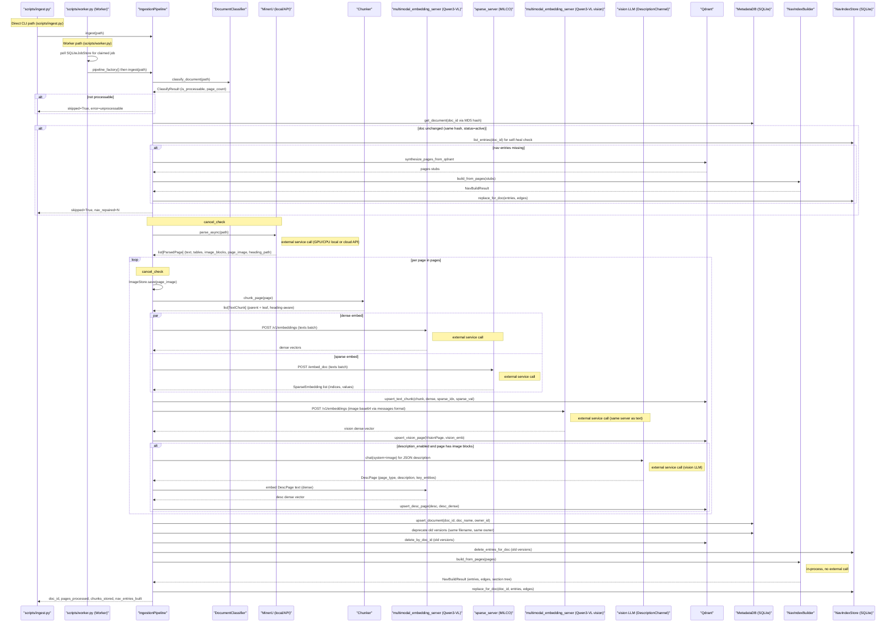
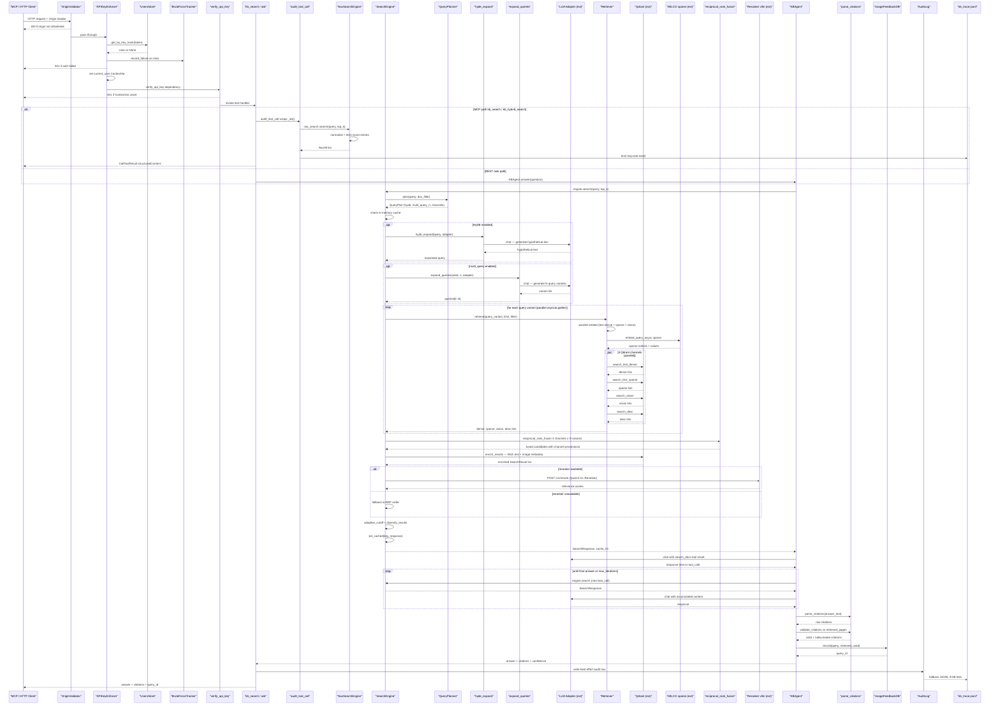
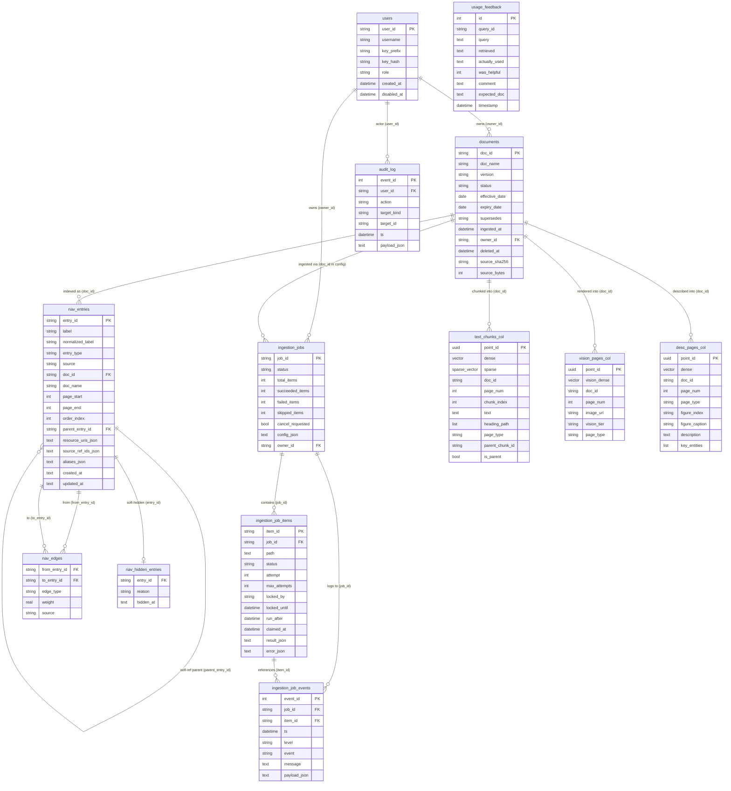
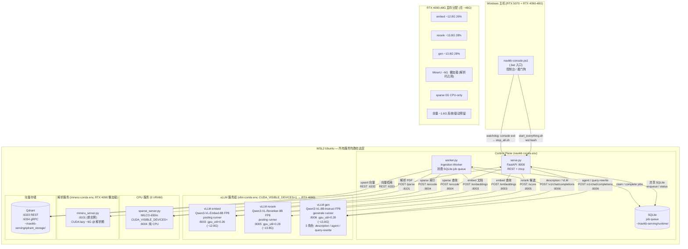

**中文** | [English](architecture-review.md)

# NaviKB 架构评审

> **TL;DR** —— NaviKB 是一个 navigation-first、自托管的知识库平台，定位为 PageIndex 的可自部署替代方案。它通过四层 pipeline（Ingest → Storage → Retrieve → Serve）处理 PDF，并经由 Model Context Protocol (MCP) Streamable-HTTP 端点对外暴露结果。本系统在架构上的核心赌注是：一个预先构建的、层级化的文档结构索引——其中每个 `NavEntry` 都是一个不携带任何文本或 embedding 的 *pure pointer*——能比 flat-embedding 方案产出更精确的结构化导航。仓库内随附一份单机 RTX 4090-48G 部署脚本，运行三个 vLLM 进程（embed / rerank / generate）、一个 CPU 侧的 sparse 服务（MILCO）以及 Qdrant。一次完整评审共发现 60 个问题；最紧迫的几个是：一个被提交进版本库的 admin API token、若干在文档中声明但代码中缺失的安全原语（Argon2id、HMAC-compare），以及核心的四通道检索路径——它们已接线但在运行时从未被真正触发。

> _快照 —— 反映评审时刻的代码状态，而非实时状态。_

## 评审后更新（本次会话）

登记册中的 5 个问题在评审后被处理。**本块为当前权威状态**；下方各章节正文是评审当时的原始快照。

| ID | 原始结论 | 当前状态 |
|----|----------|----------|
| **P1** | admin API token 硬编码在 `deploy/local-48g/_search.sh:2`（security / high） | **已修** —— 改为必填环境变量 `${KB_ADMIN_TOKEN:?}`。⚠️ 泄露的 token 仍存在于 git 历史中，**必须轮换**。 |
| **P6** | text chunk 使用 `uuid4` id → 重复 ingest 堆积幽灵向量（correctness / high） | **已修** —— text chunk 的 point id 改为确定性 `uuid5("text:{doc_id}:{chunk_index}")`，与同文件已有的 vision/desc 修复一致。 |
| **P8** | `QueryPlanner.enabled_channels` 被算出但从不传给 retriever（correctness / high） | **已修** —— `Retriever.retrieve()` 现接收 `enabled_channels` 并门控全部四通道（禁用时跳过 vision 查询 embed）；`engine.py` 传入 `plan.enabled_channels`。 |
| **P2** | API key 认证用 SQL 哈希等值而非 `hmac.compare_digest`（原 security / high） | **重分类 → low / doc-drift。** 被比较的是 SHA-256 哈希（哈希空间），并非可实际利用的 timing oracle；文档里的 `compare_digest` 属纵深防御。经决策维持现状。 |
| **P3** | 读路径无 `owner_id` 过滤 → 任何已认证用户都能读全部文档（原 security / high） | **重分类 → by design。** `security-model.md` 明确多租户强隔离对小团队场景是非目标，且 `qdrant_store.py` 标注 payload 的 `owner_id` “NOT for filter”。共享读是有意设计。 |

> P1 / P6 / P8 的代码修复**仅经语法/逻辑验证**（评审主机无 virtualenv）。请用 `uv run pytest tests/test_storage.py tests/test_search.py tests/test_search_planner.py` 验证。

## 1. 概览

NaviKB 是一个面向自托管、文档中心型检索的 navigation-first 知识库平台。它明确对标的竞品是 PageIndex，后者把文档结构降维为 flat 向量 embedding。NaviKB 的差异化主张是：一个独立构建的层级化导航索引（`nav` 层）能够回答相似度搜索无法精确回答的结构化查询——章节归属、heading 祖先链、页码范围。

整个系统由四个松耦合的层组成：

| 层 | 职责 | 关键组件 |
|-------|---------------|----------------|
| **Ingest** | PDF 解析、分块、embedding、nav-index 构建 | `IngestionPipeline`、`DocumentClassifier`、MinerU、`Chunker`、`NavIndexBuilder` |
| **Storage** | chunk、向量、nav 条目、job、usage 的持久化 | Qdrant（3 个 collection）、4 个 SQLite 数据库 |
| **Retrieve** | 四通道混合搜索、RRF 融合、cross-encoder 重排、query 扩展 | `SearchEngine`、`QueryPlanner`、`NavSearchEngine`、`CrossEncoderReranker` |
| **Serve** | API 网关、认证、MCP 端点、agent 编排 | `tool_server`（FastAPI :8000）、`/mcp` Streamable HTTP、`AgentOrchestrator` |

### 分层架构

```mermaid
flowchart TD
    subgraph EXT["External Services"]
        direction LR
        MinerU["MinerU<br/>(local HTTP / SaaS API)"]
        vLLM_Embed["vLLM<br/>Qwen3-VL-Embedding-8B<br/>:8003"]
        vLLM_Rerank["vLLM<br/>Qwen3-VL-Reranker-8B<br/>:8005"]
        MILCO["MILCO sparse_server<br/>:8004"]
        Qdrant["Qdrant<br/>:6333"]
    end

    subgraph INGEST["Ingest Layer"]
        direction TB
        DocClassifier["DocumentClassifier<br/>(native/scanned/encrypted)"]
        Parser["Parser Factory<br/>(mineru_local / mineru_api)"]
        MiddleToPages["middle_to_pages<br/>(heading_stack → ParsedPage)"]
        Chunker["Chunker<br/>(heading-aware parent+leaf)"]
        TextCh["TextChannel<br/>(dense embed)"]
        SparseCh["SparseChannel<br/>(MILCO embed)"]
        VisionCh["VisionChannel<br/>(image embed)"]
        DescCh["DescriptionChannel<br/>(vision LLM JSON)"]
        JobExecutor["IngestionJobExecutor<br/>(cancel / retry / owner)"]
        JobRunner["IngestionJobRunner<br/>(heartbeat + poll)"]
    end

    subgraph STORAGE["Storage Layer"]
        direction TB
        QdrantStore["QdrantStore<br/>text_chunks / vision_pages / desc_pages"]
        MetaDB["MetadataDB<br/>(SQLite kb_metadata.db)"]
        NavStore["NavIndexStore<br/>(SQLite nav_index.db)"]
        JobStore["SQLiteJobStore<br/>(ingestion_jobs.db)"]
        ImageStore["ImageStore<br/>(local filesystem)"]
        SourceStore["SourceDocStore<br/>(local filesystem)"]
        AuditLog["AuditLog<br/>(3-tier write semantics)"]
        CacheEpoch["CacheEpochStore<br/>(cross-process invalidation)"]
    end

    subgraph RETRIEVE["Retrieve Layer"]
        direction TB
        SearchEngine["SearchEngine<br/>(cache → expand → RRF → rerank)"]
        QueryPlanner["QueryPlanner<br/>(fact/visual/table/process)"]
        HyDE["HyDE Expander"]
        MultiQuery["Multi-Query Expander"]
        Retriever["Retriever<br/>(4-channel parallel Qdrant query)"]
        RRF["RRF Fusion<br/>(weighted reciprocal rank)"]
        Reranker["Reranker<br/>(cross-encoder /v1/rerank)"]
        NavSearch["NavSearchEngine<br/>(keyword TF in-memory)"]
        HybridNav["HybridNavigator<br/>(nav + evidence fan-out)"]
        NavBuilder["NavIndexBuilder<br/>(active-stack algorithm)"]
    end

    subgraph SERVE["Serve Layer"]
        direction TB
        ToolServer["tool_server<br/>(FastAPI :8000)"]
        MCPServer["MCP Server<br/>(/mcp StreamableHTTP)"]
        RestAPI["REST API<br/>(search / docs / jobs / ask)"]
        AgentLoop["KBAgent<br/>(tool-call loop + citation validation)"]
        MCPTools["MCP Tools<br/>(kb_search / kb_hybrid_search / nav tools)"]
        MCPResources["MCP Resources<br/>(kb:// URI handlers)"]
        AuthMW["Auth Middleware<br/>(APIKeyEnforcer + OriginValidator)"]
        AdminAPI["Admin API<br/>(maintenance mode / drain)"]
    end

    %% Ingest write paths (downward into storage)
    DocClassifier --> Parser
    Parser --> MinerU
    MinerU --> MiddleToPages
    MiddleToPages --> Chunker
    Chunker --> TextCh
    Chunker --> SparseCh
    MiddleToPages --> VisionCh
    MiddleToPages --> DescCh
    TextCh --> vLLM_Embed
    SparseCh --> MILCO
    VisionCh --> vLLM_Embed
    DescCh --> vLLM_Embed

    TextCh --> QdrantStore
    SparseCh --> QdrantStore
    VisionCh --> QdrantStore
    DescCh --> QdrantStore
    MiddleToPages --> ImageStore
    Parser --> SourceStore
    JobExecutor --> MetaDB
    JobExecutor --> AuditLog
    JobRunner --> JobStore
    JobExecutor --> CacheEpoch

    NavBuilder --> NavStore
    MiddleToPages --> NavBuilder

    %% Retrieve read paths (upward from storage)
    Qdrant <--> QdrantStore
    SearchEngine --> QueryPlanner
    SearchEngine --> HyDE
    SearchEngine --> MultiQuery
    SearchEngine --> Retriever
    Retriever --> QdrantStore
    Retriever --> vLLM_Embed
    Retriever --> MILCO
    Retriever --> RRF
    RRF --> Reranker
    Reranker --> vLLM_Rerank
    SearchEngine --> MetaDB
    SearchEngine --> CacheEpoch

    NavSearch --> NavStore
    HybridNav --> SearchEngine
    HybridNav --> NavSearch

    %% Serve reads from Retrieve and Storage
    ToolServer --> AuthMW
    ToolServer --> RestAPI
    ToolServer --> MCPServer
    MCPServer --> MCPTools
    MCPServer --> MCPResources
    RestAPI --> SearchEngine
    RestAPI --> AgentLoop
    AgentLoop --> SearchEngine
    MCPTools --> SearchEngine
    MCPTools --> HybridNav
    MCPTools --> NavStore
    MCPResources --> MetaDB
    MCPResources --> ImageStore
    MCPResources --> NavStore
    ToolServer --> AdminAPI
    AdminAPI --> MetaDB

    %% Cross-layer coordination
    JobStore --> JobRunner
    MetaDB --> NavSearch
```

该图自上而下、沿数据流方向阅读。外部服务（MinerU、两个 vLLM 实例、MILCO、Qdrant）位于顶部，只能经 HTTP 访问——它们运行在 NaviKB 主进程之外。Ingest 层把文档经过分类与解析，随后写入三个 Qdrant collection（`text_chunks_{ver}`、`vision_pages_{ver}`、`desc_pages_{ver}`）以及 SQLite `nav_index.db`。Retrieve 层的 `SearchEngine` 汇聚全部四个通道（dense、sparse、vision、description）的结果，并用加权 Reciprocal Rank Fusion (RRF) 融合。Serve 层把一切包裹在 `APIKeyEnforcer` 与审计轨迹之后，再向 MCP 或 REST 客户端返回响应。

## 2. Ingest Pipeline

该图覆盖一份 PDF 的完整 ingest pipeline，对应真实源码。几个关键的结构性说明：

- scripts/ingest.py 直接在进程内运行 IngestionPipeline（无 job 队列）。
- scripts/worker.py 运行 IngestionJobRunner，它轮询 SQLiteJobStore，再经 pipeline_factory 构造 IngestionPipeline 并调用 ingest()。两条路径共享同一份 pipeline 代码，位于 src/kb/ingestion/pipeline.py。

逐页循环（热路径）：对 MinerU 返回的每个 ParsedPage，运行三个 channel。text/sparse embed 通过 asyncio.gather 并行（见 pipeline.py 第 424-430 行）。vision embed 是一次独立的串行调用。description channel 仅在该页含 image block 或文本占比偏低时触发，它调用 DescLLM（注入的 vision-LLM adapter），再把描述文本经 TextSvc 重新 embed。

外部服务调用：MinerU（本地 GPU 子进程或云 API）、multimodal_embedding_server/Qwen3-VL（text + vision，同一服务器）、sparse_server/MILCO，以及可选的、用于生成描述的 vision LLM。

NavIndexBuilder.build_from_pages() 是纯进程内计算（无外部调用）。NavIndexStore 写入一个本地 SQLite 文件（nav_index.db）。nav_store 与 nav_builder 均由 worker lifespan 注入，并受 nav_enabled + nav_auto_build_on_ingest 两个 feature flag 控制。

## 3. Query / Retrieve Pipeline

该图完整追踪了从外部 MCP/HTTP 客户端到最终返回的每一跳，依据真实源码：

1. OriginValidator (mcp_security.py) — ASGI 层最先拦截，检查 Origin 头是否在允许列表，非法直接 403。
2. APIKeyEnforcer (auth/middleware.py) — 解析 X-API-Key / Bearer token，调用 UsersStore.get_by_key_hash；失败时通知 BruteForceTracker 累积计数，返回 401。成功后将 User 写入 current_user ContextVar（try/finally 保证 reset）。
3. verify_api_key (tool_server/security.py) — FastAPI dependency，二次断言 ContextVar 已设置，否则 401（belt-and-suspenders）。
4. audit_tool_call (mcp_security.py) — 包裹每个 MCP tool 调用，计时并写 mcp.tool trace 事件到 kb_trace.jsonl。
5. NavSearchEngine (nav/search.py) — 对 nav index 做关键词打分，返回 NavHit（仅指针，不含生成内容）。
6. SearchEngine (search/engine.py) — 中枢：先查内存缓存，按 QueryPlanner 决策可选 HyDE/Multi-Query（调外部 LLM），再并发调 Retriever。
7. Retriever (search/retriever.py) — 并行嵌入（text dense + MILCO sparse + vision），再并行向 Qdrant 发 4 通道查询（dense/sparse/vision/desc）。
8. RRF (search/rrf.py) — 跨 N 个 query variant、4 个通道做加权 Reciprocal Rank Fusion。
9. Reranker (search/reranker.py) — 向外部 vllm /v1/rerank 发 POST，不可用时 graceful fallback 为 RRF 顺序。
10. KBAgent (agent/agent.py) — tool-calling 循环驱动 LLM，每轮可触发新的 engine.search；最终解析 citations，hallucination 校验，写 UsageFeedbackDB。
11. AuditLog (audit/log.py) — best-effort 写 SQLite，DB 失败时 fsync 到 JSONL fallback。

## 4. Data Model

图中有以下几个核心设计决策值得重点解释。

**NavEntry 为何是 pure pointer（纯指针）**

`nav_entries` 表只存导航元数据：label、entry_type、页码范围（page_start/page_end）、resource_uris_json（`kb://documents/{doc_id}/pages/{start}-{end}` 格式的 URI 列表）。表中没有任何 text、embedding、description 字段。这是有意设计的"导航层与内容层分离"原则：NavEntry 本身不承载原始内容，只充当指向 Qdrant 向量记录的结构化地址簿。调用方若需要实际文本，必须通过 resource_uri 再发起一次 `kb://documents/{doc_id}/pages/{page_num}` 资源请求（或搜索命中后从 Qdrant payload 读取 text_chunk）。这个约定在 `EvidenceHit` 的注释中有明确说明：intentionally does NOT carry text_chunk / vision_description / image_url。

**parent_entry_id 与 nav_edges 的关系**

两者表达的是不同维度的"关系"，不要混淆：

- `parent_entry_id`（`nav_entries` 表自身字段）：表达树形层级（document → section → page），是由 `NavIndexBuilder.build_from_pages` 在构建阶段根据 heading_path 确定性写入的单向归属关系。整棵树以 document 根 entry 为顶点，`parent_entry_id=NULL` 仅出现在文档根节点。

- `nav_edges`（独立表，PK 为 `from_entry_id + to_entry_id + edge_type` 复合键）：表达横向语义关联，包括 `next`/`previous`（顺序关系）、`related_by_heading`/`related_by_page_window`/`related_by_keyword`（相似关系）、`same_page`/`same_document`（共同归属）等。nav_edges 是图边，parent_entry_id 是树边；前者可以跨文档（same_document 之外），后者严格单文档内。

删文档时（`delete_entries_for_doc`）会先收集该文档所有 entry_id，然后级联删除 nav_edges 中任一端点是这些 entry_id 的边，以及 nav_hidden_entries 中对应的软隐藏标记，最后删 nav_entries 行——三张表在同一事务中清理，保证不留孤立边。

**各 SQLite 文件的职责分离**

系统使用四个独立的 SQLite 文件（kb_metadata.db、kb_jobs.db、kb_nav.db、kb_feedback.db），加上 Qdrant 作为向量存储。metadata_db 是权威来源（doc lifecycle + audit + user），jobs_db 管理异步摄取队列（含 fairness-aware claim 逻辑），nav_db 是独立的导航索引（WAL 模式允许 MCP 搜索并发读），feedback_db 存搜索质量反馈。Qdrant 的三个 collection（text_chunks、vision_pages、desc_pages）各自对应一种摄取 channel，payload 中的 doc_id 是指向 metadata_db documents 表的非 FK 软引用。

**NavEntry 为何是 pure pointer。** `nav_entries` 只存储导航性元数据：`label`、`entry_type`、`page_start`/`page_end`，以及一个由 `kb://documents/{doc_id}/pages/{start}-{end}` URI 组成的 `resource_uris_json` 列表。这里没有 `text` 列，没有 `embedding` 列，也没有 `description` 列。这条 navigation-first 原则让 nav 层的结构身份独立于内容：结构化查询只由指针层独自回答，根本不触碰 Qdrant。只有当调用方沿 URI 进入某个向量 collection 时，才会发生内容检索。

## 5. Process & Deployment Topology

单机 48G 上各服务的共存方式与显存分配如下。

运行层：所有服务都跑在 WSL2 Ubuntu 内，Windows 侧只有一个 navikb-console.ps1 / NaviKB-Console.bat，它启动一个看门狗子进程——只要控制台窗口关闭（X 按钮、Ctrl+C、崩溃），看门狗就自动执行 stop_all.sh，确保 4090 的显存得以正确释放，不被持续占用。

进程结构：控制平面由两个进程组成。serve.py（FastAPI :8000）承接 REST 请求和 /mcp 端点，负责查询时编排；worker.py 是后台 ingestion worker，通过共享的 SQLite job queue（存在 WSL ext4 的 ~/navikb-serving/runtime/，不能放 /mnt/c 9p 卷）与 serve.py 协调，原子性地 claim 任务、执行解析→嵌入→入库流程。

三个 vLLM 服务全部绑定在 CUDA_VISIBLE_DEVICES=1（RTX 4090，index 0 是 5070），各自独立进程：
- embed（:8003）用 pooling runner，FP8 动态量化，gpu_util=0.26 → 约 12.8 G
- rerank（:8005）同样 pooling runner，FP8，gpu_util=0.28 → 约 13.8 G
- gen（:8006）用 generate runner，FP8，gpu_util=0.28 → 约 13.8 G；一个模型身兼三个角色：页面 description 生成、/ask agent 对话、HyDE query-rewrite

三者合计预留约 40.4 G，均为独立 vLLM 进程（而非合并为单进程），端口和 served-model-name 各不同。

MILCO sparse server（:8004）强制 CUDA_VISIBLE_DEVICES="" 跑在纯 CPU，占 0 VRAM，避免 milco.py 的 self.to("cuda") 抢占 4090。

MinerU（:8101）绑定 4090，但使用懒加载模式，只有真正执行 PDF 解析时才上 GPU，约占 6 G，解析完毕后释放，与 vLLM 的显存分配错峰（不同时进行大批解析和推理时显存可共存）。

Qdrant（:6333/:6334）纯 CPU + 磁盘，不占 VRAM。

总体设计原则：三个 vLLM 模型各自独立预留 VRAM 分区，sparse 和 Qdrant 完全不占 GPU，MinerU 懒加载填补余量；整机 48 G 在静态负载下被 vLLM 占满约 40 G，留约 8 G 给 MinerU 和系统驱动开销。

## 6. Design Principles

### 6.1 Navigation-first

NaviKB 的 "navigation-first" 不是说检索时先走导航、再走向量，而是说结构树在向量索引之前独立构建，且结构树在整个系统中处于核心地位。PageIndex 的 vectorless 方案把文档结构完全 flat 化为向量，导航语义（章节归属、上下游页面）全靠相似度隐式编码，无法回答"第 5.3 节包含哪些页"这类精确结构查询。NaviKB 则在 `builder.py:22` 的 `NavIndexBuilder.build_from_pages` 中，用活跃栈（active-stack）算法镜像解析器吐出的 heading_path：公共前缀保持不变，超出公共前缀的层级弹栈关闭，新进入的层级压栈打开，每个 section 的 page_end 随访问页面实时扩展（line 124-126），最后在循环结束后回填 resource_uris（line 162-165）。NavEntry 被设计为 pure pointer，`contains_generated_content` 属性硬编码返回 `False`（models.py:58-60），EvidenceHit 显式丢弃 text_chunk / vision_description / image_url。这意味着 NavEntry 只携带"指向哪里"的信息，不携带内容摘要——它是定位锚，不是上下文载体。检索（向量搜索 + rerank）仍是独立的第二步，两者解耦使结构树可以在 GPU 尚未启动时提前建好，也使导航路径可以独立版本化，不受 embedding 模型迭代影响。

### 6.2 Four-channel retrieval

NaviKB 的四通道检索针对四类不同的信息缺口。dense 通道（Qwen3-VL-Embedding-8B，4096 维）解决语义相似度：自然语言 query 与段落意图相同但措辞不同时命中；sparse 通道（MILCO-650m 习得稀疏，doc/query 不对称剪枝）解决精确词汇匹配：专有名词、型号、缩写等在 dense 空间中距离不稳定的 token；vision 通道（同一多模态 embedding 服务器，base64 图像 payload）解决图表、流程图、扫描页：纯文本路径无法触及的视觉内容；description 通道（LLM 结构化 JSON 描述）解决图像语义的文本可搜索性：把视觉内容预翻译为可被 dense/sparse 命中的语言描述。四路结果经两级 RRF 融合（`rrf.py`）：第一级 `_flatten_rrf` 在每通道内合并多 query 变体（engine.py），第二级 `reciprocal_rank_fusion` 跨四通道以 k=60 公式 `score += w*(1/(k+rank+1))` 加权合并，per-channel 权重允许在 CJK 关键词查询时上调 sparse、在语义英文查询时上调 dense。RRF 的角色是多样性保留：它把各路排名靠前的候选聚合成一个大候选集，不丢弃任何通道的强信号。cross-encoder rerank（Qwen3-VL-Reranker-8B via vllm `/v1/rerank`）的角色是精度收敛：对 query 与每个候选片段做 pairwise 打分，pool_multiplier=1.0 保证集合大小不缩减（只重排不踢出）；当 reranker 不可用时抛出 `RerankerUnavailable`，engine 降级为纯 RRF 序，保证可用性。

### 6.3 Dual-process architecture

server/worker 双进程分离的出发点是资源隔离：tool_server（FastAPI，无 GPU）处理所有在线 API 请求，worker（GPU 密集 pipeline）消费 SQLite 任务队列。用 SQLite 作为协调总线而非 Redis/Celery/broker，原因是部署简单——单机自托管场景不希望引入额外的有状态服务，SQLite 文件随项目走，备份只需复制文件。并发模型的核心是 `sqlite_store.py` 中的两个机制。第一，BEGIN IMMEDIATE 事务（line 150-152 的 SQLAlchemy 事件监听器）在写模式引擎连接时强制以写意图开启事务，解决 `claim_next_item` 的 TOCTOU 竞争——多个 worker 同时读到"有空闲任务"后只有一个能成功写入；只读引擎跳过 BEGIN IMMEDIATE 以避免 doctor 诊断查询与 worker 相互阻塞。第二，公平性 LRU 调度：`_CLAIM_SQL` 通过 LEFT JOIN 计算每个 owner_id 在过去 1 小时内的 `MAX(claimed_at)`，NULL last_claim 排序靠前，保证新用户或长期空闲用户优先获得调度，防止活跃用户独占队列。任务持有期间由后台 asyncio.Task 定期更新 `locked_until` 心跳，worker 崩溃后租约自然过期，其他 worker 可重新认领。跨进程缓存失效通过 `CacheEpochStore` 实现：worker 写入完成后递增 SQLite 中的 epoch 值，tool_server 每次搜索前做单行 PK 查询，epoch 变化时使本进程内的 TTLCache 全部失效，无需跨进程消息传递。

### 6.4 Authentication and audit

auth 与 audit 以两个相互独立但共享底层解析器的层次贯穿整个请求路径。REST 层的 FastAPI HTTP 中间件和 MCP 层的 `APIKeyEnforcer` ASGI 包装（`auth/middleware.py`）都调用同一个 `authenticate_token()` 解析器：hash token → DB 查找 → disabled 检查 → BruteForceTracker 记录。BruteForceTracker 是进程内滑动窗口，以 source_ip 为 key，LRU 上限 4096 条，触发阈值时写入一条 `auth.brute_force` 审计行。`current_user` 通过 `contextvars.ContextVar` 在两个层次中注入，try/finally 保证请求结束后重置，确保 asyncio.gather / to_thread 的并发调用不会跨 context 泄漏身份。`OriginValidator`（`mcp_security.py:53`）作为 ASGI 中间件包裹 MCP 子应用，拒绝不在 allowlist 中的 Origin 头，空 Origin 被放行以支持非浏览器客户端（命令行、SDK）。审计层在 `audit/log.py` 实现三级合约：MANDATORY_ACTIONS（user.create/disable/role_change/key_reset）原子写入 ORM session，失败直接 500；TWO_PHASE_ACTIONS（doc.delete/doc.reassign）带 JSONL fsync 降级兜底，DB 不可写时返回 503 而非静默成功；其余动作采用 best-effort 模式，DB 错误被吞掉。`AuditContractError` 用 `raise` 而非 `assert` 防止 `python -O` 优化掉合约检查。`require_owner_or_admin`（`auth/permissions.py`）对每次 403 均发射 best-effort `authz.denied` 审计事件，NULL / `_system` owner 视同 admin-only 资源，确保系统内部操作不被普通用户路径意外触达。owner_id 从 HTTP 请求经 ContextVar 绑定流经 job_executor → IngestionPipeline → 文档元数据，形成完整的 provenance 链。

## 7. 子系统参考

### NaviKB parser 子系统

**用途。** 把原始文档（PDF、DOCX）转换为一组 ParsedPage 对象——每个对象携带 structured_text、heading_path（该页处 heading_stack 的快照）、page_image 字节、tables 与 image_blocks——供下游摄取流程进行分块、embedding 与 nav-index 构建。parser 是 heading_path 的唯一生产者，而 heading_path 正是 NavIndexBuilder 构建多级 section 树的数据来源。

**关键文件**

| 文件 | 作用 |
|------|------|
| `C:\Users\11541\Desktop\projects\navikb\src\kb\parser\__init__.py` | 工厂：make_parser() 在启动时依据 Settings.parser_backend 选择后端；校验 API token 是否存在；惰性导入 cloud/openai 后端，让纯本地安装保持精简。 |
| `C:\Users\11541\Desktop\projects\navikb\src\kb\parser\base.py` | Parser Protocol 定义与 ParseError 异常；确立接口契约。 |
| `C:\Users\11541\Desktop\projects\navikb\src\kb\parser\_middle_to_pages.py` | 核心转换逻辑：遍历 MinerU middle_json / layout.json 页面，跨页维护 heading_stack，构建带 structured_text / heading_path / tables / image_blocks 的 ParsedPage 列表。 |
| `C:\Users\11541\Desktop\projects\navikb\src\kb\parser\_page_render.py` | pypdfium2 的 PDF-to-PNG 渲染器；生成 page_image_b64 列表以注入 layout_json（MinerUAPIParser 使用，因为 API zip 不含渲染后的页面图）。 |
| `C:\Users\11541\Desktop\projects\navikb\src\kb\parser\mineru_local.py` | 本地 MinerU 后端：在一个或多个 mineru_server HTTP 实例上做 hostname-affinity round-robin 路由（_AffinityRouter/_AcquiredURL）；503-aware 派发；可选的逐 PDF GPU 子进程（mineru_gpu_worker）。 |
| `C:\Users\11541\Desktop\projects\navikb\src\kb\parser\mineru_api.py` | MinerU SaaS API 后端：每 PDF 5 步流程（batch upload URL → OSS PUT → poll done → download zip → extract layout.json）；page-weighted least-loaded token 路由，逐 token fail-over。 |
| `C:\Users\11541\Desktop\projects\navikb\src\kb\parser\mineru_openai_local.py` | mineru-openai-server 客户端的占位实现；parse_async 始终抛 NotImplementedError —— HTTP 协议未经验证。 |
| `C:\Users\11541\Desktop\projects\navikb\src\kb\parser\document_classifier.py` | 轻量级预解析分类器（无模型）：用 pypdfium2 的字符密度与异常字符比例启发式，把 PDF 标为 native_text / scanned / encrypted / corrupted / invalid；非 PDF 直接放行。 |
| `C:\Users\11541\Desktop\projects\navikb\src\kb\parser\qdrant_to_pages.py` | 恢复辅助：从已有的 Qdrant text-chunk payload 合成最小化的 ParsedPage 存根，使 nav-index 可在不经 MinerU 重新解析的情况下重建。 |
| `C:\Users\11541\Desktop\projects\navikb\src\kb\ingestion\mineru_worker.py` | 逐 PDF GPU 子进程生命周期管理器：以 cuda 模式 spawn mineru_server.py，等 /health，yield URL，随后 /exit 并等待进程结束以回收 VRAM。 |

**关键符号**

| 符号 | 位置 | 作用 |
|--------|----------|--------------|
| `middle_to_pages` | `C:\Users\11541\Desktop\projects\navikb\src\kb\parser\_middle_to_pages.py:54` | 顶层转换：遍历 pdf_info pages，跨页维护 heading_stack，按 block 类型派发到 structured_text/tables/image_blocks，解码 page_image_b64。 |
| `heading_stack` | `C:\Users\11541\Desktop\projects\navikb\src\kb\parser\_middle_to_pages.py:69` | 文档级 list[str]，每遇 heading block 经 pop/push 逻辑更新；其快照在每页处存为 ParsedPage.heading_path。 |
| `_HEADING_LEVEL` | `C:\Users\11541\Desktop\projects\navikb\src\kb\parser\_middle_to_pages.py:47` | 把 MinerU 3.x block 类型映射到 heading 深度：doc_title=1、title=2、paragraph_title=3。 |
| `_AffinityRouter` | `C:\Users\11541\Desktop\projects\navikb\src\kb\parser\mineru_local.py:40` | hostname 稳定的 round-robin 路由器，带 asyncio.Semaphore 并发上限，用于多实例 MinerU 横向扩展。 |
| `MinerUAPIParser._pick_least_loaded` | `C:\Users\11541\Desktop\projects\navikb\src\kb\parser\mineru_api.py:84` | page-weighted least-loaded token 选择器；把 expected_pages 加到所选 token 的累计值上，以在多 token 配置间平衡 MinerU 的每账号配额。 |
| `MinerUAPIParser._poll_until_done` | `C:\Users\11541\Desktop\projects\navikb\src\kb\parser\mineru_api.py:289` | 针对 MinerU SaaS batch 状态的指数退避轮询循环（上限 30s）；失败态抛 ParseError，超过 max_wait_s 抛 TimeoutError。 |
| `render_page_images` | `C:\Users\11541\Desktop\projects\navikb\src\kb\parser\_page_render.py:18` | 经 pypdfium2 以可配置 DPI 把所有 PDF 页渲染为 PNG（默认 3.0x scale ≈ 216 DPI）；返回 base64 字符串列表以注入 layout_json。 |
| `classify_document` | `C:\Users\11541\Desktop\projects\navikb\src\kb\parser\document_classifier.py:42` | 轻量级预解析分类器，用字符密度（< 50 chars/page → scanned）与异常字符比例（> 3% → corrupted）；非 PDF 以 native_text 放行。 |
| `synthesize_pages_from_qdrant` | `C:\Users\11541\Desktop\projects\navikb\src\kb\parser\qdrant_to_pages.py:47` | 从 Qdrant text_chunks scroll 重建 ParsedPage 存根，用于在不重新解析的情况下重建 nav-index。 |
| `mineru_gpu_worker` | `C:\Users\11541\Desktop\projects\navikb\src\kb\ingestion\mineru_worker.py:71` | 异步 context manager：以 cuda 模式 spawn 逐 PDF mineru_server 子进程，等 /health，yield URL，随后 /exit 并等待进程死亡，带 terminate/kill 兜底。 |

**输入。** 本地磁盘上一个 PDF（或其他文档文件）的 Path。Settings 对象携带后端选择、服务器 URL、API token、语言、解析模式、GPU 标志、渲染 scale、超时值。

**输出。** list[ParsedPage] —— 每个元素含：doc_id（原始字节的 MD5）、doc_name（文件名）、page_num（0-based，来自 MinerU page_idx）、structured_text（带 #/## heading 和 [TABLE] 标记的 Markdown 风格文本）、heading_path（该页处 heading stack 的 list[str] 快照，root-to-current 顺序）、page_image（PNG 字节）、image_blocks（{page_num, caption} 列表）、tables（{html, page_num, caption} 列表）、metadata（{page_size, block_count, block_field}）。

**依赖。** kb.models.ParsedPage、kb.config.Settings、httpx（异步 HTTP）、pypdfium2（PDF 渲染与分类）、kb.observability.emit（事件发射）、kb.ingestion.mineru_worker.mineru_gpu_worker（GPU 子进程生命周期）、scripts/mineru_server.py（外部本地 HTTP 服务器）、mineru.net SaaS API（云后端）

**外部服务。** mineru.net SaaS API —— POST /api/v4/file-urls/batch、PUT 到 OSS 预签名 URL、GET /api/v4/extract-results/batch/{batch_id}；本地 mineru_server HTTP 服务 —— POST /parse、GET /health、POST /exit；mineru-openai-server（尚未集成 —— parse_async 抛 NotImplementedError）

**值得注意的设计。** 三后端工厂模式（mineru_local / mineru_api / mineru_openai_local）在启动时解析一次，不做自动回退 —— 失败在 ingest.error 处暴露并继续。集中式的 middle_to_pages() 被 local 与 API 解析器共用，确保两条路径产出完全一致的 ParsedPage 形状。heading_stack 作为文档级可变列表跨页迭代维护：每遇 heading block，深度 >= 当前层级的元素先被弹出，再压入新文本，从而得到一条干净的祖先链。API 后端实现 page-weighted least-loaded token 路由，在多 token 间均摊 MinerU 的每账号页配额；token_load 是内存计数器，重启即丢失，这可接受，因为日配额由外部重置。local 后端加了 hostname-affinity round-robin，配以 Semaphore 并发上限（大小按实例数设定），提供轻量背压。逐 PDF GPU 子进程生命周期（mineru_gpu_worker）通过为每份文档 spawn 并 kill 一个全新的 mineru_server 进程来约束 VRAM，而不依赖 MinerU 并不提供的 model-unload API。

**状态声明**

| 声明 | 状态 | 证据 |
|-------|--------|----------|
| MinerU middle_json → ParsedPage 转换在 local 与 API 后端间共享 | implemented | `` |
| heading_path / heading_stack 跨页按 H1/H2/H3 pop/push 正确构建 | implemented | `` |
| 多实例 MinerU 扩展，带 round-robin 与 503-aware 轮转 | implemented | `` |
| 逐 PDF GPU 子进程用于 VRAM 回收 | implemented | `` |
| MinerU SaaS API 后端，带多 token page-weighted 路由与 fail-over | implemented | `` |
| mineru-openai-server（vlm-vllm-async-engine）后端 | vision | `` |
| 轻量级预解析文档分类（native_text / scanned / encrypted / corrupted） | implemented | `` |
| 从 Qdrant 重建 nav-index 而无需重新解析 | implemented | `` |
| API 体积/页数预检查以避免浪费日配额 | implemented | `` |
| IngestionPipeline teardown 调用 Parser aclose() | partial | `` |

### NaviKB Ingestion 子系统

**用途。** 把原始文档文件（PDF 等）转换为存入 Qdrant 的多模态向量记录。pipeline 流程为：文档分类 → MinerU 解析 → heading-aware 分块 → 并行 dense+sparse 文本 embedding → vision embedding → 可选的 vision-LLM description → 跨三个 collection（text_chunks、vision_pages、desc_pages）的 Qdrant upsert + SQLite 元数据写入 + nav-index 自动构建。一个 job executor 层用协作式取消、重试策略、owner-context 绑定与 best-effort 审计日志把整个 pipeline 包裹起来。

**关键文件**

| 文件 | 作用 |
|------|------|
| `C:\Users\11541\Desktop\projects\navikb\src\kb\ingestion\pipeline.py` | 主编排器 —— IngestionPipeline.ingest() 驱动全部四个 channel、分类闸门、hash-dedup 跳过、partial-write 清理、nav self-heal 与元数据提交 |
| `C:\Users\11541\Desktop\projects\navikb\src\kb\ingestion\chunker.py` | heading-aware 页面分块器 —— 为文本与表格产出 parent+leaf 的 TextChunk 对 |
| `C:\Users\11541\Desktop\projects\navikb\src\kb\ingestion\channels\text.py` | Channel 1（dense）—— 调 vllm/Qwen3-VL-Embedding 做文本 embedding 的 HTTP 客户端；返回 (dense, [], []) 元组 |
| `C:\Users\11541\Desktop\projects\navikb\src\kb\ingestion\channels\sparse.py` | Channel 1（sparse）—— 调 sparse_server（MILCO）做 doc/query 非对称 sparse embedding 的 HTTP 客户端 |
| `C:\Users\11541\Desktop\projects\navikb\src\kb\ingestion\channels\vision.py` | Channel 2 —— 调 vllm 多模态 embedding server 的 HTTP 客户端；把页面图编码为 base64 chat-messages payload |
| `C:\Users\11541\Desktop\projects\navikb\src\kb\ingestion\channels\description.py` | Channel 3 —— vision LLM adapter 调用；产出结构化 DescPage JSON（page_type、description、key_entities 等） |
| `C:\Users\11541\Desktop\projects\navikb\src\kb\ingestion\job_executor.py` | IngestionJobExecutor —— pipeline 的异步包装；处理 owner ContextVar、cancel/fail/retry 状态迁移、审计 |
| `C:\Users\11541\Desktop\projects\navikb\src\kb\ingestion\mineru_worker.py` | local-GPU MinerU 的逐 PDF 子进程生命周期管理器；spawn/kill mineru_server.py 以在 PDF 之间回收 VRAM |
| `C:\Users\11541\Desktop\projects\navikb\src\kb\ingestion\streaming_pipeline.py` | Semaphore 限并发的多文档包装，用于批量导入 |
| `C:\Users\11541\Desktop\projects\navikb\src\kb\storage\qdrant_store.py` | Qdrant 输出层 —— upsert_text_chunk / upsert_vision_page / upsert_desc_page；collection 名以 embedding_version 为键 |
| `C:\Users\11541\Desktop\projects\navikb\src\kb\models.py` | 共享数据模型：ParsedPage、TextChunk、VisionPage、DescPage |
| `C:\Users\11541\Desktop\projects\navikb\src\kb\config.py` | Settings —— 所有 chunker/embedding/sparse/description/mineru/nav 旋钮 |

**关键符号**

| 符号 | 位置 | 作用 |
|--------|----------|--------------|
| `IngestionPipeline.ingest` | `C:\Users\11541\Desktop\projects\navikb\src\kb\ingestion\pipeline.py:244` | 顶层 ingest 入口；编排 classify→parse→chunk→embed(dense+sparse 并行)→vision→desc→qdrant upsert→metadata→nav |
| `IngestionPipeline._check_cancel` | `C:\Users\11541\Desktop\projects\navikb\src\kb\ingestion\pipeline.py:113` | 在两个检查点（pre-parse、每页）轮询 cancel hook；为 true 时抛 JobCancelled；吞掉 hook 错误（fail-open） |
| `IngestionPipeline._cleanup_partial_writes` | `C:\Users\11541\Desktop\projects\navikb\src\kb\ingestion\pipeline.py:183` | 摄取中途取消时：删该文档的 qdrant 点与图片文件；best-effort，两者均裹 try/except |
| `IngestionPipeline._heal_nav_for_skipped_doc` | `C:\Users\11541\Desktop\projects\navikb\src\kb\ingestion\pipeline.py:132` | 因 hash 未变而跳过时：若该文档 nav 为空，则从 qdrant 合成 ParsedPage 存根并重建 nav |
| `IngestionPipeline.aclose` | `C:\Users\11541\Desktop\projects\navikb\src\kb\ingestion\pipeline.py:204` | 关闭 parser/vision/desc 的 HTTP 客户端、MetadataDB 引擎、Qdrant HTTP 池；不关闭 text_ch 或 sparse_ch |
| `Chunker.chunk_page` | `C:\Users\11541\Desktop\projects\navikb\src\kb\ingestion\chunker.py:35` | 产出 parent+leaf TextChunk；表格走整表 parent+leaf；文本在 >=2 个 heading 时走 heading-aware 路径，否则按字符切分 |
| `Chunker._chunk_by_headings` | `C:\Users\11541\Desktop\projects\navikb\src\kb\ingestion\chunker.py:74` | 在 markdown heading 边界切分；短段 → parent+完全相同的 leaf；长段 → parent+按字符切分的 leaf |
| `Chunker._split_chars` | `C:\Users\11541\Desktop\projects\navikb\src\kb\ingestion\chunker.py:207` | 简单的字符计数切分器；size<=0 时抛 ValueError；注释指出 token-aware 替换为未来工作 |
| `TextChannel.embed_batch` | `C:\Users\11541\Desktop\projects\navikb\src\kb\ingestion\channels\text.py:69` | 同步入口；内部调 asyncio.run()；返回 (dense, [], []) 列表 —— sparse 占位有意留空 |
| `SparseChannel.embed_doc_batch_async` | `C:\Users\11541\Desktop\projects\navikb\src\kb\ingestion\channels\sparse.py:64` | POST /embed_doc 到 sparse_server；返回 list[SparseEmbedding]，失败返回 None（优雅降级） |
| `VisionChannel.embed_async` | `C:\Users\11541\Desktop\projects\navikb\src\kb\ingestion\channels\vision.py:65` | 把图片编码为 base64，向 /v1/embeddings 发 chat-messages payload；返回 list[float]\|None；400 时记录完整 vllm 错误体 |
| `DescriptionChannel.should_process` | `C:\Users\11541\Desktop\projects\navikb\src\kb\ingestion\channels\description.py:63` | 当 has_image_blocks 或 text_char_ratio < 0.9 时返回 True；用于跳过纯文本页 |
| `DescriptionChannel.describe` | `C:\Users\11541\Desktop\projects\navikb\src\kb\ingestion\channels\description.py:78` | 把图片 + heading 上下文发给 vision LLM；用 _strip_json_fence 解析 JSON；失败时回退到空 DescPage |
| `IngestionJobExecutor.execute_item` | `C:\Users\11541\Desktop\projects\navikb\src\kb\ingestion\job_executor.py:61` | 取 job 拿 owner_id，设 current_user ContextVar，调 _run_pipeline；处理 JobCancelled / Exception → store 迁移 |
| `_is_retryable` | `C:\Users\11541\Desktop\projects\navikb\src\kb\ingestion\job_executor.py:234` | 按类型名字符串匹配（脆弱）与 ParseError 消息内容判定异常是否可重试 |
| `mineru_gpu_worker` | `C:\Users\11541\Desktop\projects\navikb\src\kb\ingestion\mineru_worker.py:71` | 异步 context manager：以 cuda 模式 spawn mineru_server.py 子进程，等 /health，yield URL，退出时调 /exit |
| `QdrantStore.upsert_text_chunk` | `C:\Users\11541\Desktop\projects\navikb\src\kb\storage\qdrant_store.py:78` | 以 dense+sparse named vector 与完整 chunk payload 插入点；用随机 uuid4（非确定性） |
| `QdrantStore.upsert_vision_page` | `C:\Users\11541\Desktop\projects\navikb\src\kb\storage\qdrant_store.py:109` | 插入 vision_dense 向量；id=uuid5(NAMESPACE_URL, 'vision:{doc_id}:{page_num}') —— 确定性/幂等 |
| `streaming_ingest` | `C:\Users\11541\Desktop\projects\navikb\src\kb\ingestion\streaming_pipeline.py:15` | 在多个 path 上做 Semaphore 限并发的 gather；逐文档失败被吞进 result dict |

**输入。** 单个文档文件 Path。内部：来自 MinerU 的 ParsedPage 列表（structured_text、heading_path、page_image 字节、image_blocks、tables）。Settings 控制全部旋钮（chunker 大小、embedding server URL、sparse 剪枝比、description 开关/adapter、nav 自动构建）。

**输出。** Qdrant：text_chunks_{embedding_version}（dense+sparse）、vision_pages_{embedding_version}（vision_dense）、desc_pages_{embedding_version}（dense）中的点。SQLite：kb_metadata.db documents 表中的一行（doc_id、doc_name、owner_id、status=active）。Nav index：经 auto_build_nav_for_doc 生成的 NavEntry 行。经 ImageStore 的图片文件。可选：经 SourceDocStore 的源 PDF 副本。返回 dict：{doc_id, skipped, pages_processed, chunks_stored, nav_entries_built}。

**依赖。** kb.parser（make_parser / MinerU local/API）、kb.storage.qdrant_store.QdrantStore、kb.storage.metadata_db.MetadataDB、kb.storage.image_store.ImageStore、kb.storage.source_store.SourceDocStore、kb.nav.auto_build.auto_build_nav_for_doc、kb.nav.store.NavIndexStore、kb.nav.builder.NavIndexBuilder、kb.parser.document_classifier.classify_document、kb.parser.qdrant_to_pages.synthesize_pages_from_qdrant、kb.adapters.factory.make_chat_adapter、kb.search.cache.invalidate_all、kb.search.cache_epoch.CacheEpochStore、kb.auth.context.current_user（ContextVar）、kb.jobs.cancel.JobCancelled、kb.jobs.errors.JobError、kb.jobs.resource_manager.ResourceManager、kb.observability.emit / emit_error

**外部服务。** multimodal_embedding_server（vllm + Qwen3-VL-Embedding-8B），位于 settings.multimodal_embedding_server_url —— /v1/embeddings 同时用于文本和 vision；sparse_server（MILCO-650m HTTP 包装），位于 settings.sparse_server_url —— /embed_doc 与 /embed_query；mineru_server（本地子进程或 MinerU SaaS API）—— PDF 解析；Description vision LLM（Qwen3.6 或任意 OpenAI-compat 端点），位于 settings.description_url；Qdrant 向量 DB，位于 settings.qdrant_url 或本地路径；SQLite（kb_metadata.db）用于文档元数据与 cache epoch

**值得注意的设计。** 逐页四通道扇出：(1) text —— 经 Qwen3-VL 的 dense + 经 MILCO 的 sparse，用 asyncio.gather(to_thread(embed_batch), embed_doc_batch_async) 并行派发；(2) vision —— 同一 embedding server，chat-messages 图像 payload；(3) description —— 独立的 vision LLM，产出语义 JSON，作为带自身 dense embedding 的 desc collection 点存储。Parent/leaf 分块架构：检索命中 leaf，enrichment 返回 parent。heading-aware 切分仅在页面有 >=2 个 heading 时启用。基于 hash 的去重（文件字节的 MD5）跳过未变文档，跳过时做 nav self-heal。两检查点的协作式取消，配以 partial-write 回滚。基于文件名的版本弃用做跨 owner 保护。每个 pipeline 每个 job 调一次 aclose()，防止长跑 worker 中句柄累积。Qdrant collection 名编码 embedding_version，通过更换版本字符串实现零停机重新 embedding。

**状态声明**

| 声明 | 状态 | 证据 |
|-------|--------|----------|
| 经 Qwen3-VL-Embedding-8B 的 dense 文本 embedding（PoC v1.1） | implemented | `` |
| MILCO learned-sparse embedding（SparseChannel） | implemented | `` |
| Vision embedding（单向量 Qwen3-VL，替代 ColQwen 多向量） | implemented | `` |
| Description channel（逐页 vision LLM 结构化 JSON） | implemented | `` |
| heading-aware 分块，配 parent+leaf 架构 | implemented | `` |
| 页边界处的协作式 job 取消，配 partial-write 清理 | implemented | `` |
| 基于文件名的版本弃用做跨 owner 保护 | implemented | `` |
| 每次成功摄取都自动构建 nav index | implemented | `` |
| hash 未变跳过时做 nav self-heal | implemented | `` |
| 每个 pipeline 一次 aclose() 防止长跑 worker 句柄泄漏 | implemented | `` |
| aclose() 覆盖 text_ch 与 sparse_ch | partial | `` |
| token-aware 切分（被提及为未来改进） | vision | `` |
| 云 MinerU API 后端（parser_backend=mineru_api） | partial | `` |
| Resource manager 的 GPU/LLM semaphore 闸控 | implemented | `` |

### NaviKB deploy/local-48g/ 与 docker/ 子系统

**用途。** 提供单机（RTX 4090 48 GB，Windows 11 + WSL2）all-online NaviKB 实例的完整部署拓扑，以及云端/GPU-host 拆分的 Docker Compose 拓扑。涵盖模型服务编排（embed/rerank/gen/sparse/mineru/qdrant）、conda 环境管理、模型下载、VRAM 预算、服务健康检查、start/stop 生命周期，以及一个掌管整个 stack 生命周期的 Windows GUI 控制台。

**关键文件**

| 文件 | 作用 |
|------|------|
| `C:\Users\11541\Desktop\projects\navikb\deploy\local-48g\README.md` | 权威拓扑参考：port/env/VRAM 表、安装顺序、坑点索引 |
| `C:\Users\11541\Desktop\projects\navikb\deploy\local-48g\STEP_BY_STEP.md` | 详细部署日志：每个主要坑点的 root-cause/fix 配对、VRAM 预算论证、FP8 决策记录、已知局限 |
| `C:\Users\11541\Desktop\projects\navikb\deploy\local-48g\start_everything.sh` | 一次性全栈拉起：按依赖顺序启动全部 8 个服务（qdrant -> embed -> sparse -> mineru -> rerank -> gen -> serve -> worker），每个就绪前 health-poll |
| `C:\Users\11541\Desktop\projects\navikb\deploy\local-48g\start_all_online.sh` | 仅模型服务拉起（不含 qdrant/serve/worker）；用 sed 在交给 bash 前剥除 CRLF，防 Windows 检出污染 |
| `C:\Users\11541\Desktop\projects\navikb\deploy\local-48g\stop_all.sh` | 优雅 teardown：经 pidfile 发 SIGTERM，再对全部 6 个进程模式做 pkill 清扫 |
| `C:\Users\11541\Desktop\projects\navikb\deploy\local-48g\env.local-48g` | local-48g 的运行时 .env：所有服务端点、模型 ID、embedding version、sparse/rerank 设置、search feature flags |
| `C:\Users\11541\Desktop\projects\navikb\deploy\local-48g\_start_embed.sh` | 经 vLLM pooling runner 启动 Qwen3-VL-Embedding-8B，FP8 动态量化，端口 8003，26% VRAM |
| `C:\Users\11541\Desktop\projects\navikb\deploy\local-48g\_start_gen.sh` | 经 vLLM generate runner 启动 Qwen3-VL-8B-Instruct-FP8；禁用 flashinfer（无 nvcc）、TORCH_SDPA、受限 vision profile，端口 8006，28% VRAM |
| `C:\Users\11541\Desktop\projects\navikb\deploy\local-48g\_start_rerank.sh` | 经 vLLM pooling 启动 Qwen3-VL-Reranker-8B；需 3 个 must-have override（chat-template、classifier_from_token、is_original_qwen3_reranker），端口 8005，28% VRAM |
| `C:\Users\11541\Desktop\projects\navikb\deploy\local-48g\_start_sparse.sh` | 在 CPU 上启动 MILCO-650m（CUDA_VISIBLE_DEVICES=''）；HF_HUB_OFFLINE、子 tokenizer 路径、SPARSE_ENCODE_BATCH=8，端口 8004 |
| `C:\Users\11541\Desktop\projects\navikb\deploy\local-48g\_start_mineru.sh` | 在 mineru conda env 中启动 MinerU，CUDA 钉到 4090，单实例端口 8101 |
| `C:\Users\11541\Desktop\projects\navikb\deploy\local-48g\_start_serve.sh` | 在 navikb env 中启动 FastAPI 控制平面（REST + /mcp），CWD 在 ext4 上（对 SQLite 至关重要），端口 8000 |
| `C:\Users\11541\Desktop\projects\navikb\deploy\local-48g\_start_worker.sh` | 启动后台 ingestion worker；与 serve 共享同一 ext4 CWD 以协调 SQLite |
| `C:\Users\11541\Desktop\projects\navikb\deploy\local-48g\_start_qdrant.sh` | 启动 Qdrant 二进制（并发写访问需 server 模式），REST 6333 / gRPC 6334 |
| `C:\Users\11541\Desktop\projects\navikb\deploy\local-48g\navikb-console.ps1` | Windows PowerShell GUI 控制台：dashboard、实时监控、start/stop 控制、在控制台关闭时调 stop_all.sh 的看门狗 |
| `C:\Users\11541\Desktop\projects\navikb\deploy\local-48g\_sparse_fix.sh` | 一次性：改写 MILCO config.json，使子 tokenizer checkpoint 指向本地路径以离线运行 |
| `C:\Users\11541\Desktop\projects\navikb\deploy\local-48g\quantize_embed_fp8.py` | 已废弃的死路：为 embed 做离线 llmcompressor FP8 量化（加载到随机权重 —— 仅作记录留存） |
| `C:\Users\11541\Desktop\projects\navikb\deploy\local-48g\quantize_rerank_fp8.py` | 已废弃的死路：为 rerank 做离线 llmcompressor FP8 量化（仅作记录留存） |
| `C:\Users\11541\Desktop\projects\navikb\docker\docker-compose.local.yml` | 云端/GPU-host 拆分拓扑的 Docker Compose：qdrant + kb_main + kb_worker；GPU 服务经到 host.docker.internal 的 SSH 隧道访问 |
| `C:\Users\11541\Desktop\projects\navikb\docker\Dockerfile.main` | kb_main 与 kb_worker 的镜像：python:3.12-slim + navikb[server,dev]，CPU-only torch，含 FlagEmbedding 构建依赖（注明为未来清理项） |
| `C:\Users\11541\Desktop\projects\navikb\docker\Dockerfile.milco` | 独立 MILCO sparse server 镜像：CPU-only torch，仅 sparse_server.py，模型首次请求时下载（或可选预烘焙） |
| `C:\Users\11541\Desktop\projects\navikb\scripts\sparse_server.py` | MILCO FastAPI 服务：/embed_doc、/embed_query、/health；mass-based 剪枝；sub-batch guard（SPARSE_ENCODE_BATCH）；每次前向后释放内存 |
| `C:\Users\11541\Desktop\projects\navikb\scripts\mineru_server.py` | MinerU FastAPI 服务：/parse（hybrid/vlm/pipeline 模式）、/health、/exit（硬 kill 以回收 GPU）；JSON 输出上的 surrogate 清洗；busy-flag 503 用于 round-robin |
| `C:\Users\11541\Desktop\projects\navikb\scripts\serve.py` | kb.tool_server.app:app 的瘦 uvicorn 入口；默认 bind 127.0.0.1（compose 中 override 为 0.0.0.0） |
| `C:\Users\11541\Desktop\projects\navikb\scripts\worker.py` | 异步 ingestion worker：SQLiteJobStore -> IngestionJobRunner -> IngestionJobExecutor -> IngestionPipeline；接线 nav、audit、maintenance |

**关键符号**

| 符号 | 位置 | 作用 |
|--------|----------|--------------|
| `start_svc / wait_health` | `C:\Users\11541\Desktop\projects\navikb\deploy\local-48g\start_all_online.sh:17-38` | 辅助对：经 setsid 以 detached 方式启动服务，写 pidfile，然后每 3s poll 一次 /health 直至超时 |
| `launch / wait_h` | `C:\Users\11541\Desktop\projects\navikb\deploy\local-48g\start_everything.sh:11-20` | 权威拉起脚本中的同一模式；worker 以 port=0 启动（不做 health poll） |
| `_encode_to_qdrant` | `C:\Users\11541\Desktop\projects\navikb\scripts\sparse_server.py:139` | 核心 MILCO 编码：sub-batch 循环（SPARSE_ENCODE_BATCH）、COO sparse tensor 分解、mass-based 剪枝、显式 del + empty_cache |
| `_mass_based_prune` | `C:\Users\11541\Desktop\projects\navikb\scripts\sparse_server.py:109` | 从 sparse 向量中丢弃底部 prune_ratio 的质量占比；docs 用 0.3，queries 用 0.0 |
| `_parse_busy flag` | `C:\Users\11541\Desktop\projects\navikb\scripts\mineru_server.py:120` | 非加锁的单实例 busy guard：返回 503 以让 KB 路由器重试另一个 mineru 实例 |
| `surrogate scrubbing` | `C:\Users\11541\Desktop\projects\navikb\scripts\mineru_server.py:196` | json.dumps(...).encode('utf-8','replace') 丢弃来自数学密集 PDF 的孤立 UTF-16 surrogate，否则会让 JSONResponse 崩溃 |
| `SPARSE_ENCODE_BATCH env (=8)` | `C:\Users\11541\Desktop\projects\navikb\deploy\local-48g\_start_sparse.sh:20` | 把 MILCO 前向 batch 限到 8 条文本以约束 CPU/VRAM 峰值；sparse_server.py 中默认是 48 |
| `Stop-Watchdog / watchdog PS1 script` | `C:\Users\11541\Desktop\projects\navikb\deploy\local-48g\navikb-console.ps1:23-25` | spawn 隐藏的 PowerShell 看门狗进程，监控控制台 PID，控制台退出时运行 stop_all.sh |
| `ScriptUtil + VramNote` | `C:\Users\11541\Desktop\projects\navikb\deploy\local-48g\navikb-console.ps1:59-78` | 从每个 _start_*.sh 解析 gpu-memory-utilization，推导每模型 VRAM 预留估计供 dashboard 显示 |
| `CUDA_DEVICE_ORDER=PCI_BUS_ID CUDA_VISIBLE_DEVICES=1` | `C:\Users\11541\Desktop\projects\navikb\deploy\local-48g\_start_embed.sh:6` | 每个 vLLM 启动脚本都钉到 4090（PCI index 1，而非 torch fastest-first 的 index 0，即 5070 8G） |
| `VLLM_USE_FLASHINFER_SAMPLER=0 + VLLM_ATTENTION_BACKEND=TORCH_SDPA` | `C:\Users\11541\Desktop\projects\navikb\deploy\local-48g\_start_gen.sh:11-12` | 绕开需要 nvcc（conda env 中缺失）的 flashinfer JIT 编译路径 |
| `hf_overrides classifier_from_token` | `C:\Users\11541\Desktop\projects\navikb\deploy\local-48g\_start_rerank.sh:12` | Qwen3-VL-Reranker 的三个 must-have：chat_template、classifier_from_token=['no','yes']、is_original_qwen3_reranker=true —— 缺任一都会导致排名为垃圾（vllm #35412） |

**输入。** 用于摄取的 PDF 文件；操作员的 WSL2 shell（或 Windows NaviKB-Console.bat）；.env 运行时配置（env.local-48g 复制到 ~/navikb-serving/runtime/.env）。Docker 部署额外需要 KB_REPO_PATH、KB_DATA_PATH，以及 8003-8006/8101-8103 上的 GPU-host SSH 隧道。

**输出。** localhost 上 8 个服务的运行栈：embed :8003、sparse :8004、rerank :8005、gen :8006、mineru :8101、serve :8000、worker（无端口）、qdrant :6333/:6334。Pidfile 在 ~/navikb-serving/run/，日志在 ~/navikb-serving/logs/，SQLite DB + Qdrant 存储在 WSL ext4 上（~/navikb-serving/runtime/ 与 ~/navikb-serving/qdrant_storage/）。Qdrant Snapshot 目录（deploy/local-48g/snapshots/），含 3 个已填充 collection：text_chunks、vision_pages、desc_pages（sparse 作为 SparseVector 字段存在 text_chunks 内，不是单独 collection）。

**依赖。** omai-research/milco-650m（HuggingFace，Apache 2.0）、naver/splade-v3 tokenizer（HuggingFace，经 _sparse_fix.sh）、BAAI/bge-m3 tokenizer（随 MILCO 模型目录附带）、Qwen/Qwen3-VL-Embedding-8B（ModelScope BF16）、Qwen/Qwen3-VL-Reranker-8B（ModelScope BF16）、Qwen/Qwen3-VL-8B-Instruct-FP8（ModelScope 官方 FP8）、OpenDataLab/MinerU2.5-Pro-2604-1.2B（ModelScope）、qdrant v1.12.0 二进制（GitHub release）、vllm 0.22.1 + torch 2.11.0+cu130（conda env: vllm）、mineru[pipeline,vlm]>=3.1.0（conda env: mineru）、navikb[server] 可编辑安装（conda env: navikb）、~/miniconda3 下的 Miniconda3（无系统包）、Windows 11 上的 WSL2 Ubuntu 24.04、127.0.0.1:7897 的 Clash Verge 代理（仅用于 HF 下载）

**外部服务。** ModelScope（模型下载，CDN 从 WSL 可达）、经 Windows curl.exe + Clash 代理的 hf-mirror.com（仅 MILCO、splade-v3 tokenizer 下载）、nvidia-smi（status/console 脚本中的 VRAM 监控）、Qdrant REST API :6333（由 serve 和 worker 使用）

**值得注意的设计。** 有几个深层设计选择值得一提。第一，三 conda env 隔离：vllm（torch 2.11+cu130、transformers 5.10）、mineru（transformers ~4.57、torch ~2.8）、navikb（transformers <5.0、torch <2.9 CPU）。每套依赖彼此不可调和，所以跨 env 走 HTTP。第二，SQLite-on-ext4 规则：server 与 worker 必须共享 SQLite DB；/mnt/c 的 9p 锁不可靠，故两个进程在启动前都 cd 到 ~/navikb-serving/runtime/（ext4）。第三，MILCO 用 SPARSE_DEVICE=cpu + CUDA_VISIBLE_DEVICES=''：模型在 milco.py 中硬编码 self.to('cuda')，所以隐藏 GPU 是强制走 CPU 的唯一办法；代价是用 CPU 吞吐换 0 VRAM。第四，FP8 经 vLLM 加载期 --quantization fp8 而非离线 llmcompressor：离线路径把 embedding 权重加载为随机值，毁掉质量；quantize_*.py 已被明确标记废弃。第五，navikb-console.ps1 中的看门狗模式：一个隐藏的 PowerShell 子进程 poll 控制台 PID，在其死亡时调 stop_all.sh，确保即便强 kill 也能释放 VRAM。第六，start_all_online.sh 的 sed CRLF 剥除：脚本在 Windows 上编辑，故 start_all_online.sh 在执行前剥除 \r（start_everything.sh 转而信任 .gitattributes 的 eol=lf）。第七，mineru busy-flag 503 作为隐式负载均衡：无需共享状态；单实例 guard 返回 503，KB 路由器重试另一实例，把朴素 round-robin 变成 busy-aware 派发。第八，VRAM 预算逻辑：gpu-memory-utilization 是占整卡总内存的每进程比例；真正的杀手是 vision profile_run 激活，故 gen 用 --max-num-seqs 2 和封顶的 max_pixels 来约束，而非仅仅降低 utilization。

**状态声明**

| 声明 | 状态 | 证据 |
|-------|--------|----------|
| 全部 8 个服务（embed/rerank/gen/sparse/mineru/qdrant/serve/worker）在单张 RTX 4090 48G 上同时运行，search 与 ingest 并发 | implemented | `` |
| 峰值 VRAM ~42G/49G；三个 FP8 vLLM 模型消耗 embed ~11.5G + rerank ~12.5G + gen ~13G = ~37G，余 ~9G 给 MinerU | implemented | `` |
| MILCO sparse（Channel 3）经 SPARSE_DEVICE=cpu + CUDA_VISIBLE_DEVICES='' 在 CPU 上以 0 VRAM 运行 | implemented | `` |
| HyDE + multi-query 搜索启用（HYDE_ENABLED=true、MULTI_QUERY_ENABLED=true、MULTI_QUERY_N=3） | implemented | `` |
| Reranker 启用（SEARCH_DISABLE_RERANKER=false） | implemented | `` |
| 4 通道摄取（text + vision + sparse + description）全部同时在线 | implemented | `` |
| 摄取时 Nav 自动构建启用（NAV_ENABLED=true、NAV_AUTO_BUILD_ON_INGEST=true） | implemented | `` |
| Docker Compose 支持 worker 水平扩展（--scale kb_worker=N） | partial | `` |
| FP8 模型相对 BF16 基线的检索质量验证 | vision | `` |
| 无人值守/持久化运行（terminal 关闭后存活） | partial | `` |

### NaviKB runtime 子系统

**用途。** runtime 子系统是 NaviKB 的进程模型与启动编排层。它定义两个独立 OS 进程（tool_server 与 worker）如何被拉起、如何经 SQLite 数据库共享状态，以及进程内单例（model registry、tracing、auth context）如何被管理。具体涵盖：(1) src/kb/runtime/ —— 进程内 ModelRegistry 单例；(2) scripts/serve.py + scripts/worker.py —— 两个入口脚本；(3) scripts/start_all.ps1 / deploy/local-48g/start_everything.sh —— 启动编排；(4) src/kb/tool_server/app.py 的 lifespan —— FastAPI 启动/关闭接线；(5) src/kb/jobs/ —— 桥接两进程的 SQLite 支撑 job 队列；(6) src/kb/admin/maintenance.py + src/kb/search/cache_epoch.py —— 跨进程协调原语；(7) src/kb/observability/trace.py + src/kb/auth/context.py —— 两进程都用到的逐请求 ContextVar 传播。

**关键文件**

| 文件 | 作用 |
|------|------|
| `C:/Users/11541/Desktop/projects/navikb/src/kb/runtime/model_registry.py` | 进程内线程安全模型缓存（ModelRegistry）；__init__.py 为空；src/kb/runtime/ 中仅两个文件 |
| `C:/Users/11541/Desktop/projects/navikb/scripts/serve.py` | Server 入口：uvicorn 启动 kb.tool_server.app:app |
| `C:/Users/11541/Desktop/projects/navikb/scripts/worker.py` | Worker 入口：异步 main() 构建所有 store，接线 IngestionJobRunner，永久运行 |
| `C:/Users/11541/Desktop/projects/navikb/src/kb/tool_server/app.py` | FastAPI app + asynccontextmanager lifespan：接线所有 store、MCP session manager、auth middleware、route includes |
| `C:/Users/11541/Desktop/projects/navikb/src/kb/jobs/runner.py` | IngestionJobRunner：poll 循环、每个已认领 item 的 heartbeat 任务、有韧性的 run_forever |
| `C:/Users/11541/Desktop/projects/navikb/src/kb/jobs/sqlite_store.py` | SQLiteJobStore：BEGIN IMMEDIATE TOCTOU guard、fairness-aware claim_next_item、完整 job 生命周期 |
| `C:/Users/11541/Desktop/projects/navikb/src/kb/jobs/resource_manager.py` | ResourceManager：每种资源类型一个 asyncio.Semaphore（mineru_gpu、description_llm、text_embedding） |
| `C:/Users/11541/Desktop/projects/navikb/src/kb/ingestion/job_executor.py` | IngestionJobExecutor：逐 item 的 pipeline 工厂调用、cancel/fail/complete 路由、current_user ContextVar 绑定 |
| `C:/Users/11541/Desktop/projects/navikb/src/kb/admin/maintenance.py` | MaintenanceState：SQLite 单行跨进程 flag；开启时阻塞 claim_next_item |
| `C:/Users/11541/Desktop/projects/navikb/src/kb/search/cache_epoch.py` | CacheEpochStore：SQLite 单调计数器 bump/get，用于跨进程搜索缓存失效 |
| `C:/Users/11541/Desktop/projects/navikb/src/kb/observability/trace.py` | setup_tracing + ContextVar trace_id + emit/timed：结构化 JSONL 可观测性，两进程通用 |
| `C:/Users/11541/Desktop/projects/navikb/src/kb/auth/context.py` | current_user ContextVar：跨 REST 与 worker 路径的逐 asyncio-Task 用户身份传播 |
| `C:/Users/11541/Desktop/projects/navikb/src/kb/auth/middleware.py` | APIKeyEnforcer（ASGI）+ authenticate_token：REST 与 MCP 路径共享的 auth 函数 |
| `C:/Users/11541/Desktop/projects/navikb/src/kb/tool_server/mcp_security.py` | MCP 子应用的 OriginValidator ASGI middleware + audit_tool_call 包装 |
| `C:/Users/11541/Desktop/projects/navikb/src/kb/tool_server/mcp_state.py` | MCPState dataclass + bind_state/reset：交给 FastMCP tool closure 的模块级单例 |
| `C:/Users/11541/Desktop/projects/navikb/scripts/start_all.ps1` | Windows 启动编排：检查 Qdrant Docker 容器，在独立 PowerShell 窗口中 spawn serve.py + worker.py |
| `C:/Users/11541/Desktop/projects/navikb/deploy/local-48g/start_everything.sh` | Linux/WSL 全栈启动：qdrant → embed → sparse → mineru → rerank → gen → serve → worker，每个都 health wait |
| `C:/Users/11541/Desktop/projects/navikb/src/kb/config.py` | Settings（pydantic-settings）：启动时读取一次的所有可调旋钮，含 DB 路径、job-worker 时序、feature flags |

**关键符号**

| 符号 | 位置 | 作用 |
|--------|----------|--------------|
| `ModelRegistry` | `C:/Users/11541/Desktop/projects/navikb/src/kb/runtime/model_registry.py:27` | 线程安全、RLock 守卫的 dict，以 (name, **kwargs) 元组为键；failure-does-not-pollute 语义；经 get_model_registry() 提供模块级 _GLOBAL_MODEL_REGISTRY 单例 |
| `lifespan` | `C:/Users/11541/Desktop/projects/navikb/src/kb/tool_server/app.py:90` | FastAPI asynccontextmanager：按序初始化所有 store，绑定 MCP session manager run()，退出时逆序 teardown |
| `IngestionJobRunner.run_forever` | `C:/Users/11541/Desktop/projects/navikb/src/kb/jobs/runner.py:75` | 有韧性的 poll 循环：扛住 run_once 抛出的任意异常（仅重抛 CancelledError），队列空时退避 |
| `IngestionJobRunner._heartbeat` | `C:/Users/11541/Desktop/projects/navikb/src/kb/jobs/runner.py:108` | 每 heartbeat_interval_s 延长 locked_until 的 asyncio.Task；execute_item 返回后在 finally 中取消 |
| `SQLiteJobStore.claim_next_item` | `C:/Users/11541/Desktop/projects/navikb/src/kb/jobs/sqlite_store.py:234` | fairness-aware 认领，用带 BEGIN IMMEDIATE 的 _CLAIM_SQL；owner 间 1 小时窗口 LRU 公平；maintenance 闸门 |
| `_CLAIM_SQL` | `C:/Users/11541/Desktop/projects/navikb/src/kb/jobs/sqlite_store.py:40` | 公平调度的原始 SQL LEFT JOIN 子查询：NULL last_claim 排前，再按最早 claim，再按 rowid |
| `IngestionJobExecutor.execute_item` | `C:/Users/11541/Desktop/projects/navikb/src/kb/ingestion/job_executor.py:61` | 逐 item 编排：get_job 取 owner_id，设 current_user ContextVar，调 _run_pipeline，区分 JobCancelled 与 Exception，审计终态失败 |
| `ResourceManager.acquire_many` | `C:/Users/11541/Desktop/projects/navikb/src/kb/jobs/resource_manager.py:29` | 排序后的 semaphore 获取以防死锁；yield 后逆序释放 |
| `MaintenanceState.is_on` | `C:/Users/11541/Desktop/projects/navikb/src/kb/admin/maintenance.py:86` | 热路径：每次写调用做一次单行 PK SELECT 以检查跨进程 maintenance flag |
| `CacheEpochStore.bump` | `C:/Users/11541/Desktop/projects/navikb/src/kb/search/cache_epoch.py:91` | 原子 SQLite UPDATE epoch+1；worker 在 ingest/deprecate 后调用以失效 tool_server 搜索缓存 |
| `setup_tracing` | `C:/Users/11541/Desktop/projects/navikb/src/kb/observability/trace.py:29` | 对 logs/kb_trace.jsonl 的幂等 RotatingFileHandler 配置；由模块级 _initialized bool 守卫 |
| `_reset_session_manager_run_latch` | `C:/Users/11541/Desktop/projects/navikb/src/kb/tool_server/app.py:57` | 重置 FastMCP StreamableHTTPSessionManager 的 _has_started flag，使一个 pytest session 中多个 TestClient lifespan 能重新进入 run() |
| `APIKeyEnforcer` | `C:/Users/11541/Desktop/projects/navikb/src/kb/auth/middleware.py:79` | /mcp mount 的 ASGI 包装：经 provider lambda 逐请求解析 UsersStore，调 authenticate_token，set/reset current_user ContextVar |
| `MCPState / bind_state / reset` | `C:/Users/11541/Desktop/projects/navikb/src/kb/tool_server/mcp_state.py:8` | 持有所有 store 引用的模块级 dataclass；在 lifespan 中绑定，teardown 时 reset 以做测试隔离 |

**输入。** Server 进程：HTTP 请求（经 FastAPI/uvicorn 的 REST + MCP）。Worker 进程：SQLite ingestion_jobs.db（被轮询）。两进程都经 pydantic-settings Settings 读取 .env。外部服务：Qdrant（本地文件或 URL）、MinerU 解析 server（HTTP）、多模态 embedding server（HTTP）、reranker server（HTTP）、sparse server（HTTP），/ask 可选 LM Studio。

**输出。** Server 进程：:8000 上的 REST API、/mcp 上的 MCP 传输（StreamableHTTP）。Worker 进程：成功摄取后填充的 Qdrant collection + kb_metadata.db 行 + nav_index.db 条目。两进程共享输出：kb_metadata.db（users/audit/maintenance/cache_epoch 表）、ingestion_jobs.db、logs/kb_trace.jsonl。

**依赖。** fastapi、uvicorn、sqlalchemy[asyncio]、aiosqlite、httpx、pydantic-settings、mcp（FastMCP SDK）、starlette

**外部服务。** Qdrant（本地文件或 HTTP :6333）、MinerU 解析 server（HTTP :8001 或 SaaS mineru.net）、多模态 embedding server / vllm（HTTP :8003）、Sparse / MILCO server（HTTP :8004）、Reranker server / vllm（HTTP :8005）、LM Studio / OpenAI-compat LLM（HTTP :1235，/ask 可选）

**值得注意的设计。** 五个设计选择尤为突出。(1) SQLite 作为唯一的跨进程协调总线：kb_metadata.db 承载 users、audit_log、maintenance_state、cache_epoch；ingestion_jobs.db 承载 job 队列；nav_index.db 承载导航。无 Redis，无 message broker。SQLiteJobStore 上的 BEGIN IMMEDIATE 防止 claim_next_item 的 TOCTOU（sqlite_store.py:138-152）。(2) 单 worker 串行化：ResourceManager 把每种资源限到一个并发认领（所有 semaphore 默认 1）。worker 在单一 asyncio 循环中逐个处理 item —— 无线程池或多 worker 并发。(3) fail-closed 安全栈：/mcp 上有两层（OriginValidator 然后 APIKeyEnforcer）；users_store_provider lambda 把解析推迟到请求时；缺失的 store 返回 503 而非放行。lifespan 中的 bootstrap 在 users 表为空或无活跃 admin 时拒绝启动（app.py:115-126）。(4) 协作式取消：pipeline 在页边界抛 JobCancelled 异常；executor 路由到 cancel_item（非 fail_item），保留 attempt 计数；无论结果如何 heartbeat 任务都在 finally 中取消。(5) ModelRegistry 已完整设计但未集成：docstring 明确写了 'NOTE on integration status' —— TextChannel 与 Reranker 现已是 HTTP 客户端（v1.1 重构），故 registry 的主用例（去重进程内模型加载）对当前栈已无意义；该模块作为未来脚手架存在。

**状态声明**

| 声明 | 状态 | 证据 |
|-------|--------|----------|
| Server/worker 双进程启动，入口独立 | implemented | `` |
| 基于 SQLite 的跨进程 job 队列协调，带 lease/heartbeat | implemented | `` |
| fairness-aware 调度（每 owner LRU） | implemented | `` |
| 经 epoch bump 的跨进程搜索缓存失效 | implemented | `` |
| 跨进程 maintenance 模式 flag（备份期排空队列） | implemented | `` |
| 用于去重进程内模型加载的 ModelRegistry | partial | `` |
| 运行中摄取 item 的协作式取消 | implemented | `` |
| 资源并发控制（GPU、LLM、embedding semaphore） | partial | `` |
| MCP 传输安全（origin 检查 + per-user API key 认证） | implemented | `` |
| 多 worker 水平扩展（多个 worker 进程） | vision | `` |
| nav_vector_enabled（语义相似度 NavSearch 排名） | vision | `` |
| nav_graph_expand_depth（图游走扩展） | vision | `` |

### NaviKB auth 子系统

**用途。** 提供 NaviKB 的完整认证与授权层：API-key 身份（users/key_gen）、逐请求传播（context）、REST 与 MCP 两种传输的强制中间件（middleware）、基于角色与归属的访问控制（permissions），以及暴力破解聚合（audit/brute_force）。双角色模型（member/admin）。无 JWT/OAuth —— 仅不透明 API key。

**关键文件**

| 文件 | 作用 |
|------|------|
| `src/kb/auth/users.py` | UsersStore —— 对 kb_metadata.db users 表的异步 SQLAlchemy CRUD；生成/hash API key；每次写入都在同一 session 中原子地共同插入一条 AuditLogRecord（single-phase 强制审计） |
| `src/kb/auth/key_gen.py` | generate_key() 与 hash_token() —— 形如 kb_{username}_{43-char-suffix} 的 256-bit 随机 key，以 SHA-256 hex 存储；key_prefix = 随机后缀前 8 字符，供 doctor 视图人类可读而不暴露 secret |
| `src/kb/auth/middleware.py` | authenticate_token() 共享解析器 + 包裹 MCP 子应用的 APIKeyEnforcer ASGI middleware；用 try/finally set/reset current_user ContextVar；在 missing/unknown_key 失败时接入 BruteForceTracker |
| `src/kb/auth/context.py` | current_user ContextVar；get_current_user() 在未认证访问时抛 RuntimeError（而非返回 None）—— fail-loud 而非静默匿名授权 |
| `src/kb/auth/permissions.py` | require_role() FastAPI dependency 工厂；require_owner_or_admin() handler 体异步辅助；每次 403 都发射 authz.denied 审计（best-effort A-3） |
| `src/kb/audit/brute_force.py` | 逐 source_ip 的进程内滑动窗口 BruteForceTracker；以 max_ips=4096 与周期性 LRU 驱逐为界；每越阈值触发一条 auth.brute_force 审计行 |
| `src/kb/tool_server/app.py` | 接线 auth middleware 栈：trace_middleware → auth_middleware（REST 闸门）+ APIKeyEnforcer+OriginValidator（MCP 闸门）；强制在 users 表为空或无活跃 admin 时拒绝启动 |
| `src/kb/tool_server/security.py` | verify_api_key FastAPI dependency —— 纵深防御的 belt-and-suspenders 检查，确认 auth_middleware 已运行（current_user 已设） |
| `src/kb/tool_server/mcp_security.py` | 强制 MCP Origin allowlist 的 OriginValidator ASGI middleware；发射 mcp.tool trace 事件的 audit_tool_call() 包装 |
| `scripts/manage_users.py` | 用户 CRUD 的 admin CLI（create/disable/set-role/reset-key/reassign）；所有操作硬编码 acting_user_id='_system' —— 当前生产中唯一调用 UsersStore 写方法的调用方 |

**关键符号**

| 符号 | 位置 | 作用 |
|--------|----------|--------------|
| `UsersStore` | `src/kb/auth/users.py:67` | users 表的异步 SQLAlchemy store；get_by_key_hash 是热路径读；create/disable/set_role/reset_key 是仅 admin-CLI 的写 |
| `User` | `src/kb/auth/users.py:44` | 表示已认证身份的 frozen dataclass；is_disabled 属性检查 disabled_at is not None |
| `generate_key` | `src/kb/auth/key_gen.py:21` | 返回 (plaintext, key_prefix, key_hash)；用 secrets.token_urlsafe(32) 提供 256-bit 熵 |
| `hash_token` | `src/kb/auth/key_gen.py:38` | 原始 token 字符串的 SHA-256 hex digest；docstring 把等时比较委托给调用方，但调用方并未使用 hmac.compare_digest（见 problems） |
| `authenticate_token` | `src/kb/auth/middleware.py:44` | 核心解析函数：hash 传入 token、DB 查找、disabled 检查、missing/unknown 时喂 BruteForceTracker |
| `APIKeyEnforcer` | `src/kb/auth/middleware.py:79` | MCP 子应用的 ASGI middleware；经 provider lambda 逐请求解析 UsersStore，使 mount 能在模块加载时发生；用 try/finally reset ContextVar（I-8） |
| `get_current_user` | `src/kb/auth/context.py:29` | current_user ContextVar 为 None 时抛 RuntimeError —— 针对被绕过的 middleware 的 fail-loud 哨兵 |
| `require_role` | `src/kb/auth/permissions.py:40` | FastAPI dep 工厂；admin 通过任意角色检查（角色层级） |
| `require_owner_or_admin` | `src/kb/auth/permissions.py:55` | handler 体的异步辅助；NULL/"_system" owner_id 为 admin-only（I-11 backfill 哨兵）；每次 403 发射 authz.denied |
| `BruteForceTracker` | `src/kb/audit/brute_force.py:47` | 逐 source_ip 的进程内滑动窗口；max_ips=4096 硬上限配 LRU 驱逐；每越阈值触发一条 auth.brute_force 审计行 |
| `auth_middleware` | `src/kb/tool_server/app.py:367` | REST 路径的 FastAPI HTTP middleware；镜像 APIKeyEnforcer 逻辑；注册在 trace_middleware 之后，使 trace_id 在 auth 触发前已设（FastAPI 反转 decorator 顺序） |
| `_AUTH_ALLOWLIST` | `src/kb/tool_server/app.py:356` | 绕过 auth_middleware 的路径 frozenset：/health、/docs、/redoc、/openapi.json、/ui、/ui/ |
| `VALID_ROLES` | `src/kb/auth/users.py:26` | frozenset {'member', 'admin'} —— 仅有的两个合法角色字符串 |

**输入。** REST 的 HTTP 请求头（X-API-Key 或 Authorization: Bearer）；MCP 传输则在 MCP ASGI scope 内的相同头。Admin CLI 从 KB_USERS_DB_URL 环境变量或 Settings.qdrant_path 默认值读取 DB URL。

**输出。** 在请求生命周期内绑定到 current_user ContextVar 的已认证 User dataclass；auth 失败时返回 401 JSON；authz 失败时返回 403 JSON；audit_log 表和/或 kb_trace.jsonl 中的审计行。

**依赖。** kb.audit.log.AuditLog、kb.audit.brute_force.BruteForceTracker、kb.observability.trace.emit/emit_error、kb.storage.metadata_db.AuditLogRecord、sqlalchemy.ext.asyncio、starlette（ASGI、Headers、JSONResponse）、fastapi（HTTPException、Depends）、secrets、hashlib

**外部服务。** SQLite（kb_metadata.db 经 aiosqlite —— users 表与 audit_log 表共享同一文件）、two-phase 强制审计在 DB 写失败时使用的 JSONL fallback 文件（settings.audit_fallback_path）

**值得注意的设计。** 双中间件架构：REST 路径用 FastAPI @app.middleware("http") 闸门（app.py 中的 auth_middleware），而 MCP 路径用包裹挂载子应用的 ASGI 层 APIKeyEnforcer —— 两者都调同一个 authenticate_token() 解析器。current_user 隔离完全依赖 asyncio ContextVar 语义（逐 Task 拷贝）。搜索结果无任何 per-user 归属作用域：list_active_doc_ids() 返回所有活跃文档而不论 owner_id，故每个已认证用户（member 或 admin）都可搜索全部已摄取内容 —— 归属只闸控变更（delete/cancel/add-alias/hide-entry/retry）。/search_docs 上的 include_deprecated=True flag 是唯一的检索期 RBAC 闸门（admin-only）。启动时若 users 表为空或无活跃 admin 则拒绝引导。Disabled 用户在 authenticate_token 时被拒（在 BruteForce 追踪之前 —— 有意为之，per-user 状态非 IP 级信号）。BruteForce 追踪仅在内存且 process-local；进程重启重置所有计数器。

**状态声明**

| 声明 | 状态 | 证据 |
|-------|--------|----------|
| 每个 REST 端点的 API key 认证 | implemented | `` |
| MCP 传输的 API key 认证 | implemented | `` |
| 多用户隔离（文档/job 的 per-user 归属） | partial | `` |
| 基于角色的访问控制（member/admin 层级） | implemented | `` |
| 逐 source IP 的暴力破解防护 | implemented | `` |
| 所有用户变更的审计轨迹（原子 single-phase） | implemented | `` |
| 授权拒绝的审计轨迹 | implemented | `` |
| admin-via-API 端点的操作者归属（T3+） | vision | `` |
| Per-user 检索作用域（搜索结果过滤到所拥有文档） | vision | `` |
| 防时序攻击的等时 token 比较 | partial | `` |

### NaviKB search 子系统

**用途。** 实现 NaviKB 的 4 通道混合检索 pipeline：sparse（MILCO learned-sparse）、dense text、vision（Qwen3-VL embedding）与 description 通道并行检索，经加权 RRF 融合，用来自 Qdrant/SQLite 的元数据 enrich，再可选地经 cross-encoder（Qwen3-VL-Reranker-8B via vllm /v1/rerank）重排。检索前可施加查询期扩展（HyDE、Multi-Query）。一个 query planner 对每个查询分类并调整扩展 flag 与倍数。结果在进程内缓存，并经 SQLite 的 epoch 实现跨进程失效。

**关键文件**

| 文件 | 作用 |
|------|------|
| `C:\Users\11541\Desktop\projects\navikb\src\kb\search\engine.py` | 顶层 SearchEngine 编排器：缓存查找、HyDE/Multi-Query 扩展、并行检索、RRF 融合、enrichment、重排、adaptive cutoff、冷启动 UX |
| `C:\Users\11541\Desktop\projects\navikb\src\kb\search\retriever.py` | 为每个 query variant 并行触发全部 4 个 Qdrant 通道查询；从 MetadataDB 构建 doc-id 过滤列表 |
| `C:\Users\11541\Desktop\projects\navikb\src\kb\search\rrf.py` | 加权 Reciprocal Rank Fusion：以 per-channel 倍数合并来自多通道的排名列表，追踪每个结果由哪些通道贡献 |
| `C:\Users\11541\Desktop\projects\navikb\src\kb\search\reranker.py` | Cross-encoder 重排器：向 vllm 托管的 Qwen3-VL-Reranker-8B POST Cohere 风格 /v1/rerank 的 HTTP 客户端；失败时抛 RerankerUnavailable |
| `C:\Users\11541\Desktop\projects\navikb\src\kb\search\planner.py` | QueryPlanner：基于关键词的查询分类器，返回带 hyde flag、multi_query_n、enabled_channels、candidate_multiplier 的 SearchPlan |
| `C:\Users\11541\Desktop\projects\navikb\src\kb\search\contracts.py` | 检索后辅助：filter_results_by_contract（doc_name/doc_id/page_type）、diversify_results（每文档上限）、adaptive_cutoff（基于分数的裁剪） |
| `C:\Users\11541\Desktop\projects\navikb\src\kb\search\cache.py` | 进程内 TTLCache(maxsize=256, ttl=300s)，以全部影响检索的参数（含 epoch）的 SHA-256 为键 |
| `C:\Users\11541\Desktop\projects\navikb\src\kb\search\cache_epoch.py` | CacheEpochStore：跨进程缓存失效的 SQLite 单行计数器；worker 在 ingest/deprecate 时 bump，tool_server 读入 cache key |
| `C:\Users\11541\Desktop\projects\navikb\src\kb\search\expander.py` | enrich_results：经并行 Qdrant 点抓取，把 RRF 的 (doc_id, page_num, score, channels) 元组解析为完整 SearchResult 对象 |
| `C:\Users\11541\Desktop\projects\navikb\src\kb\search\hyde.py` | HyDE 扩展：经 LLM adapter 生成假设答案，失败时回退到原始查询 |
| `C:\Users\11541\Desktop\projects\navikb\src\kb\search\multi_query.py` | Multi-Query 扩展：LLM 生成 N 个改写；parser 提取编号列表；失败或解析错误时回退到原始查询 |
| `C:\Users\11541\Desktop\projects\navikb\src\kb\search\vision_query.py` | VisionQueryEmbedder：把带指令前缀的文本查询 POST 到 multimodal_embedding_server /v1/embeddings，为 vision 通道取得 4096 维 dense 向量 |
| `C:\Users\11541\Desktop\projects\navikb\src\kb\search\constants.py` | 定义 4 个通道名常量：dense、sparse、vision、desc |
| `C:\Users\11541\Desktop\projects\navikb\src\kb\config.py` | Settings：所有 search 旋钮（RRF 权重、reranker URL、adaptive cutoff 阈值、hyde/multi_query flag、profile 预设） |

**关键符号**

| 符号 | 位置 | 作用 |
|--------|----------|--------------|
| `SearchEngine.search` | `C:\Users\11541\Desktop\projects\navikb\src\kb\search\engine.py:89` | 主搜索入口：cache → HyDE/MQ 扩展 → 并行检索 → 每通道 RRF → 跨通道 RRF 融合 → enrich → rerank → adaptive cutoff → confidence flag |
| `Retriever.retrieve` | `C:\Users\11541\Desktop\projects\navikb\src\kb\search\retriever.py:43` | 嵌入查询（text dense + sparse + vision 并行），再并行触发 4 个 Qdrant 搜索；返回 (dense_hits, sparse_hits, vision_hits, desc_hits) |
| `reciprocal_rank_fusion` | `C:\Users\11541\Desktop\projects\navikb\src\kb\search\rrf.py:4` | k=60 的加权 RRF：score = sum(w * 1/(k+rank+1)) per channel；返回 (doc_id, page_num, fused_score, [channels]) 列表 |
| `_flatten_rrf` | `C:\Users\11541\Desktop\projects\navikb\src\kb\search\engine.py:356` | 把每个 variant 的列表当作 RRF 中的伪通道，跨 N 个 multi-query variant 合并同通道结果 |
| `Reranker.rerank` | `C:\Users\11541\Desktop\projects\navikb\src\kb\search\reranker.py:61` | 同步包装：过滤有内容的候选，调 asyncio.run(_rerank_async)，重新打分并排序；失败时抛 RerankerUnavailable |
| `Reranker._doc_text_for` | `C:\Users\11541\Desktop\projects\navikb\src\kb\search\reranker.py:132` | 把 SearchResult 转为 /v1/rerank 的字符串：text_chunk > vision_description > 空字符串 |
| `QueryPlanner.plan` | `C:\Users\11541\Desktop\projects\navikb\src\kb\search\planner.py:54` | 基于关键词的分类器：fact_lookup / visual_layout / table_lookup / process / general；设置 SearchPlan 字段 |
| `adaptive_cutoff` | `C:\Users\11541\Desktop\projects\navikb\src\kb\search\contracts.py:37` | 自适应裁剪结果列表：calibrated（绝对 score >= min_score）或 uncalibrated（相对比例 * top_score）；默认 OFF |
| `CacheEpochStore.bump` | `C:\Users\11541\Desktop\projects\navikb\src\kb\search\cache_epoch.py:91` | 原子递增 SQLite 中的 epoch 计数器；下次请求时使所有进程内缓存失效 |
| `enrich_results` | `C:\Users\11541\Desktop\projects\navikb\src\kb\search\expander.py:12` | 经每个候选 4 次并行 Qdrant 抓取，把 RRF (doc_id, page_num, score, channels) 元组解析为 SearchResult 对象 |

**输入。** query: str、top_k: int（默认 5）、doc_filter: dict | None（键：doc_name、doc_id、page_type）、hyde: bool | None、multi_query: bool | None、include_deprecated: bool

**输出。** tuple[SearchResponse, bool]：SearchResponse 含 results: list[SearchResult]，带 score (float)、match_channels (list[str])、text_chunk、vision_description、image_url、doc_version、effective_date，外加 low_confidence flag 与可选冷启动消息；bool 为 cache_hit

**依赖。** kb.storage.qdrant_store.QdrantStore、kb.storage.metadata_db.MetadataDB、kb.ingestion.channels.text.TextChannel、kb.ingestion.channels.sparse.SparseChannel、kb.adapters.factory.make_chat_adapter、kb.config.Settings、kb.observability（emit/SearchStartEvent/SearchEndEvent/RetrieveVariantEvent）、cachetools.TTLCache、sqlalchemy（async，用于 CacheEpochStore）、httpx（用于 VisionQueryEmbedder 与 Reranker）

**外部服务。** multimodal_embedding_server（Qwen3-VL-Embedding-8B via vllm，默认 http://localhost:8003）—— dense text + vision 查询 embedding；sparse_server（MILCO-650m，默认 http://localhost:8004）—— learned-sparse 查询编码；reranker_server（Qwen3-VL-Reranker-8B via vllm /v1/rerank，默认 http://localhost:8005）—— cross-encoder 重排；query_rewrite LLM（OpenAI-compat，默认 http://localhost:1235/v1）—— HyDE 假设文档生成与 Multi-Query 改写生成

**值得注意的设计。** 两级 RRF 融合：(1) _flatten_rrf 把每个通道的 N 个 variant 结果列表（multi-query）合并为单个 per-channel 列表；(2) reciprocal_rank_fusion 把 4 个通道列表合并为最终融合排名。Per-channel 权重（默认全 1.0）允许按查询类别调优而不改公式。Reranker pool 倍数=1.0（set-preserving）意味着 reranker 只能重排 RRF top-k 而绝不踢出 —— 把精度增益与召回损伤隔离开。CacheEpochStore 以每次搜索 ~0.1ms（单次 SQLite PK 查找）解决双进程缓存陈旧问题。adaptive_cutoff 特性默认 OFF 发布，以避免过早的生产风险。HyDE/Multi-Query 的 LLM adapter 强制关闭 thinking（disable_thinking=True），以防 Qwen3 的 reasoning-first 输出产生空 content。

**状态声明**

| 声明 | 状态 | 证据 |
|-------|--------|----------|
| 4 通道召回（dense + sparse + vision + desc） | implemented | `` |
| 跨通道的加权 RRF 融合 | implemented | `` |
| Cross-encoder 重排（Qwen3-VL-Reranker-8B via vllm /v1/rerank） | implemented | `` |
| reranker 服务故障时优雅回退到 RRF | implemented | `` |
| HyDE 查询扩展 | implemented | `` |
| 带并行检索与 RRF 合并的 Multi-Query 扩展 | implemented | `` |
| Query planner 按查询类别选择通道与 flag | partial | `` |
| 经 SQLite epoch 的跨进程缓存失效 | implemented | `` |
| Adaptive cutoff（基于分数的结果裁剪） | partial | `` |
| Vision-only 候选在重排中以其 RRF 分数保留 | partial | `` |
| Navigation-first：nav 作为搜索前的第一步 | vision | `` |

### NaviKB jobs 子系统

**用途。** 实现 NaviKB 的摄取 job 队列与跨进程 worker 协调。基于 SQLite（ingestion_jobs.db）提供持久化的 job/item 生命周期管理、面向 server+worker 双进程架构的 lease-based 协作式并发模型、per-owner 公平调度、协作式取消、带退避的重试、资源节流，以及备份窗口的 maintenance/drain 闸门。

**关键文件**

| 文件 | 作用 |
|------|------|
| `src/kb/jobs/models.py` | 纯 dataclass：IngestionJob、IngestionJobItem、IngestionJobEvent；job/item 状态字符串常量 |
| `src/kb/jobs/store.py` | JobStore Protocol —— 最小接口契约（create、get、claim、heartbeat、complete、fail、cancel、retry） |
| `src/kb/jobs/sqlite_store.py` | SQLiteJobStore —— 唯一实现；拥有全部 3 张 ORM 表（ingestion_jobs、ingestion_job_items、ingestion_job_events）、BEGIN IMMEDIATE 并发 guard、公平 LRU SQL（_CLAIM_SQL）、幂等 schema 迁移、doctor 辅助 |
| `src/kb/jobs/runner.py` | IngestionJobRunner —— 认领 item、为每个 item spawn asyncio heartbeat 任务、委派给 executor、扛过瞬时错误的 poll 循环 |
| `src/kb/jobs/cancel.py` | JobCancelled 异常 —— 页边界抛出的协作式取消信号；通知 executor 调 cancel_item 而非 fail_item |
| `src/kb/jobs/errors.py` | JobError dataclass —— fail_item 使用的带 retryable flag 的类型化错误载荷 |
| `src/kb/jobs/resource_manager.py` | ResourceManager —— 针对 GPU/LLM 资源的基于 asyncio.Semaphore 的并发限制器；排序获取以防死锁 |
| `src/kb/ingestion/job_executor.py` | IngestionJobExecutor —— 桥接 runner→pipeline；处理所有终态迁移（complete/fail/cancel_item），拥有 current_user ContextVar 绑定（T3），cancel_check closure 注入 |
| `src/kb/ingestion/pipeline.py` | IngestionPipeline —— 真正的文档处理链；在每个页边界轮询 cancel_check；抛 JobCancelled；取消时调 _cleanup_partial_writes |
| `src/kb/admin/maintenance.py` | MaintenanceState —— kb_metadata.db 中的单行 SQLite flag；备份窗口的跨进程 drain 闸门 |
| `src/kb/tool_server/admin_api.py` | POST/GET /admin/maintenance_mode；drain 循环等待至多 5 分钟直到 count_active_claims() → 0 |
| `src/kb/ops/doctor_team.py` | 只读聚合面板：活跃 worker、陈旧 claim、按 owner 的队列、公平性调试、破坏性审计动作、垃圾箱清单 |
| `scripts/worker.py` | Worker 进程入口：接线 SQLiteJobStore + MaintenanceState + IngestionJobExecutor + IngestionJobRunner，运行 run_forever() |

**关键符号**

| 符号 | 位置 | 作用 |
|--------|----------|--------------|
| `SQLiteJobStore` | `src/kb/jobs/sqlite_store.py:119` | 主 store 类；每次写事务用 NullPool + BEGIN IMMEDIATE；doctor/监控用 readonly=True 模式 |
| `_CLAIM_SQL` | `src/kb/jobs/sqlite_store.py:40` | 原始 text() 公平查询：在 _FAIRNESS_WINDOW（1h）内对 owner 的 MAX(claimed_at) 做 LEFT JOIN，NULL-safe IS 匹配，NULLS-first + last_claim ASC + rowid ASC 排序 |
| `_FAIRNESS_WINDOW` | `src/kb/jobs/sqlite_store.py:71` | timedelta(hours=1) —— LRU 公平追踪 owner 活动的窗口 |
| `SQLiteJobStore.claim_next_item` | `src/kb/jobs/sqlite_store.py:234` | 运行 _CLAIM_SQL，若 cancel_requested 立即 cancel item，递增 attempt，设 locked_by/locked_until/claimed_at，把 job 状态推进到 RUNNING |
| `SQLiteJobStore._update_job_counts` | `src/kb/jobs/sqlite_store.py:579` | 扫描所有 item 重算 succeeded/failed/skipped/cancelled 计数；设终态 job 状态（SUCCEEDED/FAILED/PARTIALLY_SUCCEEDED/CANCELLED） |
| `SQLiteJobStore.fail_item` | `src/kb/jobs/sqlite_store.py:307` | 若可重试且 attempt < max_attempts 则重新入队；设 run_after（下次拾取前延迟）；否则标 FAILED |
| `SQLiteJobStore.cancel_item` | `src/kb/jobs/sqlite_store.py:341` | 协作式取消迁移：ITEM_CANCELLED，不增 attempt，原因记入 error_json |
| `SQLiteJobStore.count_active_claims` | `src/kb/jobs/sqlite_store.py:465` | 计数 locked_until > now 的 CLAIMED item（活跃，非陈旧）；drain 循环使用 |
| `IngestionJobRunner.run_forever` | `src/kb/jobs/runner.py:75` | catch-all 循环；仅重抛 CancelledError；其他异常时退避 poll_interval_s |
| `IngestionJobRunner._heartbeat` | `src/kb/jobs/runner.py:108` | 每 heartbeat_interval_s 延长 locked_until 的后台 asyncio.Task；heartbeat() 返回 False 时停止 |
| `IngestionJobExecutor.execute_item` | `src/kb/ingestion/job_executor.py:61` | 取 job 拿 owner_id，绑定 current_user ContextVar（T3、B-2 always-paired），派发 pipeline，路由 JobCancelled→cancel_item、Exception→fail_item、成功→complete_item |
| `JobCancelled` | `src/kb/jobs/cancel.py:13` | 协作式取消的异常哨兵；cancel_check() 返回 True 时由 pipeline 在页边界抛出 |
| `ResourceManager.acquire_many` | `src/kb/jobs/resource_manager.py:29` | 排序后的 semaphore 获取（字母序以防死锁）；yield 后逆序释放 |
| `MaintenanceState.is_on` | `src/kb/admin/maintenance.py:86` | 热路径单行 PK 查找；作为 maintenance_check 回调注入 SQLiteJobStore |
| `JobStore (Protocol)` | `src/kb/jobs/store.py:7` | 最小 Protocol：8 个方法；不含 cancel_item、is_cancel_requested、append_event、list_events、list_claimed_items、count_active_claims —— 这些都被真实调用方使用 |

**输入。** 经 REST API 或 CLI 提交的文件路径（list[str]）；config dict（含 max_attempts）；owner_id（用户 UUID，CLI 为 None，T1a backfill 为 "_system"）。Worker 进程经轮询 claim_next_item 从 SQLite 队列消费 item。

**输出。** 返回给 API 调用方的 IngestionJob / IngestionJobItem dataclass；存入 result_json 的 ingest 结果 dict（{doc_id, skipped, pages_processed, chunks_stored, nav_entries_built}）；ingestion_job_events 中的结构化事件；kb_metadata.db 中的审计行；成功处理的副作用 —— Qdrant 向量、MetadataDB doc 行、NavIndex 条目。

**依赖。** sqlalchemy[asyncio] + aiosqlite（SQLite 异步 ORM）、kb.auth.context（current_user ContextVar）、kb.auth.users（UsersStore —— owner 实体化）、kb.audit.log（AuditLog）、kb.ingestion.pipeline（IngestionPipeline）、kb.nav.store / kb.nav.builder（摄取时自动构建 nav）、kb.parser.base（ParseError —— 可重试性分类）、kb.jobs.resource_manager（ResourceManager semaphore）

**外部服务。** SQLite（ingestion_jobs.db 作 job 队列；kb_metadata.db 作 maintenance flag、audit、users）、Qdrant（经 pipeline —— 不直接在 jobs/ 中）、MinerU 解析 HTTP 服务（经 pipeline）、Qwen3-VL embedding HTTP 服务（经 pipeline）、MILCO sparse embedding HTTP 服务（经 pipeline）

**值得注意的设计。** 1. 每次写事务的 BEGIN IMMEDIATE（SQLiteJobStore，仅 write 模式）：在无行级锁的情况下关闭 claim_next_item 的 TOCTOU 竞争。readonly=True 路径跳过它，使 doctor SELECT 永不与 worker 争抢全局写锁。2. 公平 LRU 队列：_CLAIM_SQL 用相关 LEFT JOIN + GROUP BY 子查询找出 1h 窗口内 MAX(claimed_at) 最旧的 owner；NULL-safe IS 匹配，使 NULL owner_id 与相同的 NULL owner 仍能正确合并。冷启动时退化为 rowid FIFO。3. 双层协作式取消：(a) request_cancel 在同一事务中原子地翻转 cancel_requested 并取消所有排队 item；(b) pipeline 在每个页边界轮询 is_cancel_requested 并抛 JobCancelled；executor 把 JobCancelled 路由到 cancel_item（无重试、不增 attempt）而非 fail_item。4. Lease + heartbeat：worker 持有 locked_until 时间戳；后台 asyncio.Task 每 lease/3 秒延长一次；claim_next_item 回收过期 lease（locked_until <= now）—— 无需外部协调器的 dead-worker 恢复。5. _update_job_counts 在每次终态迁移时扫描所有 item —— 每个 item 完成 O(N)。6. JobStore Protocol 有意保持最小（8 个方法），而 SQLiteJobStore 额外暴露约 15 个被 doctor、executor、API 层直接使用的方法 —— Protocol 对这些调用点不提供静态安全。

**状态声明**

| 声明 | 状态 | 证据 |
|-------|--------|----------|
| 经 BEGIN IMMEDIATE 的 TOCTOU-safe 并发认领 | implemented | `` |
| Per-owner 公平 LRU 调度（I-10 / T4） | implemented | `` |
| Lease + heartbeat 的 dead-worker 恢复 | implemented | `` |
| 页边界处的协作式取消 | implemented | `` |
| 带退避的重试（可重试错误以 run_after 重新入队） | implemented | `` |
| owner_id 经 job→item→pipeline→document 传播（T3） | implemented | `` |
| Maintenance drain 闸门（T5）—— 经 SQLite 跨进程 | implemented | `` |
| 资源并发限制（GPU/LLM semaphore） | implemented | `` |
| 幂等 schema 迁移（owner_id、claimed_at 列） | implemented | `` |
| 区分活跃/陈旧 worker 的 Doctor 面板 | implemented | `` |
| ingestion_jobs.db 的 WAL 模式以并发读写 | vision | `` |

### NaviKB agent 子系统

**用途。** 实现位于 search engine 之上的 LLM tool-calling 循环：接收用户问题，驱动迭代式 search_docs → 综合 循环，针对真实检索到的页面校验并过滤幻觉引用，为多模态 LLM 附上 vision 图像，从每个搜索轮次累积置信度信号，返回结构化的 {answer, citations, retrieved, query_id, confidence} 载荷。它是 /ask HTTP 端点的唯一 "Serve" 层，无 MCP 对应物。

**关键文件**

| 文件 | 作用 |
|------|------|
| `C:/Users/11541/Desktop/projects/navikb/src/kb/agent/agent.py` | 核心 KBAgent 类：tool-calling 循环、多模态图像预算、置信度累积、不确定性前缀注入 |
| `C:/Users/11541/Desktop/projects/navikb/src/kb/agent/citation.py` | Citation dataclass、正则 parser、幻觉校验器 |
| `C:/Users/11541/Desktop/projects/navikb/src/kb/agent/prompts.py` | 带严格引用规则的 SYSTEM_PROMPT、SEARCH_DOCS_TOOL_DEF、AGENT_PROMPT_VERSION 常量 |
| `C:/Users/11541/Desktop/projects/navikb/src/kb/agent/__init__.py` | 空 package init（1 行） |
| `C:/Users/11541/Desktop/projects/navikb/src/kb/tool_server/ask_api.py` | 每请求实例化 KBAgent 并序列化结果的 FastAPI /ask 端点 |
| `C:/Users/11541/Desktop/projects/navikb/src/kb/adapters/base.py` | AdapterMessage/Response/ToolCall dataclass；ImagePart 与 build_multimodal_content 辅助 |
| `C:/Users/11541/Desktop/projects/navikb/src/kb/feedback/db.py` | 用于 query/retrieved/actually_used 反馈行的 SQLAlchemy 异步 SQLite store |
| `C:/Users/11541/Desktop/projects/navikb/src/kb/observability/events.py` | 类型化的 AgentIterationEvent 与 AgentFinalEvent dataclass |
| `C:/Users/11541/Desktop/projects/navikb/tests/test_agent.py` | KBAgent、citation parser、多模态预算、prompt 的单元 + 集成测试 |

**关键符号**

| 符号 | 位置 | 作用 |
|--------|----------|--------------|
| `KBAgent` | `C:/Users/11541/Desktop/projects/navikb/src/kb/agent/agent.py:23` | 主编排器类：持有 adapter、engine、feedback_db；answer() 运行 tool-calling 循环 |
| `KBAgent.answer` | `C:/Users/11541/Desktop/projects/navikb/src/kb/agent/agent.py:39` | 异步循环：chat → tool_calls → search → 累积 retrieved_pages → 最终答案 → 校验 citations |
| `KBAgent._build_multimodal_message` | `C:/Users/11541/Desktop/projects/navikb/src/kb/agent/agent.py:235` | 从搜索结果收集页面图像，施加每轮图像数与字节预算，追加 role=user 多部分消息 |
| `KBAgent._load_image_bytes` | `C:/Users/11541/Desktop/projects/navikb/src/kb/agent/agent.py:312` | 读取 local:// / file:// / 裸路径图像 URL；显式 stub 掉 http(s):// |
| `KBAgent._format_search_result` | `C:/Users/11541/Desktop/projects/navikb/src/kb/agent/agent.py:349` | 构建带 citation_marker、text、score、可选 image_url/vision_description 的 JSON tool-result 载荷 |
| `parse_citations` | `C:/Users/11541/Desktop/projects/navikb/src/kb/agent/citation.py:16` | 从 LLM 输出提取 [doc_id:page_num] 标记的正则提取器 |
| `validate_citations` | `C:/Users/11541/Desktop/projects/navikb/src/kb/agent/citation.py:25` | 对照 retrieved_pages 集合，把原始 citations 拆为 (valid, hallucinated) |
| `_CITATION_RE` | `C:/Users/11541/Desktop/projects/navikb/src/kb/agent/citation.py:13` | parse_citations 使用的已编译正则 r"\[([a-zA-Z0-9_-]+):(\d+)\]" |
| `SYSTEM_PROMPT` | `C:/Users/11541/Desktop/projects/navikb/src/kb/agent/prompts.py:5` | LLM 系统 prompt：引用格式规则、low_confidence 处理、vision 集成指令 |
| `SEARCH_DOCS_TOOL_DEF` | `C:/Users/11541/Desktop/projects/navikb/src/kb/agent/prompts.py:45` | search_docs 工具的 OpenAI function-calling schema（query、top_k、doc_filter） |
| `_apply_uncertainty_prefix` | `C:/Users/11541/Desktop/projects/navikb/src/kb/agent/agent.py:398` | confidence.status == 'low' 时前置硬编码中文不确定性前缀 |
| `_build_confidence_summary` | `C:/Users/11541/Desktop/projects/navikb/src/kb/agent/agent.py:390` | 把 confidence_reasons 集合转为 {status: 'low'\|'grounded', reasons: [sorted list]} |
| `_estimate_history_tokens` | `C:/Users/11541/Desktop/projects/navikb/src/kb/agent/agent.py:412` | 粗略的 char/4 + 每图 1500 token 估算，用于上下文预算可观测性（非强制） |
| `AGENT_PROMPT_VERSION` | `C:/Users/11541/Desktop/projects/navikb/src/kb/agent/prompts.py:3` | 版本字符串 'agent-v1'，在 agent.start trace 事件中发射供离线分析 |

**输入。** 一个自然语言问题字符串（str）；adapter 在 ask_api.py 中按请求实例化，配置来自 app.state；SearchEngine 实例从 app.state 共享；可选 UsageFeedbackDB。LLM 可用 {query: str, top_k: int, doc_filter: {doc_name?, page_type?}} 调用 search_docs。

**输出。** 一个 dict：{answer: str, citations: list[Citation], citations_hallucinated: list[Citation], retrieved: list[tuple[str,int]], query_id: str|None, confidence: {status: 'grounded'|'low', reasons: list[str]}}。/ask 端点把它序列化为 JSON。当 feedback_db 已接线时，反馈行被持久化到 SQLite。

**依赖。** kb.adapters.base（AdapterMessage、BaseLLMAdapter、ImagePart）、kb.adapters.openai_compat / ollama（具体 LLM 后端）、kb.search.engine.SearchEngine、kb.feedback.db.UsageFeedbackDB、kb.observability（emit、AgentIterationEvent、AgentFinalEvent、preview）、kb.config.Settings（agent_max_images_per_turn、agent_max_image_bytes_per_turn）、kb.models.SearchResponse/SearchResult

**外部服务。** 任意 OpenAI 兼容的 LLM HTTP API（vLLM、LM Studio、agent_url 处的 llama-server）—— 由注入的 adapter 访问，非由 agent.py 直接访问

**值得注意的设计。** 三个正交的置信度信号在整个 session 中被累积进单个 confidence_reasons 集合：(1) 来自分数阈值的 search-engine low_confidence；(2) 检索发生但 LLM 未引用任何 grounded 内容时的 no_valid_citations；(3) LLM 捏造引用时的 hallucinated_citations_removed。它们合并为带排序原因列表的二元 grounded/low 状态。多模态预算经 _attached_image_keys 跨整个 session 追踪 (doc_id, page_num) 对，避免后续轮次重发同一页面图像。图像加载严格 local-only（local://、file://、裸路径）；http(s):// 是有文档记录的 stub。无论调用成功还是出错，LLM 都看到一致的 {status, results, total} tool-result schema，从而能优雅降级。KBAgent 在 ask_api.py 中按 HTTP 请求全新实例化，故 _attached_image_keys 正确地按会话作用域。

**状态声明**

| 声明 | 状态 | 证据 |
|-------|--------|----------|
| 提取引用标记并对照真实检索页面校验 | implemented | `` |
| 检测并报告幻觉引用（不从输出中静默丢弃） | implemented | `` |
| 低置信度答案获得不确定性前缀 | partial | `` |
| 多模态页面图像被发给支持 vision 的 LLM | implemented | `` |
| 支持远程（http/https）图像 URL 作多模态输入 | vision | `` |
| 逐 query 记录用量反馈（retrieved vs actually-used 页面） | implemented | `` |
| Agent 循环受 max_iterations 限制以防无限 tool-call 循环 | implemented | `` |
| 每轮预先监控上下文 token 预算 | partial | `` |
| LLM 提供的 doc_filter 不经净化直接转发给 SearchEngine | implemented | `` |

### scripts/ 子系统 —— NaviKB

**用途。** scripts/ 目录是 NaviKB 的整个运维界面：进程入口（ingest、serve、worker）、模型微服务（mineru_server、sparse_server）、admin CLI（manage_users、doctor、backup_kb、gc_deleted_docs、archive_old_audit）、数据迁移辅助（backfill_*、migrate_qdrant_local_to_server）、评估 harness（eval、eval_search、analyze_*），以及一组丰富的冒烟测试（smoke_*、test_mcp）。这些脚本合起来把四层 Ingest→Storage→Retrieve→Serve 架构的每一层接成可运行的操作，且不依赖任何 CI 框架 —— 它们就是 runbook 的可执行化身。

**关键文件**

| 文件 | 作用 |
|------|------|
| `C:/Users/11541/Desktop/projects/navikb/scripts/ingest.py` | 直接摄取 CLI：发现 .pdf/.docx 文件，每文件创建一个 trace_id，顺序调 IngestionPipeline.ingest |
| `C:/Users/11541/Desktop/projects/navikb/scripts/serve.py` | FastAPI tool_server 入口：kb.tool_server.app:app 的瘦 uvicorn 包装，进程内无 GPU 模型 |
| `C:/Users/11541/Desktop/projects/navikb/scripts/worker.py` | 异步摄取队列消费者：接线 SQLiteJobStore、IngestionJobExecutor、IngestionJobRunner，处理 nav/maintenance/audit 生命周期 |
| `C:/Users/11541/Desktop/projects/navikb/scripts/mineru_server.py` | MinerU 解析微服务：包装 hybrid/vlm/pipeline 后端的 FastAPI，逐 PDF 子进程模型，/exit 端点回收 GPU，surrogate-safe JSON 序列化 |
| `C:/Users/11541/Desktop/projects/navikb/scripts/sparse_server.py` | MILCO learned-sparse embedding 微服务：eager 加载模型，逐端点 doc/query 剪枝非对称，sub-batch guard 防 GPU OOM |
| `C:/Users/11541/Desktop/projects/navikb/scripts/doctor.py` | 健康检查 CLI：单主机 deep-reconcile + team admin 视图；有错误时退出 1 |
| `C:/Users/11541/Desktop/projects/navikb/scripts/manage_users.py` | Admin 用户管理 CLI：create/list/disable/set-role/reset-key/reassign 子命令，全部审计记录 |
| `C:/Users/11541/Desktop/projects/navikb/scripts/gc_deleted_docs.py` | 软删除 GC：以 crash-safe 顺序做 5 层清除（Qdrant→images→source→nav→metadata），maintenance guard，可注入 store 供测试，导出 _check_maintenance_via_http |
| `C:/Users/11541/Desktop/projects/navikb/scripts/backup_kb.py` | 在线备份：maintenance-mode 闸门，对 3 个 DB 用 SQLite 在线备份 API，qdrant copytree，副本中重置 maintenance flag，sha256 manifest |
| `C:/Users/11541/Desktop/projects/navikb/scripts/backfill_descriptions.py` | 一次性 Channel 4 description 回填，针对 description-channel 之前的文档；硬编码 /app/src 路径 |
| `C:/Users/11541/Desktop/projects/navikb/scripts/backfill_nav_index.py` | 一次性从 Qdrant text_chunks 回填 nav index；maintenance guard，合成 ParsedPage 存根 |
| `C:/Users/11541/Desktop/projects/navikb/scripts/archive_old_audit.py` | 审计日志归档：two-phase 先 append-JSONL 再 delete-DB，按年分桶，maintenance guard，默认 dry-run |
| `C:/Users/11541/Desktop/projects/navikb/scripts/eval_search.py` | 主检索质量评估：消融 flag（--no-hyde/--no-mq/--no-desc），快照输出，分组指标 |
| `C:/Users/11541/Desktop/projects/navikb/scripts/analyze_eval_groups.py` | 离线快照 diff 工具：按元数据字段分组的并排 delta 对比 |
| `C:/Users/11541/Desktop/projects/navikb/scripts/analyze_traces.py` | 离线 JSONL trace 分析器：search/agent/ingest/error 报告，带延迟百分位 |
| `C:/Users/11541/Desktop/projects/navikb/scripts/test_mcp.py` | 19 测试的 MCP wire-protocol 冒烟：对 /mcp/ 的原始 JSON-RPC，覆盖 tools/resources/并发 session/nav tools |
| `C:/Users/11541/Desktop/projects/navikb/scripts/smoke_cancel.py` | 端到端取消路径冒烟：FakePipeline + 真实 SQLiteJobStore，校验 cancelled 态 vs failed |
| `C:/Users/11541/Desktop/projects/navikb/scripts/smoke_audit.sh` | T2 审计 + 权限矩阵冒烟：隔离临时目录，经 CLI 引导 users，校验审计行与 403/200 归属路由 |
| `C:/Users/11541/Desktop/projects/navikb/scripts/start_all.ps1` | Windows 一键启动：检查 Docker Qdrant 容器，在独立 PowerShell 窗口 spawn tool_server + worker |
| `C:/Users/11541/Desktop/projects/navikb/scripts/kb.ps1` | PowerShell KB admin CLI：包装 12 个 HTTP 端点（ask/search/add/list/status/events/retry/cancel/health），在中文 Windows 上 UTF-8 安全 |

**关键符号**

| 符号 | 位置 | 作用 |
|--------|----------|--------------|
| `main(path, dry_run)` | `C:/Users/11541/Desktop/projects/navikb/scripts/ingest.py:26` | 异步摄取入口；逐文件调 IngestionPipeline.ingest，各带一个 trace_id；不传 owner_id |
| `_run_mineru(pdf_bytes, mode, ...)` | `C:/Users/11541/Desktop/projects/navikb/scripts/mineru_server.py:200` | 同步 MinerU 派发到 hybrid/vlm/pipeline 后端；经 _parse_impl 的 asyncio.to_thread 调用 |
| `_parse_busy (global bool)` | `C:/Users/11541/Desktop/projects/navikb/scripts/mineru_server.py:122` | 503 回压的单实例 busy flag；无锁 read+set（仅因事件循环单线程才安全） |
| `exit_server()` | `C:/Users/11541/Desktop/projects/navikb/scripts/mineru_server.py:98` | POST /exit：经 asyncio.create_task 加 0.1s sleep 先刷响应，再 os._exit(0) |
| `_encode_to_qdrant(texts, prune_ratio, source_view)` | `C:/Users/11541/Desktop/projects/navikb/scripts/sparse_server.py:139` | 同步 PyTorch 前向 + mass-based 剪枝；从异步端点直接调用，未经 asyncio.to_thread |
| `_mass_based_prune(indices, values, prune_ratio)` | `C:/Users/11541/Desktop/projects/navikb/scripts/sparse_server.py:109` | Top-mass 剪枝：保留 token 直到累积质量 >= total*(1-ratio)；O(n log n) |
| `gc_main(...)` | `C:/Users/11541/Desktop/projects/navikb/scripts/gc_deleted_docs.py:80` | 可注入 store 的 GC 核心：crash-safe 5 层清除，顺序 Qdrant→images→source→nav→metadata |
| `backup(...)` | `C:/Users/11541/Desktop/projects/navikb/scripts/backup_kb.py:91` | 在线备份：maintenance-mode 闸门、SQLite 在线备份、copytree、副本中重置 maintenance、manifest.json |
| `cmd_reassign(args)` | `C:/Users/11541/Desktop/projects/navikb/scripts/manage_users.py:91` | 逐文档归属转移：每文档 two-phase 审计；当前用 acting_user_id='_system' 而非真实 admin |
| `archive_main(...)` | `C:/Users/11541/Desktop/projects/navikb/scripts/archive_old_audit.py:105` | Two-phase 审计归档：带 fsync 的按年分桶 JSONL append，再批量 DELETE from DB；dry-run 退出 4 |
| `_render_page_images(pdf_bytes, scale)` | `C:/Users/11541/Desktop/projects/navikb/scripts/mineru_server.py:276` | 经 pypdfium2 以 scale=3.0（216 DPI）渲染 PDF 页；注释中与 src/kb/parser/_page_render.py 保持同步 |
| `_configure_model_source() / _configure_device()` | `C:/Users/11541/Desktop/projects/navikb/scripts/mineru_server.py:39` | 必须在任何 mineru.* import 之前调用；设置 MINERU_MODEL_SOURCE 与 MINERU_DEVICE_MODE 环境变量 |
| `_check_maintenance_via_http(base_url, admin_key)` | `C:/Users/11541/Desktop/projects/navikb/scripts/gc_deleted_docs.py:48` | 由 backfill_nav_index.py 导入、且在 archive_old_audit.py 中独立重复的共享 maintenance guard 函数 |

**输入。** ingest.py：--path（目录或单文件）、--dry-run。serve.py：--host、--port。worker.py：--queue、--poll-interval、--lease-seconds、--heartbeat-interval。mineru_server.py：--host、--port（默认 8001）；POST /parse：UploadFile + form 字段 mode/lang/formula_enable/table_enable/include_page_images。sparse_server.py：--host、--port（默认 8004）；SPARSE_MODEL/SPARSE_MODEL_REVISION/SPARSE_DOC_PRUNE_RATIO/SPARSE_QUERY_PRUNE_RATIO/SPARSE_USE_SOURCE_VIEW/SPARSE_DEVICE 环境变量。gc_deleted_docs.py：--retention-days、--dry-run、--force-purge、--server-url、--admin-key / KB_ADMIN_KEY、--skip-maintenance-check。backup_kb.py：backup_dir 位置参数、--server-url、--admin-key / KB_ADMIN_KEY、--best-effort。manage_users.py：子命令 create/list/disable/set-role/reset-key/reassign；KB_USERS_DB_URL 环境变量。eval_search.py：--testset、--top-k、--no-hyde、--no-mq、--no-desc、--verbose、--snapshot、--qdrant-path。doctor.py：--json、--no-reconcile、--reconcile-sample-limit；子命令 'team' 带 --retention-days。

**输出。** ingest.py：stderr 进度日志 + 总 chunk 数。serve.py：在 :8000 启动 uvicorn HTTP 服务器。worker.py：长跑进程，除出错外无 stdout。mineru_server.py：含 middle_json 结构的 JSON 响应，逐页注入 page_image_b64；/health、/parse、/exit 端点。sparse_server.py：/embed_doc 返回 {embeddings:[{indices,values}...]}，/embed_query 返回单个 {indices,values}。gc_deleted_docs.py：stdout 日志 + 返回已清除 doc dict 列表；退出 0/2/3。backup_kb.py：backup_dir/，含 *.bak SQLite 副本、qdrant/ 树、images/、manifest.json。eval_search.py：stdout 指标（Recall@K、NDCG@K、MRR）+ 可选 JSON 快照文件。doctor.py：文本或 JSON 健康报告，有错误退出 1。manage_users.py：create/reset-key 时把明文 key 打到 stdout（一次性）；list 时打表格。

**依赖。** kb.config.Settings、kb.ingestion.pipeline.IngestionPipeline、kb.jobs.runner.IngestionJobRunner、kb.jobs.sqlite_store.SQLiteJobStore、kb.ingestion.job_executor.IngestionJobExecutor、kb.nav.builder.NavIndexBuilder、kb.nav.store.NavIndexStore、kb.audit.log.AuditLog、kb.auth.users.UsersStore、kb.admin.maintenance.MaintenanceState、kb.storage.metadata_db.MetadataDB、kb.storage.qdrant_store.QdrantStore、kb.storage.image_store.ImageStore、kb.storage.source_store.SourceDocStore、kb.observability.setup_tracing、kb.ops.doctor.run_doctor、kb.ops.doctor_team.gather_team_view、kb.eval.runner.EvalRunner、kb.eval.testset.load_testset、kb.eval.pdf_corpus.*、kb.feedback.analyzer.*、kb.feedback.db.UsageFeedbackDB、kb.nav.search.NavSearchEngine、kb.parser.mineru_local.MinerULocalParser、kb.ingestion.mineru_worker.mineru_gpu_worker

**外部服务。** MinerU 3.x（mineru Python 包，本地 GPU 进程）、MILCO omai-research/milco-650m（HuggingFace / 经 transformers 本地）、Qdrant 向量 DB（本地文件模式或 Docker 容器 :6333）、SQLite（kb_metadata.db、ingestion_jobs.db、nav_index.db、usage_feedback.db）、pypdfium2（PDF 页渲染）、uvicorn + FastAPI（mineru_server、sparse_server、tool_server）、nvidia-smi（smoke_gpu_mineru.py GPU 内存探测）、httpx（backup、gc、backfill 的 maintenance 探测）、MinerU SaaS API mineru.net（仅 smoke_api_mineru.py）

**值得注意的设计。** 三层进程分离：tool_server（无 GPU，快冷启动）+ worker（队列消费者）+ 模型微服务（mineru_server 逐 PDF 子进程、sparse_server 长存）。MinerU 的逐 PDF 子进程模型是有意的架构选择，用于在文档间回收 6.6 GB GPU（MinerU 无公开的 model-unload API）—— /exit 在 0.1s 刷新后触发 os._exit(0)。MILCO sparse server 把 MILCO 的 doc/query 剪枝非对称实现为分开的 /embed_doc 与 /embed_query 端点，把"改剪枝比就必须 bump embedding_version"的规格不变量编码进去。GC 清除顺序（Qdrant→images→source→nav→metadata-last）按设计 crash-safe：部分清除会保留 metadata 行，下次运行重试。备份用 SQLite 在线备份 API（WAL-aware），并在副本中重置 maintenance flag，使恢复的快照干净启动。scripts/ 的 __init__.py 让该包可被 import（尤其供 backfill_nav_index.py 跨 import gc_deleted_docs._check_maintenance_via_http）。

**状态声明**

| 声明 | 状态 | 证据 |
|-------|--------|----------|
| 带协作式取消的异步 job worker（页边界 cancel_check） | implemented | `` |
| 所有破坏性运维脚本（GC、backup、archive、backfill）上的 maintenance-mode guard | implemented | `` |
| 摄取时 Nav index 自动构建（nav_enabled && nav_auto_build_on_ingest 闸门） | implemented | `` |
| 对全部 3 个 SQLite DB 的在线（WAL-aware）备份，配 maintenance 模式协调 | implemented | `` |
| Crash-safe 5 层 GC 清除（Qdrant→images→source→nav→metadata） | implemented | `` |
| Two-phase 审计归档（append-then-delete），按年分桶 JSONL 与 fsync | implemented | `` |
| MinerU GPU 回收的逐 PDF 子进程 worker 模型 | implemented | `` |
| MILCO sub-batch guard 以防大文档上的 GPU OOM | implemented | `` |
| 带消融支持的检索质量评估（HyDE / multi-query / desc 通道） | implemented | `` |
| 针对 Channel-4 之前摄取文档的 description channel 回填 | partial | `` |
| manage_users CLI 操作的 admin 审计归属（acting_user_id） | partial | `` |
| Doctor --no-reconcile 快路径（jobs DB 的 SQLite 只读 guard） | partial | `` |

### NaviKB Storage 子系统

**用途。** 提供 NaviKB 的全部持久化：由 QdrantStore 支撑的三个 Qdrant 向量 collection（text_chunks、vision_pages、desc_pages）；基于 SQLite 的文档元数据登记（MetadataDB）；本地文件系统的图像 blob store（ImageStore）；本地文件系统的源 PDF blob store（SourceDocStore）；基于 SQLite 的摄取 job 队列（SQLiteJobStore）；基于 SQLite 的 nav-index 图 store（NavIndexStore）；以及编排跨 store 清理的复合协调器（KnowledgeBaseStore）。共享的 kb_metadata.db 文件中另有四张 SQLite 表 —— audit_log、users、maintenance_state、cache_epoch —— 补全了持久态全貌。该层为双进程部署（tool_server + worker）设计，以 WAL 模式 SQLite 作为跨进程协调总线。

**关键文件**

| 文件 | 作用 |
|------|------|
| `C:\Users\11541\Desktop\projects\navikb\src\kb\storage\kb_store.py` | KnowledgeBaseStore 复合：包装 QdrantStore + MetadataDB + ImageStore；拥有跨 store 清理与 staging-to-active 晋升 |
| `C:\Users\11541\Desktop\projects\navikb\src\kb\storage\metadata_db.py` | documents 与 audit_log 表的 SQLAlchemy 异步 SQLite store；持有所有 status 生命周期迁移与内联 ALTER TABLE 迁移 |
| `C:\Users\11541\Desktop\projects\navikb\src\kb\storage\qdrant_store.py` | Qdrant 向量 store：三个 collection（text_chunks/vision_pages/desc_pages）、hybrid dense+sparse 文本搜索、vision/desc 检索、基于 scroll 的点查找 |
| `C:\Users\11541\Desktop\projects\navikb\src\kb\storage\image_store.py` | 本地文件系统逐页图像 blob store（每页一个 PNG）；不再保留远程存储选项 |
| `C:\Users\11541\Desktop\projects\navikb\src\kb\storage\source_store.py` | 带路径遍历防御的本地文件系统源 PDF blob store；保存时做流式 SHA256 hash |
| `C:\Users\11541\Desktop\projects\navikb\src\kb\jobs\sqlite_store.py` | 基于 SQLite 的摄取 job 队列，带 leased-claim、heartbeat、retry、fairness（每 owner_id LRU）、取消与 maintenance 闸门 |
| `C:\Users\11541\Desktop\projects\navikb\src\kb\nav\store.py` | 基于 SQLite 的导航索引：nav_entries / nav_edges / nav_hidden_entries；原子 replace_for_doc、分块批删、WAL 模式 |
| `C:\Users\11541\Desktop\projects\navikb\src\kb\audit\log.py` | 带三种写语义（single-phase mandatory / two-phase / best-effort）的 AuditLog；two-phase completed 的 JSONL fallback；共享 kb_metadata.db 引擎 |
| `C:\Users\11541\Desktop\projects\navikb\src\kb\admin\maintenance.py` | 基于 SQLite 的跨进程 maintenance flag；kb_metadata.db 中的单行表；FastAPI dependency require_no_maintenance |
| `C:\Users\11541\Desktop\projects\navikb\src\kb\search\cache_epoch.py` | 跨进程搜索缓存失效的 SQLite 单行 epoch 计数器；worker 调 bump()，tool_server 每次搜索调 get_epoch() |
| `C:\Users\11541\Desktop\projects\navikb\src\kb\auth\users.py` | UsersStore：kb_metadata.db 中的 users 表；WAL 模式；MANDATORY 审计动作的原子 user+audit 提交 |
| `C:\Users\11541\Desktop\projects\navikb\src\kb\feedback\db.py` | UsageFeedbackDB：SQLite usage_feedback 表，独立文件，内联 ALTER TABLE 迁移 |
| `C:\Users\11541\Desktop\projects\navikb\scripts\gc_deleted_docs.py` | GC 脚本：扫描超过 retention 窗口的已删文档；清除 Qdrant、images、源 PDF、nav index，最后 metadata 行（最后 = crash-safe 顺序） |
| `C:\Users\11541\Desktop\projects\navikb\scripts\migrate_qdrant_local_to_server.py` | 一次性迁移脚本：从本地文件 Qdrant scroll 所有点并 upsert 到 Qdrant server |
| `C:\Users\11541\Desktop\projects\navikb\src\kb\models.py` | 共享 dataclass：TextChunk、VisionPage、DescPage、ParsedPage、SearchResult —— 流入存储的规范数据形状 |
| `C:\Users\11541\Desktop\projects\navikb\src\kb\config.py` | Settings（pydantic-settings）：所有存储路径、Qdrant URL、embedding_version（collection 名）、retention、WAL 相关注释 |

**关键符号**

| 符号 | 位置 | 作用 |
|--------|----------|--------------|
| `KnowledgeBaseStore.cleanup_doc_assets` | `C:\Users\11541\Desktop\projects\navikb\src\kb\storage\kb_store.py:25` | 删某文档的 Qdrant 向量 + images；此处不删 source_store，仅由 gc_deleted_docs.py 处理 |
| `KnowledgeBaseStore.activate_new_version` | `C:\Users\11541\Desktop\projects\navikb\src\kb\storage\kb_store.py:51` | 原子晋升：激活新 doc_id，在 MetadataDB 中弃用所有 old_doc_ids |
| `MetadataDB.init` | `C:\Users\11541\Desktop\projects\navikb\src\kb\storage\metadata_db.py:70` | 建表 + 为 owner_id、deleted_at、source_sha256、source_bytes 运行幂等 ALTER TABLE 迁移 |
| `MetadataDB.mark_deleted` | `C:\Users\11541\Desktop\projects\navikb\src\kb\storage\metadata_db.py:208` | 软删除：设 status=deleted 且 deleted_at=now()；GC 的事实来源 |
| `MetadataDB.restore_document` | `C:\Users\11541\Desktop\projects\navikb\src\kb\storage\metadata_db.py:216` | 撤销软删除：设 status=active，清除 deleted_at |
| `MetadataDB.list_valid_doc_ids` | `C:\Users\11541\Desktop\projects\navikb\src\kb\storage\metadata_db.py:249` | 返回尚未过 expiry_date 的活跃 doc_id —— 用于把过期文档挡在检索之外 |
| `QdrantStore.ensure_collections` | `C:\Users\11541\Desktop\projects\navikb\src\kb\storage\qdrant_store.py:44` | 幂等 collection 创建：text_chunks（dense 4096 + sparse MILCO）、vision_pages（dense 4096）、desc_pages（dense 4096） |
| `QdrantStore.upsert_text_chunk` | `C:\Users\11541\Desktop\projects\navikb\src\kb\storage\qdrant_store.py:78` | 以随机 uuid4 point id upsert TextChunk —— 文本 chunk 无去重（不同于 vision/desc） |
| `QdrantStore.upsert_vision_page / upsert_desc_page` | `C:\Users\11541\Desktop\projects\navikb\src\kb\storage\qdrant_store.py:109` | 以 (doc_id, page_num) 为键的确定性 uuid5 point id —— 确保重新摄取覆盖而非重复 |
| `SQLiteJobStore._CLAIM_SQL` | `C:\Users\11541\Desktop\projects\navikb\src\kb\jobs\sqlite_store.py:40` | fairness-aware 认领查询：对每 owner MAX(claimed_at) 做 LEFT JOIN；冷 owner（NULL last_claim）排前；需 BEGIN IMMEDIATE 防 TOCTOU |
| `SQLiteJobStore._begin_immediate listener` | `C:\Users\11541\Desktop\projects\navikb\src\kb\jobs\sqlite_store.py:150` | 事件 hook，对 write-mode job store 的每个事务强制 BEGIN IMMEDIATE 以串行化认领 |
| `NavIndexStore.replace_for_doc` | `C:\Users\11541\Desktop\projects\navikb\src\kb\nav\store.py:384` | 一个事务中原子 delete+upsert：若 upsert 失败则 delete 回滚，避免空 nav 态 |
| `SourceDocStore._doc_path` | `C:\Users\11541\Desktop\projects\navikb\src\kb\storage\source_store.py:33` | 路径遍历防御：拒绝含 '..'、'/'、'\'、null byte 的 doc_id；额外检查 resolve().is_relative_to() |
| `AuditLog.make_record / write_attempted / write_completed / write` | `C:\Users\11541\Desktop\projects\navikb\src\kb\audit\log.py:127` | 三层审计写契约；write_completed 有 JSONL fsync fallback；write() 在入口拒绝 mandatory+two-phase 动作 |
| `gc_main` | `C:\Users\11541\Desktop\projects\navikb\scripts\gc_deleted_docs.py:80` | GC 核心：清除顺序为 Qdrant -> images -> 源 PDF -> nav -> metadata 行；metadata 行最后删以 crash-safe |

**输入。** 携带 doc_id、embeddings、payload 的 TextChunk / VisionPage / DescPage dataclass（models.py）；来自摄取 pipeline 的源 PDF 文件路径；提供所有路径与 Qdrant URL 的 Settings（config.py）；来自已认证用户上下文的 owner_id

**输出。** search_text_dense/sparse/vision/desc 以 list[dict] 返回的 Qdrant point payload；MetadataDB 的文档元数据 dict；ImageStore 与 SourceDocStore 的本地文件路径/URL；SQLiteJobStore 的 IngestionJob/Item dataclass；NavIndexStore 的 NavEntry/NavEdge dataclass

**依赖。** qdrant_client（sync）、sqlalchemy[asyncio] + aiosqlite、kb.config.Settings、kb.models（TextChunk/VisionPage/DescPage）、kb.nav.models（NavEntry/NavEdge）、kb.jobs.models（IngestionJob/Item）、kb.observability.trace（audit 中的 emit/emit_error）

**外部服务。** Qdrant（本地文件模式或 server URL）、经 aiosqlite 的 SQLite（kb_metadata.db、ingestion_jobs.db、usage_feedback.db、nav_index.db）、本地文件系统（image_storage_path 下的图像，source_storage_path 下的 PDF）

**值得注意的设计。** 使用五个独立的持久化后端（Qdrant + 四个 SQLite 文件），其中 kb_metadata.db 充当 audit、users、maintenance flag、cache epoch 的跨进程协调总线。SQLiteJobStore 用带 BEGIN IMMEDIATE 的原始 SQL 公平查询，在多 worker SQLite 并发下防 TOCTOU。Vision 与 desc 的 Qdrant 点用确定性 uuid5 ID 使重新摄取幂等，但文本 chunk 点用随机 uuid4 —— 一处有意的、在源码注释中记录的非对称。MetadataDB、SQLiteJobStore、UsageFeedbackDB 都做内联 ALTER TABLE 迁移（PRAGMA table_info 探测 + 幂等 ALTER TABLE）而非迁移框架，这让启动自愈但带来 schema drift 风险。WAL 模式 + PRAGMA synchronous=NORMAL 经连接事件 hook 设在 NavIndexStore、AuditLog、UsersStore 引擎上；MetadataDB、MaintenanceState、CacheEpochStore 不设 WAL，在同一 kb_metadata.db 文件内造成并发不一致。所有 SQLite 引擎用 NullPool（无连接复用），这对异步 aiosqlite 正确，但意味着每次查询都打开并关闭文件。GC 脚本最后删 metadata 行（crash-safe 顺序），但直接访问 MetadataDB 的私有 _engine 与 _session_factory 属性，把脚本耦合到内部 ORM 状态。SourceDocStore 有分层路径遍历防御（字符串检查 + resolve().is_relative_to()），是该层中安全加固最强的组件。

**状态声明**

| 声明 | 状态 | 证据 |
|-------|--------|----------|
| 三 collection Qdrant schema（text_chunks dense+sparse、vision_pages dense、desc_pages dense），用 Qwen3-VL-Embedding-8B 4096 维向量 | implemented | `` |
| 幂等重新摄取：vision 与 desc 页经确定性 uuid5 point ID 覆盖而非重复 | implemented | `` |
| 重新摄取时的文本 chunk 去重（幂等 upsert） | vision | `` |
| 带 retention-period GC 的文档软删除（deleted_at 时间戳 + gc_deleted_docs.py） | implemented | `` |
| 源 PDF 保留以供工作台导航与按需页面重渲染 | partial | `` |
| tool_server 与 worker 间的跨进程 SQLite 协调（maintenance flag、cache epoch） | implemented | `` |
| fairness-aware 摄取 job 队列（每 owner LRU、BEGIN IMMEDIATE TOCTOU guard） | implemented | `` |
| 原子导航索引替换（一个事务中 delete+upsert） | implemented | `` |
| 三层审计写语义（single-phase mandatory / 带 JSONL fallback 的 two-phase / best-effort） | implemented | `` |
| 自愈 schema 迁移（init 时幂等 ALTER TABLE，无迁移框架） | implemented | `` |
| Qdrant 本地文件到 server 的迁移 | partial | `` |
| nav 向量搜索（语义相似度 nav 排名） | vision | `` |
| 图游走扩展（从 nav 命中沿 parent_child/next_prev 边走 N 跳） | vision | `` |

### NaviKB Observability 子系统

**用途。** 为 NaviKB 系统的离线分析提供结构化事件 tracing。所有事件经一个 rotating file handler 以 JSONL 写入 logs/kb_trace.jsonl。该模块暴露在整个代码库（ingest、search、agent、nav、auth、audit、MCP）被消费的 emit/timed 原语；离线分析由 scripts/analyze_traces.py 完成，它读取同样的 JSONL 文件。

**关键文件**

| 文件 | 作用 |
|------|------|
| `C:\Users\11541\Desktop\projects\navikb\src\kb\observability\trace.py` | 核心：ContextVar trace_id 管理、RotatingFileHandler 设置、emit/emit_error/timed 原语 |
| `C:\Users\11541\Desktop\projects\navikb\src\kb\observability\events.py` | 5 个最高频事件（SearchStart/End、RetrieveVariant、AgentIteration、AgentFinal）的类型化 dataclass schema |
| `C:\Users\11541\Desktop\projects\navikb\src\kb\observability\preview.py` | preview() 辅助 —— 在嵌入 trace 记录前把长字符串截断到 200 字符 |
| `C:\Users\11541\Desktop\projects\navikb\src\kb\observability\token_parser.py` | parse_thinking() —— 把 vLLM reasoning_content 字段（Track 1）与 <think>...</think> 标签（Track 2）规范化为统一的 thinking_chars/content_chars/clean_content dict |
| `C:\Users\11541\Desktop\projects\navikb\src\kb\observability\__init__.py` | 公开 re-export 界面：__all__ 中的全部原语 + 全部类型化事件 |
| `C:\Users\11541\Desktop\projects\navikb\scripts\analyze_traces.py` | 离线分析器：读 kb_trace.jsonl + rotated 备份，为 search/agent/ingest pipeline 计算延迟百分位（median/p95/max），错误直方图 |
| `C:\Users\11541\Desktop\projects\navikb\src\kb\tool_server\app.py` | HTTP middleware：逐请求生成/接受 X-Trace-Id，在 lifespan 启动时调 setup_tracing() |
| `C:\Users\11541\Desktop\projects\navikb\src\kb\auth\context.py` | current_user ContextVar —— 被 emit() 惰性导入以自动把 user_id 注入每条 trace 记录 |

**关键符号**

| 符号 | 位置 | 作用 |
|--------|----------|--------------|
| `setup_tracing()` | `C:\Users\11541\Desktop\projects\navikb\src\kb\observability\trace.py:29` | 配置写入 {log_dir}/kb_trace.jsonl 的 RotatingFileHandler；经模块级 _initialized flag 幂等；从 FastAPI lifespan、worker main() 与 CLI 脚本调用 |
| `emit()` | `C:\Users\11541\Desktop\projects\navikb\src\kb\observability\trace.py:74` | 写一条带 ts/trace_id/event + caller 字段的 JSONL 记录；接受类型化 TraceEvent dataclass 或遗留 string+kwargs；从 current_user ContextVar 自动注入 user_id；吞掉所有异常 |
| `timed()` | `C:\Users\11541\Desktop\projects\navikb\src\kb\observability\trace.py:129` | context manager，退出时发射带 duration_ms 与 success=True/False 的事件；重抛异常（不像 emit 那样吞掉） |
| `new_trace() / set_trace_id()` | `C:\Users\11541\Desktop\projects\navikb\src\kb\observability\trace.py:58` | new_trace() 生成一个 12-hex 的 UUID 片段并设入 asyncio ContextVar；set_trace_id() 允许上游 X-Trace-Id 传播 |
| `parse_thinking()` | `C:\Users\11541\Desktop\projects\navikb\src\kb\observability\token_parser.py:21` | 从 LLM 响应提取 thinking vs content 切分；支持 vLLM reasoning_content 字段与 Qwen3 <think> 标签；返回剥除 thinking 后的 clean_content |
| `TraceEvent / dataclasses` | `C:\Users\11541\Desktop\projects\navikb\src\kb\observability\events.py:19` | 基类 + 5 个类型化事件 dataclass；to_emit_args() 在序列化前剥除 EVENT_NAME；字段名必须与遗留 emit() kwargs 完全一致以兼容 analyze_traces.py |
| `trace_middleware` | `C:\Users\11541\Desktop\projects\navikb\src\kb\tool_server\app.py:420` | FastAPI @app.middleware('http')，逐请求设 trace_id 并在 X-Trace-Id 响应头中回显 |
| `load_traces()` | `C:\Users\11541\Desktop\projects\navikb\scripts\analyze_traces.py:20` | 读 kb_trace.jsonl 加 rotated 备份（kb_trace.jsonl.1、.2、...），带可选 --since datetime 过滤；静默跳过空行与 JSON 解析错误 |
| `_p()` | `C:\Users\11541\Desktop\projects\navikb\scripts\analyze_traces.py:64` | 自定义百分位辅助（基于索引，非插值）；用于所有 report_*() 函数的 p95 延迟 |

**输入。** 逐请求：X-Trace-Id 头（可选，用于上游 trace 传播）。逐 emit 调用：事件名字符串或类型化 TraceEvent dataclass 实例加任意关键字字段。逐 parse_thinking 调用：OpenAI SDK ChatCompletion 对象或原始 dict。离线：--log-dir（默认 ./logs）、--since ISO datetime、--type（all/search/agent/ingest/errors）。

**输出。** 运行时：append 到 logs/kb_trace.jsonl 的 JSONL 记录（默认 50 MB 轮转、5 个备份）；HTTP 响应头中回显的 X-Trace-Id。离线：analyze_traces.py 打到 stdout 的人类可读延迟/百分位报告。

**依赖。** kb.auth.context（current_user ContextVar，emit 中惰性导入）、logging.handlers.RotatingFileHandler（stdlib）、contextvars（stdlib）、re、json、time、uuid（stdlib）、kb.config.Settings（log_dir / log_max_mb / log_backup_count）

**值得注意的设计。** "永不抛出"契约：emit() 吞掉所有异常，使可观测性路径永不影响业务路径（trace.py:112）。timed() 有意不吞异常 —— 它发射后重抛，使失败模式与 emit() 非对称。类型化事件（events.py dataclass）与遗留 string+kwargs emit() 保持线兼容，使 analyze_traces.py 无需改动。_initialized 全局（trace.py:26）使 setup_tracing() 在多个调用点（server lifespan + worker + CLI 脚本）幂等。trace_id 传播用 asyncio ContextVar，使 asyncio.gather / asyncio.to_thread 自动继承而无需显式转发。用户归属：emit() 惰性导入 kb.auth.context 并调 current_user.get()；若 auth 未设（bootstrap / 测试隔离 / worker 上下文），该字段被静默省略。RetrieveVariantEvent 中的 vision_query_ms 字段是个向后兼容别名，自 v1.1 起 vision embedding 被并行化时设为等于 embed_ms（retriever.py:98-100）。analyze_traces.py 覆盖 search/agent/ingest 报告类型，但对代码库发射的 agent.ctx.snapshot、hybrid.search、mcp.tool、auth.failed、search.plan 事件无处理器 —— 这些被记录到磁盘但不产生离线分析输出。

**状态声明**

| 声明 | 状态 | 证据 |
|-------|--------|----------|
| trace_id 经 asyncio.gather 与 asyncio.to_thread 自动传播 | implemented | `` |
| emit() 从 ContextVar 自动注入 user_id | implemented | `` |
| 类型化 dataclass 事件在编辑时捕获字段名拼写错误 | implemented | `` |
| 离线分析器为 search pipeline 各阶段计算 median/p95/max 延迟 | implemented | `` |
| 离线分析器覆盖 agent（iterations、citations、thinking 比例） | implemented | `` |
| 离线分析器覆盖 ingest pipeline（parse/embed/vision/describe 各阶段） | implemented | `` |
| 离线分析器覆盖 auth.failed / hybrid.search / mcp.tool / search.plan 事件 | vision | `` |
| parse_thinking 同时处理 vLLM reasoning_content 与 Qwen3 <think> 标签 | implemented | `` |
| vision_query_ms 字段独立测量 vision 查询 embedding 延迟 | partial | `` |
| Worker 进程 trace 与 server 共享同一日志文件 | implemented | `` |

### NaviKB core_types 子系统

**用途。** 提供 NaviKB 系统的完整类型界面：全局运行时配置（Settings）、进程内 pipeline 数据传输对象（ParsedPage、TextChunk、VisionPage、DescPage、SearchResult、SearchResponse、DocMeta、DocumentSummary）、导航索引类型（NavEntry、NavEdge、NavSourceRef、FetchTarget、EvidenceHit、NavHit、HybridNavigatorResponse）、job 编排类型（IngestionJob、IngestionJobItem、IngestionJobEvent、JobError），以及身份/安全类型（User、AuditLogRecord、DocumentRecord，及其在 storage 中的 ORM 映射）。它们合起来是规范 schema，每一层 —— Ingest / Storage / Retrieve / Serve —— 都从中派生自己的契约。

**关键文件**

| 文件 | 作用 |
|------|------|
| `C:\Users\11541\Desktop\projects\navikb\src\kb\config.py` | 单一 pydantic-settings Settings 类，持有全部约 80 个运行时旋钮；env-file 驱动，extra=ignore；含 effective_search_config() profile 解析器 |
| `C:\Users\11541\Desktop\projects\navikb\src\kb\models.py` | 进程内 DTO 层：ParsedPage、TextChunk、VisionPage、DescPage、SearchResult、SearchResponse、DocMeta、DocumentSummary |
| `C:\Users\11541\Desktop\projects\navikb\src\kb\nav\models.py` | 导航索引类型：NavEntry、NavEdge、NavSourceRef、FetchTarget、EvidenceHit、NavHit、HybridNavigatorResponse，带 type/source/edge-kind 的 Literal 枚举 |
| `C:\Users\11541\Desktop\projects\navikb\src\kb\jobs\models.py` | Job 编排 DTO：IngestionJob、IngestionJobItem、IngestionJobEvent；job 与 item 两套状态机的状态字符串常量 |
| `C:\Users\11541\Desktop\projects\navikb\src\kb\jobs\sqlite_store.py` | 基于 SQLite 的 JobStore：ORM 行（JobRecord、JobItemRecord、JobEventRecord）、fairness-aware claim SQL（_CLAIM_SQL）、BEGIN IMMEDIATE TOCTOU 修复、cancel/heartbeat/retry 逻辑 |
| `C:\Users\11541\Desktop\projects\navikb\src\kb\storage\metadata_db.py` | DocumentRecord 与 AuditLogRecord ORM 行；带 owner_id、deleted_at、source_sha256/source_bytes 幂等 ALTER 迁移的 MetadataDB；软删除与恢复 |
| `C:\Users\11541\Desktop\projects\navikb\src\kb\auth\users.py` | User dataclass + _UserRow ORM + UsersStore：对 kb_metadata.db users 表的 CRUD；WAL 模式；mandatory 动作在同一 session 中原子共写审计行 |
| `C:\Users\11541\Desktop\projects\navikb\src\kb\auth\key_gen.py` | API key 生成：kb_{username}_{43-char-urlsafe-random}；存 SHA-256 hash 与 8-char prefix；hash_token 辅助 |
| `C:\Users\11541\Desktop\projects\navikb\src\kb\auth\middleware.py` | authenticate_token() + APIKeyEnforcer ASGI middleware：X-API-Key / Bearer 提取、hash 查找、用 try/finally set/reset current_user ContextVar |
| `C:\Users\11541\Desktop\projects\navikb\src\kb\auth\context.py` | current_user ContextVar，其 get_current_user() 在 middleware 被绕过时 fail loud（RuntimeError） |
| `C:\Users\11541\Desktop\projects\navikb\src\kb\auth\permissions.py` | require_role() FastAPI dependency + require_owner_or_admin() 辅助；NULL/_system owner = admin-only；发射 best-effort authz.denied 审计 |
| `C:\Users\11541\Desktop\projects\navikb\src\kb\audit\log.py` | AuditLog：三种写语义（经 make_record 的 single-phase mandatory、带 JSONL fallback 的 two-phase mandatory、best-effort）；AuditWriteFailure；契约错误 guard |
| `C:\Users\11541\Desktop\projects\navikb\src\kb\audit\brute_force.py` | BruteForceTracker：逐 source_ip 的进程内滑动窗口；以 max_ips=4096 + LRU 驱逐 + 周期清扫限内存 |
| `C:\Users\11541\Desktop\projects\navikb\src\kb\jobs\errors.py` | JobError dataclass：error_type、message、retryable flag，由 fail_item 用于 retry vs 终态-fail 决策 |

**关键符号**

| 符号 | 位置 | 作用 |
|--------|----------|--------------|
| `Settings` | `src/kb/config.py:7` | 中心 pydantic-settings 类；所有环境变量在此解析；effective_search_config() 用 model_fields_set 解析 profile vs 显式 override |
| `Settings.effective_search_config` | `src/kb/config.py:349` | Profile（fast/quality/balanced）× 显式-env-override 解析器；用 Pydantic model_fields_set 防 profile 覆盖用户显式值 |
| `ParsedPage` | `src/kb/models.py:7` | Parser 输出 DTO；携带原始页图字节、structured_text、heading_path、image_blocks、tables —— 被摄取 pipeline 消费 |
| `TextChunk` | `src/kb/models.py:19` | 来自 chunker 的 small/parent chunk DTO；parent_chunk_id + is_parent 支持 small-large 检索模式 |
| `VisionPage` | `src/kb/models.py:33` | Vision 通道摄取单元；vision_tier 区分渲染质量 |
| `DescPage` | `src/kb/models.py:41` | Description 通道单元；携带 LLM 生成的 description、key_entities、figure 元数据 |
| `SearchResult` | `src/kb/models.py:55` | 统一搜索命中；score 注释声称始终是 reranker sigmoid [0,1]；match_channels 追踪哪些检索通道贡献 |
| `SearchResponse` | `src/kb/models.py:82` | 搜索输出信封；含 low_confidence flag、冷启动 UX 字段（message、suggested_upload_topics） |
| `DocMeta / DocumentSummary` | `src/kb/models.py:94` | 文档元数据视图；DocumentSummary 在 DocMeta 上扩展 page_count 与 has_vision |
| `NavEntry` | `src/kb/nav/models.py:40` | Pure pointer：entry_id、label、page_start/end、doc_id —— 无内嵌文本或向量。contains_generated_content 属性始终返回 False |
| `EvidenceHit` | `src/kb/nav/models.py:94` | 供 HybridNavigatorResponse 的 SearchResult 的 frozen 紧凑投影；有意省略 text_chunk/vision_description/image_url 以强制 navigation-only 不变量 |
| `HybridNavigatorResponse` | `src/kb/nav/models.py:137` | 顶层 hybrid 搜索响应，同时携带 evidence_hits（搜索）与 nav_hits + suggested_fetches（导航） |
| `IngestionJob / IngestionJobItem` | `src/kb/jobs/models.py:21` | Job 编排 DTO；IngestionJobItem 暴露 locked_by/locked_until 以诊断活跃 vs 陈旧 claim |
| `User` | `src/kb/auth/users.py:44` | Frozen user dataclass；is_disabled 属性；role 是 member\|admin 字符串 |
| `DocumentRecord` | `src/kb/storage/metadata_db.py:27` | documents 表的 SQLAlchemy ORM 行；含软删除（deleted_at、status=deleted）、去重用的 source_sha256/source_bytes、访问控制用的 owner_id |
| `AuditLogRecord` | `src/kb/storage/metadata_db.py:45` | audit_log 表的 ORM 行；(user_id,ts) 与 (action,ts) 上的复合索引；payload 以 TEXT JSON 存储 |
| `AuditLog` | `src/kb/audit/log.py:83` | 三语义审计写器：make_record() 做原子同 session mandatory 写；write_completed() 带 JSONL fsync fallback；write() best-effort 带契约强制 |
| `SQLiteJobStore._CLAIM_SQL` | `src/kb/jobs/sqlite_store.py:40` | fairness-aware 公平队列认领：1 小时窗口内对每 owner MAX(claimed_at) 做 LEFT JOIN；NULL-safe owner 比较；回收过期 lease |
| `BruteForceTracker` | `src/kb/audit/brute_force.py:47` | 逐 IP 的滑动窗口进程内 auth 失败追踪器；max_ips=4096 硬上限配 LRU 驱逐；每越阈值触发一条审计行 |
| `hash_token` | `src/kb/auth/key_gen.py:38` | 明文 token 的 SHA-256 hex digest；注释指出等时比较是调用方责任，但调用方用 == 而非 hmac.compare_digest |

**输入。** 环境变量 / .env 文件（pydantic-settings）；Settings 构造的运行时 kwargs；用于 auth 的传入 HTTP 头（X-API-Key / Authorization Bearer）；SQLite DB 文件（documents/users/audit 用 kb_metadata.db，jobs 用独立 DB 文件）；来自 admin CLI 的明文 API key。

**输出。** 被所有其他层消费的类型化 DTO；已认证 User 对象 + ContextVar 传播；DB 与 JSONL fallback 中的 AuditLog 记录；SQLite 中的 IngestionJob/Item 状态迁移；DocumentRecord 生命周期状态；为所有下游模块的 Settings 解析。

**依赖。** pydantic-settings、sqlalchemy（async、aiosqlite）、httpx（reranker 客户端）、python stdlib：contextvars、hashlib、secrets、hmac（部分使用）、kb.observability.trace（emit/emit_error）

**外部服务。** SQLite（documents/users/audit_log 用 kb_metadata.db；独立 jobs DB；nav_index.db）、文件系统（带 fsync 的 audit_fallback.jsonl；source_storage_path；image_storage_path；log_dir）、MinerU SaaS API（mineru.net）或本地 HTTP 服务器（经 parser_backend 配置）、Qwen3-VL-Embedding server（multimodal_embedding_server_url:8003）、Qwen3-VL-Reranker server（reranker_server_url:8005）、MILCO sparse server（sparse_server_url:8004）、LM Studio / OpenAI-compat LLM（agent_url、description_url、query_rewrite_url 默认 :1235）

**值得注意的设计。** 在 API 边界由契约强制的三层审计语义：(1) single-phase mandatory（user.* 操作），经 make_record() 共加到调用方的 ORM session —— 按设计原子；(2) two-phase mandatory（doc.delete/reassign），带 DB→JSONL fsync fallback 并抛 AuditWriteFailure；(3) best-effort，显式拒绝 mandatory/two-phase 动作名以防静默降级。NavEntry 按架构不变量是 pure pointer（无 text/embedding/description）—— nav/models.py 中的 EvidenceHit 在 hybrid 响应类型上强制此点。Job 公平性用单条受 BEGIN IMMEDIATE 保护的 LEFT-JOIN SQL 关闭 TOCTOU 竞争。Settings.effective_search_config() 用 Pydantic model_fields_set 正确区分"用户设了这个环境变量"与"这仍是类默认值"，防 profile 静默覆盖显式配置。

**状态声明**

| 声明 | 状态 | 证据 |
|-------|--------|----------|
| NavEntry 是 pure pointer（无 text/embedding/description） | implemented | `` |
| EvidenceHit 强制 navigation-only 不变量（无 text_chunk/image_url） | implemented | `` |
| 三语义审计写契约（mandatory/two-phase/best-effort） | implemented | `` |
| SearchResult.score 始终是 reranker sigmoid [0,1] | partial | `` |
| API key 以 SHA-256 hash 存储，绝不明文 | implemented | `` |
| 等时 token 比较（timing-safe auth） | partial | `` |
| Profile 不覆盖用户显式 env 配置 | implemented | `` |
| Job 认领经 BEGIN IMMEDIATE 做到 TOCTOU-safe | implemented | `` |
| fairness-aware job 调度（每 owner_id LRU） | implemented | `` |
| ingestion_allowed_roots 路径 guard 防任意文件摄取 | implemented | `` |
| nav_vector_enabled 启用 nav 向量搜索 | vision | `` |
| nav_graph_expand_depth 启用图游走扩展 | vision | `` |
| hybrid_router_min_samples_for_training 启用监督式路由 | vision | `` |
| BruteForceTracker 内存有界（无无限 IP map 增长） | implemented | `` |
| sparse_model_revision 在生产安全上应 pin 到 SHA | partial | `` |

### NaviKB eval 子系统

**用途。** eval 子系统提供 NaviKB 的完整评估基础设施：golden-set 管理、纯函数检索指标（Recall@K / NDCG@K / MRR）、把实时 SearchEngine 调用接到这些指标的异步 runner、逐场景的轻量质量探针（hybrid hit-rate、navigation page-coverage）、可选的 RAGAS 端到端指标，以及一套分层语料管理框架（manifest schema、public seeds、arXiv Atom 采集器、东方财富研报采集器、确定性合成 PDF）。它还附带用于运行评估与 diff 快照的 CLI 脚本。

**关键文件**

| 文件 | 作用 |
|------|------|
| `C:\Users\11541\Desktop\projects\navikb\src\kb\eval\golden.py` | GoldenCase / ExpectedSource dataclass + JSONL loader；强制 3 模式枚举（evidence/hybrid/navigation），显式拒绝遗留的 'wiki' 模式 |
| `C:\Users\11541\Desktop\projects\navikb\src\kb\eval\metrics.py` | 纯函数检索指标：recall_at_k、ndcg_at_k（二元相关性）、mean_reciprocal_rank |
| `C:\Users\11541\Desktop\projects\navikb\src\kb\eval\runner.py` | EvalRunner：在 TestQuery 集上异步循环，调 SearchEngine.search()，计算逐 query 指标，按 query_type 分组，经 classify_failure() 诊断 recall-0 失败 |
| `C:\Users\11541\Desktop\projects\navikb\src\kb\eval\testset.py` | TestQuery dataclass + JSONL loader；ground-truth 格式为 (doc_id, page_num) 对 |
| `C:\Users\11541\Desktop\projects\navikb\src\kb\eval\nav_eval.py` | page_coverage()：测量期望页面有多大比例落入返回的 nav 范围 |
| `C:\Users\11541\Desktop\projects\navikb\src\kb\eval\hybrid_eval.py` | source_hit()：二元检查任一 GoldenCase.expected_sources 是否与 returned_sources 相交 |
| `C:\Users\11541\Desktop\projects\navikb\src\kb\eval\ragas_eval.py` | 可选 RAGAS 集成：faithfulness / answer_relevancy / context_precision；未装 ragas 时优雅降级为 None |
| `C:\Users\11541\Desktop\projects\navikb\src\kb\eval\pdf_corpus.py` | Manifest schema（pdf_corpus_manifest_v1）：REQUIRED_MANIFEST_FIELDS、CONTROLLED_VALUES、validate_record/manifest、读写 JSONL、sha256/md5 辅助、子集选择、MMDocIR normalizer |
| `C:\Users\11541\Desktop\projects\navikb\src\kb\eval\pdf_corpus_synthetic.py` | 确定性合成内部政策 PDF：20 主题 × 每个 3 页，经 fpdf2 渲染，发射 60 条带已知 doc_id（渲染 PDF 的 MD5）的 ground-truth 查询 |
| `C:\Users\11541\Desktop\projects\navikb\src\kb\eval\pdf_corpus_public_sources.py` | 精选公有领域种子记录：IRS 表格、GovInfo 法案、NASA NTRS、arXiv 论文；带 max_mb 上限的 download_pdf 辅助 |
| `C:\Users\11541\Desktop\projects\navikb\src\kb\eval\pdf_corpus_arxiv.py` | arXiv Atom API 采集器：fetch_arxiv_entries、parse_arxiv_feed、build_arxiv_records；从 arxiv ID 剥除版本后缀 |
| `C:\Users\11541\Desktop\projects\navikb\src\kb\eval\financial_reports_corpus.py` | 双语半导体研报语料：带 retry + dfcfw cookie 绕过的东方财富 JSONP API 爬虫，来自 MSCI/Goldman/JPMorgan/SIA/S&P 的英文种子记录；带 content-type guard 的 download_pdf |
| `C:\Users\11541\Desktop\projects\navikb\scripts\eval_search.py` | 主评估 harness 脚本：消融 flag（--no-hyde、--no-mq、--no-desc）、快照 JSON 输出、逐 query 细分 |
| `C:\Users\11541\Desktop\projects\navikb\scripts\analyze_eval_groups.py` | 快照 diff/对比工具：按任意 metadata.field 分组，打印 delta NDCG 表 |

**关键符号**

| 符号 | 位置 | 作用 |
|--------|----------|--------------|
| `GoldenCase` | `C:\Users\11541\Desktop\projects\navikb\src\kb\eval\golden.py:23` | 单条 golden 评估 case 的 frozen dataclass；字段：id、query、intent、expected_mode、expected_sources |
| `load_golden_cases` | `C:\Users\11541\Desktop\projects\navikb\src\kb\eval\golden.py:31` | JSONL parser；任何 schema 违例时抛带 file:line 上下文的 ValueError |
| `VALID_EXPECTED_MODES` | `C:\Users\11541\Desktop\projects\navikb\src\kb\eval\golden.py:13` | frozenset({'evidence', 'hybrid', 'navigation'})；拒绝来自早期架构的 'wiki' |
| `recall_at_k` | `C:\Users\11541\Desktop\projects\navikb\src\kb\eval\metrics.py:9` | top-k 中找到的相关 item 比例；relevant 为空时返回 0.0 |
| `ndcg_at_k` | `C:\Users\11541\Desktop\projects\navikb\src\kb\eval\metrics.py:19` | 二元相关性 NDCG；理想 DCG 用 min(k, \|relevant\|) 个相关 item |
| `mean_reciprocal_rank` | `C:\Users\11541\Desktop\projects\navikb\src\kb\eval\metrics.py:34` | 首个相关命中的倒数排名；无命中为 0.0 |
| `EvalRunner` | `C:\Users\11541\Desktop\projects\navikb\src\kb\eval\runner.py:23` | 异步 runner：包装 SearchEngine，遍历 TestQuery 列表，计算指标与分组 |
| `classify_failure` | `C:\Users\11541\Desktop\projects\navikb\src\kb\eval\runner.py:80` | 把 recall-0 case 分桶为：no_ground_truth / no_recall / wrong_page / wrong_doc |
| `page_coverage` | `C:\Users\11541\Desktop\projects\navikb\src\kb\eval\nav_eval.py:4` | 测量期望页码被返回 (start, end) 范围元组覆盖的比例 |
| `source_hit` | `C:\Users\11541\Desktop\projects\navikb\src\kb\eval\hybrid_eval.py:6` | 二元：任一期望 (doc_id, page_num) 对出现在 returned_sources 中则为 True |
| `run_ragas_eval` | `C:\Users\11541\Desktop\projects\navikb\src\kb\eval\ragas_eval.py:14` | 可选 ragas 包装：返回 dict 或 None；在 asyncio.to_thread 中运行 ragas.evaluate() |
| `generate_synthetic_corpus` | `C:\Users\11541\Desktop\projects\navikb\src\kb\eval\pdf_corpus_synthetic.py:38` | 经 fpdf2 创建 20 个合成 PDF，发射 manifest 记录 + 60 条带真实 MD5 doc_id 的 ground-truth 查询 |
| `validate_record` | `C:\Users\11541\Desktop\projects\navikb\src\kb\eval\pdf_corpus.py:108` | 检查所有 REQUIRED_MANIFEST_FIELDS 存在且 CONTROLLED_VALUES 合法；返回 list[ManifestIssue] |
| `eastmoney_to_manifest_record` | `C:\Users\11541\Desktop\projects\navikb\src\kb\eval\financial_reports_corpus.py:326` | 把东方财富 API item dict 转为 manifest 记录；追加非 schema 的 'meta' 键 |
| `extract_dfcfw_cookie_header` | `C:\Users\11541\Desktop\projects\navikb\src\kb\eval\financial_reports_corpus.py:525` | 解析 dfcfw.com JS 挑战 HTML，经正则算术构造反爬 cookie |

**输入。** TestQuery JSONL（query + relevant (doc_id, page_num) 对 + 可选 metadata）；GoldenCase JSONL（id/query/intent/expected_mode/expected_sources）；PDF manifest JSONL；本地文件系统上的原始 PDF；东方财富 JSONP API；arXiv Atom API；SearchEngine 实例（需实时 Qdrant + MetadataDB）

**输出。** EvalResult（n_queries、avg_recall_at_k、avg_ndcg_at_k、avg_mrr、带 failure_bucket 的 per_query 列表、group_metrics dict）；JSON 快照文件；manifest JSONL 文件；合成 PDF + ground-truth query JSONL；PDF 列表文件；可选 RAGAS 指标 dict

**依赖。** kb.search.engine.SearchEngine、kb.models.SearchResponse/SearchResult、fpdf2（可选，用于合成语料）、pypdfium2（可选，用于 enrich_local_pdf_metadata 中的页数）、ragas + datasets（可选，用于 RAGAS eval）、aiosqlite/SQLAlchemy（经 MetadataDB）、Qdrant client（经 QdrantStore）

**外部服务。** Qdrant 向量数据库（实时，供 EvalRunner）、arXiv Atom API（https://export.arxiv.org/api/query）、东方财富研报 API（https://reportapi.eastmoney.com/report/list）、dfcfw.com PDF CDN（供东方财富 PDF）、IRS.gov / GovInfo / NASA NTRS / Goldman / JPMorgan / MSCI / SIA / S&P 公开 PDF URL

**值得注意的设计。** 三级语料分层（gold/medium/candidate），配独立的 eval_role 轴（gold/smoke/background/stress_only/parse_only），使测试集选择可精准外科化。合成语料是唯一完全自包含的 ground-truth 闭环：fpdf2 渲染确定性 PDF，渲染字节的 MD5 成为 doc_id，查询内嵌同一 doc_id —— 故评估可在不摄取任何真实文档的情况下运行。failure-bucket 分类（no_ground_truth / no_recall / wrong_page / wrong_doc）是有意的诊断切分：wrong_page 聚类 chunking/routing bug；wrong_doc 聚类 index-recall bug。nav_eval 与 hybrid_eval 有意是极小的单函数模块而非类，使其可组合而不耦合到 EvalRunner。RAGAS 集成经 import-time guard 选择性启用，遵循代码库其他处的同一 optional-dependency 模式。eval 子系统有意不 import 任何摄取或模型代码，使其占用最小、import 期快。

**状态声明**

| 声明 | 状态 | 证据 |
|-------|--------|----------|
| 为检索评估计算 Recall@K、NDCG@K、MRR | implemented | `` |
| 逐 query 失败诊断（wrong_page vs wrong_doc） | implemented | `` |
| 按 query_type 的组级指标细分 | implemented | `` |
| Golden-case 路由模式校验（evidence/hybrid/navigation） | implemented | `` |
| 导航层 page-coverage 指标 | implemented | `` |
| Hybrid source-hit 二元指标 | implemented | `` |
| RAGAS 端到端评估（faithfulness / answer_relevancy / context_precision） | partial | `` |
| 带已验证 doc_id 的确定性合成 gold 语料 | implemented | `` |
| 语料 manifest schema 校验 | implemented | `` |
| 评估 harness 中的消融 flag（HyDE / multi-query / description 通道） | implemented | `` |
| 跨运行的快照 diff 对比 | implemented | `` |
| nav_eval 与 hybrid_eval 已接入 EvalRunner | vision | `` |
| 评估 expected_mode 路由正确性（不止 source hit） | vision | `` |
| 双语（zh/en）半导体研报语料采集 | partial | `` |

### NaviKB feedback 子系统

**用途。** 采集逐 query 的用量信号（retrieved vs 实际引用的页面、用户有用度评分、自由文本评论、期望文档提示），把它们持久化到专用 SQLite 数据库，并对外呈现聚合的每周统计，使运维者能识别表现不佳的检索路径与低满意度查询。该子系统在当前代码库中不喂任何自动再训练循环；其输出由一个 CLI 报告脚本以及未来的 wiki-review 分类工具消费。

**关键文件**

| 文件 | 作用 |
|------|------|
| `C:\Users\11541\Desktop\projects\navikb\src\kb\feedback\db.py` | ORM 模型（UsageFeedbackRecord）+ 异步 SQLAlchemy DB 包装（UsageFeedbackDB）：schema 创建、内联迁移、record/update/list 操作 |
| `C:\Users\11541\Desktop\projects\navikb\src\kb\feedback\analyzer.py` | 纯 Python 聚合：compute_weekly_stats（7 天窗口，underused/low-satisfaction 信号）、format_report（Markdown）、feedback_to_wiki_review_kind（分类 stub） |
| `C:\Users\11541\Desktop\projects\navikb\src\kb\feedback\__init__.py` | 空 package 标记 |
| `C:\Users\11541\Desktop\projects\navikb\src\kb\tool_server\feedback_api.py` | FastAPI router：POST /feedback —— 接收 FeedbackRequest（query_id、was_helpful、comment、expected_doc）并调 update_feedback |
| `C:\Users\11541\Desktop\projects\navikb\src\kb\tool_server\ui_api.py` | 第二个 POST /ui/api/feedback 端点 —— 内联复制 feedback_api 逻辑，共享 FeedbackRequest 模型 |
| `C:\Users\11541\Desktop\projects\navikb\src\kb\tool_server\app.py` | Lifespan 把 UsageFeedbackDB 接到 app.state.feedback_db；DB 存于 <qdrant_path>/usage_feedback.db |
| `C:\Users\11541\Desktop\projects\navikb\src\kb\agent\agent.py` | 在 answer 完成时调 feedback_db.record()，捕获 retrieved + actually_used 页面；向调用方返回 query_id |
| `C:\Users\11541\Desktop\projects\navikb\scripts\feedback_report.py` | CLI 入口：打开 DB，运行 compute_weekly_stats + format_report，打印或写 Markdown 文件 |
| `C:\Users\11541\Desktop\projects\navikb\tests\test_feedback.py` | 覆盖 db.py CRUD 与 analyzer.py 聚合/分类的异步 pytest 套件 |

**关键符号**

| 符号 | 位置 | 作用 |
|--------|----------|--------------|
| `UsageFeedbackRecord` | `C:\Users\11541\Desktop\projects\navikb\src\kb\feedback\db.py:20` | SQLAlchemy ORM 表：id、query_id（UUID，唯一）、query、retrieved（JSON）、actually_used（JSON）、was_helpful（int\|None）、comment、expected_doc、timestamp |
| `UsageFeedbackDB.record` | `C:\Users\11541\Desktop\projects\navikb\src\kb\feedback\db.py:74` | 以全新 UUID query_id 插入新行；向调用方返回 query_id 字符串 |
| `UsageFeedbackDB.update_feedback` | `C:\Users\11541\Desktop\projects\navikb\src\kb\feedback\db.py:91` | 按 query_id 查找，写 was_helpful/comment/expected_doc；未找到返回 False |
| `UsageFeedbackDB._migrate_existing_table` | `C:\Users\11541\Desktop\projects\navikb\src\kb\feedback\db.py:51` | 内联 PRAGMA 迁移，为已存在的表加 query_id/was_helpful/comment/expected_doc；为 NULL query_id 回填 legacy-<id> |
| `UsageFeedbackDB.list_recent_since` | `C:\Users\11541\Desktop\projects\navikb\src\kb\feedback\db.py:125` | 经 SQL 过滤抓取比给定 datetime 更新的行，被 compute_weekly_stats 使用 |
| `compute_weekly_stats` | `C:\Users\11541\Desktop\projects\navikb\src\kb\feedback\analyzer.py:11` | 把 7 天窗口聚合为：total_queries、most_used_pages（按引用次数 top 10）、underused_pages（retrieved >= 5 次、从未被引）、low_satisfaction_queries（was_helpful=False） |
| `feedback_to_wiki_review_kind` | `C:\Users\11541\Desktop\projects\navikb\src\kb\feedback\analyzer.py:96` | 把单条反馈行分类为 review-kind 字符串；当前识别 'user_feedback' 与 'low_source_coverage'（中文关键词匹配） |

**输入。** 逐 query：问题字符串、来自 SearchEngine 的 retrieved (doc_id, page_num) 元组列表、由 LLM 引用解析派生的 actually-used (doc_id, page_num) 列表。答后（经 API 异步）：was_helpful bool、comment 字符串（最多 2000 字符）、expected_doc 字符串（最多 500 字符）。所有写入 sqlite+aiosqlite:///<qdrant_path>/usage_feedback.db。

**输出。** 返回给 API 调用方的 query_id UUID（回传给 UI/客户端供后续 update_feedback 调用）。每周统计 dict 与格式化 Markdown 报告（经脚本或未来端点）。feedback_to_wiki_review_kind 字符串标签（当前无调用方使用 —— 仅被测试）。

**依赖。** sqlalchemy[asyncio]、aiosqlite、pydantic（feedback_api.py 中的 FeedbackRequest 校验）、kb.agent.agent（record 调用点）、kb.tool_server.app（生命周期接线）

**外部服务。** SQLite（本地文件，经 aiosqlite 异步驱动）

**值得注意的设计。** 该子系统遵循两阶段写协议：agent 在 query 完成时写一条不可变记录（record()），客户端稍后以用户提供的信号丰富它（update_feedback()）。这把延迟敏感的 LLM 路径与 UI 反馈采集解耦。内联迁移（_migrate_existing_table）用 SQLite PRAGMA table_info 安全地为反馈循环列存在之前创建的 DB 加列，避免单独的 Alembic 依赖。异步引擎上强制 NullPool，以防单文件 SQLite 场景下的跨 coroutine 连接共享。feedback_to_wiki_review_kind 是个分类 stub，返回 review-kind 标签，但在生产代码中零调用方 —— 现阶段实际上仅是 vision/intent。

**状态声明**

| 声明 | 状态 | 证据 |
|-------|--------|----------|
| 逐 query 反馈记录（retrieved vs 引用页面） | implemented | `` |
| 用户有用度信号采集（thumbs up/down + comment + expected doc） | implemented | `` |
| 每周统计聚合（underused 页面、最常引用、低满意度） | implemented | `` |
| 反馈循环回灌检索改进（re-ranking / re-training 信号） | vision | `` |
| 为已存在 DB 的内联 schema 迁移 | implemented | `` |
| 定时/自动化每周报告投递 | vision | `` |

### NaviKB Audit 子系统（src/kb/audit/）

**用途。** 为 NaviKB 中所有安全敏感操作提供结构化、持久的审计日志。强制三种不同写语义 —— single-phase mandatory（用户生命周期操作，与 ORM commit 原子）、two-phase mandatory（破坏性 doc 操作，DB→JSONL fallback，全失败时 503），以及 best-effort（其余一切，吞掉 DB 错误）。还提供 BruteForceTracker，一个进程内滑动窗口计数器，逐 source IP 聚合 auth 失败，并在越阈值时发射一条 auth.brute_force 审计行，以 LRU 驱逐限内存。

**关键文件**

| 文件 | 作用 |
|------|------|
| `C:\Users\11541\Desktop\projects\navikb\src\kb\audit\log.py` | 核心 AuditLog 类：三个写语义方法（make_record、write_attempted/write_completed、write）、query/count_by_action_user 读 API、JSONL fallback、SQLite WAL 设置 |
| `C:\Users\11541\Desktop\projects\navikb\src\kb\audit\brute_force.py` | BruteForceTracker：逐 source IP 的进程内滑动窗口 auth-failure 聚合器，LRU/周期驱逐，越阈值触发 best-effort audit.write |
| `C:\Users\11541\Desktop\projects\navikb\src\kb\audit\__init__.py` | 空 package 标记（1 行） |
| `C:\Users\11541\Desktop\projects\navikb\src\kb\storage\metadata_db.py` | 在第 45 行定义 AuditLogRecord ORM 模型（audit_log 表，复合索引 idx_audit_user_ts / idx_audit_action_ts） |
| `C:\Users\11541\Desktop\projects\navikb\src\kb\tool_server\audit_api.py` | GET /audit 端点：角色作用域查询（member 强制只看自己行，admin 看全部）、limit 封顶、ISO-8601 since 解析 |
| `C:\Users\11541\Desktop\projects\navikb\src\kb\tool_server\documents_api.py` | two-phase 审计（doc.delete）与 best-effort 审计（doc.restore）的调用方 |
| `C:\Users\11541\Desktop\projects\navikb\src\kb\auth\middleware.py` | authenticate_token 在 auth 失败时喂 BruteForceTracker.record_failure；source_ip 从 ASGI scope 或 FastAPI request.client 提取 |
| `C:\Users\11541\Desktop\projects\navikb\src\kb\tool_server\app.py` | 在 lifespan 把 AuditLog + BruteForceTracker 接入 app.state；REST middleware 与 MCP APIKeyEnforcer 都把 tracker 传给 authenticate_token |
| `C:\Users\11541\Desktop\projects\navikb\src\kb\auth\users.py` | 在自身 ORM session 内为 user.create/disable/role_change/key_reset 调 make_record（A-1 原子性） |
| `C:\Users\11541\Desktop\projects\navikb\src\kb\auth\permissions.py` | 在 403 拒绝时调 audit_log.write('authz.denied') —— best-effort，依 I-13 |

**关键符号**

| 符号 | 位置 | 作用 |
|--------|----------|--------------|
| `AuditLog` | `C:\Users\11541\Desktop\projects\navikb\src\kb\audit\log.py:83` | 主审计类；拥有 SQLAlchemy 异步引擎 + session factory + fallback 路径 |
| `AuditLog.make_record` | `C:\Users\11541\Desktop\projects\navikb\src\kb\audit\log.py:128` | 仅对 MANDATORY_ACTIONS 返回未保存的 AuditLogRecord；调用方加到自己的 session |
| `AuditLog.write_attempted / write_completed` | `C:\Users\11541\Desktop\projects\navikb\src\kb\audit\log.py:159` | 对 TWO_PHASE_ACTIONS 的两阶段 mandatory 写；completed 回退到 fsync 的 JSONL 再抛 AuditWriteFailure |
| `AuditLog.write` | `C:\Users\11541\Desktop\projects\navikb\src\kb\audit\log.py:224` | Best-effort 写；主动拒绝 MANDATORY 与 TWO_PHASE 动作名（含派生后缀）以防静默错路由 |
| `AuditLog.count_by_action_user` | `C:\Users\11541\Desktop\projects\navikb\src\kb\audit\log.py:323` | 为 doctor team 做 DB 侧 GROUP BY (user_id, action)；since 过滤在 group_by 子句后应用 |
| `AuditLog._append_fallback_jsonl_synced` | `C:\Users\11541\Desktop\projects\navikb\src\kb\audit\log.py:393` | 同步 fallback：open-append、write、flush、fsync —— 确保 DB 故障时的持久性 |
| `AuditWriteFailure` | `C:\Users\11541\Desktop\projects\navikb\src\kb\audit\log.py:55` | 当 two-phase completed 写的 DB 与 JSONL fallback 双双失败时抛出的异常；调用方映射为 503 |
| `AuditContractError` | `C:\Users\11541\Desktop\projects\navikb\src\kb\audit\log.py:64` | 当调用方对某动作用错写方法时 raise（非 assert）；在 python -O 下仍存活 |
| `BruteForceTracker` | `C:\Users\11541\Desktop\projects\navikb\src\kb\audit\brute_force.py:47` | 逐 IP 的进程内滑动窗口失败计数器；阈值默认 10/5 分钟窗口；max_ips=4096 LRU 硬上限 |
| `BruteForceTracker.record_failure` | `C:\Users\11541\Desktop\projects\navikb\src\kb\audit\brute_force.py:67` | 核心方法：驱逐旧事件、追加失败、运行周期清扫 + 上限强制、越阈值触发 audit |
| `MANDATORY_ACTIONS` | `C:\Users\11541\Desktop\projects\navikb\src\kb\audit\log.py:48` | frozenset：user.create、user.disable、user.role_change、user.key_reset |
| `TWO_PHASE_ACTIONS` | `C:\Users\11541\Desktop\projects\navikb\src\kb\audit\log.py:52` | frozenset：doc.delete、doc.reassign |
| `_now_naive` | `C:\Users\11541\Desktop\projects\navikb\src\kb\audit\log.py:75` | 返回剥除 tzinfo 的 UTC datetime —— 匹配 SQLite naive 存储，避免时区偏移 bug |
| `AuditLogRecord` | `C:\Users\11541\Desktop\projects\navikb\src\kb\storage\metadata_db.py:45` | audit_log 表的 SQLAlchemy ORM 模型；列：event_id（PK autoincrement）、user_id（nullable）、action、target_kind、target_id、ts、payload_json |

**输入。** 逐请求：user_id（来自 auth ContextVar）、action 字符串（调用方提供）、target_kind、target_id、可选 payload dict。BruteForceTracker：来自 ASGI scope 或 FastAPI request.client 的 source_ip、来自 authenticate_token 失败的 reason 字符串。

**输出。** 写入 audit_log SQLite 表（与 UsersStore/MetadataDB 同一 kb_metadata.db）。two-phase DB 失败时：向 audit_fallback.jsonl append 一条 fsync 的 JSONL 行。Query/count 方法返回 list[dict] 或嵌套 dict[user_id][action]=count。BruteForceTracker 每越阈值产生一条 auth.brute_force 审计行。

**依赖。** kb.storage.metadata_db（AuditLogRecord ORM 模型）、kb.observability.trace（emit、emit_error —— 永不抛出，吞掉所有失败）、sqlalchemy.ext.asyncio（AsyncSession、create_async_engine）、aiosqlite（SQLite 异步驱动）、asyncio.Lock（BruteForceTracker 并发）

**外部服务。** SQLite（kb_metadata.db，WAL 模式，PRAGMA synchronous=NORMAL）、本地文件系统（audit_fallback.jsonl，two-phase fallback 时 fsync）

**值得注意的设计。** 在 API 级强制的三层写语义契约 —— MANDATORY（经 make_record 与 user ORM commit 原子）、TWO_PHASE（attempted best-effort + completed mandatory-with-fallback）、BEST_EFFORT（吞掉 DB 错误）—— 防止调用方意外为高价值操作静默掉审计。AuditContractError 用 raise 而非 assert，使契约在 python -O 下成立。两个动作类型集都是 frozenset 成员检查，故新增动作需要明确的分类决策。BruteForceTracker 有意 process-local（无跨进程聚合），因为 auth 失败是 per-server 的，持久化会把每次 miss 都压到 SQLite。AuditLog.init() 独立（不要求 MetadataDB.init()），使 CLI bootstrap 路径能在 DB 其余 schema 存在前就写审计行。count_by_action_user 做 DB 侧 GROUP BY，以避免行数超过 query limit 时 pull-rows-then-len 的不准确。

**状态声明**

| 声明 | 状态 | 证据 |
|-------|--------|----------|
| Mandatory single-phase 审计与 user 写原子（user.create / user.disable / user.role_change / user.key_reset） | implemented | `` |
| doc.delete 的 two-phase mandatory 审计，带 DB→JSONL fallback 与全失败时 503 | implemented | `` |
| doc.reassign 的 two-phase mandatory 审计已接入某 handler | vision | `` |
| doc.ingest、job.cancel、job.failed、authz.denied、auth.brute_force 的 best-effort 审计 | implemented | `` |
| GET /audit 把 member 作用域限到自己行，admin 看全部 | implemented | `` |
| BruteForceTracker 内存有界（LRU 驱逐 + 周期清扫） | implemented | `` |
| AuditLog.init() 自包含，不依赖 MetadataDB.init() | implemented | `` |
| 复合索引（idx_audit_user_ts、idx_audit_action_ts）存在以提升查询性能 | implemented | `` |
| AuditContractError 用 raise 而非 assert，在 python -O 下存活 | implemented | `` |
| job.retry（POST /ingestion/jobs/{id}/retry）发射审计行 | vision | `` |

### NaviKB —— src/kb/nav/ 子系统

**用途。** nav 子系统是 NaviKB 的 navigation-first 核心。它从已解析文档构建结构化导航树（document → sections → pages），持久化到 SQLite，暴露一个基于关键词的 nav 搜索引擎，并把 nav 搜索与 dense/sparse 证据检索组合成 HybridNavigator 响应 —— 全程强制系统不变量：NavEntry 是 pure pointer（无生成文本、无 embedding）。

**关键文件**

| 文件 | 作用 |
|------|------|
| `C:/Users/11541/Desktop/projects/navikb/src/kb/nav/models.py` | 核心领域类型：NavEntry（pure pointer）、NavEdge、NavSourceRef、NavHit、EvidenceHit、HybridNavigatorResponse、FetchTarget |
| `C:/Users/11541/Desktop/projects/navikb/src/kb/nav/builder.py` | NavIndexBuilder：镜像 parser 的 heading_stack、从 ParsedPage.heading_path 构建多级 section 树的 active-stack 算法 |
| `C:/Users/11541/Desktop/projects/navikb/src/kb/nav/store.py` | NavIndexStore：异步 SQLite 持久化（aiosqlite + SQLAlchemy core）、WAL 模式、分块 IN-clause 删除、原子 replace_for_doc |
| `C:/Users/11541/Desktop/projects/navikb/src/kb/nav/search.py` | NavSearchEngine：在规范化 label + aliases 上的词频关键词搜索；active-doc 过滤 + hidden-entry 过滤 |
| `C:/Users/11541/Desktop/projects/navikb/src/kb/nav/hybrid.py` | HybridNavigator：扇出到 dense/sparse SearchEngine + NavSearchEngine，合并为带 FetchTarget 建议的 HybridNavigatorResponse |
| `C:/Users/11541/Desktop/projects/navikb/src/kb/nav/auto_build.py` | auto_build_nav_for_doc：摄取 pipeline 调用的 best-effort 胶水；永不抛出；用 replace_for_doc 语义 |
| `C:/Users/11541/Desktop/projects/navikb/src/kb/nav/normalize.py` | normalize_label（小写+collapse）与 nav_entry_id（SHA-256[:24] 稳定 hash） |
| `C:/Users/11541/Desktop/projects/navikb/src/kb/nav/resources.py` | kb:// URI 辅助：document_uri、page_uri、page_range_uri、page_image_uri |
| `C:/Users/11541/Desktop/projects/navikb/src/kb/nav/lint.py` | lint_nav_entry / lint_nav_entries：校验 page_start<=page_end、非空 resource_uris、无生成内容 |
| `C:/Users/11541/Desktop/projects/navikb/src/kb/nav/__init__.py` | 空（1 行）—— 无公开 re-export |

**关键符号**

| 符号 | 位置 | 作用 |
|--------|----------|--------------|
| `NavIndexBuilder.build_from_pages` | `C:/Users/11541/Desktop/projects/navikb/src/kb/nav/builder.py:22` | active-stack 算法，按序遍历页面，维护打开的 section 链，扩展 page_end 覆盖，在最终 page_end 已知后回填 resource_uris |
| `NavEntry` | `C:/Users/11541/Desktop/projects/navikb/src/kb/nav/models.py:40` | Pure-pointer 导航条目：entry_id、label、page_start/end、resource_uris、source_ref_ids、aliases。contains_generated_content 始终为 False（硬编码属性） |
| `NavIndexStore.replace_for_doc` | `C:/Users/11541/Desktop/projects/navikb/src/kb/nav/store.py:384` | 一个事务中原子 delete+upsert。若 upsert 在 replace 中途失败可避免空-nav 窗口 |
| `NavSearchEngine.search` | `C:/Users/11541/Desktop/projects/navikb/src/kb/nav/search.py:31` | 在从 store 抓取的所有条目上做进程内关键词 TF 搜索。两遍过滤：hidden_ids 与 active_doc_ids。返回按词匹配数排序的 top_k NavHit |
| `HybridNavigator.search` | `C:/Users/11541/Desktop/projects/navikb/src/kb/nav/hybrid.py:41` | 并行扇出到 dense SearchEngine + NavSearchEngine；发射可观测性 trace；返回 routing_reason 恒为 'evidence_plus_navigation' 的 HybridNavigatorResponse |
| `nav_entry_id` | `C:/Users/11541/Desktop/projects/navikb/src/kb/nav/normalize.py:12` | 'doc_id:entry_type:normalized_label:page_start:page_end' 的 SHA-256[:24]。Section 在创建时编码 page_end=page_start，故 page_end 增长时 ID 仍稳定 |
| `NavIndexStore._delete_entries_for_doc_on` | `C:/Users/11541/Desktop/projects/navikb/src/kb/nav/store.py:332` | 级联删除：entries → edges（两端点）→ hidden_flags。以 500 分块以保持在 SQLite 参数上限内 |
| `auto_build_nav_for_doc` | `C:/Users/11541/Desktop/projects/navikb/src/kb/nav/auto_build.py:23` | Best-effort 桥：从 ParsedPage 列表构建 nav，经 replace_for_doc 持久化，发射 trace。捕获所有异常并返回 0，永不抛出 |

**输入。** ParsedPage 列表（来自 kb.models）：doc_id、doc_name、page_num（0-based MinerU page_idx）、heading_path（parser heading_stack 快照）、metadata dict（flowchart 检测用的 page_type）。搜索的 query 字符串。

**输出。** 来自 builder 的 NavBuildResult（entries+edges）。来自 search 的 NavHit 列表。来自 hybrid 的 HybridNavigatorResponse（evidence_hits、nav_hits、suggested_fetches）。nav_entries/nav_edges/nav_hidden_entries 表中的 SQLite 行。

**依赖。** kb.models（ParsedPage、SearchResponse、SearchResult）、kb.observability（emit、emit_error）、sqlalchemy.ext.asyncio + aiosqlite、kb.tool_server.app（把 NavIndexStore、NavSearchEngine、HybridNavigator 接入 lifespan）、kb.ingestion.pipeline（解析后调 auto_build_nav_for_doc）

**外部服务。** SQLite（经 aiosqlite）：nav.db 文件 —— nav_entries、nav_edges、nav_hidden_entries 表，WAL 模式

**值得注意的设计。** active-stack builder 精确镜像 parser 的 heading_stack：公共前缀检测保持 section 打开，pop 关闭它们，push 创建 section 条目。Section entry_id 稳定（打开时编码 page_end=page_start）；page_end 就地增长，resource_uris 循环后回填。这通过让每次 push 经 page_start 唯一化，正确处理重名 section（如两个 'Overview' H1）。NavEntry 在三层被强制为 pure pointer：(1) contains_generated_content 硬编码 False，(2) lint 检查它，(3) EvidenceHit 模型剥除所有文本正文字段。搜索引擎是有意简单的进程内关键词 TF 扫描（无倒排索引）—— 在 early-alpha 规模下合理。HybridNavigator 的 routing_reason 硬编码 'evidence_plus_navigation' —— 尚无自适应路由。

**状态声明**

| 声明 | 状态 | 证据 |
|-------|--------|----------|
| NavEntry 是 pure pointer —— 无 text/embedding/description | implemented | `` |
| active-stack 算法（镜像 parser heading_stack）用于 nav 树构建 | implemented | `` |
| 多级 section 树（document → section → page），带 coverage-based page_end | implemented | `` |
| Nav 搜索引擎过滤陈旧/弃用的 doc 条目 | implemented | `` |
| Lint 校验 NavEntry 不变量（页范围、resource URI、无生成内容） | implemented | `` |
| 原子 replace_for_doc（一个事务中 delete+upsert —— 无空-nav 窗口） | implemented | `` |
| 组合 nav 搜索 + dense 证据检索的 Hybrid navigator | implemented | `` |
| Entry 类型：来自 table_caption/figure_caption/keyword_rule 源的 table、figure、topic、appendix | vision | `` |
| NavEdge 类型：related_by_heading、related_by_page_window、related_by_keyword、same_page、same_document | vision | `` |
| NavHit 携带已填充的 source_refs 与 neighbor_entry_ids | vision | `` |
| 自适应 hybrid 路由（navigation-first vs evidence-first 决策） | vision | `` |

### NaviKB adapters 子系统

**用途。** 在三种 LLM 后端（OpenAI 兼容的 HTTP API，如 vLLM/LM Studio；原始 Anthropic Messages API；以及 Ollama）之上提供统一的 chat-completion 抽象，配以构造用的中心工厂。处理线格式转换（消息形状、tool call schema、多模态图像块）、thinking-tag 剥除与逐调用可观测性发射。不覆盖 embedding、sparse 或 rerank 路由 —— 那些分别位于 ingestion/channels/ 与 search/reranker.py，独立于本模块调用各自的 HTTP 服务（vLLM /v1/embeddings、MILCO sparse server、vLLM /v1/rerank）。

**关键文件**

| 文件 | 作用 |
|------|------|
| `C:/Users/11541/Desktop/projects/navikb/src/kb/adapters/base.py` | 抽象基类 BaseLLMAdapter、共享 dataclass（AdapterMessage、AdapterResponse、ToolCall、ImagePart）、共享辅助（to_openai_message、parse_openai_response、build_multimodal_content）、DISABLE_THINKING_EXTRA_BODY 常量 |
| `C:/Users/11541/Desktop/projects/navikb/src/kb/adapters/factory.py` | make_chat_adapter() —— 按 adapter_type 字符串派发到三个具体 adapter 的单一入口；携带 disable_thinking、session_id、task_type |
| `C:/Users/11541/Desktop/projects/navikb/src/kb/adapters/openai_compat.py` | OpenAICompatAdapter —— 包装 openai.AsyncOpenAI，为 Qwen3 thinking 控制转发 extra_body，发射 kb.llm.call trace |
| `C:/Users/11541/Desktop/projects/navikb/src/kb/adapters/anthropic_native.py` | AnthropicNativeAdapter —— 对 Anthropic Messages API 的原始 httpx；处理 system-message 扁平化、OpenAI-to-Anthropic tool schema 转换、多部分图像块、畸形 data-URL guard、供 proxy 缓存的 session_id 头 |
| `C:/Users/11541/Desktop/projects/navikb/src/kb/adapters/ollama.py` | OllamaAdapter —— 对 Ollama /api/chat 的 httpx；vision 能力的模型名前缀启发式；把 OpenAI 形状的 content 列表转为 Ollama content+images 协议 |
| `C:/Users/11541/Desktop/projects/navikb/src/kb/observability/token_parser.py` | parse_thinking() —— 剥除 <think>...</think> 标签（Track 2）或读 reasoning_content 字段（Track 1/vLLM）；返回 clean_content + 元数据；被三个 adapter 消费 |
| `C:/Users/11541/Desktop/projects/navikb/src/kb/observability/trace.py` | emit() / timed() / setup_tracing() —— 结构化 JSONL trace 骨干；为每个事件自动注入 trace_id 与 user_id |
| `C:/Users/11541/Desktop/projects/navikb/src/kb/tool_server/ask_api.py` | 调用点：/ask 端点经 _build_adapter() 构建其 adapter；ollama 路径部分绕过工厂 |
| `C:/Users/11541/Desktop/projects/navikb/src/kb/search/engine.py` | 调用点：SearchEngine._get_llm_adapter() 经工厂以 disable_thinking=True 构建 HyDE/Multi-Query adapter |
| `C:/Users/11541/Desktop/projects/navikb/src/kb/ingestion/pipeline.py` | 调用点：IngestPipeline._build_description_channel() 经工厂以 disable_thinking=True 构建 description adapter |

**关键符号**

| 符号 | 位置 | 作用 |
|--------|----------|--------------|
| `BaseLLMAdapter` | `C:/Users/11541/Desktop/projects/navikb/src/kb/adapters/base.py:46` | 抽象基类；强制 chat(messages, tools) -> AdapterResponse 并支持 supports_vision() -> bool；提供 no-op aclose() |
| `make_chat_adapter` | `C:/Users/11541/Desktop/projects/navikb/src/kb/adapters/factory.py:15` | 按 adapter_type 在 {openai_compat, ollama, anthropic} 中派发的工厂；未知类型抛 ValueError |
| `DISABLE_THINKING_EXTRA_BODY` | `C:/Users/11541/Desktop/projects/navikb/src/kb/adapters/base.py:15` | 为需要关闭 thinking 的 OpenAI-compat 调用（HyDE/MQ/Description）作 extra_body 注入的常量 dict |
| `parse_openai_response` | `C:/Users/11541/Desktop/projects/navikb/src/kb/adapters/base.py:85` | OpenAICompatAdapter 的共享响应 parser；调 parse_thinking 剥除 reasoning；与 openai_compat 中的解析路径共享 |
| `_to_anthropic_message` | `C:/Users/11541/Desktop/projects/navikb/src/kb/adapters/anthropic_native.py:136` | 把 AdapterMessage 转为 Anthropic 线格式；处理 tool/tool_result 角色重映射与 image_url -> base64 块转换 |
| `_openai_tool_to_anthropic` | `C:/Users/11541/Desktop/projects/navikb/src/kb/adapters/anthropic_native.py:211` | 把 OpenAI tool schema（嵌套 function 包装）转为 Anthropic tool schema（name/description/input_schema） |
| `_parse_anthropic_response` | `C:/Users/11541/Desktop/projects/navikb/src/kb/adapters/anthropic_native.py:228` | 把 Anthropic Messages 响应 dict 解析为 AdapterResponse；累积 text 块，提取 tool_use 块 |
| `OllamaAdapter.supports_vision` | `C:/Users/11541/Desktop/projects/navikb/src/kb/adapters/ollama.py:38` | 启发式：模型名有来自 _VISION_CAPABLE_PREFIXES 元组的前缀时返回 True |
| `parse_thinking` | `C:/Users/11541/Desktop/projects/navikb/src/kb/observability/token_parser.py:21` | 双轨 thinking 提取器：Track 1 读 reasoning_content 字段（vLLM/SGLang），Track 2 剥除 <think>...</think> 标签 |
| `ImagePart.to_openai_dict` | `C:/Users/11541/Desktop/projects/navikb/src/kb/adapters/base.py:131` | 把原始字节编码为 data-URL base64 image_url dict；被 agent 用于多模态轮次 |

**输入。** 一个 list[AdapterMessage]（role/content/tool_call_id/tool_calls）与一个可选的 OpenAI 格式 tool schema list[dict]。AdapterMessage.content 可为 str 或 list[dict]（多模态部分）。经 make_chat_adapter() 构造，它接受 adapter_type、url、api_key、model、supports_vision、disable_thinking、session_id、task_type —— 全部来自 Settings 字段。

**输出。** AdapterResponse，含：clean content（thinking 已剥除）、list[ToolCall]、usage dict（prompt_tokens/completion_tokens）、thinking_chars/content_chars/total_tokens/thinking_detected 元数据。副作用：每次 chat() 调用都向 JSONL 日志发射一条 kb.llm.call trace 事件。

**依赖。** kb.observability（parse_thinking、emit）、openai Python SDK（openai.AsyncOpenAI）、httpx（Ollama + Anthropic 路径）、kb.config.Settings（调用点的 URL/key/model 字段）

**外部服务。** 任意 OpenAI 兼容 HTTP 服务器（vLLM、LM Studio、llama-server），位于 settings.{agent,query_rewrite,description}_url；Anthropic Messages API（云或本地 proxy），位于 settings 目标 URL；Ollama 本地服务器（硬编码默认 http://localhost:11434，不可经 Settings override）

**值得注意的设计。** 三个有意分开的设计决策尤为突出。(1) 双轨 thinking 剥除：Track 1 读 vLLM/SGLang reasoning_content 字段，Track 2 剥除 <think>...</think> 标签 —— 两者都规范化到同一 AdapterResponse.content，使调用方 thinking-agnostic（token_parser.py:21-75）。(2) disable_thinking 作为逐调用点而非逐 adapter 的关切：HyDE/MQ/Description 经 extra_body 注入 DISABLE_THINKING_EXTRA_BODY；Agent 有意保留 thinking 开启；这防止 reasoning token 污染短结构化输出，且无需全局开关。(3) AnthropicNativeAdapter 每次调用创建一个全新的 httpx.AsyncClient（经 chat() 内的 async with），避开了困扰早期长存客户端模式的 event-loop-closed 陷阱（同一理由在 channels/text.py:56-58 中有记录）。代价是每次调用一次 TLS 握手。

**状态声明**

| 声明 | 状态 | 证据 |
|-------|--------|----------|
| 用于 chat 生成的 OpenAI 兼容 adapter（vLLM/LM Studio） | implemented | `` |
| Anthropic Messages API adapter（云 + 本地 proxy） | implemented | `` |
| 本地模型的 Ollama adapter（Gemma/Qwen3/Llava） | implemented | `` |
| adapter 构造的中心工厂（调用点无重复） | implemented | `` |
| 跨所有 adapter 的 thinking-token 剥除（Qwen3 <think> 标签 + vLLM reasoning_content） | implemented | `` |
| 带 task_type 归属的逐调用 kb.llm.call trace 事件（Phase 6.4） | implemented | `` |
| 多模态图像支持（OpenAI-compat 与 Anthropic 线格式） | implemented | `` |
| kb.llm.call trace 事件中逐 task 的延迟（duration_ms） | partial | `` |
| Anthropic adapter 经 /ask 端点可达 | vision | `` |
| 可配置的 Ollama server URL（非 localhost 部署） | vision | `` |

### tool_server

**用途。** 作为 NaviKB 主 HTTP 网关的 FastAPI 应用。它暴露：一个 REST API（search、documents CRUD、摄取 job 管理、ask/agent、feedback、audit、admin、UI proxy）、一个 MCP server（经 Streamable HTTP 传输的 tools + resources + prompts），以及可选的静态 SPA 托管。它是 server/worker 拆分中的两个进程之一，经 SQLite 与 worker 协调。所有对外的认证、授权、maintenance 闸控与可观测性都在此处理。

**关键文件**

| 文件 | 作用 |
|------|------|
| `C:/Users/11541/Desktop/projects/navikb/src/kb/tool_server/app.py` | FastAPI 应用工厂：lifespan（所有 store init + MCP session manager 生命周期）、两个 HTTP middleware（auth_middleware + trace_middleware）、router includes、/mcp 的 ASGI mount 栈（APIKeyEnforcer -> OriginValidator -> FastMCP）、可选 /ui 静态 mount、/health 端点 |
| `C:/Users/11541/Desktop/projects/navikb/src/kb/tool_server/mcp_api.py` | FastMCP 实例定义；注册 kb_search 与 kb_list tools；在模块加载时有条件地注册 document resources、nav resources、nav tools、write tools 与 prompts |
| `C:/Users/11541/Desktop/projects/navikb/src/kb/tool_server/mcp_tools.py` | MCP nav tools（kb_search_nav、kb_hybrid_search、kb_expand_nav_entry、kb_list_documents、kb_get_document_text、kb_get_document_source、kb_get_toc、kb_get_status）与闸控的 write tools（kb_add_nav_alias、kb_hide_nav_entry、kb_rebuild_nav_index）；全部用 CallToolResult adapter 模式 |
| `C:/Users/11541/Desktop/projects/navikb/src/kb/tool_server/mcp_resources.py` | kb://documents、kb://documents/{id}、kb://documents/{id}/pages/{n}、kb://documents/{id}/pages/{n}/image、kb://documents/{id}/ranges/{r}、kb://documents/{id}/fulltext、kb://documents/{id}/source、kb://documents/{id}/toc、kb://nav、kb://nav/entries/{id} 的 MCP resource handler；页面 payload 组装与 continuation 启发式 |
| `C:/Users/11541/Desktop/projects/navikb/src/kb/tool_server/security.py` | verify_api_key FastAPI dependency：纵深防御的 belt-and-suspenders 检查，确认 auth_middleware 已设 current_user ContextVar；未设则 401 |
| `C:/Users/11541/Desktop/projects/navikb/src/kb/tool_server/mcp_security.py` | MCP mount 的 OriginValidator ASGI middleware；在每次 MCP tool 调用前后计时并发射 mcp.tool trace 事件的 audit_tool_call 包装 |
| `C:/Users/11541/Desktop/projects/navikb/src/kb/tool_server/mcp_state.py` | 模块级 MCPState 单例；从 lifespan 调用的 bind_state() 接入 engine/meta_db/nav*/qdrant/image_store/source_store/audit_log/maintenance；teardown 时调 reset() 做测试隔离 |
| `C:/Users/11541/Desktop/projects/navikb/src/kb/tool_server/ingestion_api.py` | 摄取 job 管理：POST /ingestion/jobs（创建，经 allowed_roots 做路径 guard）、GET /jobs/{id}、GET /jobs/{id}/events、POST /jobs/{id}/cancel（owner-or-admin）、POST /jobs/{id}/retry（owner-or-admin） |
| `C:/Users/11541/Desktop/projects/navikb/src/kb/tool_server/documents_api.py` | 文档 CRUD：GET /documents/{id}（active-gate）、DELETE /documents/{id}（软删除、two-phase 审计、owner-or-admin）、POST /documents/{id}/restore（owner-or-admin）、GET /documents（列出活跃） |
| `C:/Users/11541/Desktop/projects/navikb/src/kb/tool_server/ui_api.py` | /ui/api/* 的工作台 UI API：me、status、documents 列表、TOC、hybrid_search、page preview、page image、source PDF、range preview、delete/restore 代理、ask 代理、feedback、upload、upload_batch |
| `C:/Users/11541/Desktop/projects/navikb/src/kb/tool_server/admin_api.py` | GET/POST /admin/maintenance_mode：仅 admin 的 flag 翻转，带 drain 循环（备份前等至多 5 分钟让活跃 worker claim 静默） |
| `C:/Users/11541/Desktop/projects/navikb/src/kb/tool_server/audit_api.py` | GET /audit：分页审计日志读取器；member 仅看自己行（强制），admin 看全部；带正确 UTC 处理的 ISO-8601 since-filter |
| `C:/Users/11541/Desktop/projects/navikb/src/kb/tool_server/ask_api.py` | POST /ask：以调用方提供或 settings 配置的 LLM adapter spawn KBAgent；返回 answer + citations + 幻觉引用列表 + confidence |
| `C:/Users/11541/Desktop/projects/navikb/src/kb/tool_server/mcp_formatters.py` | evidence_response_to_mcp_payload：把 SearchResponse 渲染为 MCP text+structured payload；在 text 与 structuredContent 两个通道中都显式把 text_chunk（evidence）与 vision_description（hint）分区 |
| `C:/Users/11541/Desktop/projects/navikb/src/kb/tool_server/observability.py` | log_search：向 kb.observability logger 发射结构化 JSON search 日志条目（latency、channels、score、cache_hit） |
| `C:/Users/11541/Desktop/projects/navikb/src/kb/tool_server/mcp_prompts.py` | 注册 kb_answer_from_originals MCP prompt：指示 agent 用 hybrid 搜索、抓取原文、跟随 continuation 指针、按 doc_id:page_num 引用 |
| `C:/Users/11541/Desktop/projects/navikb/src/kb/auth/middleware.py` | authenticate_token：在 UsersStore 中 hash 并查找 token、检查 disabled flag、喂 BruteForceTracker；APIKeyEnforcer：/mcp 子应用的 ASGI 包装，用 try/finally reset 设 current_user ContextVar |
| `C:/Users/11541/Desktop/projects/navikb/src/kb/auth/permissions.py` | require_role FastAPI dependency 工厂（admin 通过任意检查）；带拒绝时 authz.denied 审计的 require_owner_or_admin 异步辅助 |
| `C:/Users/11541/Desktop/projects/navikb/src/kb/admin/maintenance.py` | 基于 SQLite 的 MaintenanceState（kb_metadata.db 中的单行表）；写端点的 require_no_maintenance FastAPI dependency；对 worker 可见的跨进程 flag |

**关键符号**

| 符号 | 位置 | 作用 |
|--------|----------|--------------|
| `lifespan` | `C:/Users/11541/Desktop/projects/navikb/src/kb/tool_server/app.py:90` | asynccontextmanager，初始化所有 store（Qdrant、MetadataDB、UsersStore、AuditLog、MaintenanceState、CacheEpochStore、BruteForceTracker、FeedbackDB、JobStore、ImageStore、KBStore、SearchEngine、NavLayer），bootstrap-refuse-start（空 users 表 / 无活跃 admin），绑定 MCPState，运行 FastMCP session_manager.run()，并逆序 teardown |
| `auth_middleware` | `C:/Users/11541/Desktop/projects/navikb/src/kb/tool_server/app.py:367` | 作为主 REST auth 闸门的 FastAPI HTTP middleware；跳过 /health、/docs、/redoc、/openapi.json、/ui（SPA 静态）、/mcp（由 APIKeyEnforcer ASGI 层处理）；调 authenticate_token，用 try/finally reset 设 current_user ContextVar |
| `APIKeyEnforcer` | `C:/Users/11541/Desktop/projects/navikb/src/kb/auth/middleware.py:79` | 包裹 FastMCP /mcp 子应用的 ASGI middleware；经 provider lambda 逐请求解析 UsersStore；用 try/finally reset 设 current_user ContextVar（I-8）；lifespan 完成前 fail closed（503） |
| `OriginValidator` | `C:/Users/11541/Desktop/projects/navikb/src/kb/tool_server/mcp_security.py:53` | 对照 mcp_allowed_origins 配置检查 Origin 头的 ASGI middleware；默认 localhost/127.0.0.1；非 HTTP scope 原样放行；无 Origin 头的请求被允许（非浏览器客户端） |
| `verify_api_key` | `C:/Users/11541/Desktop/projects/navikb/src/kb/tool_server/security.py:21` | FastAPI dependency —— 纵深防御检查，确认 auth_middleware 已运行并设 current_user；current_user 为 None 时 401；用于大多数 router，但不用于 audit_router |
| `audit_tool_call` | `C:/Users/11541/Desktop/projects/navikb/src/kb/tool_server/mcp_security.py:77` | 每次 MCP tool 调用的异步 context 包装；发射带 name、input_preview、latency_ms、is_write_tool、success 的 mcp.tool trace 事件；异常时发射 emit_error（重抛） |
| `require_owner_or_admin` | `C:/Users/11541/Desktop/projects/navikb/src/kb/auth/permissions.py:55` | 异步权限辅助：无条件放行 admin；检查 target.owner_id == user.user_id；NULL/'_system' owner_id 为 admin-only（I-11）；403 时发射 authz.denied 审计行 |
| `register_nav_write_tools` | `C:/Users/11541/Desktop/projects/navikb/src/kb/tool_server/mcp_tools.py:440` | 注册 kb_add_nav_alias、kb_hide_nav_entry、kb_rebuild_nav_index；全部先查 maintenance 模式，再查 mcp_enable_write_tools flag，再查 owner-or-admin 权限（entry->doc 解析）；始终注册（稳定 tool 目录），执行在运行时闸控 |
| `_page_looks_continued` | `C:/Users/11541/Desktop/projects/navikb/src/kb/tool_server/mcp_resources.py:99` | 跨页 continuation 启发式：从整页文本尾部剥除收尾包装，除非最后字形是句末标点否则返回 True（continued）；有意偏 eager（false continued > false complete）；与内联 20k 字符显示上限解耦 |
| `_assemble_fulltext` | `C:/Users/11541/Desktop/projects/navikb/src/kb/tool_server/mcp_resources.py:314` | 从 nav index 页范围组装整文档文本；nav_store 为 None 时回退到空结果；以 400k 字符封顶并带 truncation flag |
| `_safe_upload_dest` | `C:/Users/11541/Desktop/projects/navikb/src/kb/tool_server/ui_api.py:41` | 为上传生成 UUID-parent / original-stem.pdf 目标；从文件名剥除控制字符与路径分隔符；保留原始 stem 以做 version-supersession 匹配 |
| `_reset_session_manager_run_latch` | `C:/Users/11541/Desktop/projects/navikb/src/kb/tool_server/app.py:57` | 重置 FastMCP StreamableHTTPSessionManager._has_started 并清 task-group/server-instances，以在多个 TestClient lifespan 间做测试隔离；由 hasattr 守卫，使 SDK 重命名降级为 no-op |
| `_validate_path_under_roots` | `C:/Users/11541/Desktop/projects/navikb/src/kb/tool_server/ingestion_api.py:26` | 校验摄取路径：检查存在性、支持后缀（仅 .pdf），再对 ingestion_allowed_roots 做解析 symlink 的 is_relative_to 检查；allowed_roots 为空时 guard OFF（任意路径） |

**输入。** HTTP/1.1+HTTP/2 请求：到 /search_docs、/documents、/ingestion/jobs、/ask、/feedback、/audit、/admin/maintenance_mode、/ui/api/* 的 REST JSON 请求；到 /mcp 的 MCP Streamable HTTP 请求；经 multipart 到 /ui/api/upload[_batch] 的 PDF 文件上传；从 /ui 提供的可选静态 SPA 文件。

**输出。** 所有 REST 路由的 JSON API 响应；经 Streamable HTTP 的 MCP CallToolResult + JSON resources；/ui/api/documents/{id}/source 与页面图像的 PDF 二进制流（FileResponse）；每个请求的 X-Trace-Id 响应头；写入 logs/kb_trace.jsonl 的结构化 trace 事件；写入 kb_metadata.db（SQLite）的审计行。

**依赖。** kb.auth.middleware、kb.auth.context、kb.auth.permissions、kb.auth.users、kb.admin.maintenance、kb.audit.log、kb.audit.brute_force、kb.search.engine、kb.search.cache、kb.search.cache_epoch、kb.nav.store、kb.nav.search、kb.nav.builder、kb.nav.hybrid、kb.nav.auto_build、kb.storage.metadata_db、kb.storage.qdrant_store、kb.storage.kb_store、kb.storage.image_store、kb.storage.source_store、kb.jobs.sqlite_store、kb.feedback.db、kb.agent.agent、kb.adapters.ollama、kb.adapters.factory、kb.observability、kb.config、kb.parser.qdrant_to_pages

**外部服务。** Qdrant（经 QdrantStore 的本地文件模式 —— 持有文件锁，必须显式关闭）、SQLite（三个数据库：元数据/users/audit/maintenance/cache_epoch 用 kb_metadata.db，job 跟踪用 ingestion_jobs.db，反馈用 usage_feedback.db；全部经 aiosqlite/SQLAlchemy async）、FastMCP / MCP SDK（经 ASGI 的 StreamableHTTPSessionManager）、ask 时的 LLM adapter：Ollama（本地）或 OpenAI 兼容 HTTP 端点（可配置或调用方提供）

**值得注意的设计。** 认证用两层纵深防御：REST 路由的主 auth_middleware（FastAPI HTTP），加包裹 /mcp 子应用的 APIKeyEnforcer（ASGI），并以 verify_api_key 作为大多数 router 上的 belt-and-suspenders FastAPI dependency。ContextVar（current_user）在两层都用 try/finally set 与 reset。MCP tools 始终注册（稳定 tool 目录），但 write tools 由 mcp_enable_write_tools 设置在运行时闸控。导航 tools 显式返回 CallToolResult（绕过 FastMCP 对裸 dict 的 JSON-stringify fallback），以在线上保留 structuredContent。UNTRUSTED_SOURCE_HEADER 被注入每个内容 payload，以防来自 KB 内容的 prompt injection。摄取路径 guard 用 resolve()（非 absolute()），使 allowed_roots 内的 symlink 无法逃逸。Bootstrap refuse-start：若 users 表为空或无活跃 admin 则 server 停。MCP session manager 在模块加载时挂载一次（非在 lifespan 内），以防多 TestClient pytest session 中的路由累积，并配以 run-latch 重置辅助做测试隔离。Maintenance 模式 flag 存在 SQLite（非 asyncio.Event），以跨越 server/worker 进程边界。

**状态声明**

| 声明 | 状态 | 证据 |
|-------|--------|----------|
| 经 Streamable HTTP 暴露 tools、resources、prompts 的 MCP server | implemented | `` |
| 所有 REST 与 MCP 路径上的 user-token 认证（T1b hard-cutover） | implemented | `` |
| 所有文档/job 变更端点上的 owner-or-admin 授权 | partial | `` |
| auth 失败上的暴力破解防护 | implemented | `` |
| 所有写操作的结构化审计日志（delete 用 two-phase） | implemented | `` |
| 带跨进程 SQLite flag 与 drain 循环的 maintenance 模式 | implemented | `` |
| 文档的软删除 + 恢复（delete 时不物理清除） | implemented | `` |
| Navigation-first 设计：MCP tools 返回 pointer-only payload，agent 必须抓取原文 | implemented | `` |
| MCP 端点上的 Origin 校验（CSRF/敌意浏览器扩展防御） | implemented | `` |
| 所有读路径上的 active-doc 闸门（已删/弃用文档返回 404/doc_not_active） | partial | `` |
| MCP payload 中 evidence vs hint 分区（text_chunk != vision_description） | implemented | `` |
| PDF 上传校验（magic bytes + 扩展名检查） | implemented | `` |
| 经 allowed_roots 的摄取路径沙箱 | partial | `` |
| 经 X-Trace-Id 头与 kb_trace.jsonl 的逐请求分布式 trace | implemented | `` |
| MCP write tools 在调用时（而非注册时）由 mcp_enable_write_tools 设置闸控 | implemented | `` |

### ops_admin

**用途。** 跨进程 maintenance flag（写闸门）、过期软删除文档的 GC/清除、审计日志归档、多层健康诊断（doctor + team view），以及一组一次性运维脚本（nav-index 回填、description 回填、Qdrant 本地到 server 迁移、备份）。它们合起来为 NaviKB 双进程部署实现 "maintenance、GC、backup、archiving" 关切。

**关键文件**

| 文件 | 作用 |
|------|------|
| `C:/Users/11541/Desktop/projects/navikb/src/kb/admin/maintenance.py` | 基于 SQLite 的跨进程 maintenance flag（MaintenanceState ORM + FastAPI dependency require_no_maintenance） |
| `C:/Users/11541/Desktop/projects/navikb/src/kb/tool_server/admin_api.py` | REST 端点 POST/GET /admin/maintenance_mode，含 drain-loop 逻辑 |
| `C:/Users/11541/Desktop/projects/navikb/src/kb/ops/doctor.py` | 单主机健康检查引擎：config、storage、nav、auth、HTTP 服务、5-invariant reconcile（deep） |
| `C:/Users/11541/Desktop/projects/navikb/src/kb/ops/doctor_team.py` | Team-admin 面板：逐用户 24h 活动、队列状态、破坏性动作、垃圾箱清单、孤儿 owner |
| `C:/Users/11541/Desktop/projects/navikb/scripts/gc_deleted_docs.py` | GC：从 5 个存储层（Qdrant、images、源 PDF、nav、metadata）清除过期软删除文档 |
| `C:/Users/11541/Desktop/projects/navikb/scripts/backup_kb.py` | 一致备份：maintenance ON → 对 3 个 DB 用 SQLite .backup() API + 对 Qdrant/images copytree → 副本中重置 flag → manifest.json → maintenance OFF |
| `C:/Users/11541/Desktop/projects/navikb/scripts/archive_old_audit.py` | 审计日志归档器：把超过 retention 的行从热 SQLite 表移入按年分桶的 JSONL 文件 |
| `C:/Users/11541/Desktop/projects/navikb/scripts/doctor.py` | doctor 的 CLI 入口（默认 health-check 或 team 子命令） |
| `C:/Users/11541/Desktop/projects/navikb/scripts/backfill_nav_index.py` | 一次性恢复：为 pre-nav 文档从已有 Qdrant text_chunks 合成 nav index |
| `C:/Users/11541/Desktop/projects/navikb/scripts/backfill_descriptions.py` | 一次性恢复：为 Channel 4 启用前摄取的文档重跑 description embedding |
| `C:/Users/11541/Desktop/projects/navikb/scripts/migrate_qdrant_local_to_server.py` | 一次性迁移：把本地文件 Qdrant collection 复制到运行中的 Qdrant server |

**关键符号**

| 符号 | 位置 | 作用 |
|--------|----------|--------------|
| `MaintenanceState` | `C:/Users/11541/Desktop/projects/navikb/src/kb/admin/maintenance.py:53` | 基于 SQLite 的跨进程 flag；init/is_on/set_on/set_off/get_state/aclose |
| `require_no_maintenance` | `C:/Users/11541/Desktop/projects/navikb/src/kb/admin/maintenance.py:131` | FastAPI dependency，flag ON 或 app.state.maintenance 未设时返回 503（fail-closed） |
| `MaintenanceRecord` | `C:/Users/11541/Desktop/projects/navikb/src/kb/admin/maintenance.py:33` | kb_metadata.db 中的单行 ORM 表 maintenance_state；列 id、on、set_at、set_by_user_id |
| `set_maintenance_mode` | `C:/Users/11541/Desktop/projects/navikb/src/kb/tool_server/admin_api.py:67` | POST /admin/maintenance_mode：设 flag 后轮询 count_active_claims 直到 0 或 5 分钟超时 |
| `run_doctor` | `C:/Users/11541/Desktop/projects/navikb/src/kb/ops/doctor.py:441` | 运行所有健康检查的异步入口；返回 DoctorResult |
| `_run_reconcile_block` | `C:/Users/11541/Desktop/projects/navikb/src/kb/ops/doctor.py:473` | 五项深度一致性检查（collections、active-docs-have-vectors、vectors-have-metadata、deleted-no-residue、orphan-image-dirs） |
| `gather_team_view` | `C:/Users/11541/Desktop/projects/navikb/src/kb/ops/doctor_team.py:38` | 把 maintenance flag、24h 活动、queue/stale-claims、破坏性动作（7d）、垃圾箱清单、孤儿 owner 聚合为一个 dict |
| `gc_main` | `C:/Users/11541/Desktop/projects/navikb/scripts/gc_deleted_docs.py:80` | GC 核心逻辑；可注入 store 供测试；删除顺序：Qdrant → images → 源 PDF → nav → metadata（crash-safe） |
| `backup` | `C:/Users/11541/Desktop/projects/navikb/scripts/backup_kb.py:91` | 异步备份函数：设 maintenance，经 connection.backup() API 复制 3 个 SQLite DB + copytree，副本中重置 maintenance flag，写 manifest |
| `archive_main` | `C:/Users/11541/Desktop/projects/navikb/scripts/archive_old_audit.py:105` | 审计归档：读超过 retention 的行，按年分组，带 fsync 的 JSONL append，再分批删除 |
| `_check_maintenance_via_http` | `C:/Users/11541/Desktop/projects/navikb/scripts/gc_deleted_docs.py:48` | GC/archive/backfill 脚本运行前用的对 GET /admin/maintenance_mode 的 HTTP 探测 |
| `_get_qdrant_doc_ids` | `C:/Users/11541/Desktop/projects/navikb/src/kb/ops/doctor.py:212` | 经 sync client.scroll 扫描 text_chunks collection；HARD_CAP=50000 以约束交互式 doctor 运行时长 |

**输入。** maintenance：HTTP POST/GET /admin/maintenance_mode（admin API key + role）。GC：Settings（qdrant_path、nav_db_path、image_storage_path）、--retention-days、--dry-run、--force-purge、KB_ADMIN_KEY 环境变量。backup：Settings + --backup-dir、KB_ADMIN_KEY、--best-effort flag。archive：Settings + --retention-days、--confirm、KB_ADMIN_KEY。doctor：Settings、可选 --no-reconcile / --reconcile-sample-limit；team 子命令还读 ingestion_jobs.db 与 AuditLog。backfill 脚本：Settings + 可选 --doc-id / --skip-maintenance-check。

**输出。** Maintenance：SQLite 行更新；REST JSON 响应 {on, drained, set_at}。GC：Qdrant 向量、磁盘图像、源 PDF、nav 条目、metadata 行的物理删除；打印摘要。Backup：含 *.bak SQLite 文件 + qdrant/ + images/ + manifest.json（sha256 校验和、schema_version=5）的目录。Archive：logs/audit_archive/ 下按年分桶的 JSONL 文件、已删 DB 行。Doctor：DoctorResult（text/JSON 发现）；team view：结构化 dict（text/JSON 渲染）。Backfill 脚本：Qdrant 中的 nav index 或 desc embedding。

**依赖。** kb.storage.metadata_db（MetadataDB、DocumentRecord、AuditLogRecord）、kb.storage.qdrant_store（QdrantStore）、kb.storage.image_store（ImageStore）、kb.storage.source_store（SourceDocStore）、kb.nav.store（NavIndexStore）、kb.jobs.sqlite_store（SQLiteJobStore、count_active_claims）、kb.audit.log（AuditLog、count_by_action_user）、kb.auth.users（UsersStore）、kb.config（Settings）、kb.auth.permissions（require_role）、kb.auth.context（get_current_user）、fastapi、sqlalchemy、httpx、qdrant_client

**外部服务。** SQLite（kb_metadata.db 经 aiosqlite/SQLAlchemy async）、Qdrant（本地文件或 server 模式；doctor reconcile 中的 sync client.scroll/count）、/admin/maintenance_mode 处的 HTTP server 自身（GC、archive、backfill 运行前都探测）

**值得注意的设计。** 1. SQLite 作跨进程协调：maintenance flag 存在 kb_metadata.db 的专用单行表（maintenance_state）—— server 与 worker 都已打开的那个文件 —— 而非 Redis、socket 或文件锁。这在模块 docstring（maintenance.py:1-12）中有明确论证，契合单主机、小团队的部署模型。

2. 缺失状态时的 fail-closed 语义：require_no_maintenance 在 app.state.maintenance 为 None 时返回 503，而非静默放行写入（maintenance.py:151-159）。这防止配置错误的 rollout 期间静默写穿。

3. 粘滞 flag + drain 循环：POST maintenance_mode ON 在启动 5 分钟 drain poll 前先设 flag（admin_api.py:83-88）。drain 期间的 SIGKILL 会让 maintenance 保持 ON 而非 OFF —— 运维者必须显式清除它。反转顺序会允许 drain 窗口期间写入。

4. Crash-safe GC 删除顺序：Qdrant → images → 源 PDF → nav → metadata-row-last（gc_deleted_docs.py:149-188）。metadata 行最后删意味着 purge 中途崩溃会在下次 GC 运行时重试整个文档。带 NULL deleted_at 的 pre-T5 行被跳过，除非显式传 --force-purge。

5. 两阶段审计归档：每个年桶的 JSONL append + fsync 发生在 DB DELETE 之前（archive_old_audit.py:157-177），故崩溃在归档中留下重复（安全）而非丢失行。

6. Doctor 有两副面孔：单主机（run_doctor —— check_settings、HTTP 探测、auth、storage、nav、可选 5-invariant reconcile）与 team admin 面板（gather_team_view —— activity、queue、破坏性动作、trash）。两者各 section 独立 best-effort（C-5 不变量见 doctor_team.py:8-9）。

7. _get_qdrant_doc_ids 在异步上下文中用同步 Qdrant client.scroll（doctor.py:212-238），以 HARD_CAP=50000 页为界；doctor 的 reconcile pass 可用 --no-reconcile 跳过以快速探测。

8. backfill_nav_index.py 直接从 scripts.gc_deleted_docs import _check_maintenance_via_http（backfill_nav_index.py:58）—— 一处制造微妙耦合的跨脚本 import。

**状态声明**

| 声明 | 状态 | 证据 |
|-------|--------|----------|
| 基于 SQLite 的跨进程 maintenance flag 在 tool_server 与 worker 两侧于备份期阻止写入 | implemented | `` |
| 所有写端点（ingest、cancel、retry、delete、restore、reassign、MCP write tools）在 maintenance 期被阻塞 | partial | `` |
| GC 从 5 个存储层（Qdrant / images / 源 PDF / nav / metadata）清除过期软删除文档 | implemented | `` |
| 一致备份：server 暂停、SQLite .backup() API 捕获 WAL、带 sha256 校验和的 manifest | implemented | `` |
| 备份在副本中重置 maintenance flag，使恢复的快照干净启动 | implemented | `` |
| 审计归档：超过 retention 的行移入按年分桶 JSONL，two-phase 安全（append before delete） | implemented | `` |
| Doctor deep-reconcile：跨 metadata / Qdrant / image dirs 的 5 个不变量 | implemented | `` |
| Doctor team view 展示逐用户 24h 活动、活跃/陈旧 worker、破坏性动作（7d）、垃圾箱清单、孤儿 owner、maintenance flag | implemented | `` |
| Nav 孤儿检测（nav 条目指向 MetadataDB active 集中缺失的文档） | implemented | `` |
| GC 与 archive 脚本在 server 处于 maintenance 模式时拒绝运行 | implemented | `` |
| Restore（POST /documents/{id}/restore）撤销软删除，含清除 deleted_at | implemented | `` |
| GC、backup 或 archive 的定时/自动化 cron | vision | `` |

### datasets/pdf_corpus_v1

**用途。** NaviKB 的评估语料：精选 PDF 元数据 manifest、确定性 gold 评估 fixture，以及供 EvalRunner 跨 navigation/evidence/hybrid 模式测量检索质量（Recall@k、nDCG@k、MRR）的 gold 查询集。它充当四通道检索 pipeline 的 ground-truth 层。

**关键文件**

| 文件 | 作用 |
|------|------|
| `C:/Users/11541/Desktop/projects/navikb/datasets/pdf_corpus_v1/manifest.jsonl` | 主 524 记录语料 manifest：所有源族（synthetic/mmdocir/govinfo/academic），带 schema_version、sha256、ingest_status、eval_role、quality_tier |
| `C:/Users/11541/Desktop/projects/navikb/datasets/pdf_corpus_v1/gold_manifest.jsonl` | 20 记录的 gold-only manifest：全部合成文档，quality_tier=gold、eval_role=gold；由 pdf_corpus_ingest.py 评估运行直接消费 |
| `C:/Users/11541/Desktop/projects/navikb/datasets/pdf_corpus_v1/gold_queries.jsonl` | 60 条 gold 查询（每个合成文档 3 条）：fact_lookup/table_lookup/exception_rule，带 answer key、expected_channel，以及与摄取 pipeline 匹配的 MD5 doc_id |
| `C:/Users/11541/Desktop/projects/navikb/datasets/pdf_corpus_v1/smoke_manifest.jsonl` | Top-10 冒烟子集（回退到 gold tier）；用于快速 CI 风格 pass |
| `C:/Users/11541/Desktop/projects/navikb/datasets/pdf_corpus_v1/medium_manifest.jsonl` | 250 记录的 medium 子集，用于更广回归；gold+candidate 混合，local-first 排序 |
| `C:/Users/11541/Desktop/projects/navikb/datasets/pdf_corpus_v1/source_notes.md` | 人类可读的语料政策：再分发规则、源族描述、gitignore 理由 |
| `C:/Users/11541/Desktop/projects/navikb/datasets/pdf_corpus_v1/synthetic_sources/` | 20 个已提交的 Markdown 源文件（每个合成主题一个）；供 generate_synthetic 产出 PDF 并追踪人类可读的 gold 内容 |
| `C:/Users/11541/Desktop/projects/navikb/src/kb/eval/pdf_corpus.py` | 核心 schema 库：REQUIRED_MANIFEST_FIELDS、CONTROLLED_VALUES、validate_record/validate_manifest、compute_sha256/compute_md5、make_manifest_record、merge/filter/select 辅助 |
| `C:/Users/11541/Desktop/projects/navikb/src/kb/eval/pdf_corpus_synthetic.py` | 确定性合成语料生成器：SYNTHETIC_TOPICS 表、_render_pdf（fpdf2）、_build_queries 为每个文档产出带 MD5 doc_id 的 3 种查询类型 |
| `C:/Users/11541/Desktop/projects/navikb/src/kb/eval/pdf_corpus_public_sources.py` | 公开种子采集器：IRS 表格、GovInfo 法案/法律（160+）、NASA NTRS、arXiv 种子；带 size guard 的可选 HTTP 下载 |
| `C:/Users/11541/Desktop/projects/navikb/src/kb/eval/pdf_corpus_arxiv.py` | arXiv Atom API 采集器：分类搜索、feed 解析、带 ingest_status 推断的记录构建 |
| `C:/Users/11541/Desktop/projects/navikb/src/kb/eval/financial_reports_corpus.py` | 双语半导体研报语料：东方财富 JSONP API 爬虫、cookie-challenge 绕过、英文公开研报种子；写入独立的 datasets/financial_semiconductor_reports_v1/ |
| `C:/Users/11541/Desktop/projects/navikb/src/kb/eval/runner.py` | EvalRunner：在 SearchEngine 上的异步 query 循环、逐 query Recall@k/nDCG@k/MRR、failure_bucket 分类、按 query_type 的 group_metrics |
| `C:/Users/11541/Desktop/projects/navikb/src/kb/eval/metrics.py` | 纯函数检索指标：recall_at_k、ndcg_at_k、mean_reciprocal_rank |
| `C:/Users/11541/Desktop/projects/navikb/src/kb/eval/testset.py` | TestQuery dataclass 与 load_testset loader；记录 doc_id=MD5 契约并对占位符 ID 发出警告 |
| `C:/Users/11541/Desktop/projects/navikb/src/kb/eval/golden.py` | navigation-mode 评估的 GoldenCase loader；强制 VALID_EXPECTED_MODES={evidence,hybrid,navigation}，拒绝已移除的 'wiki' 模式 |
| `C:/Users/11541/Desktop/projects/navikb/src/kb/eval/nav_eval.py` | page_coverage 指标：期望页面被返回页范围覆盖的比例；用于 NavIndexBuilder+NavSearchEngine 评估 |
| `C:/Users/11541/Desktop/projects/navikb/src/kb/eval/hybrid_eval.py` | source_hit 辅助：检查任一来自 GoldenCase 的 (doc_id, page_num) 对是否与返回 sources 相交 |
| `C:/Users/11541/Desktop/projects/navikb/src/kb/eval/ragas_eval.py` | 可选 RAGAS 集成（faithfulness/answer_relevancy/context_precision）；未装 ragas 时优雅返回 None |
| `C:/Users/11541/Desktop/projects/navikb/scripts/pdf_corpus_generate_synthetic.py` | CLI 入口：调 generate_synthetic_corpus，合并入 manifest.jsonl 与 gold_manifest.jsonl，写 gold_queries.jsonl |
| `C:/Users/11541/Desktop/projects/navikb/scripts/pdf_corpus_prepare.py` | 准备 smoke/gold/medium 子 manifest 与 derived/{smoke,gold,medium}_pdfs.txt 列表；local-first 排序 |
| `C:/Users/11541/Desktop/projects/navikb/scripts/pdf_corpus_ingest.py` | 把 manifest 子集摄取进隔离 Qdrant store 做语料级评估；写逐文档 run 报告 JSONL |
| `C:/Users/11541/Desktop/projects/navikb/scripts/pdf_corpus_validate.py` | 对照 schema 校验 manifest；可选地用本地 sha256/size/page_count 丰富记录 |
| `C:/Users/11541/Desktop/projects/navikb/tests/test_pdf_corpus.py` | 所有语料辅助函数、合成生成、mmdocir normalizer、公开种子 builder、arXiv feed parser 的单元测试 |

**关键符号**

| 符号 | 位置 | 作用 |
|--------|----------|--------------|
| `SYNTHETIC_TOPICS` | `C:/Users/11541/Desktop/projects/navikb/src/kb/eval/pdf_corpus_synthetic.py:14` | 20 行的 (slug, title, domain, level3_approver, ack_sla, exception_keyword) 元组表；所有 gold 文档内容与查询答案的唯一事实来源 |
| `generate_synthetic_corpus` | `C:/Users/11541/Desktop/projects/navikb/src/kb/eval/pdf_corpus_synthetic.py:38` | 经 fpdf2 生成 20 个 PDF、20 条 manifest 记录与 60 条 gold 查询（每文档 3 条）；用 compute_md5 内嵌与摄取 pipeline 匹配的 doc_id |
| `REQUIRED_MANIFEST_FIELDS` | `C:/Users/11541/Desktop/projects/navikb/src/kb/eval/pdf_corpus.py:20` | 定义 manifest schema 契约的 22 字段集；由 validate_record/validate_manifest 校验 |
| `CONTROLLED_VALUES` | `C:/Users/11541/Desktop/projects/navikb/src/kb/eval/pdf_corpus.py:44` | 用于 quality_tier、eval_role、source_family、ingest_status、parse_status、collection_policy 的枚举式受控词表 |
| `merge_records_by_doc_key` | `C:/Users/11541/Desktop/projects/navikb/src/kb/eval/pdf_corpus.py:263` | 按 doc_key 的幂等 upsert；replace_source 参数允许重生成时按源族作用域替换 |
| `compute_md5` | `C:/Users/11541/Desktop/projects/navikb/src/kb/eval/pdf_corpus.py:179` | PDF 文件字节的 MD5 hash；必须与 pipeline.py 第 297 行以同法计算 doc_id 一致 |
| `EvalRunner.run` | `C:/Users/11541/Desktop/projects/navikb/src/kb/eval/runner.py:27` | 异步评估循环；逐 query 调 engine.search，计算 Recall@k/nDCG@k/MRR，为 miss 标 failure_bucket，按 query_type 分组指标 |
| `classify_failure` | `C:/Users/11541/Desktop/projects/navikb/src/kb/eval/runner.py:80` | 把 recall==0 结果映射到 no_recall/wrong_page/wrong_doc/no_ground_truth 桶 |
| `extract_dfcfw_cookie_header` | `C:/Users/11541/Desktop/projects/navikb/src/kb/eval/financial_reports_corpus.py:525` | 针对 pdf.dfcfw.com 的基于正则的 JS 挑战绕过；从混淆 JS 提取数值常量以合成反爬 cookie |
| `page_coverage` | `C:/Users/11541/Desktop/projects/navikb/src/kb/eval/nav_eval.py:4` | Nav 专用指标：expected_pages 被返回页范围覆盖的比例 |
| `VALID_EXPECTED_MODES` | `C:/Users/11541/Desktop/projects/navikb/src/kb/eval/golden.py:13` | frozenset {evidence, hybrid, navigation}；加载时强制；'wiki' 经注释显式排除 |
| `_download_pdf` | `C:/Users/11541/Desktop/projects/navikb/src/kb/eval/pdf_corpus_public_sources.py:197` | 带 size guard 的 HTTP 下载器（读 max_mb+1 字节以检测超大文件），对已存在文件幂等 |

**输入。** - SYNTHETIC_TOPICS 表（硬编码于 pdf_corpus_synthetic.py）：gold PDF/查询的唯一确定性输入\n- datasets/pdf_corpus_v1/synthetic_sources/*.md：提交到 git 的人类可读源，由 generate_synthetic_corpus 重生成\n- 外部 HTTP 源：IRS/GovInfo/NASA/arXiv URL（公开）、东方财富 JSONP API（半公开，CAPTCHA 守护）、Goldman Sachs/MSCI/SIA/S&P/JPMorgan 公开 PDF\n- MMDocIR benchmark 元数据（metadata_only，manifest 中 312 记录，PDF 不分发）\n- fpdf2 2.8.7（dev 依赖）：由 _render_pdf 用于生成合成 PDF

**输出。** - datasets/pdf_corpus_v1/manifest.jsonl：524 记录，提交到 git\n- datasets/pdf_corpus_v1/gold_manifest.jsonl：20 gold 记录，提交到 git\n- datasets/pdf_corpus_v1/gold_queries.jsonl：60 条带 MD5 doc_id 的 gold 查询，提交到 git\n- datasets/pdf_corpus_v1/smoke_manifest.jsonl：top-10 子集，提交到 git\n- datasets/pdf_corpus_v1/medium_manifest.jsonl：top-250 子集，提交到 git\n- datasets/pdf_corpus_v1/raw/synthetic/*.pdf：20 个合成 PDF，gitignored，须重生成\n- datasets/pdf_corpus_v1/derived/ingest_runs/latest.jsonl：逐文档摄取结果（gitignored）\n- datasets/pdf_corpus_v1/derived/{smoke,gold,medium}_pdfs.txt：本地 PDF 路径列表（gitignored）\n- 带 avg_recall_at_k、avg_ndcg_at_k、avg_mrr、per_query 详情、group_metrics 的 EvalResult dataclass

**依赖。** fpdf2>=2.7.9（dev dep，uv.lock pin 到 2.8.7）、pypdfium2（可选，用于 enrich_local_pdf_metadata 中的 page_count）、kb.search.engine.SearchEngine（用于 EvalRunner）、kb.ingestion.pipeline.IngestionPipeline（用于 pdf_corpus_ingest.py 脚本）、kb.eval.metrics（纯函数，无外部依赖）、ragas（可选，用于 run_ragas_eval）

**外部服务。** https://export.arxiv.org/api/query（arXiv Atom API）、https://www.irs.gov/pub/irs-pdf/（IRS 公开 PDF）、https://www.govinfo.gov/content/pkg/（GovInfo 公开立法 PDF）、https://ntrs.nasa.gov/api/citations/（NASA NTRS）、https://reportapi.eastmoney.com/report/list（东方财富 JSONP API）、https://pdf.dfcfw.com/（东方财富 PDF CDN，反爬保护）、MSCI/Goldman Sachs/JPMorgan/SIA/S&P 公开 PDF URL（静态种子）

**值得注意的设计。** 三级评估架构：(1) 在 SYNTHETIC_TOPICS 表中带确定性 answer key 的合成 gold fixture，所有答案都是内嵌于 PDF 文本的精确字符串，查询直接测试特定检索通道（text/mixed/sparse）；(2) 跨 8 个源族做 layout/parser 压力的公开 candidate 语料；(3) 独立目录中的单独半导体金融语料。manifest schema 用 SHA256 做内容验证，但用 MD5 作摄取 doc_id（匹配 pipeline.py:297），故 gold_queries.jsonl 存 MD5 hash，与 manifest 中的 SHA256 列在功能上解耦。整个评估循环 navigation-aware：golden.py 强制 {evidence, hybrid, navigation} 模式（非原始检索），nav_eval.py 提供独立于 chunk 级 Recall@k 的 page-range 覆盖指标。语料是 manifest-first：辅助函数无需 import 摄取代码即可组合，使本地 schema 校验无需跑完整 pipeline。

**状态声明**

| 声明 | 状态 | 证据 |
|-------|--------|----------|
| 覆盖 20 个合成内部政策文档、带确定性 answer key 的 gold 评估 fixture | implemented | `` |
| 60 条 gold 查询（fact_lookup/table_lookup/exception_rule），带精确答案字符串与 MD5 doc_id | implemented | `` |
| 带必需字段与受控词表的 manifest schema 校验 | implemented | `` |
| 多层子集 manifest（smoke/gold/medium）用于渐进式评估运行 | implemented | `` |
| 跨 govinfo/academic/IRS/NASA/arXiv 的公开源语料覆盖（192 种子） | partial | `` |
| MMDocIR benchmark 集成（312 记录） | partial | `` |
| SEC 公司申报覆盖 | vision | `` |
| 双语（中/英）半导体研报语料 | partial | `` |
| navigation-first 模式评估（nav_eval、golden cases） | implemented | `` |
| RAGAS 端到端 RAG 评估集成 | partial | `` |
| 已提交 manifest 的自动化 CI 校验 | vision | `` |

## 8. 文档与实现的漂移

| 设计点 | 文档声称 | 代码现实 | 状态 | 证据 |
|-------------|-------------------|--------------|--------|----------|
| Token hash 算法 | security-model.md §token-storage："Argon2id，OWASP 推荐参数（t=3, m=65536, p=4）" | 经 hashlib.sha256 的 SHA-256；src/kb/auth/ 中任何地方都无 Argon2id 依赖或调用 | vision | `src/kb/auth/key_gen.py:38` |
| 等时 token 比较 | security-model.md §authentication："后续认证是等时比较" | token 经 SQL WHERE 子句等值查找；timing 泄漏经 DB 查询延迟，而非 hmac.compare_digest | partial | `src/kb/auth/middleware.py:65` |
| Vision-only 命中以 RRF 分通过 reranker | architecture.md §retrieve 第 147-149 行："vision-only 命中（无文本跨度可打分）以其 RRF 分通过" | Reranker 对任何无文本跨度的命中赋 score ~0.0 而非保留 RRF 分；vision 命中被惩罚 | vision | `src/kb/search/reranker.py:132-148` |
| 检索层对证据命中的 NavEntry enrichment | architecture.md §retrieve：每个证据命中在响应前被附上 NavEntry 指针（heading_path、section 祖先） | SearchEngine 返回的命中含从 Qdrant payload 填充的 heading_path，但无 NavEntry 指针查找；nav 层独立，未注入证据结果 | vision | `src/kb/search/engine.py:89` |
| doc.reassign 两阶段审计 | security-model.md §audit-classes 第 163-168 行：doc.delete 与 doc.reassign 都用两阶段（intent-then-commit）审计 | 仅 doc.delete 有两阶段 handler；无 doc.reassign handler 实现；审计日志仅为 reassign 记录 single-phase 事件 | vision | `src/kb/audit/log.py:52` |
| NavEntry entry_type 覆盖 | navigation-first.md §naventry-schema 第 66-83 行：entry_type 枚举含 "section"、"table"、"figure"、"page_range" | NavIndexBuilder 仅创建 "document"、"section"、"page"、"flowchart"；"table"、"figure"、"page_range" 从不产出 | partial | `src/kb/nav/builder.py:138` |
| NavEntry source 类型（table_caption、figure_caption、keyword_rule） | navigation-first.md 暗示 alias 与 table/figure 条目来自多个 parser 派生源 | 仅实现 "parser_heading" 与 "page_label" 源；keyword_rule/key_entities alias 扩展在 TODO 注释中显式推迟 | partial | `src/kb/nav/builder.py:10-12` |
| 自适应 hybrid 路由（nav-first 优先） | navigation-first.md §mcp-tools 第 119-136 行：导航是优先访问路径；检索填补导航无法覆盖的空缺 | HybridNavigator 始终并行运行证据搜索与 nav 搜索；routing_reason 硬编码 "evidence_plus_navigation"；无条件化的 first-nav-then-retrieve 逻辑 | vision | `src/kb/nav/hybrid.py:89` |
| WAL 模式一致应用于 kb_metadata.db | architecture.md §storage：SQLite WAL 模式 + BEGIN IMMEDIATE 做 TOCTOU-safe 跨进程协调 | MetadataDB、MaintenanceState、CacheEpochStore 各自打开自己的连接，但 WAL pragma 仅在部分引擎设置；覆盖不一致 | partial | `src/kb/storage/metadata_db.py:64` |
| 文本 chunk 幂等重新摄取（确定性 chunk ID） | architecture.md 暗示摄取对未变文档产出稳定输出；重新摄取应幂等 | 文本 chunk 用 uuid4() 作 ID；重新摄取同一文档创建新 Qdrant 点而非 upsert 已有 | partial | `src/kb/storage/qdrant_store.py:86` |
| ingestion_allowed_roots 路径沙箱 | security-model.md §sandboxing：ingestion_allowed_roots 限制 server 可读取的文件系统路径 | Guard 存在于代码但默认 OFF（allowed_roots=None 跳过检查）；settings 中未配置默认 root | partial | `src/kb/tool_server/ingestion_api.py:57-62` |
| Per-user 检索作用域（member vs admin 权限） | security-model.md §privileges：member 看自己文档；admin 看全部；检索按归属作用域 | SearchEngine 无 owner_id 过滤地查询 Qdrant 所有活跃文档；所有认证用户得到相同语料视图 | vision | `src/kb/search/engine.py:89` |
| NavEdge 关系类型覆盖 | navigation-first.md 与 nav 模型定义的关系类型在结构边之外还含 "sibling"、"related"、"alias" | NavIndexBuilder 仅发射 "parent_child"、"next"、"previous" 边类型；sibling/related/alias 边从不构建 | partial | `src/kb/nav/builder.py:119-158` |
| NavHit source_refs 已填充 | navigation-first.md 暗示 nav 搜索结果携带链回 parser 证据的 source_ref_ids | NavSearch 始终返回 source_refs=[] / source_ref_ids=[]；字段结构上存在但从不填充 | vision | `src/kb/nav/search.py:70` |
| GC 删除顺序 | security-model.md §gc 第 253-262 行：清除顺序为 Qdrant 向量 → 图像文件 → NavIndex 条目 → DELETE metadata 行 | GC 脚本实现 Qdrant 向量 → 源 PDF → 图像文件 → NavIndex 条目 → metadata DELETE；源 PDF 步作为超集加入 | implemented | `scripts/gc_deleted_docs.py:149-188` |
| Worker 作为独立 OS 进程（与 server 无共享内存） | architecture.md §process-topology：摄取 worker 是独立 OS 进程；与 serve 进程无共享进程内状态 | scripts/worker.py 与 scripts/serve.py 是独立入口；SQLite 是唯一共享状态通道 | implemented | `scripts/worker.py, scripts/serve.py` |
| 四层架构（Ingest→Storage→Retrieve→Serve） | architecture.md §overview：系统组织为四层，带定义好的交接契约 | src/kb/{parser,storage,search,tool_server,nav} 直接映射到四层；契约被遵守 | implemented | `src/kb/ directory layout` |
| 三种审计语义类（best-effort、single-phase mandatory、two-phase） | security-model.md §audit-classes：三种不同类，带定义好的 commit 保证 | AuditLog、two-phase doc.delete 与 best-effort 事件日志全部实现；类边界在代码中强制 | implemented | `src/kb/audit/log.py:1-80` |
| 带 retention-period GC 的软删除 | security-model.md §lifecycle：文档被软删除（status=deleted），retention 期后由 GC 清除 | status 字段、软删除 API、带 retention-period 检查的 gc_deleted_docs.py 全部存在并接线 | implemented | `scripts/gc_deleted_docs.py:40-70` |
| 带五个 nav tool 的 MCP 子应用 | navigation-first.md §mcp-tools 第 104-111 行：五个 tool —— kb_search_nav、kb_expand_nav_entry、kb_get_toc、kb_search、kb_hybrid_search | MCP 子应用存在（FastMCP、Streamable HTTP）；kb_search_nav、kb_search、kb_hybrid_search 已实现；kb_expand_nav_entry 与 kb_get_toc 以 stub 或有限实现存在 | partial | `src/kb/tool_server/mcp_app.py` |

**Summary.** 整体漂移程度：中等偏高。20 个设计点中，5 个完整落地（implemented），9 个部分落地（partial），6 个为纯愿景（vision，文档有承诺但代码无对应实现）。最严重的漂移集中在安全层和检索层：①token 哈希算法声称 Argon2id 实为 SHA-256，是已记录的安全债务；②vision-only hits 在 reranker 中被错误惩罚为 ~0 分，而非文档描述的保留 RRF 分数；③doc.reassign 两阶段审计仅文档有、代码无；④证据命中不携带 NavIndex 指针（NavEntry enrichment 未落地）；⑤adaptive 混合路由（先导航后检索）在 hybrid.py 中被硬编码为并行两路，routing_reason 固定为常量字符串。partial 类最常见的模式是"结构已建但关键逻辑缺失"（entry_type 枚举覆盖不全、WAL pragma 覆盖不一致、chunk ID 用 uuid4 导致无法幂等 re-ingest、ingestion_allowed_roots 默认关闭）。文档整体处于"设计蓝图"阶段，描述了一个比当前代码领先约 1-2 个开发迭代的目标系统。

## 9. 问题登记与反思

### 横切主题

- 安全防护层不一致：timing oracle、路径遍历、资源隔离三类漏洞分布于 auth、storage、ingestion 各层，根因在于缺乏统一的安全基础设施（hmac 比较、路径沙箱、owner 过滤）未贯穿所有接入点
- 设计愿景与代码实现脱节：QueryPlanner 通道选择、navigation-first 检索、HybridNavigator 召回保障三处核心架构承诺在运行时均未生效，nav 层对主搜索路径无贡献
- SQLite 多进程运行时隐患：WAL 模式、readonly 守卫、连接复用在六个 Store 中实现参差不齐，同一数据库文件由不同引擎以不同模式打开，构成系统性并发数据风险
- 测试套件与实现版本漂移：v1.0 FlagReranker mock、v1.0 构造器签名、占位符 doc_id golden 文件共同导致大量测试为死代码，核心功能（reranker、nav 评估、幻觉检测）缺乏有效回归保障
- 资源管理模式不统一：asyncio.run 嵌套、per-task 新建 QdrantStore/MetadataDB、JSONL 无大小限制、Qdrant 同步客户端阻塞事件循环，均源于缺乏统一的资源生命周期工厂和连接复用规范

### 高严重度问题

| ID | 标题 | 子系统 | 类别 | 证据 | 建议方向 | 结论 |
|----|-------|-----------|----------|----------|---------------------|---------|
| P1 | API token 明文提交至版本控制，admin 凭证已泄露 | deploy/local-48g | security | `C:\Users\11541\Desktop\projects\navikb\deploy\local-48g\_search.sh:2` | 立即轮换 token。脚本改为 TOKEN=${KB_API_TOKEN:?set KB_API_TOKEN}，将真实值移至 .gitignore 保护的 .env 文件，再用 git filter-repo 或 BFG Repo-Cleaner 清除历史记录。 | verified (high) |
| P2 | API key 通过 SQL 等值比较而非 hmac.compare_digest —— timing oracle | auth | security | `src/kb/auth/middleware.py:65-66; src/kb/auth/users.py:236; src/kb/auth/key_gen.py:38-42` | fetch 行不变，fetch 完成后在 Python 侧用 hmac.compare_digest(computed_hash, stored_hash) 做等时比对，再信任查找结果。 | verified (high) |
| P3 | 搜索读路径无 owner_id 隔离 —— 所有认证用户可互读全量文档 | search / storage | security | `src/kb/storage/metadata_db.py:242; src/kb/search/engine.py:89; src/kb/storage/qdrant_store.py:104` | 明确选择设计方向：(a) 共享语料库 —— 公开说明并在 UI 中展示，(b) 按所有者隔离 —— 将 owner_id 传入 list_active_doc_ids() 并在 _build_extra_must() 中追加 FieldCondition，需同步在 Qdrant payload 上建立 owner_id 索引。 | verified (high) |
| P5 | env.local-48g 缺少 INGEST_USE_GPU_MINERU=false 和 MINERU_PARSE_MODE=pipeline —— 默认配置触发 WSL 死锁 | deploy/local-48g | correctness | `C:\Users\11541\Desktop\projects\navikb\deploy\local-48g\env.local-48g; C:\Users\11541\Desktop\projects\navikb\deploy\local-48g\STEP_BY_STEP.md:230` | 在 env.local-48g 中添加 INGEST_USE_GPU_MINERU=false 和 MINERU_PARSE_MODE=pipeline，附注释说明原因。 | verified (high) |
| P6 | 文本 chunk Qdrant ID 使用 uuid4 —— 重复入库累积幽灵向量 | storage / ingestion | correctness | `src/kb/storage/qdrant_store.py:88` | 改用 uuid5(NAMESPACE_URL, f'text:{doc_id}:{page_num}:{chunk_index}')，与 vision/desc 保持一致。需执行一次存量清理或引入 embedding_version 区分前后数据。 | verified (high) |
| P7 | asyncio.to_thread → asyncio.run 双层嵌套 —— 脆弱且绕过背压控制 | ingestion / search | correctness | `src/kb/ingestion/channels/text.py:88; src/kb/search/reranker.py:85; src/kb/ingestion/pipeline.py:424` | 将 TextChannel 和 Reranker 的核心逻辑改为原生 async 方法，调用方直接 await，移除 to_thread + asyncio.run 双层包装。保留 sync 包装供遗留调用方使用。 | verified (high) |
| P8 | QueryPlanner enabled_channels 计算结果从未传给 Retriever —— 通道选择完全失效 | search | correctness | `src/kb/search/engine.py:132-136; src/kb/search/retriever.py:43` | 在 Retriever.retrieve() 加入 enabled_channels: set[str] \| None = None 参数，SearchEngine 将 plan.enabled_channels 透传，各通道检索前检查自身是否被启用。 | verified (high) |
| P9 | NavSearchEngine 每次查询全表扫描 nav_entries —— 已有 SQL 索引未使用 | nav | correctness | `src/kb/nav/search.py:33,51-57` | 将词项匹配下推为 SQL WHERE normalized_label LIKE :term（利用现有索引）；中期引入 SQLite FTS5；当 active_doc_ids_provider 提供文档上下文时，优先传入 doc_id 过滤以大幅缩小扫描范围。 | verified (high) |
| P10 | multi_query.py 字符串替换污染 system prompt（'No' → '{n}o'） | search | correctness | `src/kb/search/multi_query.py:47-48` | 改用 {n} 占位符：_SYSTEM = '...{n} numbered variants...No preamble...'，调用时用 .format(n=n)。添加单元测试断言替换后不含意外变形。 | verified (high) |
| P11 | ui_api /documents 在 nav_enabled=False 时因 nav_store=None 崩溃 | tool_server | correctness | `src/kb/tool_server/ui_api.py:157` | 访问前加 null guard：nav_store = getattr(request.app.state, 'nav_store', None)；nav_counts = await nav_store.count_entries_by_doc(active_ids) if nav_store else {}。统一为所有可选服务提取 get_optional_service() 辅助函数。 | verified (high) |
| P12 | test_model_registry.py 使用已删除的 v1.0 构造器签名 —— 测试全部为死代码 | runtime | test-gap | `C:/Users/11541/Desktop/projects/navikb/tests/test_model_registry.py:112-131` | 删除或重写这两个测试；v1.1 后对应的测试应改为验证 HTTP 客户端连接（mock httpx 或使用 respx），而非测试已不存在的 in-process 模型加载去重逻辑。 | verified (high) |
| P13 | reranker 测试全部 mock 不存在的 FlagReranker API —— 死代码掩盖真实 bug | search | test-gap | `C:\Users\11541\Desktop\projects\navikb\tests\test_search.py:379; src/kb/search/reranker.py:132-148` | 删除所有 FlagReranker mock 测试；改用 respx 或 unittest.mock 对 httpx.AsyncClient 打 mock，验证 /v1/rerank 调用；补充测试断言纯图片候选在 rerank 后以 RRF 原始分保留而非被置零。 | verified (high) |
| P14 | eval 核心指标（page_coverage / source_hit）未被 EvalRunner 调用 —— nav/hybrid 层无质量信号 | eval | test-gap | `C:\Users\11541\Desktop\projects\navikb\src\kb\eval\runner.py:27-60` | 扩展 TestQuery/GoldenCase 以携带 expected_mode；EvalRunner 按 mode 路由调用 page_coverage 或 source_hit；将结果并入 EvalResult。同时补充一个集成测试，用合成语料端到端跑一遍评估管线。 | verified (high) |
| P15 | kb_metadata.db 未启用 WAL 模式 —— 双进程并发写入可触发 database is locked | storage / runtime | correctness | `src/kb/storage/metadata_db.py:64; src/kb/jobs/sqlite_store.py:127` | 提取 create_wal_engine(db_url) 工厂函数，统一执行 WAL + synchronous=NORMAL pragma，MetadataDB、SQLiteJobStore、MaintenanceState、CacheEpochStore 均通过该工厂创建引擎。 | verified (high) |
| P35 | sparse_server.py GPU 推理函数在 async 端点中同步调用 —— 阻塞事件循环 | scripts | perf | `C:/Users/11541/Desktop/projects/navikb/scripts/sparse_server.py:232-237,252-255` | 在 embed_doc 和 embed_query 中用 await asyncio.to_thread(_encode_to_qdrant, ...) 包装，与 mineru_server.py:167 保持一致。 | verified (high) |
| P40 | gold_queries.jsonl doc_id 依赖 fpdf2 输出字节稳定性 —— 版本升级静默使所有 golden 失效 | eval | correctness | `C:/Users/11541/Desktop/projects/navikb/src/kb/eval/pdf_corpus_synthetic.py:84` | 将 20 个合成 PDF（每个约 2.5KB）直接提交至 git，或将 fpdf2 精确 pin 到特定版本，或添加生成后校验步骤（对比已提交的 doc_id）。 | verified (med) |

### 中严重度问题

| ID | 标题 | 子系统 | 类别 | 证据 | 建议方向 | 结论 |
|----|-------|-----------|----------|----------|---------------------|---------|
| P4 | X-Trace-Id 在 auth 之前被接受并原样写入日志 —— trace 投毒 | tool_server / observability | security | `src/kb/tool_server/app.py:419-430` | 对 X-Trace-Id 值做严格格式校验（仅允许 [0-9a-f]{8,32}），不符合则生成新 id 并忽略传入值。 | verified (high) |
| P16 | GET /ingestion/jobs/{id} 和 /events 无所有权校验 —— 认证用户可读他人任务及文件路径 | tool_server | security | `C:/Users/11541/Desktop/projects/navikb/src/kb/tool_server/ingestion_api.py:101-124` | 在读取端点复用 require_owner_or_admin 检查，与 cancel/retry 保持一致。 | verified (high) |
| P17 | MCP 页面图片资源和 nav_root_resource 不校验软删除状态 —— 已删文档内容仍可访问 | tool_server / MCP resources | security | `src/kb/tool_server/mcp_resources.py:497-545,:602` | 提取 assert_doc_active(meta_db, doc_id) helper，在所有 per-doc MCP 资源入口调用；nav_root_resource 中将 list_entries() 结果与 list_active_doc_ids() 取交集。 | verified (high) |
| P18 | 上传端点无文件大小限制 —— 认证用户可触发内存耗尽 DoS | tool_server | security | `src/kb/tool_server/ui_api.py:372,401` | 按块读取并维护字节计数器，超过上限（如 200MB）即以 HTTP 413 拒绝，不缓冲完整文件。 | verified (high) |
| P19 | ingestion_allowed_roots 默认禁用 —— 认证用户可入库服务器上任意 PDF | tool_server | security | `src/kb/tool_server/ingestion_api.py:57-62` | 将默认值改为服务的 data_dir 而非空；如需完全开放，要求管理员通过显式 INGESTION_ALLOWED_ROOTS='' 方式 opt-in，并在启动日志中打印明确警告。 | verified (high) |
| P20 | LLM 控制的搜索参数（top_k、doc_filter）未校验直接转发 —— prompt 注入可触发 DoS | MCP tools / agent | security | `src/kb/agent/agent.py:184-190` | 在 MCP 工具层强制将 top_k 夹紧到服务端上限（如 50），对 doc_filter key 做白名单校验（doc_name、page_type、doc_id），记录异常参数值。 | verified (high) |
| P21 | BruteForceTracker 进程内独立 —— REST+MCP 双端口累计尝试次数翻倍 | auth | security | `src/kb/audit/brute_force.py:47; src/kb/auth/middleware.py:44` | 将计数状态迁移至共享 SQLite（复用 CacheEpochStore 模式），使两个进程共享同一计数器；将所有认证失败类型（含 disabled_user）纳入 tracker。 | verified (med) |
| P22 | IngestionPipeline.aclose() 遗漏 TextChannel 和 SparseChannel | ingestion | correctness | `src/kb/ingestion/pipeline.py:217` | 将所有 channel 纳入统一清理列表，或在 __init__ 中维护 self._channels 列表，aclose() 遍历全量。 | verified (high) |
| P23 | IngestionPipeline 每个任务创建新 QdrantStore + MetadataDB —— 连接抖动严重 | ingestion / runtime | perf | `src/kb/ingestion/pipeline.py:83-86,544-554; src/kb/jobs/job_executor.py:172-174` | 在 worker 启动时构造长生命周期的 QdrantStore、MetadataDB、CacheEpochStore 实例，注入 IngestionPipeline（与 nav_store/nav_builder 的现有注入模式保持一致）。 | verified (high) |
| P24 | Qdrant 同步客户端阻塞 async 事件循环 | storage | perf | `src/kb/storage/qdrant_store.py:14,107` | 迁移至 AsyncQdrantClient（qdrant_client.AsyncQdrantClient），所有方法成为 coroutine，消除分散的 to_thread 包装。或作为过渡措施，为所有写操作统一加 asyncio.to_thread。 | verified (high) |
| P25 | heading_stack 仅存文本不存深度 —— 无 doc_title 时位置被误判为层级 | parser | correctness | `C:\Users\11541\Desktop\projects\navikb\src\kb\parser\_middle_to_pages.py:88-91` | 将 heading_stack 改为 list[tuple[int, str]]（level, text），builder 使用 int level 而非 list index；或在无 doc_title 时注入从 doc_name 派生的虚拟 H1。 | unverified — under review (high) |
| P26 | MinerUAPIParser._token_load 无 asyncio.Lock —— 并发解析竞争最小负载选择 | parser | correctness | `C:\Users\11541\Desktop\projects\navikb\src\kb\parser\mineru_api.py:84-97` | 在 _pick_least_loaded 的读-改-写操作外加 asyncio.Lock，确保一次仅一个协程修改 _token_load。 | verified (high) |
| P27 | data_id = MD5(pdf_bytes) —— 同一文件并发提交触发 Qdrant batch 结果串扰 | parser | correctness | `C:\Users\11541\Desktop\projects\navikb\src\kb\parser\mineru_api.py:133-135` | 为 data_id 追加 uuid4 后缀使其每次提交唯一（如 f'{doc_id}_{uuid.uuid4().hex[:8]}'），doc_id 保持内容寻址不变。 | verified (high) |
| P28 | 图片候选在 reranker 中静默拿到 score≈0，丢失 RRF 原始排名 | search | correctness | `C:\Users\11541\Desktop\projects\navikb\src\kb\search\reranker.py:132-148` | 在 rerank() 中将候选分为有文本（参与重排）和纯图片（以 RRF 原始分直传）两组，重排完成后合并排序。 | unverified — under review (high) |
| P29 | doc.reassign 两阶段审计契约声明但无调用方 —— 审计条目产生虚假完整性印象 | audit | correctness | `C:\Users\11541\Desktop\projects\navikb\src\kb\audit\log.py:52` | 要么实现 reassign 端点并补全两阶段审计调用，要么从 TWO_PHASE_ACTIONS 和 _DESTRUCTIVE_ACTIONS 中移除 'doc.reassign' 直到端点真正落地。 | verified (high) |
| P30 | retry_ingestion_job 无审计行 | audit | correctness | `C:\Users\11541\Desktop\projects\navikb\src\kb\tool_server\ingestion_api.py:165-193` | 在 retry_failed_items 调用成功后添加 audit_log.write('job.retry', user_id=user.user_id, target_kind='job', target_id=job_id, payload={'retried_items': retried})。 | verified (high) |
| P31 | _update_job_counts 全量扫描 items —— O(N) 写锁内执行 | jobs | perf | `src/kb/jobs/sqlite_store.py:579-604` | 改用 SELECT status, COUNT(*) FROM ingestion_job_items WHERE job_id=? GROUP BY status 单次聚合查询替代全量 ORM 加载。 | verified (high) |
| P32 | JobStore Protocol 缺少生产代码实际调用的约 7 个方法 | jobs | maintainability | `src/kb/jobs/store.py:7-37; src/kb/ingestion/job_executor.py:114,170` | 将所有生产代码实际调用的方法补充到 Protocol 中，并用 typing.runtime_checkable + isinstance 断言验证 SQLiteJobStore 的符合性；或改用 ABC 作为公共接口。 | verified (high) |
| P33 | manage_users.py CLI 使用硬编码 acting_user_id='_system' —— admin 操作无人员归属 | admin / audit / scripts | security | `C:/Users/11541/Desktop/projects/navikb/scripts/manage_users.py:134,149` | 接受 --acting-as 参数或从 CLI session token 环境变量解析操作者，将其传入 acting_user_id；至少回退到 os.getlogin()。 | verified (high) |
| P34 | audit_router 缺少 verify_api_key 纵深防御依赖 | tool_server / auth | security | `src/kb/tool_server/audit_api.py:26; src/kb/tool_server/app.py:310` | 为 audit_router 添加 dependencies=[Depends(verify_api_key)]，与其他路由保持一致。 | verified (high) |
| P36 | probe_mineru.py 调用已废弃的 hybrid_analyze() 而非 doc_analyze() | scripts | correctness | `C:/Users/11541/Desktop/projects/navikb/scripts/probe_mineru.py:116-117` | 将 probe_mineru.py 的 Attempt 1 改为调用 doc_analyze，与 mineru_server.py 的实际入口保持一致。 | verified (high) |
| P37 | backfill_descriptions.py 硬编码 /app/src 容器路径 —— 本地运行必定 ImportError | scripts | maintainability | `C:/Users/11541/Desktop/projects/navikb/scripts/backfill_descriptions.py:22` | 改为 sys.path.insert(0, str(Path(__file__).parent.parent / 'src'))，与仓库其他脚本保持一致。 | unverified — under review (high) |
| P38 | _check_maintenance_via_http 跨脚本重复定义 | scripts | maintainability | `C:/Users/11541/Desktop/projects/navikb/scripts/archive_old_audit.py:63; C:/Users/11541/Desktop/projects/navikb/scripts/gc_deleted_docs.py:48` | 将函数提升至 src/kb/ops/maintenance_check.py，两个脚本均从该模块导入。 | verified (high) |
| P39 | GC 脚本直接访问 MetadataDB 私有属性 _session_factory / _engine | ops_admin | maintainability | `C:/Users/11541/Desktop/projects/navikb/scripts/gc_deleted_docs.py:113,183` | 在 MetadataDB 中添加公开的 hard_delete_document(doc_id) 方法，GC 脚本通过该接口而非直接访问 ORM 内部结构。 | verified (high) |
| P41 | eval golden 文件 doc_id 全为占位符 'doc'/'sample' —— 对真实 KB 评估恒为 0% | eval | correctness | `C:\Users\11541\Desktop\projects\navikb\tests\data\nav_golden.jsonl:1; C:\Users\11541\Desktop\projects\navikb\tests\data\eval_testset.jsonl:1` | EvalRunner/load_testset 中检测明显合成 doc_id（非 32 位 hex 串）时打印运行时警告；scripts/eval.py --help 中说明内置测试集仅供 schema 冒烟测试。 | verified (high) |
| P42 | SearchResult.score 文档契约在 reranker 禁用时被违反 | search | correctness | `src/kb/models.py:57-65; src/kb/search/engine.py:294-308,312-316` | 在 SearchResult 中添加 score_type: str ('reranker' \| 'rrf') 字段；低置信度阈值检查应 gate on score_type；或在 fallback 路径对 RRF 分数做归一化后再返回。 | unverified — under review (high) |
| P44 | HybridNavigator 硬编码 hyde=False / multi_query=False —— nav 增强路径召回低于普通搜索 | nav / search | design | `src/kb/nav/hybrid.py:43-50` | 移除硬编码覆盖，允许 HybridNavigator 透传调用方的 hyde/multi_query 偏好；或通过 nav 命中结果注入 doc_filter 到 SearchEngine，以导航约束代替禁用查询扩展。 | verified (high) |
| P45 | kb_search 默认路径无 nav 步骤 —— navigation-first 架构承诺在主检索路径上缺失 | search / MCP tools | design | `src/kb/search/engine.py:1-26; src/kb/nav/hybrid.py:1-50` | 将 HybridNavigator 提升为 kb_search 的默认后端（对未索引文档 nav_weight=0.0 回退）；或使 SearchEngine 接受可选 NavSearchEngine 并将 nav 命中转化为 Retriever 的 doc_filter/page_range 约束。 | verified (high) |
| P49 | Worker 未为每个任务创建独立 trace_id —— 所有入库事件共享同一 trace | jobs / observability | design | `src/kb/jobs/job_executor.py:61; src/kb/observability/trace.py:5` | 在 execute_item() 开头调用 new_trace() 生成新 trace_id，并将 job_id 作为 span 属性附加。 | verified (high) |
| P51 | JSONL 审计回退文件无大小限制 —— 数据库持续故障时无限增长 | audit | maintainability | `C:\Users\11541\Desktop\projects\navikb\src\kb\audit\log.py:393-408` | 用 await asyncio.to_thread() 包装 _append_fallback_jsonl_synced；添加 max_fallback_bytes 配置项，超限时触发 503 而非静默增长。 | verified (high) |
| P52 | docker-compose kb_worker depends_on 无健康检查 —— 启动竞态 | deploy/docker | correctness | `C:\Users\11541\Desktop\projects\navikb\docker\docker-compose.local.yml:83-85,120-121` | 为 Dockerfile.main 添加 HEALTHCHECK（curl -f /health），将 depends_on 改为 condition: service_healthy；Qdrant 使用 /healthz 端点。 | verified (high) |
| P54 | factory.py Ollama 分支未转发 url 参数 | adapters | correctness | `C:/Users/11541/Desktop/projects/navikb/src/kb/adapters/factory.py:52` | 将 base_url=url 传给 OllamaAdapter；添加 Settings.ollama_url 配置项；补充单元测试断言工厂创建的 adapter._url 与传入 url 一致。 | verified (high) |
| P55 | parse_openai_response 和 Ollama tool-call path 的 json.loads 无异常处理 | adapters | correctness | `src/kb/adapters/base.py:95,102; src/kb/adapters/ollama.py:71` | 在索引前检查 choices 非空；用 try/except json.JSONDecodeError 包装 json.loads，失败时抛出结构化 AdapterError 或将原始字符串存入 arguments。 | verified (high) |
| P56 | doc_id filter 未传入 Qdrant 查询 —— 同名文档跨版本污染召回 | search | correctness | `C:\Users\11541\Desktop\projects\navikb\src\kb\search\retriever.py:146-154` | 在 SearchRequest 中添加 doc_id 字段，_build_extra_must() 优先以 doc_id 构建精确 FieldCondition。 | verified (high) |
| P58 | validate_citations 无专项单元测试，幻觉路径端到端未覆盖 | agent | test-gap | `C:/Users/11541/Desktop/projects/navikb/tests/test_agent.py:1-524` | 补充 validate_citations 的单元测试（完全不重叠、部分重叠、完全虚构三类场景）；补充 agent 级异步测试，断言 citations_hallucinated 在 LLM 引用未检索页面时被正确填充。 | verified (high) |
| P59 | Hardcoded 中文不确定性前缀破坏非中文部署 | agent | design | `C:/Users/11541/Desktop/projects/navikb/src/kb/agent/agent.py:401-403` | 将前缀移入系统 prompt 作为条件指令（让 LLM 自行添加免责声明），或通过 Settings.uncertainty_prefix 配置化。 | verified (high) |

### 低严重度问题

| ID | 标题 | 子系统 | 类别 | 证据 | 建议方向 | 结论 |
|----|-------|-----------|----------|----------|---------------------|---------|
| P43 | qdrant_to_pages.py 返回的导航存根被误用于全流程管线的风险 | parser | design | `C:\Users\11541\Desktop\projects\navikb\src\kb\parser\qdrant_to_pages.py:80` | 重命名为 synthesize_nav_pages_from_qdrant 并在文档中明确说明这些是导航专用存根，不得路由至 chunker/embedding 管线。 |  |
| P46 | contains_generated_content 属性硬编码为 False —— 无法标记 LLM 生成的 nav 条目 | nav | correctness | `src/kb/nav/models.py:58-60` | 将 contains_generated_content 改为可赋值字段（默认 False），auto_build_nav 路径设置为 True；或在确认永远为 False 的情况下移除该属性并记录设计决策。 |  |
| P47 | nav_hidden_entries 无外键约束 —— 可插入幽灵 entry_id | nav | correctness | `C:/Users/11541/Desktop/projects/navikb/src/kb/nav/store.py:306` | 添加 entry_id 存在性预检查（与 add_alias 保持一致），或启用 SQLite PRAGMA foreign_keys=ON 加外键约束。 |  |
| P48 | NavEntry created_at/updated_at 在 store 轮回中丢失 | nav | correctness | `C:/Users/11541/Desktop/projects/navikb/src/kb/nav/store.py:187-202` | 在 _row_to_nav_entry 中添加 datetime.fromisoformat(row['created_at']) 反序列化；补充 round-trip 单元测试。 |  |
| P50 | AuditLog._db_insert_best_effort 与 _db_insert_for_mandatory 实现完全相同 —— 测试驱动的代码重复 | audit | maintainability | `src/kb/audit/log.py:361-391` | 提取单一 _db_insert(action, ...) 实现；测试通过 for_mandatory: bool 参数或 side_effect 注入区分场景。 |  |
| P53 | ModelRegistry 在 v1.1 HTTP 客户端架构下为死抽象 | runtime | maintainability | `src/kb/runtime/model_registry.py:8-15` | 移除模块或明确标记为'待未来 in-process 模型加载场景使用 —— 当前不活跃'；同步修复依赖它的测试（见 P12）。 |  |
| P57 | nav_golden.jsonl 未被任何测试 harness 端到端执行 | nav | test-gap | `C:/Users/11541/Desktop/projects/navikb/tests/data/nav_golden.jsonl:1` | 添加 pytest parametrize fixture，从合成 ParsedPages 构建 nav store，运行搜索/hybrid 查询，断言 page_coverage >= 阈值。 |  |
| P60 | max-iterations fallback 返回字典缺少 citations_hallucinated 键 | agent | correctness | `C:/Users/11541/Desktop/projects/navikb/src/kb/agent/agent.py:227-233` | 在 max-iterations fallback return dict 中添加 'citations_hallucinated': []，与成功路径保持 schema 一致。 |  |

## 10. 建议的后续步骤

按影响排序，源自问题登记：

### 立即 —— 安全（不可推迟）

**P1 —— API token 明文提交至版本控制，admin 凭证已泄露.**
立即轮换 token。脚本改为 TOKEN=${KB_API_TOKEN:?set KB_API_TOKEN}，将真实值移至 .gitignore 保护的 .env 文件，再用 git filter-repo 或 BFG Repo-Cleaner 清除历史记录。

**P2 —— API key 通过 SQL 等值比较而非 hmac.compare_digest —— timing oracle.**
fetch 行不变，fetch 完成后在 Python 侧用 hmac.compare_digest(computed_hash, stored_hash) 做等时比对，再信任查找结果。

**P3 —— 搜索读路径无 owner_id 隔离 —— 所有认证用户可互读全量文档.**
明确选择设计方向：(a) 共享语料库 —— 公开说明并在 UI 中展示，(b) 按所有者隔离 —— 将 owner_id 传入 list_active_doc_ids() 并在 _build_extra_must() 中追加 FieldCondition，需同步在 Qdrant payload 上建立 owner_id 索引。

### 短期 —— 恢复核心检索完整性

若干高严重度与中严重度问题描述了在代码中已接线但运行时从未被触发的检索路径（QueryPlanner 通道选择、navigation-first 路径、HyDE/multi-query 扩展）。这些应在任何面向用户的部署之前用集成测试加以验证。

- **P7 asyncio.to_thread → asyncio.run 双层嵌套 —— 脆弱且绕过背压控制**: 将 TextChannel 和 Reranker 的核心逻辑改为原生 async 方法，调用方直接 await，移除 to_thread + asyncio.run 双层包装。保留 sync 包装供遗留调用方使用。
- **P8 QueryPlanner enabled_channels 计算结果从未传给 Retriever —— 通道选择完全失效**: 在 Retriever.retrieve() 加入 enabled_channels: set[str] | None = None 参数，SearchEngine 将 plan.enabled_channels 透传，各通道检索前检查自身是否被启用。
- **P9 NavSearchEngine 每次查询全表扫描 nav_entries —— 已有 SQL 索引未使用**: 将词项匹配下推为 SQL WHERE normalized_label LIKE :term（利用现有索引）；中期引入 SQLite FTS5；当 active_doc_ids_provider 提供文档上下文时，优先传入 doc_id 过滤以大幅缩小扫描范围。
- **P10 multi_query.py 字符串替换污染 system prompt（'No' → '{n}o'）**: 改用 {n} 占位符：_SYSTEM = '...{n} numbered variants...No preamble...'，调用时用 .format(n=n)。添加单元测试断言替换后不含意外变形。
- **P11 ui_api /documents 在 nav_enabled=False 时因 nav_store=None 崩溃**: 访问前加 null guard：nav_store = getattr(request.app.state, 'nav_store', None)；nav_counts = await nav_store.count_entries_by_doc(active_ids) if nav_store else {}。统一为所有可选服务提取 get_optional_service() 辅助函数。
- **P12 test_model_registry.py 使用已删除的 v1.0 构造器签名 —— 测试全部为死代码**: 删除或重写这两个测试；v1.1 后对应的测试应改为验证 HTTP 客户端连接（mock httpx 或使用 respx），而非测试已不存在的 in-process 模型加载去重逻辑。
- **P13 reranker 测试全部 mock 不存在的 FlagReranker API —— 死代码掩盖真实 bug**: 删除所有 FlagReranker mock 测试；改用 respx 或 unittest.mock 对 httpx.AsyncClient 打 mock，验证 /v1/rerank 调用；补充测试断言纯图片候选在 rerank 后以 RRF 原始分保留而非被置零。
- **P14 eval 核心指标（page_coverage / source_hit）未被 EvalRunner 调用 —— nav/hybrid 层无质量信号**: 扩展 TestQuery/GoldenCase 以携带 expected_mode；EvalRunner 按 mode 路由调用 page_coverage 或 source_hit；将结果并入 EvalResult。同时补充一个集成测试，用合成语料端到端跑一遍评估管线。
- **P15 kb_metadata.db 未启用 WAL 模式 —— 双进程并发写入可触发 database is locked**: 提取 create_wal_engine(db_url) 工厂函数，统一执行 WAL + synchronous=NORMAL pragma，MetadataDB、SQLiteJobStore、MaintenanceState、CacheEpochStore 均通过该工厂创建引擎。
- **P35 sparse_server.py GPU 推理函数在 async 端点中同步调用 —— 阻塞事件循环**: 在 embed_doc 和 embed_query 中用 await asyncio.to_thread(_encode_to_qdrant, ...) 包装，与 mineru_server.py:167 保持一致。

### 中期 —— 解决 auth/audit 设计债务

auth 与 audit 子系统承载了有文档记录的安全承诺（Argon2id token 哈希、HMAC timing-safe 比较、三层审计语义），它们部分或完全未实现。在任何生产部署之前处理。

- **P21 BruteForceTracker 进程内独立 —— REST+MCP 双端口累计尝试次数翻倍**
- **P29 doc.reassign 两阶段审计契约声明但无调用方 —— 审计条目产生虚假完整性印象**
- **P30 retry_ingestion_job 无审计行**
- **P33 manage_users.py CLI 使用硬编码 acting_user_id='_system' —— admin 操作无人员归属**
- **P34 audit_router 缺少 verify_api_key 纵深防御依赖**
- **P51 JSONL 审计回退文件无大小限制 —— 数据库持续故障时无限增长**

### 长期 —— 应对单节点可扩展性天花板

SQLite 作为跨进程协调总线、单节点 Qdrant，以及固定的逐进程 VRAM 布局，构成了硬性的可扩展性上限。当文档量或查询吞吐增长超出单机容量时，这些会变得相关。

- **P52 docker-compose kb_worker depends_on 无健康检查 —— 启动竞态**
